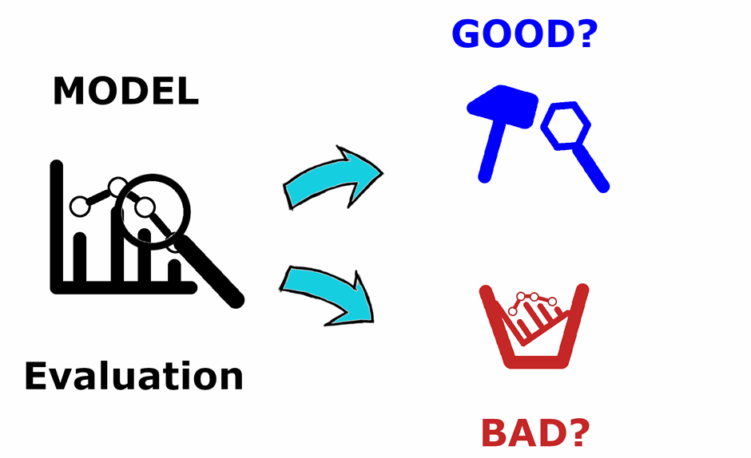

## Table of Contents

## What is evaluation in the context of machine learning?

Evaluation in machine learning is the process of assessing how well a machine learning model performs on a given task. It involves using a set of data, called the test set, which the model hasn't seen during training. By comparing the model's predictions to the actual outcomes, we can determine how accurate or effective the model is. This step is crucial because it helps us understand if the model can generalize well to new, unseen data, which is the ultimate goal of machine learning.

There are several common metrics used for evaluation, depending on the type of task. For classification tasks, metrics like accuracy, precision, recall, and F1-score are often used. For regression tasks, metrics like Mean Squared Error (MSE) or R-squared are common. For example, accuracy can be calculated as the ratio of correctly predicted instances to the total instances: $$ \text{Accuracy} = \frac{\text{Number of Correct Predictions}}{\text{Total Number of Predictions}} $$. By choosing the right metric, we can better understand the strengths and weaknesses of our model and make necessary adjustments to improve its performance.

## Why is evaluation important in machine learning?

Evaluation is really important in machine learning because it tells us how good our model is at doing its job. Imagine you're trying to guess what kind of animal is in a picture. You want to know if your guesses are usually right or if you're making a lot of mistakes. By using evaluation, we can see if our model is making good guesses on new pictures it hasn't seen before. This helps us trust the model more and use it in real situations.

Without evaluation, we wouldn't know if our model is actually learning or just guessing randomly. It's like taking a test in school; you need to see your score to know if you studied well. Evaluation helps us compare different models to pick the best one. For example, if we're trying to predict house prices, we might use a metric like Mean Squared Error (MSE) to see which model's predictions are closest to the real prices: $$ \text{MSE} = \frac{1}{n} \sum_{i=1}^{n} (y_i - \hat{y}_i)^2 $$. This way, we can keep improving our models to make them more useful and accurate.

## What are the common metrics used to evaluate machine learning models?

In [machine learning](/wiki/machine-learning), we use different ways to check how good our models are, depending on what they're doing. For tasks where we're sorting things into groups, like telling if an email is spam or not, we often use accuracy, precision, recall, and F1-score. Accuracy is how often the model gets it right overall, calculated as $$ \text{Accuracy} = \frac{\text{Number of Correct Predictions}}{\text{Total Number of Predictions}} $$. Precision tells us how many of the things we said were in a group actually belong there, while recall tells us how many of the things that should be in a group we actually found. The F1-score is a mix of precision and recall, giving us a balanced view of how well the model is doing.

For tasks where we're trying to guess numbers, like predicting house prices, we use different measures. Mean Squared Error (MSE) is one of the most common ones. It looks at how far off our guesses are from the real numbers, squared so bigger mistakes count more. We calculate MSE like this: $$ \text{MSE} = \frac{1}{n} \sum_{i=1}^{n} (y_i - \hat{y}_i)^2 $$. Another useful measure is R-squared, which tells us how well our model's guesses fit the real data compared to just using the average. These metrics help us see if our model is doing a good job at guessing numbers accurately.

## How do you split data into training and testing sets for model evaluation?

Splitting data into training and testing sets is really important for checking how well our machine learning model works. Usually, we take our whole set of data and divide it into two parts. One part, called the training set, is used to teach the model how to make predictions. The other part, called the testing set, is used to see how well the model can guess on new data it hasn't seen before. A common way to split the data is to use 70-80% of it for training and the rest for testing. This helps make sure our model learns well from the training data and can still make good guesses on the testing data.

To actually split the data, we can use tools like Python's `scikit-learn` library. Here's a simple example of how to do it:

```python
from sklearn.model_selection import train_test_split

# Assume 'X' is our feature data and 'y' is our target data
X_train, X_test, y_train, y_test = train_test_split(X, y, test_size=0.2, random_state=42)
```

In this code, `test_size=0.2` means we're using 20% of the data for testing and the rest for training. The `random_state` helps make sure we get the same split every time we run the code, which is helpful for comparing different models. By using this split, we can train our model on `X_train` and `y_train`, then check how well it does on `X_test` and `y_test` to see if it's good at making predictions on new data.

## What is cross-validation and why is it used in model evaluation?

Cross-validation is a way to check how good our machine learning model is by using different parts of our data to train and test it multiple times. Instead of just splitting our data once into a training set and a testing set, we split it into several smaller parts. We then train our model on all but one of these parts and test it on the remaining part. We do this over and over, using a different part for testing each time. This helps us get a better idea of how well our model works because it's tested on different pieces of data.

Cross-validation is really useful because it helps us avoid a problem called overfitting. Overfitting happens when our model learns too much from the training data and doesn't work well on new data. By testing our model on different parts of the data, we can see if it's doing well overall or if it's just good at guessing on one specific part of the data. A common way to do cross-validation is called k-fold cross-validation, where we split our data into k parts, or "folds." For example, if we use 5-fold cross-validation, we'd train our model 5 times, each time leaving out a different fifth of the data for testing. The average of these tests gives us a good idea of how our model might perform on new data.

## How can overfitting be detected during the evaluation of a machine learning model?

Overfitting can be detected during the evaluation of a machine learning model by comparing its performance on the training data to its performance on the testing data. If a model performs much better on the training data than on the testing data, it's a sign that the model has learned the training data too well and isn't generalizing well to new data. For example, if a model has an accuracy of 99% on the training data but only 70% on the testing data, it's likely overfitting. This big difference shows that the model has memorized the training data instead of learning the general patterns that would help it make good predictions on new data.

To further detect overfitting, we can use cross-validation. Cross-validation involves splitting the data into several parts and training the model multiple times, each time using a different part for testing. If the model's performance varies a lot across these different tests, it's another sign of overfitting. For instance, if we use 5-fold cross-validation and the model's accuracy on the test sets ranges from 60% to 85%, this inconsistency suggests that the model is overfitting to certain parts of the data. By using these methods, we can better understand if our model is overfitting and take steps to improve it.

## What are precision, recall, and F1 score, and how are they used in model evaluation?

Precision, recall, and F1 score are important metrics used to evaluate how well a machine learning model does at sorting things into different groups, like telling if an email is spam or not. Precision is all about how many of the things we said were in a group actually belong there. For example, if we're trying to find all the spam emails, precision tells us how many of the emails we marked as spam are really spam. We calculate precision like this: $$ \text{Precision} = \frac{\text{True Positives}}{\text{True Positives + False Positives}} $$. Recall, on the other hand, is about how many of the things that should be in a group we actually found. So, if we missed some spam emails, recall would show us how many of the actual spam emails we caught. We calculate recall like this: $$ \text{Recall} = \frac{\text{True Positives}}{\text{True Positives + False Negatives}} $$.

The F1 score is a way to combine precision and recall into one number that gives us a balanced view of how well our model is doing. It's especially useful when we want our model to be good at both finding all the right things and making sure it doesn't make too many wrong guesses. The F1 score is the harmonic mean of precision and recall, and we calculate it like this: $$ \text{F1 Score} = 2 \times \frac{\text{Precision} \times \text{Recall}}{\text{Precision} + \text{Recall}} $$. By looking at these three metrics together, we can get a full picture of our model's performance. If precision is high but recall is low, our model might be too careful and missing some important things. If recall is high but precision is low, it might be guessing too much and including things that don't belong. A good F1 score means our model is doing well at both.

## How does the choice of evaluation metric affect model selection?

The choice of evaluation metric is super important when we're [picking](/wiki/asset-class-picking) a machine learning model. Different tasks need different metrics. For example, if we're trying to tell if an email is spam or not, we might care a lot about not missing any spam emails. In that case, we'd look at recall, which tells us how many of the spam emails we actually caught. If recall is our main metric, we'd pick the model that does the best at finding all the spam, even if it means it might sometimes mark a regular email as spam by mistake.

On the other hand, if we're more worried about not marking regular emails as spam, we'd focus on precision. Precision tells us how many of the emails we marked as spam are actually spam. If precision is what we care about most, we'd choose the model that's really good at not making mistakes, even if it means missing some spam emails. The F1 score can be helpful because it balances precision and recall. It's calculated as $$ \text{F1 Score} = 2 \times \frac{\text{Precision} \times \text{Recall}}{\text{Precision} + \text{Recall}} $$. By using the F1 score, we can pick a model that does well at both finding all the spam and not making too many wrong guesses.

## What is the ROC curve and how is it used to evaluate model performance?

The ROC curve, or Receiver Operating Characteristic curve, is a way to see how well a machine learning model can tell the difference between things, like telling if an email is spam or not. It shows how the model's ability to find all the right things (sensitivity) changes as we change how careful the model is about making mistakes (specificity). The curve is made by plotting the true positive rate against the false positive rate at different decision thresholds. The true positive rate is the same as recall, and it's calculated as $$ \text{True Positive Rate} = \frac{\text{True Positives}}{\text{True Positives + False Negatives}} $$. The false positive rate is calculated as $$ \text{False Positive Rate} = \frac{\text{False Positives}}{\text{False Positives + True Negatives}} $$. A good model will have a curve that goes up quickly and stays high, showing it's good at finding the right things without making too many mistakes.

To use the ROC curve to evaluate a model's performance, we look at the area under the curve, called the AUC (Area Under the Curve). The AUC is a number between 0 and 1, and a higher number means the model is better at telling things apart. If the AUC is close to 1, the model is doing a great job. If it's close to 0.5, the model is no better than guessing randomly. By comparing the AUC of different models, we can pick the one that's best at separating the things we care about. For example, if we're trying to predict if a patient has a disease, a model with a higher AUC would be better at telling sick patients from healthy ones.

## How do you evaluate the performance of regression models?

Evaluating regression models involves checking how well the model's predictions match the real values. A common way to do this is by using the Mean Squared Error (MSE), which measures the average of the squared differences between the predicted and actual values. The formula for MSE is $$ \text{MSE} = \frac{1}{n} \sum_{i=1}^{n} (y_i - \hat{y}_i)^2 $$. A smaller MSE means the model's predictions are closer to the real values, which is what we want. Another useful metric is the Mean Absolute Error (MAE), which is the average of the absolute differences between the predicted and actual values, calculated as $$ \text{MAE} = \frac{1}{n} \sum_{i=1}^{n} |y_i - \hat{y}_i| $$. MAE is easier to understand because it's in the same units as the target variable, but it doesn't penalize larger errors as much as MSE.

Another important metric for regression models is R-squared, which tells us how well the model's predictions fit the real data compared to just using the average of the target variable. R-squared is calculated as $$ R^2 = 1 - \frac{\sum_{i=1}^{n} (y_i - \hat{y}_i)^2}{\sum_{i=1}^{n} (y_i - \bar{y})^2} $$, where $$ \bar{y} $$ is the mean of the actual values. An R-squared value close to 1 means the model explains a lot of the variation in the data, which is good. A value close to 0 means the model isn't much better than just using the average. By looking at these metrics, we can understand how well our regression model is doing and make improvements if needed.

## What are some advanced techniques for model evaluation in machine learning?

One advanced technique for model evaluation in machine learning is called bootstrapping. Bootstrapping involves creating many different samples of our data by randomly picking data points with replacement. We then train and test our model on these different samples to get a sense of how well it might perform on new data. This method helps us see how stable our model's performance is and can give us confidence intervals for our performance metrics. For example, if we want to estimate the Mean Squared Error (MSE) using bootstrapping, we'd calculate the MSE for each sample and then look at the average and range of these values to understand our model's performance better.

Another advanced technique is using learning curves. Learning curves show how our model's performance changes as we increase the amount of training data. By plotting the model's performance on both the training and testing sets as we add more data, we can see if our model is suffering from overfitting or underfitting. If the training performance is much better than the testing performance, it's a sign of overfitting. If both performances are low and don't improve much with more data, it might be underfitting. Learning curves help us decide if we need more data or if we should try a different model or adjust our current one. For instance, if we're looking at the accuracy of our model, we'd plot the accuracy on the training set and the testing set against the number of training examples used.

A third technique is the use of confusion matrices for classification tasks. A confusion matrix shows us how many times our model correctly or incorrectly classified each class. By looking at the matrix, we can see patterns in the model's mistakes, like if it often confuses one class for another. From the confusion matrix, we can calculate advanced metrics like precision, recall, and the F1 score for each class. For example, if we're trying to classify emails as spam or not spam, the confusion matrix would show us how many spam emails were correctly identified and how many were missed. This helps us understand where our model needs improvement.

## How can you compare the performance of multiple machine learning models effectively?

To compare the performance of multiple machine learning models effectively, you need to use the right evaluation metrics for your task. For example, if you're sorting things into groups, like telling if an email is spam or not, you might look at accuracy, precision, recall, and the F1 score. Accuracy tells you how often the model gets it right overall, calculated as $$ \text{Accuracy} = \frac{\text{Number of Correct Predictions}}{\text{Total Number of Predictions}} $$. Precision shows how many of the things you said were in a group actually belong there, while recall shows how many of the things that should be in a group you actually found. The F1 score is a mix of precision and recall, giving you a balanced view of how well the model is doing. By looking at these metrics for each model, you can see which one does the best job.

For tasks where you're trying to guess numbers, like predicting house prices, you might use Mean Squared Error (MSE) and R-squared. MSE measures how far off your guesses are from the real numbers, squared so bigger mistakes count more. It's calculated as $$ \text{MSE} = \frac{1}{n} \sum_{i=1}^{n} (y_i - \hat{y}_i)^2 $$. R-squared tells you how well your model's guesses fit the real data compared to just using the average. A higher R-squared means your model is doing a better job. You can also use techniques like cross-validation to get a more reliable comparison. Cross-validation involves splitting your data into several parts and training and testing your models multiple times with different parts left out for testing each time. This helps you see if your models are consistent and not just good at guessing on one specific part of the data. By comparing these metrics and using these techniques, you can pick the best model for your needs.

## References & Further Reading

[1]: Kohavi, R., & John, G. H. (1995). ["Automatic Parameter Selection by Minimizing Estimated Error."](https://www.sciencedirect.com/science/article/pii/B9781558603776500451) In Machine Learning: ECML-95 (pp. 304-313). Springer, Berlin, Heidelberg.

[2]: Witten, I. H., Frank, E., Hall, M. A., & Pal, C. J. (2016). ["Data Mining: Practical Machine Learning Tools and Techniques."](https://www.sciencedirect.com/book/9780123748560/data-mining-practical-machine-learning-tools-and-techniques) Morgan Kaufmann.

[3]: Powers, D. M. (2011). ["Evaluation: From precision, recall and F-measure to ROC, informedness, markedness and correlation."](https://arxiv.org/abs/2010.16061) Journal of Machine Learning Technologies, 2(1), 37-63.

[4]: Bishop, C. M. (2006). ["Pattern Recognition and Machine Learning."](https://www.cs.uoi.gr/~arly/courses/ml/tmp/Bishop_book.pdf) Springer.

[5]: Hastie, T., Tibshirani, R., & Friedman, J. (2009). ["The Elements of Statistical Learning: Data Mining, Inference, and Prediction."](https://link.springer.com/book/10.1007/978-0-387-84858-7) Springer. 

[6]: Pedregosa, F., Varoquaux, G., Gramfort, A., Michel, V., Thirion, B., Grisel, O., ... & Duchesnay, É. (2011). ["Scikit-learn: Machine Learning in Python."](https://dl.acm.org/doi/10.5555/1953048.2078195) Journal of Machine Learning Research, 12, 2825-2830.