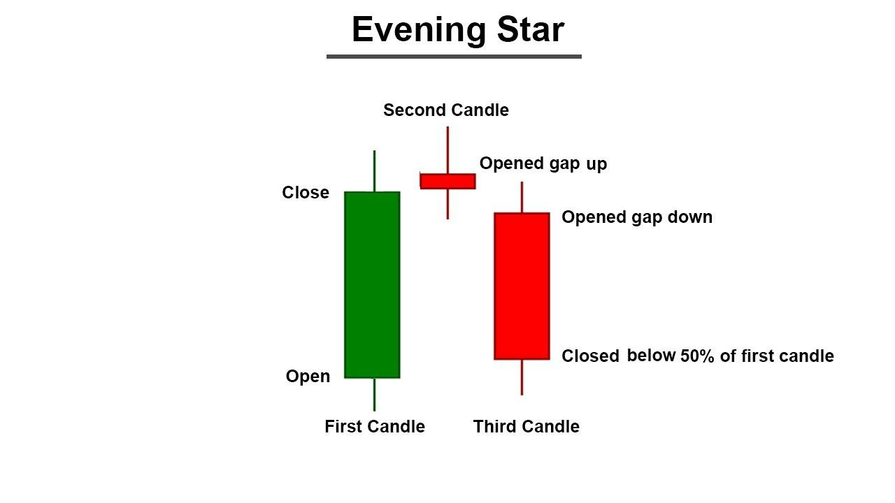

## Table of Contents

## What is the Evening Star candlestick pattern?

The Evening Star is a type of candlestick pattern that traders use to predict when a price might start to go down. It is made up of three candles and often shows up at the top of an upward trend. The first candle is a big green one, which means the price went up a lot that day. The second candle is smaller and can be either green or red. It shows that the price didn't move much and might be starting to change direction. The third candle is a big red one, showing that the price dropped a lot after the second candle.

This pattern is important because it can signal that the upward trend is getting tired and might reverse. Traders look for this pattern to decide when to sell their stocks or other assets. It's like a warning sign that the good times might be over, and prices could start falling soon. However, it's always a good idea to use other tools and information too, not just this one pattern, to make the best trading decisions.

## How does the Evening Star pattern form on a chart?

The Evening Star pattern forms on a chart over three trading days. It starts with a big green candle, which means the price went up a lot that day. This candle shows that buyers were in control and the price was moving higher. After this strong upward movement, the next day's candle is smaller and can be either green or red. This smaller candle indicates that the price didn't move much, suggesting that the buying pressure might be weakening and the market could be unsure about the direction.

Following the smaller candle, the third day brings a big red candle. This red candle shows that the price dropped significantly, indicating that sellers have taken over and the price is now moving downward. When these three candles appear in this order at the top of an upward trend, it forms the Evening Star pattern. This pattern is a signal to traders that the upward trend might be ending and a downward trend could be starting.

## What are the key components of an Evening Star pattern?

The Evening Star pattern is made up of three candles that show up at the top of an upward trend. The first candle is a big green one, which means the price went up a lot that day. This shows that buyers were strong and pushing the price higher. The second candle is smaller and can be either green or red. It tells us that the price didn't move much and the market might be unsure about what to do next. This smaller candle is important because it shows that the buying power could be getting weaker.

The third candle in the Evening Star pattern is a big red one, which means the price dropped a lot that day. This red candle shows that sellers have taken over and are now pushing the price down. When these three candles appear in this order, it forms the Evening Star pattern. This pattern is a warning to traders that the upward trend might be ending and a downward trend could be starting soon.

## What does the Evening Star pattern indicate about market trends?

The Evening Star pattern tells us that the market might be changing from going up to going down. It shows up at the top of an upward trend and is made of three candles. The first candle is big and green, meaning the price went up a lot. Then, the second candle is smaller and can be either green or red, showing that the price didn't move much and the market is unsure. Finally, the third candle is big and red, meaning the price dropped a lot. This pattern is a warning that the upward trend might be getting tired and could reverse.

Traders look for the Evening Star pattern to decide when to sell their stocks or other things they own. It's like a signal that the good times might be over, and prices could start falling soon. But, it's smart to use other tools and information too, not just this one pattern, to make the best choices about trading. The Evening Star pattern is a helpful clue, but it's not the only thing traders should look at when trying to understand market trends.

## How reliable is the Evening Star pattern as a trading signal?

The Evening Star pattern is a helpful clue for traders, but it's not perfect. It shows up at the top of an upward trend and can warn that prices might start to go down. But, it doesn't always mean the price will drop right away or drop a lot. Sometimes, the market keeps going up even after an Evening Star shows up. So, traders need to be careful and not just rely on this one pattern.

To make better choices, traders often use the Evening Star pattern along with other tools and information. They might look at other chart patterns, use technical indicators, or check the news to see what's happening in the market. By combining different signals, traders can get a better idea of what might happen next. This way, they can make smarter decisions about when to sell or hold onto their investments.

## Can you explain the psychology behind the Evening Star pattern?

The Evening Star pattern shows what traders are thinking and feeling during a change in the market. At first, there's a big green candle, which means buyers were really excited and pushed the price up a lot. They were feeling confident and thought the price would keep going up. But then, the next day, the candle is smaller and might be green or red. This shows that buyers are starting to feel less sure. They're not as excited anymore, and some might even be thinking about selling. The market is kind of confused and doesn't know which way to go.

Then, the third day brings a big red candle. This means sellers have taken over and are pushing the price down. They see that the buyers are tired and jump in to sell. The sellers are feeling strong and confident now, thinking the price will keep going down. The Evening Star pattern shows how the mood in the market changes from being excited about buying to being worried and then selling. It's like a story of how people's feelings can make the market go from up to down.

## What are the differences between the Evening Star and the Morning Star patterns?

The Evening Star and the Morning Star patterns are both made up of three candles and show up at important times in the market, but they tell different stories. The Evening Star pattern shows up at the top of an upward trend and warns that the price might start going down. It starts with a big green candle, then a smaller candle that can be either green or red, and ends with a big red candle. This pattern shows how buyers lose their excitement and sellers take over, pushing the price down.

On the other hand, the Morning Star pattern shows up at the bottom of a downward trend and suggests that the price might start going up. It begins with a big red candle, followed by a smaller candle that can be either red or green, and ends with a big green candle. This pattern shows how sellers lose their power and buyers start to feel more confident, pushing the price up. Both patterns help traders understand when the market might change direction, but they signal opposite trends.

## How can the Evening Star pattern be confirmed for better accuracy?

To make sure the Evening Star pattern is a good sign of a trend change, traders often look for other clues in the market. One way to confirm it is by using other chart patterns or technical indicators. For example, if the Evening Star shows up and the price also breaks below a key support level, it can make the pattern more reliable. Traders might also look at the [volume](/wiki/volume-trading-strategy) of trades. If the volume is high when the big red candle appears, it can show that more people are selling, which makes the pattern stronger.

Another way to confirm the Evening Star pattern is by checking what's happening in the market and the news. If there's bad news or something that makes people worried about the market, it can support the idea that the price will go down. Traders might also wait for a few more days to see if the price keeps dropping after the Evening Star. If it does, it can give them more confidence that the pattern was right and the trend is really changing. By looking at all these things together, traders can make better choices about when to sell or hold onto their investments.

## What are some common mistakes traders make when using the Evening Star pattern?

One common mistake traders make with the Evening Star pattern is relying on it too much without looking at other signs in the market. The Evening Star is just one clue, and it doesn't always mean the price will go down right away. Traders should use other tools like other chart patterns, technical indicators, and news to get a fuller picture of what might happen next. If they only focus on the Evening Star, they might sell too early or miss out on more gains if the price keeps going up.

Another mistake is not waiting for the pattern to be confirmed. The Evening Star looks strong, but sometimes it's a false signal. Traders should look for extra signs like a break below a support level or high selling volume to make sure the pattern is real. Jumping to sell right after seeing an Evening Star without these extra signs can lead to bad trades. It's important to be patient and gather more evidence before making a move.

## How does the Evening Star pattern perform in different market conditions?

The Evening Star pattern can work differently depending on the market conditions. In a strong bull market, where prices are going up a lot, the Evening Star might not be as reliable. The market might keep going up even after the pattern shows up, making it a false signal. But, in a market that's starting to get tired or is unsure, the Evening Star can be a good warning that the price might start going down soon. Traders need to look at other signs in the market to know if the Evening Star is a good clue or not.

In a bear market, where prices are already going down, the Evening Star can be more useful. It can show that a small upward move is over and the price will keep dropping. But, traders should still be careful and use other tools to check if the pattern is right. The Evening Star can give good hints about what might happen next, but it's not perfect and can be wrong sometimes. So, it's important to look at the bigger picture and not just rely on one pattern.

## What are some advanced techniques for trading the Evening Star pattern?

One advanced technique for trading the Evening Star pattern is to use it with other technical indicators to confirm the signal. For example, traders might look at the Relative Strength Index (RSI) or the Moving Average Convergence Divergence (MACD) to see if they also show that the market might be turning down. If the RSI is overbought or the MACD shows a bearish crossover at the same time as the Evening Star, it can make the pattern more reliable. Another way to confirm the pattern is by watching the volume. If the volume is high when the big red candle appears, it shows that more people are selling, which can make the signal stronger.

Another technique is to look at different time frames to get a better understanding of the market. Traders might see an Evening Star on a daily chart, but they can also check the weekly or monthly charts to see if the pattern fits with the bigger trend. If the Evening Star on the daily chart matches with a bearish signal on the weekly chart, it can give more confidence that the price will go down. Traders can also use stop-loss orders to protect themselves. They might place a stop-loss just above the high of the Evening Star pattern. This way, if the price goes up instead of down, they can limit their losses. By combining these techniques, traders can make better decisions when using the Evening Star pattern.

## How can the Evening Star pattern be integrated into a comprehensive trading strategy?

The Evening Star pattern can be a helpful part of a bigger trading plan. Traders should not just look at the Evening Star by itself but use it with other tools to make better choices. For example, they might use technical indicators like the Relative Strength Index (RSI) or the Moving Average Convergence Divergence (MACD) to see if they also show that the market might be turning down. If these indicators agree with the Evening Star, it can make the pattern more reliable. Traders can also check the volume of trades. If the volume is high when the big red candle of the Evening Star appears, it means more people are selling, which can make the signal stronger.

Another way to use the Evening Star in a trading strategy is by looking at different time frames. Traders might see an Evening Star on a daily chart, but they can also check the weekly or monthly charts to see if the pattern fits with the bigger trend. If the Evening Star on the daily chart matches with a bearish signal on the weekly chart, it can give more confidence that the price will go down. Traders can also use stop-loss orders to protect themselves. They might place a stop-loss just above the high of the Evening Star pattern. This way, if the price goes up instead of down, they can limit their losses. By combining the Evening Star pattern with these other techniques, traders can make smarter decisions and build a strong trading strategy.

## References & Further Reading

[1]: Bergstra, J., Bardenet, R., Bengio, Y., & Kégl, B. (2011). ["Algorithms for Hyper-Parameter Optimization."](https://proceedings.neurips.cc/paper/2011/file/86e8f7ab32cfd12577bc2619bc635690-Paper.pdf) Advances in Neural Information Processing Systems 24.

[2]: ["Advances in Financial Machine Learning"](https://resources.caih.jhu.edu/textbooks/Resources/_pdfs/Advances_In_Financial_Machine_Learning.pdf) by Marcos Lopez de Prado

[3]: ["Evidence-Based Technical Analysis: Applying the Scientific Method and Statistical Inference to Trading Signals"](https://www.amazon.com/Evidence-Based-Technical-Analysis-Scientific-Statistical/dp/0470008741) by David Aronson

[4]: ["Machine Learning for Algorithmic Trading"](https://github.com/stefan-jansen/machine-learning-for-trading) by Stefan Jansen

[5]: ["Quantitative Trading: How to Build Your Own Algorithmic Trading Business"](https://books.google.com/books/about/Quantitative_Trading.html?id=j70yEAAAQBAJ) by Ernest P. Chan