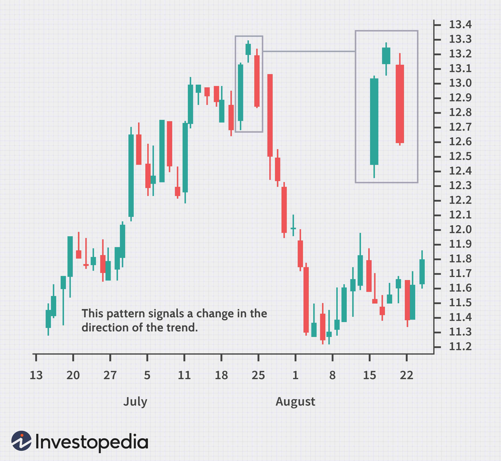

Candlestick patterns are a fundamental aspect of technical analysis, used by traders to interpret and predict market sentiment and future price movements. These visual representations, formed by a succession of candlesticks, encapsulate the battle between buyers and sellers over specific periods. Among these patterns, the Evening Star holds particular significance as a bearish reversal formation, typically indicating the potential end of an uptrend and a shift towards a downtrend. It comprises three components: a large bullish candle, a subsequent smaller-bodied candle indicating indecision, and a large bearish candle, confirming the reversal of sentiment. 

The importance of the Evening Star pattern extends beyond manual trading strategies, finding a robust place in algorithmic trading systems. Algorithmic trading, which uses computer programs to execute trades at speeds and frequencies impossible for a human trader, benefits significantly from integrating patterns like the Evening Star. By embedding this pattern into algorithms, traders can enhance accuracy and speed, ensuring timely responses to market shifts without the hindrance of emotional decision-making.



This article will focus on the application of the Evening Star pattern, both conceptually and practically, within the context of automated trading. It will discuss how the pattern can be coded into sophisticated trading algorithms that improve decision-making by reacting to market conditions faster than ever. The overarching aim is to demonstrate how traders can effectively utilize this powerful candlestick pattern in automated systems to gain a competitive advantage, ensuring precision in detecting bearish reversals and executing profitable trades.

## Table of Contents

## Understanding the Evening Star Candlestick Pattern

The Evening Star candlestick pattern is a critical signal in technical analysis, indicating a potential reversal in market trends from bullish to bearish. This pattern is composed of three distinct candles, each representing a different phase in market sentiment. It is a valuable tool for traders seeking to anticipate market reversals and capitalize on shifts in [momentum](/wiki/momentum).

The first component of the Evening Star pattern is a large bullish candle, which reflects strong buying pressure and continued upward momentum. This candle typically suggests that traders are optimistic about the asset, pushing its price higher. The second candle is a small-bodied candle, which can be either bullish or bearish. This candle represents a pause or indecision in the market, where the buying pressure begins to wane, and neither bulls nor bears have a definitive advantage.

The final component is a large bearish candle, which signifies a shift in sentiment as sellers gain control, driving the price downward. This candle often closes within the body of the first bullish candle, confirming the reversal pattern. The transition from a strong bullish sentiment to a dominant bearish outlook highlights a potential downturn in price action, making it a key indicator for traders looking to adjust their strategies accordingly.

Psychologically, the Evening Star pattern reflects a gradual erosion of bullish confidence, initially indicated by the large bullish candle. As the market transitions to the small-bodied candle, traders face uncertainty, potentially reassessing their positions. This uncertainty is resolved by the bearish candle, which reveals a decisive move by sellers to drive prices lower, completing the reversal signal. Understanding these behavioral dynamics can help traders anticipate the end of an uptrend and prepare for possible price declines.

Overall, the Evening Star pattern is a nuanced reflection of market psychology and behavior, encapsulating the shift from bullish exuberance to bearish dominance. By recognizing these patterns, traders can better navigate the complexities of the market and position themselves for potential reversals.

## The Role of Evening Star in Algorithmic Trading

Algorithmic trading has revolutionized the financial markets by employing computer algorithms for executing trades based on predefined criteria, such as price, timing, and market conditions. The Evening Star candlestick pattern, recognized for signaling potential bearish reversals, is a valuable tool for [algorithmic trading](/wiki/algorithmic-trading) systems to automatically detect and respond to these market signals.

Integrating the Evening Star pattern into algorithmic trading provides several advantages:

1. **Precision and Speed**: Algorithms process vast amounts of data swiftly, recognizing Evening Star patterns in real-time, ensuring timely trade execution. This speed is crucial in volatile markets where prices can shift rapidly. The elimination of human delay translates into capturing optimal entry and exit points.

2. **Emotion-Free Operations**: Emotional biases often impair manual trading decisions. Algorithms, however, execute trades based purely on logic and programmed criteria, reducing the risks associated with human emotions.

3. **Scalability**: An algorithm can analyze multiple markets and timeframes simultaneously, providing traders opportunities across various assets without the manual effort required to do so.

To incorporate the Evening Star pattern into trading algorithms, one must first define the pattern's criteria programmatically. This process involves setting conditions such as identification of a large bullish candle followed by a smaller-bodied candle and concluding with a large bearish candle. The following is a simplified Python example using historical price data:

```python
def is_evening_star(candle1, candle2, candle3):
    return (candle1['close'] > candle1['open'] and
            abs(candle2['close'] - candle2['open']) < (candle1['close'] - candle1['open']) / 2 and
            candle3['open'] > candle3['close'])

def identify_pattern(data):
    for i in range(2, len(data)):
        if is_evening_star(data[i-2], data[i-1], data[i]):
            print(f"Evening Star identified at index {i}")

# Example usage
historical_data = [
    {'open': 100, 'close': 110},
    {'open': 110, 'close': 112},  # small-bodied candle
    {'open': 111, 'close': 105}   # large bearish candle
]

identify_pattern(historical_data)
```

**Backtesting**: Validating the pattern's effectiveness through backtesting is crucial before deploying it into live markets. This process involves running historical data through the algorithm to evaluate its performance. Emphasis should be placed on adjusting algorithm parameters to accommodate different market conditions and asset classes. 

Robust testing allows the algorithm to be refined, reducing false positives and enhancing accuracy. Market conditions' variability necessitates adaptive algorithms capable of accounting for different volatilities or trading volumes.

Successful implementation of the Evening Star pattern in algorithmic trading hinges upon meticulous pattern definition, rigorous [backtesting](/wiki/backtesting), and continuous refinement to maintain performance across changing market landscapes. Such procedural diligence ensures that the Evening Star pattern remains a reliable component within the broader architecture of automated trading strategies.

## Implementing the Evening Star Pattern in Trading Algorithms

To implement the Evening Star pattern algorithmically, the first step is to define the pattern using historical price data. The Evening Star consists of three distinct candles: a large bullish candle, a small-bodied candle (either bullish or bearish), and a subsequent large bearish candle. This pattern suggests a potential reversal in an uptrend, indicating bearish sentiment.

### Step 1: Define the Pattern

The pattern can be identified using specific criteria applied to price data:

1. **Large Bullish Candle (C1):** The first step is confirming a strong bullish presence in the market. This can be quantified by ensuring the close price is significantly higher than the open price over a given timeframe.
2. **Small-bodied Candle (C2):** The second candle represents indecision. The body of this candle should be significantly smaller than C1, indicating a pause in the uptrend. It can be a doji or any small-body formation.
3. **Large Bearish Candle (C3):** This candle signals a shift toward bearish sentiment. The close price should be significantly lower than the open, and ideally, C3 should open below the C2 close.

### Step 2: Incorporate Technical Filters

To enhance the pattern's reliability, additional technical filters can be used:

- **Trendlines:** Ensure that C1 occurs at the peak of an uptrend, establishing the presence of strong bullish momentum before the reversal.
- **Oscillators:** Use tools like the Relative Strength Index (RSI) to confirm overbought conditions, supporting the potential for a bearish reversal.

### Step 3: Code the Pattern in Python

Below is an example of how you might detect the Evening Star pattern using Python:

```python
import pandas as pd

def is_evening_star(df):
    # Ensure the dataset has at least three candles
    if len(df) < 3:
        return False

    # Get the last three candles
    c1, c2, c3 = df.iloc[-3], df.iloc[-2], df.iloc[-1]

    # Define conditions for the Evening Star pattern
    large_bullish_candle = (c1['Close'] > c1['Open']) and ((c1['Close'] - c1['Open']) / c1['Open'] > 0.01)
    small_body_candle = abs(c2['Close'] - c2['Open']) < 0.005 * (c1['Close'] - c1['Open'])
    large_bearish_candle = (c3['Open'] > c3['Close']) and ((c3['Open'] - c3['Close']) / c3['Open'] > 0.01)

    # Check if C2's close is inside C1's range and C3 opens below C2's close
    indecision_candle = (c2['Close'] < c1['Close']) and (c2['Close'] > c1['Open'])
    bearish_shift = c3['Open'] < c2['Close']

    return large_bullish_candle and small_body_candle and large_bearish_candle and indecision_candle and bearish_shift

# Example usage with a DataFrame
df = pd.DataFrame({
    'Open': [100, 105, 104],
    'Close': [105, 104, 102],
})

if is_evening_star(df):
    print("Evening Star pattern detected.")
else:
    print("No pattern detected.")
```

### Step 4: Testing and Optimization

The final step involves backtesting the algorithm to ensure its effectiveness across different markets and periods. This involves running the code on historical data and evaluating the generated signals. Performance metrics like the Sharpe ratio or profit [factor](/wiki/factor-investing) can validate the strategy's effectiveness.

Additionally, it's beneficial to refine the algorithm by adjusting parameters or incorporating [machine learning](/wiki/machine-learning) techniques to optimize signal accuracy and adapt to evolving market conditions. This iterative process is crucial for maintaining a robust and reliable trading strategy.

## Benefits and Risks of Trading the Evening Star Pattern Algorithmically

Algorithmic trading offers numerous advantages when implementing the Evening Star pattern, notably in ensuring execution consistency, scalability, and the ability to respond quickly to market changes. With automation, trades are executed precisely according to predefined criteria, eliminating errors associated with manual trading. Scalability allows traders to apply the same strategy across multiple markets and instruments simultaneously, significantly enhancing the potential for profit maximization.

However, trading the Evening Star pattern algorithmically is not without risks. One primary concern is the possibility of false signals. The pattern itself may occasionally appear in noise-laden or choppy markets, resulting in trades based on incorrect assumptions about market direction. This challenge necessitates robust algorithm tuning. Traders often develop filters or use additional indicators to validate signals, reducing the likelihood of acting on false positives.

Overfitting is another significant risk. Algorithms tailored too closely to historical data might perform well during backtests but fail in live markets. To mitigate this, it's essential to use out-of-sample testing and walk-forward analysis. These strategies provide a more realistic evaluation of how the algorithm would perform in unseen market conditions.

Risk management is crucial and can be achieved by setting stop-loss limits and continuously monitoring algorithms in real time. Stop-loss settings help protect against significant losses by automatically closing positions when the market moves unfavorably beyond a specified threshold. Real-time monitoring of algorithmic performance is essential to detect and address issues promptly, ensuring that unforeseen market events or system errors do not lead to substantial financial loss.

In conclusion, while algorithmic trading of the Evening Star pattern offers significant benefits, it also presents challenges that require careful consideration and proactive management. By balancing these elements, traders can leverage the full potential of their strategies while minimizing associated risks.

## Case Studies and Backtesting: Evening Star in Action

Backtesting is a crucial process in evaluating the effectiveness of trading patterns like the Evening Star. By applying this pattern to historical data, traders can gain insights into its performance across different timeframes and markets. This process helps in identifying optimal trading settings and further refining algorithmic strategies.

The Evening Star pattern is generally recognized as a reliable bearish reversal indicator. Its core components—first a large bullish candle, followed by a small-bodied candle, and finally a large bearish candle—signal a potential shift from an uptrend to a downtrend. Testing this pattern against historical data helps ascertain its reliability and effectiveness under various market conditions and timeframes.

### Insights from Backtesting

Through comprehensive backtesting, one can observe how the Evening Star pattern performs during different market phases. Markets are inherently cyclical and exhibit various [volatility](/wiki/volatility-trading-strategies) levels. Backtesting this pattern across several market settings allows for a realistic assessment of its strengths and weaknesses. Analyzing results can reveal the pattern’s profitability and risk when used in trading algorithms.

For example, if the backtesting shows a significant number of false signals in a highly volatile market, traders can infer that additional technical indicators may be necessary to filter out these inaccuracies. Conversely, if the pattern consistently predicts market reversals in a stable market environment, it may underscore the pattern’s reliability under such conditions.

### Optimal Trading Settings

Determining optimal trading settings involves adjusting algorithmic parameters to maximize profitability and minimize risk. This could include setting appropriate stop-loss levels, optimizing entry and [exit](/wiki/exit-strategy) points, or combining the Evening Star with other technical indicators like moving averages or Relative Strength Index (RSI). Such adjustments are crucial in tailoring the pattern's application to specific asset classes, be it equities, commodities, or [forex](/wiki/forex-system).

For instance, the code snippet below illustrates a simple Python script using a popular data analysis library, `pandas`, to identify the Evening Star pattern:

```python
import pandas as pd

def identify_evening_star(data):
    signals = []
    for i in range(2, len(data)):
        if (data['Close'][i-2] > data['Open'][i-2] and  # First candle is bullish
            data['Close'][i-1] < data['Open'][i-1] and  # Second candle doji or small body
            data['Close'][i] < data['Open'][i] and      # Third candle is bearish
            data['Open'][i] > data['Close'][i-1]):      # Third candle opens above second
            signals.append((data.index[i], 'Evening Star'))
    return signals

# Sample usage with historical price data
historical_data = pd.DataFrame({'Open': [...], 'Close': [...]})
evening_star_signals = identify_evening_star(historical_data)
```

### Hypothetical Scenarios

Constructing hypothetical scenarios enhances understanding by applying the Evening Star pattern in simulated trading environments. For example, suppose a trader backtests this pattern on the S&P 500 index during a specified period, and finds that integrating a stochastic oscillator mitigates false breakouts. Such findings can inform the development of robust trading strategies tailored to specific types of market behavior.

### Evaluating Effectiveness and Reliability 

Evaluating the pattern’s effectiveness involves a meticulous review of historical data and backtesting results. Key performance metrics such as win/loss ratio, average profit/loss, and maximum drawdown are calculated to gauge the pattern's credibility. These analyses provide valuable insights into whether the pattern should form the backbone of a trading strategy or serve as a supplementary tool alongside other indicators.

In conclusion, backtesting the Evening Star pattern is indispensable for understanding its practical applications and overall efficacy. Through such rigorous testing, traders and algorithmic systems can enhance their precision in predicting market reversals, contributing to more resilient and profitable trading outcomes.

## Conclusion

The Evening Star pattern serves as an essential tool for traders seeking to identify bearish reversals, particularly when used in conjunction with algorithmic trading systems. This integration allows for timely and precise trade executions, bolstering a trader's ability to capitalize on market shifts. To maintain its effectiveness, continuous testing and adjusting of the algorithm are crucial as market conditions evolve over time. Such vigilance ensures that the pattern consistently provides accurate signals, even as trading dynamics change.

Incorporating other technical indicators alongside the Evening Star pattern can significantly enhance its reliability. Common indicators like moving averages, oscillators, or [volume](/wiki/volume-trading-strategy) analysis can corroborate the signals generated by the pattern, reducing the likelihood of false positives and improving overall trade success rates.

For traders, strategic flexibility and an ongoing commitment to learning are indispensable. Market environments are inherently volatile, dictated by an array of unpredictable factors. Being adaptable in strategy and continuously updating one's knowledge base are critical to maintaining a competitive edge. Regularly refining the algorithm with new insights and emerging market data allows for optimized performance and more robust decision-making.

In conclusion, the Evening Star pattern offers a valuable mechanism for identifying market reversals within algorithmic trading. However, the key to leveraging its full potential lies in constant refinement, strategic incorporation of additional indicators, and an unwavering pursuit of knowledge and flexibility in approach.

## FAQs

Implementing the Evening Star pattern in algorithmic trading presents several technical challenges. One primary challenge is accurately coding the pattern's identification. The Evening Star consists of a large bullish candle, a small-bodied candle that can be bullish or bearish, and a large bearish candle. The challenge in coding lies in defining precise criteria such as the relative sizes of the candles and their positions to avoid false positives. Traders can achieve this by using libraries like Pandas and TA-Lib in Python to handle extensive historical data and technical analysis, respectively.

Another challenge is integrating the Evening Star pattern with other indicators to reduce noise and improve reliability. Comprehensive backtesting frameworks, such as Backtrader or PyAlgoTrade, are essential. These tools allow traders to evaluate the pattern's performance across diverse markets and time frames and include additional indicators like moving averages or relative strength index (RSI) to confirm signals.

When starting algorithmic trading with candlestick patterns, traders must equip themselves with robust platforms and resources. Platforms like MetaTrader or TradingView offer extensive charting capabilities and support for algorithmic trading strategies via languages like MQL5 (for MetaTrader) or Pine Script (for TradingView). Additionally, online coding communities, such as Stack Overflow or GitHub, can provide valuable insights and code snippets for implementing the Evening Star pattern in various trading algorithms.

Educational resources are equally essential for traders new to this domain. Books like "Algorithmic Trading" by Ernie Chan and online courses from platforms like Coursera or Udemy can offer essential foundational knowledge. Additionally, following quantitative finance blogs and forums can provide ongoing learning and exposure to the latest industry practices. Engaging with these resources can help traders overcome technical challenges and optimally deploy the Evening Star pattern in automated trading systems.

## References & Further Reading

1. **Scholarly Articles and Journals**:
   - Bulkowski, T. (2008). *Encyclopedia of Candlestick Charts*. Wiley Finance. This book provides comprehensive analyses and statistics related to candlestick patterns, including the Evening Star.
   - Murphy, J. J. (1999). *Technical Analysis of the Financial Markets: A Comprehensive Guide to Trading Methods and Applications*. New York Institute of Finance. This classic resource covers various technical analysis tools and offers insights into integrating candlestick patterns into broader trading strategies.

2. **Books**:
   - Nison, S. (1991). *Japanese Candlestick Charting Techniques: A Contemporary Guide to the Ancient Investment Techniques of the Far East*. This book is essential for understanding the historical and practical applications of candlestick patterns, including how they are integrated into modern trading systems.
   - Chan, E. (2008). *Quantitative Trading: How to Build Your Own Algorithmic Trading Business*. Wiley. This book provides an excellent foundation for those new to algorithmic trading, including how to approach integrating technical patterns like the Evening Star into algorithms.

3. **Online Resources**:
   - [Investopedia](https://www.investopedia.com/): Numerous articles explain technical analysis and specific candlestick patterns with practical examples.
   - [TradingView](https://www.tradingview.com/): A platform offering charting tools and community discussions around various trading strategies, including the usage of the Evening Star pattern.

4. **Programming and Implementation Resources**:
   - [QuantConnect](https://www.quantconnect.com/): This platform offers algorithmic trading resources, including a community to backtest trading strategies and patterns using Python.
   - [GitHub](https://github.com/): Search for Python repositories focusing on algorithmic trading to find open-source projects that implement candlestick patterns like the Evening Star.

5. **Research Papers and Theses**:
   - Explore academic databases like JSTOR or IEEE Xplore for research papers on the effectiveness and application of candlestick patterns in financial markets. Topics include algorithmic trading methodologies and performance analysis.

6. **Continuing Education and Online Courses**:
   - [Coursera](https://www.coursera.org/) and [edX](https://www.edx.org/): Look for courses on technical analysis and algorithmic trading, which provide structured learning paths on these subjects.

By exploring the above-suggested materials, traders and researchers can deepen their understanding of candlestick patterns, like the Evening Star, and how these can be effectively used within algorithmic trading frameworks.