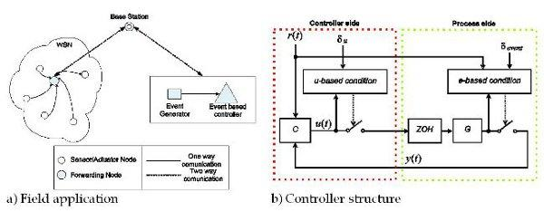

## Table of Contents

## What is event-based sampling?

Event-based sampling is a way of collecting data where you only record information when something specific happens. Instead of taking measurements at regular times, you wait for an event to trigger the recording. This can be useful when you want to study things that don't happen often or at predictable times. For example, if you're studying earthquakes, you would record data every time an earthquake happens, not every hour.

This method helps save resources because you're not constantly collecting data that might not be useful. It also makes sure you capture important moments that might be missed with regular sampling. However, it can be tricky because you need to decide what counts as an event and set up your system to detect these events accurately. If you miss an event or record too many false events, your data might not be very reliable.

## How does event-based sampling differ from time-based sampling?

Event-based sampling and time-based sampling are two different ways to collect data. In event-based sampling, you only record data when something special happens, like a machine breaking down or a customer making a purchase. This means you're not constantly collecting data, but instead, you wait for the right moment to take a measurement. This can be good if you want to study things that don't happen often or at set times.

On the other hand, time-based sampling involves collecting data at regular intervals, like every hour or every day. This method is useful when you want to track changes over time, such as temperature or stock prices. With time-based sampling, you might end up with a lot of data, even if nothing interesting is happening, but it helps you see patterns and trends over time.

Both methods have their own strengths and weaknesses. Event-based sampling can save resources and focus on important moments, but it requires a clear definition of what counts as an event. Time-based sampling gives you a complete picture over time but can be wasteful if you're collecting a lot of unnecessary data. Choosing the right method depends on what you're trying to study and how often the thing you're interested in happens.

## What are the main applications of event-based sampling?

Event-based sampling is used a lot in studying things that don't happen on a regular schedule. For example, it's great for tracking rare events like earthquakes or machinery breakdowns. Scientists and engineers use it to collect data only when something important happens, which helps them save time and resources. They can focus on understanding what causes these events and how to predict or prevent them in the future.

Another common use of event-based sampling is in business and finance. Companies might use it to record data every time a customer buys something or when there's a big change in stock prices. This way, they can study customer behavior or market trends without collecting lots of unnecessary data. It helps them make better decisions and improve their services or products based on real events.

## Can you explain the basic principles behind event-based sampling?

Event-based sampling works by collecting data only when something special happens. Instead of taking measurements all the time, you wait for an event to trigger the recording. This event could be anything important, like a machine breaking down, an earthquake happening, or a customer making a purchase. By focusing on these specific moments, you save time and resources because you're not collecting data when nothing is happening.

The key to event-based sampling is defining what counts as an event. You need to set up a system that can detect these events accurately and start recording data as soon as they happen. If you miss an event or record too many false events, your data won't be very reliable. But when done right, event-based sampling helps you study rare or unpredictable things without wasting effort on unimportant data.

## What are the advantages of using event-based sampling over traditional methods?

Event-based sampling has a big advantage because it saves time and resources. When you use event-based sampling, you only collect data when something important happens, like a machine breaking down or a customer buying something. This means you don't have to take measurements all the time, which can be a waste if nothing interesting is happening. By focusing only on the events that matter, you can study rare or unpredictable things without collecting a lot of unnecessary data.

Another advantage is that event-based sampling helps you catch important moments that might be missed with traditional methods. If you're studying something that doesn't happen often, like earthquakes, you want to make sure you record data every time one happens. With event-based sampling, you set up a system to detect these events and start recording as soon as they occur. This way, you can gather valuable information about what causes these events and how to predict or prevent them in the future.

## What are some common challenges faced when implementing event-based sampling?

One common challenge with event-based sampling is figuring out what counts as an event. You need to decide what is important enough to trigger data collection. If you set the event criteria too strict, you might miss important moments. But if you set it too loose, you could end up with a lot of false events and useless data. Getting this right is tricky and requires a good understanding of what you're trying to study.

Another challenge is setting up a reliable system to detect these events. You need technology that can accurately spot when an event happens and start recording data right away. If the system misses events or triggers too often, your data won't be very useful. This can be especially hard when you're studying things that happen quickly or unpredictably, like earthquakes or machinery breakdowns. Making sure your detection system works well takes a lot of careful planning and testing.

## How do you determine the appropriate events for triggering samples in event-based sampling?

To determine the appropriate events for triggering samples in event-based sampling, you need to think about what you want to study. The events should be things that are important to your research or business. For example, if you're studying machinery, an event might be when it breaks down. If you're looking at customer behavior, an event could be when someone makes a purchase. You need to decide what counts as an important event based on your goals.

Once you know what events you want to focus on, you have to set clear rules for what triggers a sample. These rules should be specific so that you don't miss important events or record too many false ones. For instance, if you're studying earthquakes, you might set the rule that any movement above a certain level triggers a sample. It's important to test these rules to make sure they work well and give you the data you need.

## What types of sensors or systems are typically used in event-based sampling?

Event-based sampling often uses sensors that can detect when something important happens. These sensors can be things like motion detectors, which sense movement, or pressure sensors, which feel when something is pressed or released. For example, if you want to study when a machine breaks down, you might use a vibration sensor that triggers a sample when it detects unusual shaking. In businesses, a sensor might be a barcode scanner that records data every time a product is sold.

The systems used in event-based sampling need to be reliable and fast. They have to quickly recognize when an event happens and start recording data right away. This can be done with computer programs that watch the sensors and start collecting data as soon as an event is detected. For instance, in a factory, a computer might be set up to monitor sensors on machines and record data whenever it senses a problem. This helps make sure that important moments are not missed and that the data collected is useful for understanding what happened.

## How can event-based sampling improve the efficiency of data collection?

Event-based sampling can make data collection more efficient by only recording information when something important happens. Instead of taking measurements all the time, you wait for a special event, like a machine breaking down or a customer buying something. This means you don't waste time and resources on collecting data when nothing interesting is going on. By focusing on these key moments, you can study rare or unpredictable things without getting bogged down with unnecessary data.

Using event-based sampling also helps make sure you catch important events that might be missed with other methods. If you're studying something that doesn't happen often, like earthquakes, you want to record data every time one occurs. By setting up a system to detect these events and start recording right away, you can gather valuable information about what causes them and how to predict or prevent them. This way, you can make better use of your time and resources to focus on what really matters.

## What are the potential limitations or drawbacks of event-based sampling?

One big challenge with event-based sampling is deciding what counts as an event. If you set the rules too strict, you might miss important moments. But if you set them too loose, you could end up recording a lot of false events and get useless data. It's hard to get this right and it takes a lot of understanding of what you're trying to study. You need to test your rules to make sure they work well and give you the data you need.

Another problem is setting up a system that can accurately detect when an event happens. If the system misses events or triggers too often, your data won't be very useful. This can be especially tough when you're studying things that happen quickly or unpredictably, like earthquakes or machinery breakdowns. Making sure your detection system works well takes careful planning and testing. If you don't get it right, you might end up with data that doesn't help you understand what's going on.

## How does event-based sampling integrate with data analysis and machine learning?

Event-based sampling works well with data analysis and [machine learning](/wiki/machine-learning) because it gives you data that is focused on important moments. When you use event-based sampling, you collect information only when something special happens, like a machine breaking down or a customer making a purchase. This makes it easier for data analysts and machine learning models to study these events without having to sort through a lot of unimportant data. For example, if you're trying to predict when a machine might break down, event-based sampling gives you data on all the past breakdowns, which can be used to train a machine learning model to spot patterns and make predictions.

Once you have this focused data, you can use it to train machine learning models to understand what leads to these events. For instance, if you're looking at customer purchases, the data from event-based sampling can help you see what customers do before they buy something. This information can be used to create models that predict future purchases or suggest products to customers. By using event-based sampling, you make sure that the data you feed into your analysis and machine learning models is relevant and useful, which can lead to better insights and more accurate predictions.

## Can you discuss any advanced techniques or algorithms used in optimizing event-based sampling?

One advanced technique for optimizing event-based sampling is adaptive thresholding. This means the system can change what counts as an event based on what it learns over time. For example, if a sensor is used to detect when a machine breaks down, the system might start with a certain level of vibration that triggers a sample. But as it collects more data, it can adjust this level to make sure it's not missing important events or recording too many false ones. This helps make the data more accurate and useful for studying what's happening.

Another technique is using machine learning algorithms to predict when events are likely to happen. These algorithms can look at past data to find patterns and then use those patterns to guess when the next event might occur. For instance, if you're studying customer purchases, a machine learning model could predict when a customer is likely to buy something based on their past behavior. By using these predictions, the system can be ready to record data at just the right time, making the sampling more efficient and effective.

## What is Event-Based Sampling?

Event-based sampling is a data collection technique where data is recorded contingent upon the occurrence of specific, predefined events within a dataset. This methodology contrasts with the traditional time-based sampling approach, where data is captured at constant, regular time intervals irrespective of market fluctuations.

In [algorithmic trading](/wiki/algorithmic-trading), event-based sampling often targets market events such as significant price changes, spikes in trading volume, or the dissemination of impactful news releases. For instance, rather than collecting prices at every minute, an event-based system might only record a price once it deviates by a certain percentage from the previous recorded price. This can be mathematically expressed for a price change event as:

$$
P_{\text{new}} = P_{\text{old}} \times (1 + \delta)
$$

where $P_{\text{new}}$ is the new price point captured, $P_{\text{old}}$ is the previous price point, and $\delta$ is the predefined threshold percentage change that triggers a data capture event.

This method leverages the inherent significance of certain market conditions, reducing the data [volume](/wiki/volume-trading-strategy) by focusing only on consequential market states. Consequently, traders benefit from a dataset rich in relevant information, thereby streamlining analysis and potentially improving decision-making.

For instance, a Python approach to implementing an event-based sampling system could involve setting triggers based on these conditions using a simple loop that checks for event satisfaction:

```python
def event_based_sampling(data, threshold):
    sampled_data = []
    last_recorded_price = data[0]
    sampled_data.append(last_recorded_price)

    for price in data[1:]:
        if abs(price - last_recorded_price) / last_recorded_price >= threshold:
            sampled_data.append(price)
            last_recorded_price = price

    return sampled_data

# Assuming `market_data` is a list of price data and the threshold is set at 2%
sampled_prices = event_based_sampling(market_data, 0.02)
```

Such a system ensures that data collection is concentrated on capturing the variance in financial metrics that are more likely to hold actionable insights for traders. This aspect of event-based sampling makes it particularly advantageous for strategies where the immediacy and relevance of information are critical for performance.

## References & Further Reading

[1]: Bergstra, J., Bardenet, R., Bengio, Y., & Kégl, B. (2011). ["Algorithms for Hyper-Parameter Optimization."](https://papers.nips.cc/paper/4443-algorithms-for-hyper-parameter-optimization) Advances in Neural Information Processing Systems 24.

[2]: ["Advances in Financial Machine Learning"](https://www.amazon.com/Advances-Financial-Machine-Learning-Marcos/dp/1119482089) by Marcos Lopez de Prado

[3]: ["Evidence-Based Technical Analysis: Applying the Scientific Method and Statistical Inference to Trading Signals"](https://www.amazon.com/Evidence-Based-Technical-Analysis-Scientific-Statistical/dp/0470008741) by David Aronson

[4]: ["Machine Learning for Algorithmic Trading"](https://github.com/stefan-jansen/machine-learning-for-trading) by Stefan Jansen

[5]: ["Quantitative Trading: How to Build Your Own Algorithmic Trading Business"](https://books.google.com/books/about/Quantitative_Trading.html?id=j70yEAAAQBAJ) by Ernest P. Chan