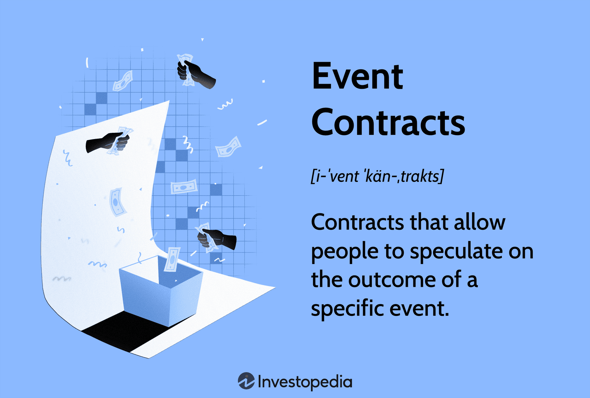

Contracts are foundational elements in the finance and trading sector, providing the necessary clarity and legal framework for transactions. Within this landscape, event contracts and financial trading contracts have become increasingly significant. This article examines the application of these contracts, particularly highlighting their integration within algorithmic trading. Algorithmic trading thrives on speed, accuracy, and automation, and these contracts are critical tools in such environments.

Understanding the structure and significance of both event and financial trading contracts allows for insights into their role in algorithmic trading strategies. These contracts not only enhance the reliability and security of transactions but also support the specific needs of traders when it comes to executing their strategies efficiently. Whether hedging risks or capitalizing on speculative opportunities, contracts serve as essential instruments. 



This discussion will provide a comprehensive overview of how these contracts reinforce trading strategies. Both experienced and novice market participants will find value in understanding how contracts facilitate seamless operations in today's financial markets. As the trading environment evolves, mastering the integration and execution of these contracts presents a notable competitive edge.

## Table of Contents

## Understanding Event Contracts

Event contracts are a type of derivative that enables traders to place bets on the outcomes of specific events, distinguished by their binary nature and dependence on predetermined occurrences rather than traditional financial asset movements. This characteristic distinguishes them from other financial trading instruments, as event contracts provide a distinctive avenue for speculation or risk management based on tangible events or scenarios. 

These contracts are typically structured as binary options, offering an all-or-nothing payout to the trader contingent upon the realization of the predicted event. For example, a trader might purchase an event contract predicting that a particular economic report, such as the non-farm payrolls number, will exceed or fall short of market expectations. If the outcome aligns with the trader's prediction, they receive a predetermined payout; otherwise, they incur the loss of their initial investment.

The appeal of event contracts lies in their simplicity and their ability to hedge or speculate on market movements driven by events. Given their binary and often short-term nature, these contracts are attractive as hedging tools, providing a straightforward means to offset potential losses from market volatility tied to specific events. For instance, a corporation exposed to currency fluctuations around geopolitical developments might use event contracts to mitigate risks associated with adverse currency movements.

Moreover, their accessibility has increased with the proliferation of online trading platforms, which offer these instruments to both institutional and retail investors. Such platforms provide user-friendly interfaces that allow traders to efficiently navigate and execute event contracts, thereby democratizing participation in this segment of the derivatives market. This availability is coupled with the advent of complex analytical tools and real-time data feeds, which empower traders to make informed decisions rapidly.

In summary, event contracts offer unique trading opportunities distinct from those based on the price trajectories of financial instruments. By focusing on specific occurrences and delivering binary results, they provide versatile tools for traders aiming to hedge against or profit from predicted events. The growing accessibility through online platforms ensures that both institutional and retail traders can leverage these tools effectively.

## Exploring Financial Trading Contracts

Financial trading contracts constitute a crucial component of financial markets, offering a spectrum of instruments tailored for diverse trading strategies and risk management needs. These instruments include futures, options, and swaps, each serving unique purposes and providing distinct benefits to market participants.

### Futures Contracts

A futures contract is a standardized agreement to buy or sell an asset at a predetermined price on a specific future date. These contracts are commonly utilized for hedging risk and speculation purposes. Participants in futures markets typically include hedgers, who aim to protect against price fluctuations in an underlying asset, and speculators, who seek to profit from anticipated price movements. The effectiveness of futures contracts in hedging is primarily due to their ability to lock in prices, thereby stabilizing future cash flows.

Mathematically, the profit or loss from a futures position can be expressed as:

$$
\text{Profit/Loss} = (P_{\text{sell}} - P_{\text{buy}}) \times \text{contract size}
$$

where $P_{\text{sell}}$ and $P_{\text{buy}}$ are the selling and buying prices, respectively.

### Options Contracts

Options contracts provide traders with the right, but not the obligation, to buy (call option) or sell (put option) an underlying asset at a predetermined strike price before or at expiration. This flexibility allows traders to craft sophisticated strategies that can benefit from various market conditions. Unlike futures, options require the payment of a premium for this right, which is determined by factors such as the underlying asset's [volatility](/wiki/volatility-trading-strategies), time to expiration, and current market price.

The value of an option can be assessed using pricing models like the Black-Scholes formula, which estimates the theoretical value of European-style options:

$$
C = S_0 \cdot N(d_1) - X \cdot e^{-rT} \cdot N(d_2)
$$

where:
- $C$ is the call option price,
- $S_0$ is the current stock price,
- $X$ is the strike price,
- $r$ is the risk-free interest rate,
- $T$ is the time to expiration,
- $N(d)$ is the cumulative distribution function of the standard normal distribution,
- $d_1$ and $d_2$ are defined as:

$$
d_1 = \frac{\ln(S_0/X) + (r + \sigma^2/2)T}{\sigma \sqrt{T}}
$$

$$
d_2 = d_1 - \sigma \sqrt{T}
$$

where $\sigma$ is the volatility of the stock.

### Swaps

Swaps are financial agreements in which two parties exchange sequences of cash flows for a set period. Common types include [interest rate](/wiki/interest-rate-trading-strategies) swaps, where fixed interest rate payments are exchanged for floating-rate payments, and currency swaps, where principal and interest payments are exchanged in different currencies. Swaps enable institutions to manage exposure to fluctuations in interest rates or currency exchange rates and can be tailored to specific needs.

Swaps often involve bespoke terms, tailored to the participants' needs, which distinguishes them from standardized futures and options contracts. The valuation of swaps typically involves the calculation of the present value of the cash flows involved, using appropriate discount rates.

### Core Role in Financial Markets

These financial trading contracts are integral to the operation of financial markets. They provide mechanisms for price discovery, allowing traders to express views on future price movements and to distribute risks effectively among participants. By providing [liquidity](/wiki/liquidity-risk-premium), these instruments enable markets to function efficiently, facilitating transactions and capital movement.

The versatility and adaptability of futures, options, and swaps make them indispensable tools for hedging, speculation, and strategic financial management. As a result, they are foundational to maintaining stability and efficiency in global financial systems.

## The Role of Algorithmic Trading in Contract Usage

Algorithmic trading, powered by advanced algorithms and state-of-the-art technology, has revolutionized financial markets by enabling rapid trade execution and minimizing transaction costs. Within the context of contracts, these technologies employ sophisticated models that forecast market movements, optimize trading strategies, and execute trades at unparalleled speeds. Such proficiency is crucial in effectively managing event and financial trading contracts, where precision timing and pattern recognition can significantly impact profitability.

Traders harness specific algorithms to identify and exploit [arbitrage](/wiki/arbitrage) opportunities across various contract markets. Arbitrage, which involves buying and selling equivalent assets in different markets to profit from price discrepancies, is particularly well-suited to automation due to the precision and speed required to execute these trades successfully. For example, if a futures contract is underpriced in one market and overpriced in another, an algorithm can execute simultaneous transactions to capitalize on this difference, thus enhancing profitability.

Risk management is another area where [algorithmic trading](/wiki/algorithmic-trading) excels, especially regarding event and financial trading contracts. Algorithms systematically assess risk exposure, adjusting positions in real-time to ensure compliance with predefined risk parameters and regulatory standards. This capability is essential in maintaining the integrity of trading strategies and protecting assets from unexpected market shifts. Pyton code for such a risk management algorithm could include:

```python
def manage_risk(portfolio, risk_limits, market_data):
    for contract in portfolio:
        risk = calculate_risk(contract, market_data)
        if risk > risk_limits[contract]:
            adjust_position(contract, portfolio)

def calculate_risk(contract, market_data):
    # A hypothetical function to calculate risk
    return market_data[contract]['volatility'] * market_data[contract]['exposure']

def adjust_position(contract, portfolio):
    # Adjust portfolio to manage risk
    portfolio[contract]['position'] -= portfolio[contract]['position'] * 0.1  # Example adjustment
```

Automation facilitated by algorithmic trading empowers institutions to efficiently manage large volumes of contracts. This efficiency reduces the need for manual interventions, minimizing human errors and facilitating more consistent execution across trades. The reduced reliance on human input also allows traders to allocate resources towards developing more sophisticated plays and optimizing existing algorithms, further contributing to market efficiency and enhancing institutional capabilities.

In conclusion, algorithmic trading is indispensable for modern contract usage in financial markets. By leveraging sophisticated models and automation, it ensures efficient trade execution, optimizes profitability through arbitrage, and robustly manages risk exposure. As technology continues to evolve, the algorithms that drive this process will likely become even more integral to the successful management of trading contracts.

## Benefits and Challenges of Using Contracts in Algo Trading

Integrating contracts into algorithmic trading offers substantial benefits, enhancing efficiency, scalability, and precision in trade execution. Contracts enable the development of complex trading strategies that are not feasible through manual processes. Through automation, traders can handle vast data streams and execute trades more quickly than humanly possible. The ability to process and act on information in milliseconds provides a significant competitive edge in fast-paced market environments.

One of the advantages of using contracts in algorithmic trading is the improved capacity to model intricate trading scenarios. Traders can implement strategies involving a diverse array of contracts, leveraging computational power to simulate various conditions and outcomes. For instance, Python libraries such as NumPy and pandas can be used to model price movements and triggers for contract execution:

```python
import numpy as np
import pandas as pd

# Example: Calculate moving averages for contract price data
prices = pd.Series([100, 101, 102, 103, 104, 105])
short_window = 2
long_window = 3

signals = pd.DataFrame(index=prices.index)
signals['short_mavg'] = prices.rolling(window=short_window, min_periods=1).mean()
signals['long_mavg'] = prices.rolling(window=long_window, min_periods=1).mean()

# Generate trading signals based on moving averages
signals['signal'] = 0.0
signals['signal'][short_window:] = np.where(
    signals['short_mavg'][short_window:] > signals['long_mavg'][short_window:], 1.0, 0.0
)
```

Despite their benefits, contracts in algorithmic trading also present significant challenges. System failures and algorithmic errors pose risks that can result in substantial financial losses. It's crucial for firms to implement robust risk management protocols to mitigate these risks. Market volatility further complicates the scenario, requiring algorithms to be adaptable and resilient to rapid fluctuations.

Continuous monitoring, [backtesting](/wiki/backtesting), and optimization are essential practices for maintaining the effectiveness of trading algorithms. Backtesting allows traders to assess how algorithms perform against historical data, fine-tuning them to adapt to dynamic market conditions. This process involves simulating trades and analyzing outcomes, which helps in optimizing strategies.

The regulatory landscape for algorithmic trading is continuously evolving, imposing adherence to compliance and transparency standards. Regulatory bodies require that automated trading activities are well-documented, fair, and not disruptive to market integrity. Traders must ensure that their algorithms comply with these standards, maintaining auditable logs of trading activities and decisions.

In conclusion, while contracts in algorithmic trading provide significant advantages, traders must also navigate various challenges. Mastery of algorithmic tools, continuous refinement of strategies, and strict adherence to regulatory standards are crucial for success in this competitive field.

## Conclusion

Event and financial trading contracts play a crucial role in contemporary trading strategies by providing avenues for both hedging and speculative endeavors. They offer flexibility, allowing traders to tailor their approaches according to market conditions and individual risk appetites. A notable development in this sector is the integration of these contracts with algorithmic trading models. This fusion enhances market efficiency and trader effectiveness by enabling rapid analysis and execution of trading strategies.

As technology progresses, the sophistication and adoption of algorithmic trading are poised to increase. This evolution is heavily dependent on the structured use of contracts, which form the backbone of automated trading strategies. Algorithmic frameworks leverage the predictability and standardized nature of contracts to optimize trading operations, thereby ensuring that traders can swiftly respond to market dynamics.

For traders aiming to capitalize on these dynamics, understanding the interplay between contracts and algorithmic strategies is vital. The capacity to analyze and execute trades with precision can significantly bolster a trader's competitive edge. Mastering the intricacies of contract utilization in conjunction with algorithmic systems is not just advantageous but increasingly necessary in the swiftly evolving landscape of modern financial markets.

## References & Further Reading

[1]: Hull, J. C. (2017). ["Options, Futures, and Other Derivatives Fourth Edition."](https://books.google.com/books/about/Options_Futures_and_Other_Derivatives_eB.html?id=2iopDwAAQBAJ) Pearson Education.

[2]: Kissell, R. (2013). ["The Science of Algorithmic Trading and Portfolio Management."](https://www.sciencedirect.com/book/9780124016897/the-science-of-algorithmic-trading-and-portfolio-management) Academic Press.

[3]: Varian, H. R. (1992). ["Microeconomic Analysis."](https://archive.org/details/microeconomicana00vari_0) W. W. Norton & Company.

[4]: Black, F., & Scholes, M. (1973). ["The Pricing of Options and Corporate Liabilities."](https://www.cs.princeton.edu/courses/archive/fall09/cos323/papers/black_scholes73.pdf) Journal of Political Economy, 81(3), 637-654.

[5]: Aldridge, I. (2013). ["High-Frequency Trading: A Practical Guide to Algorithmic Strategies and Trading Systems."](https://onlinelibrary.wiley.com/doi/pdf/10.1002/9781119203803.fmatter) Wiley.