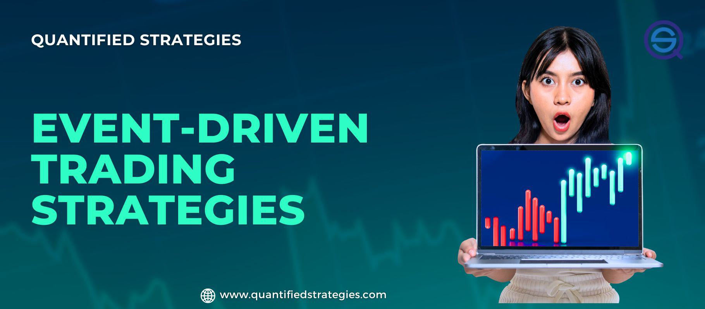

## Table of Contents

## What is event-driven investing?

Event-driven investing is a strategy where investors make decisions based on specific events that can affect the price of a stock or other financial assets. These events could be things like mergers, acquisitions, earnings reports, or even big news like a new product launch. The idea is to predict how these events will change the value of the asset and then buy or sell it to make a profit.

This type of investing requires a lot of research and quick thinking. Investors need to stay updated with news and announcements that could impact the market. They also need to understand how different events can influence different companies in different ways. For example, a positive earnings report might boost a company's stock price, while news of a lawsuit could cause it to drop. By carefully analyzing these events, event-driven investors aim to make smart moves that take advantage of the market's reactions.

## What types of events trigger event-driven investing strategies?

Event-driven investing strategies are triggered by specific happenings that can move the prices of stocks or other financial assets. These events can include company-specific news like earnings announcements, where a company reports its financial performance. If the earnings are better than expected, the stock price might go up. Other company events like mergers and acquisitions, where one company buys another, can also trigger these strategies. When a merger or acquisition is announced, investors might buy or sell stocks based on how they think the deal will affect the companies involved.

In addition to company-specific events, broader economic or political news can also drive event-driven investing. For example, changes in government policies, like new tax laws or trade agreements, can impact entire industries. If a new law makes it easier for a certain type of business to operate, investors might buy stocks in those companies expecting their value to rise. Similarly, unexpected events like natural disasters or major lawsuits can also lead to investment decisions. Investors watch these events closely and try to predict how they will affect the market, hoping to make profitable trades based on their predictions.

## How can beginners identify potential event-driven investment opportunities?

Beginners can identify potential event-driven investment opportunities by keeping an eye on the news. They should look for big announcements from companies, like earnings reports or news about mergers and acquisitions. These events can cause a company's stock price to move up or down. For example, if a company reports higher earnings than expected, its stock might go up. On the other hand, if a company is involved in a lawsuit, its stock might go down. By staying updated with news and understanding how these events can affect a company, beginners can spot chances to invest.

Another way for beginners to find event-driven opportunities is to pay attention to economic and political news. Changes in government policies, like new tax laws or trade agreements, can impact whole industries. If a new law makes it easier for a certain type of business to operate, the stocks of those businesses might go up. Also, unexpected events like natural disasters can shake up the market. Beginners should watch these events and try to predict how they will change stock prices. With some research and attention to the news, beginners can start to see where the best event-driven investment opportunities might be.

## What are the key differences between event-driven and traditional investing strategies?

Event-driven investing and traditional investing strategies differ mainly in what drives the investment decisions. In traditional investing, people often look at long-term trends and the overall health of a company. They might buy stocks because they believe the company will grow over time. They consider things like the company's earnings, its position in the market, and the economy as a whole. Traditional investors might hold onto their investments for years, hoping the value will increase steadily.

On the other hand, event-driven investing focuses on specific events that can change a stock's price quickly. These events could be a company's earnings report, a merger or acquisition, or even big news like a new product launch or a lawsuit. Event-driven investors try to predict how these events will affect the stock price and make quick decisions to buy or sell based on those predictions. Unlike traditional investors, they might hold onto their investments for a shorter time, looking to profit from the immediate impact of the event.

## Can you explain the risk and reward profile of event-driven investing?

Event-driven investing can offer big rewards because it tries to take advantage of quick changes in stock prices caused by specific events. If an investor can predict how an event, like a merger or an earnings report, will affect a stock, they might be able to buy low and sell high in a short time. This can lead to fast profits, especially if the event causes a big move in the stock price. For example, if a company announces better-than-expected earnings, its stock might jump, and an event-driven investor could make a lot of money in a short time.

However, event-driven investing also comes with higher risks. The biggest risk is that the event might not turn out as expected. If an investor bets on a stock going up after a merger announcement, but the merger falls through, the stock could drop instead. This means the investor could lose money quickly. Also, because event-driven investing often involves short-term trades, there's less time to recover from a bad investment. So, while the potential rewards can be high, the risks of losing money are also significant.

## What are some common tools and resources used in event-driven investing?

Event-driven investors use a lot of different tools and resources to find out about events that can affect stock prices. One of the most important tools is financial news websites and apps. These help investors stay updated on things like earnings reports, mergers, and other big news. They also use stock market data platforms, which give them detailed information about stock prices and trading volumes. These platforms can show how a stock is reacting to an event in real time. Another useful resource is company announcements and press releases. By reading these, investors can learn about events directly from the companies involved.

In addition to these, event-driven investors often use research reports from analysts. These reports can give insights into how an event might affect a company's future. Social media and forums are also important, as they can provide quick updates and different opinions about what's happening in the market. Some investors even use special software that tracks news and events automatically, alerting them when something important happens. All these tools and resources help event-driven investors make quick and informed decisions based on the events they're watching.

## How do market reactions to events affect event-driven investment strategies?

Market reactions to events are really important for event-driven investing. When something big happens, like a company announcing good earnings or a merger, the stock price can change a lot. Event-driven investors try to guess how the market will react to these events. If they think the stock price will go up, they might buy the stock before the event happens. If they think it will go down, they might sell it or even bet against it. The key is to understand how the market might move and make a move first.

But, guessing the market's reaction isn't always easy. Sometimes, the market might not react the way investors expect. For example, a company might announce a merger, but if investors are worried about the deal, the stock price could go down instead of up. This can lead to losses for event-driven investors if they made the wrong guess. So, while event-driven investing can be exciting and potentially profitable, it also comes with a lot of risk because the market can be unpredictable.

## What role does timing play in the success of event-driven investments?

Timing is super important in event-driven investing. When an event happens, like a company announcing earnings or a merger, the stock price can change quickly. Event-driven investors need to act fast to buy or sell stocks before the price moves too much. If they time it right, they can make a lot of money. For example, if they buy a stock just before good news comes out, they can sell it at a higher price soon after.

But, getting the timing wrong can lead to big losses. If an investor buys a stock thinking it will go up after an event, but the stock actually goes down, they lose money. The market can be unpredictable, and even if an event seems good, it might not turn out that way. So, event-driven investors need to be really careful about when they make their moves. Timing is a big part of whether they succeed or not.

## How can an investor manage the volatility associated with event-driven strategies?

Managing the ups and downs of event-driven investing can be tough, but there are ways to handle it. One way is to spread out your investments. Instead of putting all your money into one stock that might go up or down because of an event, you can invest in a few different stocks. This way, if one stock loses value, the others might balance it out. Another way is to use stop-loss orders. These are like safety nets that automatically sell your stock if it drops to a certain price, helping you limit how much money you could lose.

Another important thing is to do a lot of research and stay calm. Before you invest based on an event, make sure you understand how it might affect the stock. Look at past events and see how stocks reacted. Also, try not to panic if the stock price starts to move a lot. Sometimes, the market can overreact, and if you stay calm, you might be able to make better decisions. By spreading out your investments, using stop-loss orders, and staying informed and calm, you can manage the [volatility](/wiki/volatility-trading-strategies) that comes with event-driven strategies.

## What advanced techniques can be used to enhance returns in event-driven investing?

One advanced technique to boost returns in event-driven investing is to use options trading. Options are like bets on whether a stock will go up or down. If an investor thinks a stock will jump because of an event, they can buy a call option, which lets them buy the stock at a set price later. This can be cheaper than buying the stock outright and can lead to bigger profits if the stock price goes up a lot. On the flip side, if an investor thinks a stock will drop, they can buy a put option, which lets them sell the stock at a set price. This way, they can make money even if the stock price falls.

Another technique is to use [algorithmic trading](/wiki/algorithmic-trading). This involves using computer programs to make trades based on certain rules. For example, an algorithm can be set up to buy a stock as soon as a certain event happens, like a merger announcement. This can help investors act faster than they could on their own, which is important in event-driven investing where timing is everything. Algorithms can also look at lots of data quickly and find patterns that humans might miss, helping investors make smarter decisions and potentially earn more money.

## How do regulatory environments impact event-driven investing strategies?

Regulatory environments can really change how event-driven investing works. When new rules come out, like changes in tax laws or new rules about mergers, they can affect what investors decide to do. For example, if a new law makes it harder for companies to merge, investors might not want to bet on stocks that are part of a merger plan. They have to think about how these rules will change what companies can do and how that will affect stock prices. So, event-driven investors need to keep an eye on what the government is doing and be ready to change their plans if the rules change.

Also, regulatory news can be a big event that drives investing decisions. If there's news about a new rule that will help a certain industry, like making it easier for tech companies to operate, investors might buy stocks in those companies because they think the stock prices will go up. But if the news is bad, like a new rule that will hurt an industry, investors might sell those stocks because they think the prices will go down. So, understanding and reacting to regulatory changes is a big part of event-driven investing.

## Can you discuss case studies of successful and failed event-driven investment scenarios?

A successful event-driven investment happened in 2016 when Microsoft announced it was buying LinkedIn. Some investors saw this coming and bought LinkedIn stock before the news came out. When Microsoft made the announcement, LinkedIn's stock price jumped a lot. The investors who bought the stock early made a good profit because they guessed right about the merger and bought at the right time. This shows how event-driven investing can work well if you can predict big events and their effects on stock prices.

On the other hand, a failed event-driven investment happened with the merger between Sprint and T-Mobile in 2018. Some investors thought the merger would go through quickly and bought Sprint stock, expecting the price to go up. But the merger took a long time because of regulatory issues, and the stock price didn't move as much as expected. Investors who bought the stock hoping for a quick profit ended up losing money because they didn't think about how regulatory delays could affect the stock price. This shows that even when you think you know what will happen, things can go wrong in event-driven investing if you don't consider all the risks.

## References & Further Reading

[1]: Sweeney, R. J. (1996). ["Do Markets React Efficiently to Corporate Event Announcements?"](https://www.semanticscholar.org/paper/Causes-and-Consequences-of-Earnings-Manipulation%3A-Dechow-Sloan/c607aa58de0a81ecc39d05a78589128d8db61999) Journal of Financial Economics, 41(2).

[2]: Hasbrouck, J. (2007). ["Empirical Market Microstructure: The Institutions, Economics, and Econometrics of Securities Trading"](https://academic.oup.com/book/52241). Oxford University Press.

[3]: Fabozzi, F. J., Focardi, S. M., & Mazza, T. (2010). ["Mathematics of Financial Modeling and Investment Management"](https://archive.org/details/mathematicsoffin0000foca). Wiley.

[4]: Kissell, R. (2013). ["The Science of Algorithmic Trading and Portfolio Management"](https://www.sciencedirect.com/book/9780124016897/the-science-of-algorithmic-trading-and-portfolio-management). Academic Press.

[5]: Jarrow, R. (1994). ["Derivative Securities"](https://archive.org/details/derivativesecuri0000jarr_r8m0). South-Western College Publishing.