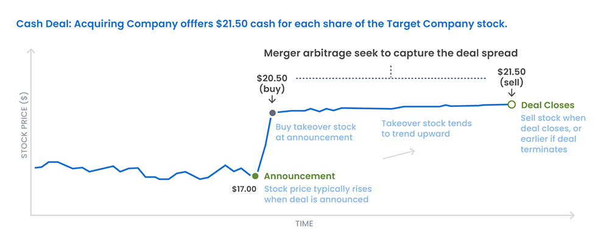
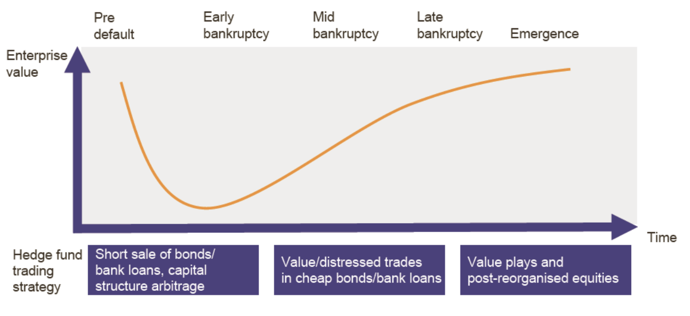
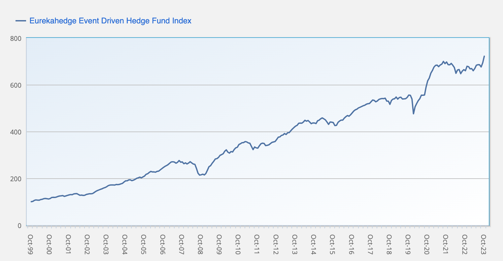

Event-driven strategies in the realm of trading and investing are approaches that focus on capitalizing on the volatility and price movements triggered by significant corporate events. These events can include mergers and acquisitions, earnings announcements, regulatory changes, or any other occurrences that can impact a company's financial outlook. By leveraging the market's reaction to these events, investors aim to secure profits or hedge risks.

In the complex tapestry of today's financial markets, event-driven strategies hold a place of significant importance. They provide a unique opportunity for investors to not only profit from but also navigate through the volatile waters stirred by corporate actions and market responses. Unlike traditional investment strategies that primarily rely on fundamental or technical analysis, event-driven strategies hinge on the understanding and anticipation of the market's reaction to specific events.

This approach demands a keen sense of market sentiment, an understanding of the intricacies of corporate actions, and a strategic vision to foresee potential market shifts. The appeal of event-driven strategies lies in their potential to exploit short-term mispricings in the market, often created in the wake of significant corporate events. These strategies also contribute to market efficiency by correcting mispricings.

## Table of Contents

## Understanding Event-Driven Strategies

Event-driven strategies are a sophisticated form of investment and trading approach that focus on capitalizing on the price movements and volatility resulting from significant corporate events. These events can range from mergers and acquisitions to bankruptcy filings, earnings reports, and regulatory changes. The fundamental logic behind these strategies is that such events can lead to mispricing of securities, providing opportunities for profit.

**Concept and Mechanics**

The core concept of event-driven strategies lies in identifying and predicting the outcome of corporate events and understanding how these events will influence the value of a company's stock or debt. Investors employing these strategies analyze the details of the event, assess the market's reaction, and then position their trades accordingly. For instance, in merger arbitrage, investors will buy and sell the stocks of two merging companies to profit from the deal's successful completion.

The mechanics involve thorough research and analysis to determine the potential impacts of the event on the company's financial health and market perception. Traders and investors use a mix of fundamental and quantitative analysis to assess the situation, and once they have a position, they closely monitor the situation as it unfolds, ready to adjust their strategy as new information emerges.

**Historical Context**

Event-driven strategies have been around for several decades, evolving with the financial markets. In the early days, these strategies were primarily focused on mergers and acquisitions. Investors would analyze potential merger deals and invest accordingly, trying to predict which mergers would be successful and which would fail.

Over time, as financial markets became more complex and information more accessible, the scope of event-driven strategies expanded. The 1980s saw a significant rise in leveraged buyouts and corporate restructuring, which provided a fertile ground for these strategies. The 1990s and 2000s introduced more complexity with the advent of new financial instruments and a greater focus on distressed securities.

Today, event-driven strategies encompass a wide array of corporate events and are employed by a diverse group of market participants, from hedge funds specializing in specific types of events to individual investors looking for opportunities in market inefficiencies. The evolution of technology and data analytics has further refined these strategies, allowing for more sophisticated analysis and quicker reaction to events as they unfold.

## Types of Event-Driven Strategies

### Merger Arbitrage

Merger arbitrage is a specialized event-driven strategy that capitalizes on the price movements of companies involved in mergers and acquisitions (M&A). The fundamental mechanics of this strategy revolve around the concept of exploiting the pricing inefficiencies that often arise before and after a merger announcement.

**Specific Mechanics**

Merger arbitrageurs closely monitor the market for potential or announced mergers and acquisitions. Once a merger is announced, these investors analyze the details, including the terms of the deal and the likelihood of its completion.

The typical approach in merger arbitrage involves taking a long position in the stock of the company being acquired and a short position in the stock of the acquiring company. This is based on the premise that the target company's stock will rise to the offer price, while the acquirer's stock might decline due to the costs and risks associated with the acquisition.

The 'spread' in merger arbitrage refers to the difference between the market price of the target company's shares and the price offered by the acquiring company. Arbitrageurs aim to profit from this spread. They purchase the target's shares at the current market price, betting that the price will rise to the offer price once the merger is completed.

A key aspect of merger arbitrage is assessing the risk of the merger not going through as planned. Factors such as regulatory hurdles, financing issues, or changes in market conditions can impact the success of a merger. Arbitrageurs must evaluate these risks and adjust their positions accordingly.

Successful merger arbitrage requires precise timing. Investors need to enter and exit their positions at the right moments to maximize profits and minimize risks. This often involves a detailed analysis of the merger timeline and the regulatory environment.

To mitigate risks, merger arbitrageurs often employ various hedging strategies. These may include options strategies or diversifying across multiple merger deals.

**Unique Aspects**

Unlike traditional investment strategies, merger arbitrage is highly dependent on the specific event of the merger. The profits are not necessarily correlated with the broader market movements but are tied to the success of the merger.

This strategy requires a thorough understanding of the regulatory landscape, as governmental approvals are often a significant factor in the success of a merger.

Arbitrageurs must analyze vast amounts of information, including legal documents and financial statements, to assess the viability of the merger.

In essence, merger arbitrage is a sophisticated strategy that combines elements of fundamental analysis, risk management, and timing. It offers investors a way to gain from specific corporate events with a risk-return profile that is different from traditional market investing. As with any investment strategy, it requires expertise and a deep understanding of the dynamics at play in mergers and acquisitions.

### Distressed Securities

Distressed securities investing is a nuanced event-driven strategy that revolves around investing in the debt, equity, or other financial obligations of companies that are experiencing financial or operational distress, default, or are under bankruptcy. This strategy operates on the principle that distressed securities are often undervalued, presenting an opportunity for substantial returns if the company recovers or goes through a successful restructuring or liquidation process.

**Specific Mechanics**

The first step in distressed securities investing is identifying companies facing financial hardships. This can include firms undergoing bankruptcy proceedings, reorganization, or restructuring. Investors look for companies with a potential for recovery or those whose assets are undervalued compared to their market price.

Once potential investment opportunities are identified, a thorough analysis of the distressed company's financial situation is conducted. This includes examining its capital structure, cash flow, liabilities, and the reasons behind its distress. The goal is to ascertain the intrinsic value of the company's securities and the likelihood of a successful turnaround or restructuring.

Based on the analysis, investors decide whether to buy the distressed securities. The decision hinges on the potential risk-reward ratio, with an emphasis on the probability of the company's recovery and the expected returns in various scenarios, including liquidation.

Distressed securities investors often play an active role in the restructuring or reorganization process of the company. They may seek to influence the direction of the restructuring, negotiate with creditors, or participate in the management of the company to protect their investment and maximize returns.

Having an exit strategy is crucial. Investors need to decide when and how to sell their holdings, which could be after a successful restructuring, during a merger or acquisition, or after a certain target return is achieved.

**Unique Aspects**

Distressed securities investing is high-risk, as it involves companies in financial trouble. However, the potential for high returns exists if the company successfully turns around or if the liquidation value of its assets is greater than the market’s valuation.

This strategy requires a deep understanding of bankruptcy law, corporate finance, and debt restructuring. Investors must navigate through complex legal and financial structures, making it a more specialized investment approach.

Distressed securities are often mispriced due to the market’s aversion to risk and the complexity of the situation. Skilled investors exploit these inefficiencies to purchase assets at prices below their intrinsic value.

Investments in distressed securities may require a longer time horizon compared to other event-driven strategies. The process of restructuring or bankruptcy can be lengthy, and investors need to be prepared for a potentially extended holding period.

In summary, investing in distressed securities requires a blend of thorough financial analysis, strategic foresight, and an appetite for risk. It offers the opportunity to achieve significant returns by capitalizing on market inefficiencies and the potential recovery of companies facing financial distress.

### Special Situations

Special situations in event-driven strategies refer to investments made in response to specific corporate activities or events that are expected to create significant changes in a company's stock price. Unlike other event-driven strategies that may focus on predictable events like mergers or acquisitions, special situations involve a broader range of scenarios.

**Specific Mechanics**

Special situations encompass a variety of corporate events. These can include spin-offs, share buybacks, stock splits, dividend payments, changes in management, or regulatory decisions. Each of these events can potentially lead to a reassessment of a company’s value, offering investment opportunities.

The cornerstone of this strategy is in-depth research and analysis to understand the potential impact of the event on the company’s value. This involves analyzing the company’s financials, understanding the specifics of the event, and evaluating the market’s potential response.

Once an event and its impact are understood, investors take positions accordingly. This could mean buying or short-selling stocks, investing in options, or other derivatives based on the anticipated movement of the stock.

Each special situation presents a unique set of risks and rewards. Investors need to evaluate the probability of different outcomes of the event and estimate the potential returns in each scenario.

The investment time horizon in special situations can vary greatly, from short-term trades to longer-term investments, depending on the nature of the event and how long its effects are expected to influence the company's stock.

**Unique Aspects**

Special situations require an opportunistic investment approach. Investors need to be agile and ready to capitalize on opportunities as they arise.

Each special situation is unique, and there is no one-size-fits-all approach. The strategy must be tailored to fit the specifics of each event, which requires a high level of flexibility and adaptability.

Special situations often arise in areas where the market is less efficient. These inefficiencies create the opportunity for above-average returns for investors who can accurately assess the impact of the event.

Since special situations can arise in any sector and involve a wide range of events, they offer a way to diversify risk in an investment portfolio.

Special situations in event-driven strategies offer a dynamic and flexible approach to investing that can lead to significant returns. However, they require a deep understanding of a wide range of potential events, an ability to quickly and accurately assess their impact, and a readiness to act upon opportunities as they present themselves.

## Key Events in Event-Driven Investing

### Mergers

Mergers are significant corporate events where two companies combine to form a single entity. This process typically involves the acquisition of one company by another and can have a substantial impact on the market, particularly on the stock prices of the companies involved.

**Outline**

The initial announcement of a merger is often accompanied by a surge in the trading volume and volatility of the stocks of the companies involved. This phase sees the market reacting to the news, with investors assessing the potential benefits and drawbacks of the merger.

Following the announcement, there is a period where due diligence is conducted, and the terms of the merger are negotiated. This phase can be marked by uncertainty, as investors speculate on the likelihood of the merger’s completion and its final terms.

Most mergers require approval from regulatory bodies. The length and outcome of this review can significantly affect investor sentiment and the market’s perception of the merger’s success.

Once a merger is completed, the combined entity often undergoes restructuring. This phase can lead to fluctuations in stock prices as the market adjusts to the new corporate structure and potential changes in the company's future earnings and growth prospects.

**Impact on Market**

The stock prices of the companies involved in a merger often react strongly to the announcement. Typically, the share price of the company being acquired increases, approaching the offer price, while the acquirer's stock might experience a decline due to the costs associated with the merger.

Mergers attract speculative trading, as investors try to profit from the anticipated changes in stock prices. This can lead to increased volatility in the stocks of the companies involved.

The announcement of a merger can influence broader market sentiment, especially if it involves major corporations. A successful merger can signal industry consolidation and may lead to bullish sentiment, while a failed merger can have the opposite effect.

Mergers create opportunities for merger arbitrage, where investors seek to profit from the price differential between the current market price of the target company’s stock and the proposed acquisition price.

Mergers can also impact other companies within the same sector, as they may lead to changes in competitive dynamics, market share distribution, and industry standards.

In summary, mergers are pivotal events that can significantly impact the market prices and investor behavior. They provide various trading opportunities but also come with risks due to the complexity and uncertainty involved in the merger process. Understanding how these events play out and their market implications is crucial for investors employing event-driven strategies.

### Acquisitions

Acquisitions are pivotal events in the financial markets where one company takes over another, either through purchasing a majority stake or buying it out completely. This corporate action, a key component in event-driven investing, creates significant market movements and investor responses.

**Outline**

The announcement of an acquisition typically leads to immediate market reaction. The stock price of the target company often rises towards the offer price, while the acquiring company's stock might see varied reactions based on how the market perceives the acquisition's future benefits and costs.

After the announcement, due diligence is conducted. This period involves scrutiny of the target company's financials and business model. Regulatory approvals are also sought, and any hurdles in this process can impact market sentiment.

Upon completion of the acquisition, the focus shifts to the integration of the two companies. This phase can involve restructuring and strategic shifts, influencing both companies' stock prices based on how effectively the integration is perceived by the market.

**Impact on Market**

Acquisitions can lead to volatility in the stock prices of both the acquiring and target companies. The target company’s stock typically sees a rise, while the acquirer’s stock might fluctuate based on the market's assessment of the acquisition's value.

These events often attract speculative trading, as investors seek to profit from potential price movements. This speculative interest can increase market volatility around the involved companies.

The market's perception of the acquisition’s potential success can significantly impact investor behavior. A positive reception can lead to bullish sentiment, while skepticism or perceived overvaluation can result in bearish trends.

Acquisitions can influence an entire sector by altering competitive dynamics. A significant acquisition might lead to industry consolidation, affecting other companies within the sector.

Similar to mergers, acquisitions create opportunities for arbitrage strategies, especially if there is a significant spread between the market price and the acquisition offer price.

In conclusion, acquisitions are critical events that shape market dynamics and investor behavior. They offer opportunities for profit through various strategies, including speculative trading and arbitrage. However, they also come with risks, as the outcome of an acquisition can be uncertain, and market perceptions can change rapidly. Investors using event-driven strategies must carefully analyze acquisitions, considering both the immediate impact and the longer-term implications for the companies and sectors involved.

### Earnings Announcements

Earnings announcements are critical events in the financial calendar where publicly-traded companies report their quarterly or annual earnings. These announcements provide significant insights into a company's financial health and future prospects and are closely watched by investors and traders.

**Outline**

Leading up to the earnings announcement, there's often speculation and analysis about the expected performance. Analysts provide earnings estimates, which set a benchmark against which the actual earnings are compared.

The company releases its earnings report, typically including key financial metrics such as revenue, net income, earnings per share (EPS), and guidance for future quarters. This report is often accompanied by a conference call where management discusses the results and may answer questions from analysts.

Immediately following the announcement, the company's stock price can experience significant volatility as the market reacts to the news. This reaction is not just to the earnings figures themselves but also to how they compare to expectations and the company's future earnings guidance.

**Impact on Market**

A company’s stock can experience sharp movements following an earnings announcement. If the earnings exceed market expectations, the stock price typically rises, and conversely, if earnings fall short of expectations, the stock price often falls.

Earnings announcements can influence the broader market sentiment, especially when they come from market leaders or bellwether companies. Positive or negative surprises can set the tone for market behavior.

Significant deviations from analysts' expectations, known as earnings surprises, can lead to larger-than-average stock price movements. Consistently beating or missing earnings estimates can also affect the long-term market perception of a company.

Earnings results from leading companies in a particular sector can impact other stocks in the same sector. Positive news might lift other stocks within the sector, while negative news can drag them down.

Earnings announcements are a focus for many short-term trading strategies. Traders might speculate on the direction of stock movement post-announcement or engage in strategies like options trading to capitalize on the expected volatility.

For long-term investors, earnings announcements offer crucial information that can influence decisions to buy, hold, or sell. They provide insights into a company's operational efficiency, market position, and future growth prospects.

In summary, earnings announcements are significant market events that can affect both the short-term and long-term behavior of stock prices. They offer opportunities for various trading and investment strategies but also come with risks, as predictions about earnings outcomes and their market impacts can be challenging. Understanding how to interpret earnings reports and anticipate market reactions is essential for those implementing event-driven strategies.

### Regulatory Changes

Regulatory changes are significant events in the financial markets where alterations to laws, policies, or regulations can have a profound impact on companies, industries, and the market at large. These changes can range from tax law amendments to new financial regulations or changes in trade policies.

**Outline**

The process often starts with the announcement of potential regulatory changes by government bodies or regulatory agencies. These announcements can be sudden or may follow a period of speculation and lobbying.

Regulatory changes typically undergo a legislative process, which might include debates, amendments, and voting. During this period, the market responds to news and speculation about the possible outcomes and their implications.

Once a regulatory change is approved and enacted, companies and industries must adapt to the new requirements. This phase can involve significant restructuring, compliance efforts, and changes in business strategies.

The long-term impact of regulatory changes can include alterations in competitive landscapes, industry standards, and operational costs. These effects often unfold over several years and can reshape entire sectors.

**Impact on Market**

The announcement of regulatory changes often leads to immediate market reactions. Stocks of companies and sectors directly affected by the proposed changes can experience heightened volatility.

Regulatory changes can have a disproportionate impact on certain sectors. For instance, stricter environmental regulations might negatively impact the energy sector but could be beneficial for renewable energy companies.

Companies might undertake strategic shifts in response to regulatory changes, such as divesting certain assets, changing supply chains, or altering their product lines, which can affect their stock prices.

Investor sentiment can be significantly influenced by regulatory changes. Positive regulatory changes can boost confidence in affected industries, while negative changes can lead to uncertainty and bearish sentiment.

For long-term investors, regulatory changes can factor into the fundamental analysis of companies and sectors. Changes in regulations might alter the long-term profitability and viability of certain business models.

In summary, regulatory changes are critical events that can dramatically affect market prices and investor behavior. They can create both risks and opportunities, depending on the nature of the change and the sectors involved. Investors utilizing event-driven strategies need to closely monitor regulatory developments and adapt their strategies accordingly to navigate these changes effectively. Understanding the potential impact of these changes on specific companies and sectors is crucial for successful event-driven investing.

### Others

In addition to the key events like mergers, acquisitions, earnings announcements, and regulatory changes, there are several other types of events that can drive market movements and are crucial in event-driven investing strategies.

**Outline**

When a company **launches a significant new product** or innovation, it can drastically affect its stock price. Positive reception can lead to higher stock prices, while failures or lukewarm receptions can have the opposite effect.

**Changes in key management positions**, especially in high-profile companies, can influence investor sentiment. The appointment of a new CEO, for example, can lead to positive or negative reactions based on the perceived competence and track record of the appointee.

**Legal battles**, especially involving patents or regulatory compliance issues, can have significant impacts. Settlements or court rulings can result in sudden changes in stock prices.

**Political instability**, elections, international conflicts, or significant policy changes can affect entire markets, sectors, or specific companies, especially those operating internationally.

**Events such as earthquakes, hurricanes, or global health crises** like the COVID-19 pandemic can have profound effects on markets, influencing sectors like insurance, travel, healthcare, and manufacturing.

**Impact on Market**

The announcement or occurrence of these events can lead to an immediate reaction in the stock market. Investors and traders often quickly reassess the affected company’s or sector's future prospects.

Some events have long-term implications for companies or sectors. For instance, a successful product launch can lead to sustained growth, while a major legal setback can hamper future prospects.

Certain events can impact entire sectors. For example, a technological breakthrough in renewable energy can affect all companies in that sector, while geopolitical tensions can impact global markets.

These events can introduce significant volatility, with stock prices fluctuating in response to new information and market sentiment.

Each event can create unique investment opportunities. Event-driven investors and traders might leverage these opportunities through strategies tailored to capitalize on the anticipated market reaction.

In summary, 'other' events in event-driven investing encompass a wide range of occurrences, each with the potential to significantly affect market prices and investor behavior. Understanding and anticipating the impact of these diverse events is essential for successful event-driven investing. These events offer opportunities but also come with risks, and investors need to carefully analyze each event's potential impact on the market.

## Event-Driven Hedge Fund Performance

Event-driven hedge funds focus on exploiting opportunities presented by significant corporate events such as mergers, acquisitions, earnings reports, bankruptcies, and restructurings. Their performance is a critical area of analysis, offering insights into the efficacy of event-driven strategies compared to other investment approaches.

**Performance Analysis**

Historically, event-driven hedge funds have shown a strong ability to generate alpha, which is the excess return on an investment relative to the return of a benchmark index. These funds typically thrive in environments where corporate events are frequent and market volatility is high. During periods of economic uncertainty or transition, such as during the 2008 financial crisis or the more recent COVID-19 pandemic, event-driven funds have often outperformed the market. This is due to their ability to quickly adapt to changing market conditions and capitalize on the mispricing of securities related to corporate events.

However, the performance of these funds can vary significantly based on the skill and experience of the fund manager, the specific event-driven strategy employed, and the overall market conditions. Some strategies, like merger arbitrage, tend to exhibit lower volatility and more consistent returns, while others, like distressed securities, can be riskier but potentially offer higher returns.

**Comparative Analysis**

When compared to other investment strategies, event-driven hedge funds often exhibit unique risk-return profiles. They tend to be less correlated with the broader market indices, which can make them an attractive option for diversifying an investment portfolio. This lower correlation stems from the focus on company-specific events rather than broader market trends.

In bull markets, event-driven strategies might not capture the full upside seen in more traditional equity strategies, as they are not purely reliant on market movements. Conversely, in bear markets or periods of high volatility, these funds can provide downside protection due to their focus on specific events and opportunities for arbitrage.

It's also important to note that the success of event-driven strategies can be heavily influenced by the regulatory environment, as changes in laws and policies can impact the frequency and nature of corporate events. Additionally, the increased popularity of these strategies has led to greater competition, which can sometimes reduce the potential for outsized returns as more investors seek to capitalize on the same opportunities.

## Risk Management in Event-Driven Strategies

Event-driven strategies, while offering substantial opportunities for profit, also carry inherent risks that must be carefully managed. Understanding and mitigating these risks is crucial for the success of any event-driven investment approach.

### Risks Involved

**Market Risk**: Event-driven strategies are subject to market volatility. The price of securities involved in events like mergers, acquisitions, or earnings announcements can be highly volatile, influenced by broader market movements and investor sentiment.

**Event Risk**: The outcome of a corporate event may not unfold as anticipated. For instance, mergers might not be completed, or earnings might be significantly different from expectations. Such unexpected outcomes can lead to substantial losses.

**Regulatory Risk**: Changes in regulations or legal decisions can impact the viability of a corporate event, altering the expected payoff of an event-driven strategy. For instance, a merger may face unforeseen regulatory hurdles or be blocked by antitrust authorities.

**Liquidity Risk**: Some event-driven strategies involve investing in less liquid securities, like distressed debt, which might be hard to sell at a reasonable price in a volatile market.

**Model and Valuation Risk**: The effectiveness of event-driven strategies often depends on the accuracy of the valuation models used to predict outcomes. Mispricing or model errors can lead to significant losses.

### Risk Mitigation Techniques

By spreading investments across different types of events and securities, investors can reduce the impact of a single event on the overall portfolio. Diversification can be achieved across different sectors, geographies, and event types.

Thorough research and analysis of each potential investment, including a deep dive into the specifics of the event, the companies involved, and the broader industry context, can help in better assessing risks and potential returns.

Using derivatives or other financial instruments to hedge positions can help manage risks. For instance, options can be used to hedge against adverse price movements in merger arbitrage strategies.

Setting stop-loss orders can limit losses by automatically selling securities when they reach a certain price level.

Maintaining a portion of the portfolio in highly liquid assets can be vital in responding to market changes or exiting positions quickly if needed.

Continuously monitoring market conditions, corporate developments, and regulatory changes and being ready to adjust strategies accordingly is crucial. This includes reassessing the underlying assumptions of the investment thesis as new information becomes available.

Leveraging the knowledge and experience of seasoned professionals can be invaluable, especially in complex situations like distressed debt investing or regulatory changes.

While event-driven strategies offer unique opportunities, they also come with specific risks that need to be skillfully managed. A combination of diversification, thorough research, hedging, liquidity management, and continuous monitoring forms the cornerstone of effective risk management in these strategies.

## Event-Driven Strategies in Different Market Sectors

Event-driven strategies are not one-size-fits-all; they vary significantly across different market sectors. Each sector presents unique opportunities and challenges for event-driven investing, influenced by the sector's specific characteristics, regulatory environment, and market dynamics.

**Healthcare Sector**

In the healthcare sector, event-driven strategies often focus on mergers and acquisitions, drug approval processes, and regulatory changes. The sector is known for its high volume of M&A activity, driven by the need for consolidation and expansion of product lines. Drug approval announcements by regulatory bodies like the FDA can lead to significant stock price movements, offering opportunities for event-driven trades. However, the healthcare sector also poses unique risks, including regulatory risks and the binary nature of outcomes in drug trials, which can lead to significant volatility.

**Technology Sector**

The technology sector is another prime area for event-driven investing, characterized by rapid innovation, frequent M&A activity, and significant regulatory scrutiny. Event-driven strategies here might focus on earnings releases, product launches, or regulatory actions against tech giants. The fast-paced nature of the tech sector means that information is quickly priced into the market, requiring investors to be exceptionally agile and well-informed.

**Energy Sector**

In the energy sector, event-driven strategies often revolve around regulatory changes, geopolitical events, and environmental policies. This sector is heavily influenced by external factors like oil prices, political stability in key oil-producing regions, and global energy policies. Investors in the energy sector must be adept at assessing the impact of these macro factors on individual companies and the sector as a whole.

**Financial Sector**

The financial sector presents opportunities for event-driven strategies, especially around regulatory changes, economic policy announcements, and macroeconomic events. The performance of financial institutions is closely tied to interest rate changes, monetary policy, and economic cycles, making them susceptible to event-driven trades based on economic indicators and central bank announcements.

**Consumer Goods Sector**

In the consumer goods sector, event-driven strategies might focus on mergers, acquisitions, and changes in consumer trends. This sector is particularly sensitive to economic cycles, consumer confidence, and demographic shifts. Event-driven investors here need to understand the consumer mindset and how global events, like trade policies or pandemics, can impact consumer behavior.

**Sector Analysis**

Each sector requires a tailored approach to event-driven investing. The key is to understand the specific drivers of stock price movements within that sector. This includes a deep understanding of the sector's regulatory environment, the competitive landscape, and any external factors that can influence the sector.

Event-driven strategies in different sectors also come with varying risk profiles. For example, the healthcare sector's binary outcomes from drug trials can lead to higher risk and reward scenarios compared to the more stable, but perhaps less volatile, consumer goods sector. Investors must align their strategies with their risk tolerance and investment goals, ensuring they have the requisite expertise or advice to navigate each sector effectively.

## Conclusion

Event-driven strategies represent a vital and dynamic segment of the investing landscape, enabling investors to capitalize on significant corporate events. These strategies, ranging from merger arbitrage to distressed securities and special situations, offer unique opportunities to generate alpha in various market conditions. They are grounded in the principle of exploiting market inefficiencies and volatility triggered by corporate events such as mergers, acquisitions, earnings announcements, and regulatory changes.

Understanding the mechanics behind these strategies is crucial. Each type of event-driven strategy comes with its own set of mechanics, risks, and rewards, requiring a tailored approach and thorough analysis. The success of these strategies hinges on the investor's ability to accurately assess and respond to the intricacies of each event.

Historically, event-driven strategies have played a significant role in the financial markets, evolving alongside market changes and regulatory environments. They have been instrumental in offering diversified returns, especially during times of market turbulence. Looking ahead, these strategies are expected to continue evolving, influenced by factors like globalization, technological advancements, and shifting regulatory landscapes.

💡 **Read more:**

- Trading strategies papers with code on [Equities](https://wiki.paperswithbacktest.com/trading-strategies/equities), [Cryptocurrencies](https://wiki.paperswithbacktest.com/trading-strategies/cryptocurrencies), [Commodities](https://wiki.paperswithbacktest.com/trading-strategies/commodities), [Currencies](https://wiki.paperswithbacktest.com/trading-strategies/currencies), [Bonds](https://wiki.paperswithbacktest.com/trading-strategies/bonds), [Options](https://wiki.paperswithbacktest.com/trading-strategies/options)
- [A curated list](https://github.com/paperswithbacktest/awesome-systematic-trading) of awesome libraries, packages, strategies, books, blogs, and tutorials for systematic trading
- [A bunch of datasets](https://huggingface.co/paperswithbacktest) for quantitative trading
- [A website to help you](https://paperswithbacktest.com/) become a quant trader and achieve financial independence

## Frequently Asked Questions

**What Are Event-Driven Strategies?**

Event-driven strategies are investment approaches that seek to capitalize on price movements and opportunities created by significant corporate events. These events include mergers and acquisitions, earnings announcements, regulatory changes, and other scenarios that can lead to temporary mispricing of a company's stock.

**How Do Event-Driven Strategies Work?**

These strategies work by anticipating how a specific event will impact a company's stock price. Investors analyze the event's potential outcomes and position their investments to profit from the anticipated price movement. The strategy can involve buying, selling, or holding securities based on expected changes in their value.

**What Types of Events Are Key in Event-Driven Investing?**

Key events include mergers and acquisitions, company earnings announcements, regulatory changes, and significant management changes. These events can cause substantial price movements, providing opportunities for investors to capitalize on the resulting volatility.

**Are Event-Driven Strategies Risky?**

Yes, event-driven strategies carry inherent risks. These include the unpredictability of event outcomes, market volatility, and the potential for unexpected developments that can adversely affect the anticipated outcome of an event.

**How Can Investors Mitigate Risks in Event-Driven Investing?**

Risk mitigation in event-driven investing involves thorough research and analysis, diversification across different events and sectors, using hedging techniques, and setting stop-loss orders to minimize potential losses. Continuous monitoring of market conditions and corporate developments is also crucial.

**Who Should Consider Event-Driven Strategies?**

Event-driven strategies are suitable for investors who have a deep understanding of market dynamics and corporate events. They are well-suited for those who can thoroughly analyze events and their potential impacts on stock prices and are comfortable with the associated risks.

**Can Individual Investors Implement Event-Driven Strategies?**

Yes, individual investors can implement event-driven strategies, but they need to be well-informed and prepared to conduct thorough research. Access to timely and detailed financial information and a good understanding of market dynamics are crucial for success in these strategies.

**What Tools and Resources Are Helpful in Event-Driven Investing?**

Useful tools and resources include financial news platforms, company reports, market analysis tools, and risk management software. Staying informed through real-time news services and utilizing financial databases for research are also important.

**How Do Event-Driven Strategies Fit into a Diversified Portfolio?**

Event-driven strategies can add diversification to a portfolio since their performance is often based on specific corporate events rather than broader market movements. This can help in reducing overall portfolio risk and enhancing returns.

**Where Can I Learn More About Event-Driven Investing?**

To learn more about event-driven investing, consider financial education courses, industry books, reputable financial news websites, and research papers. Engaging with financial advisors or investment professionals who specialize in these strategies can also provide valuable insights.

## References & Further Reading

- ["Merger Arbitrage: How to Profit from Global Event-Driven Arbitrage"](https://www.amazon.com/Merger-Arbitrage-Profit-Event-Driven-Finance/dp/1118736354) by Thomas Kirchner.
- ["Distressed Debt Analysis: Strategies for Speculative Investors"](https://www.amazon.com/Distressed-Debt-Analysis-Strategies-Speculative/dp/1932159185) by Stephen G. Moyer.
- ["The Art of M&A Strategy: A Guide to Building Your Company's Future through Mergers, Acquisitions, and Divestitures"](https://www.amazon.com/Art-Strategy-Building-Acquisitions-Divestitures/dp/0071756213) by Kenneth Smith and Alexandra Reed Lajoux.
- Research articles from The Journal of Finance, The Journal of Financial Economics, and The Review of Financial Studies.