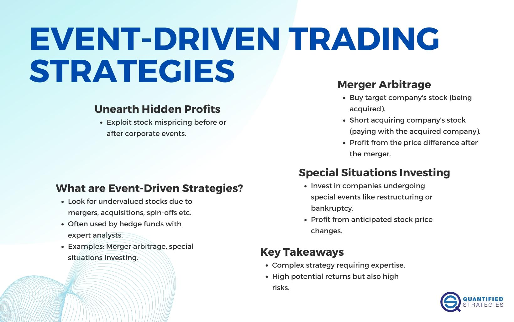

## Table of Contents

## What is event-driven trading?

Event-driven trading is a way of making investment decisions based on specific events or news that can affect the price of stocks or other financial assets. Instead of looking at long-term trends or patterns, traders who use this strategy focus on short-term changes caused by things like company announcements, economic reports, or unexpected news. For example, if a company announces better-than-expected earnings, an event-driven trader might quickly buy its stock, expecting the price to go up because of the good news.

This type of trading requires traders to be quick and well-informed. They need to stay updated with news and be ready to act fast when an event happens. Event-driven trading can be risky because the market's reaction to news can be hard to predict, and prices can change a lot in a short time. However, it can also be rewarding if a trader can correctly guess how the market will respond to an event and make a profit from the price movements that follow.

## How do event-driven trading strategies differ from other trading strategies?

Event-driven trading strategies focus on reacting quickly to specific events or news that can move the market. These events could be anything from a company's earnings report to unexpected news like a natural disaster. Traders using this strategy need to be on top of the news and ready to make fast decisions. They buy or sell assets based on how they think the market will react to the news. This approach is all about timing and being able to predict short-term market movements based on specific events.

In contrast, other trading strategies might not rely as heavily on immediate news or events. For example, trend-following strategies look at long-term patterns in the market and try to ride those trends for profit. These traders might hold onto their investments for weeks, months, or even years. Another common strategy is value investing, where traders look for stocks that they believe are undervalued and hold them until the market recognizes their true value. Unlike event-driven trading, these strategies are more about patience and long-term analysis rather than quick reactions to news.

The key difference between event-driven trading and other strategies lies in their time horizon and focus. Event-driven trading is short-term and reactive, requiring traders to be alert and agile. Other strategies like trend following or value investing take a longer view and are more about steady analysis and waiting for the right moment. Each type of strategy carries its own set of risks and rewards, and the choice between them depends on a trader's goals, risk tolerance, and how much time they can dedicate to monitoring the markets.

## What types of events are typically considered in event-driven trading?

Event-driven trading looks at many different kinds of events that can shake up the market. These can be things like a company's earnings report, which tells everyone how much money the company made. If the report is better than expected, traders might buy the stock hoping its price will go up. Another big event is a merger or acquisition, where one company buys another. This can change how people see the future of both companies, so traders watch these announcements closely. Also, changes in laws or regulations can impact certain industries, like when new rules are made for banks or energy companies.

Unexpected events, like natural disasters or political changes, can also move the market. For example, if a hurricane hits an area with lots of oil refineries, it might cause oil prices to jump. Or if there's a big election and the winner changes policies, that can affect stocks too. Traders who use event-driven strategies need to stay on top of all these kinds of news to make quick decisions. They're always ready to buy or sell based on how they think the market will react to these events.

## Can you explain the basic steps to implement an event-driven trading strategy?

To start with event-driven trading, you need to keep an eye on the news and events that might affect the market. This means watching for things like company earnings reports, mergers, changes in laws, or big news like natural disasters or elections. You need to be quick and ready to act when something important happens. So, you'll set up ways to get news fast, like alerts on your phone or computer, and keep checking news websites or financial news channels.

Once you spot an event that could move the market, the next step is to decide how to trade based on it. You need to guess how the market will react to the news. If you think a stock's price will go up because of good news, you might buy it quickly. If you think it will go down because of bad news, you might sell it or even bet against it. After you make your trade, you need to watch the market closely to see if your guess was right. If the market moves the way you thought, you might sell the stock for a profit. If it doesn't, you need to decide whether to hold on or cut your losses and get out.

## What are the key components of an event-driven trading system?

An event-driven trading system needs a few key parts to work well. First, it needs a good way to get news quickly. This could be through news alerts on a phone or computer, or by watching financial news channels all the time. The system also needs to be able to understand what the news means for the market. This means figuring out if the news is good or bad for certain stocks or markets. Another important part is having a plan for what to do when news comes in. This includes deciding when to buy or sell based on the news and how much to trade.

The second part of an event-driven trading system is the ability to act fast. Once the system spots an important event, it needs to make a trade quickly before the market moves too much. This means having a fast computer and a good connection to the trading platform. The system also needs to keep an eye on the trades after they're made. This means watching the market to see if the trade is working out and deciding when to close the trade, either to take a profit or to stop a loss. All these parts together make up a complete event-driven trading system that can react to news and try to make money from it.

## How do traders identify and analyze events for trading opportunities?

Traders who use event-driven trading need to be good at spotting and understanding events that can move the market. They do this by staying up-to-date with all kinds of news. This includes watching financial news channels, setting up alerts on their phones or computers, and checking news websites often. They look for events like company earnings reports, mergers and acquisitions, changes in laws, and even unexpected things like natural disasters or political changes. The key is to know which events matter and how they might affect the market. For example, if a company announces better-than-expected earnings, traders might see that as a good sign and think the stock price will go up.

Once they spot an event, traders need to figure out what it means for the market. They think about how the news might change how people see a company or an industry. If the news is good, like a company doing better than expected, they might decide to buy the stock, hoping the price will go up. If the news is bad, like a natural disaster affecting a company's operations, they might sell the stock or even bet against it, expecting the price to drop. After making a trade, traders keep a close eye on the market to see if their guess was right. If the market moves the way they thought, they might sell the stock for a profit. If it doesn't, they need to decide whether to hold on or cut their losses and get out.

## What are the risks associated with event-driven trading?

Event-driven trading can be risky because the market's reaction to news can be hard to predict. Sometimes, even good news doesn't make the stock price go up right away, or bad news might not cause the price to drop as much as expected. This means traders can lose money if they guess wrong about how the market will react. Also, because event-driven trading often involves quick decisions, there's not always enough time to think everything through. This can lead to mistakes and more losses.

Another risk is that event-driven trading can be very fast-paced. Traders need to act quickly when news comes out, which can be stressful and tiring. If they're not careful, they might make trades based on emotions instead of thinking clearly. Plus, since they're often holding onto stocks for a short time, they might not have the chance to wait out any bad news. All these things together make event-driven trading a high-risk, high-reward strategy that requires a lot of attention and quick thinking.

## How can technology enhance event-driven trading strategies?

Technology can make event-driven trading a lot easier and faster. One big way it helps is by giving traders quick access to news. With tools like news alerts on phones or computers, traders can know about important events as soon as they happen. This means they can make trades before the market moves too much. Also, technology can help traders figure out what the news means for the market. Special software can look at past data and guess how the market might react to different kinds of news. This can help traders make better guesses about what to buy or sell.

Another way technology helps is by making trades happen fast. With fast computers and good internet connections, traders can buy or sell stocks in just a few seconds. This is really important in event-driven trading because being quick can make a big difference in how much money a trader makes or loses. Also, technology can help traders keep an eye on their trades after they're made. There are programs that watch the market and can even make trades automatically if certain things happen. This can save traders a lot of time and help them catch more trading opportunities.

## What are some common metrics used to evaluate the performance of event-driven trading strategies?

When traders want to see how well their event-driven trading strategies are doing, they look at a few key numbers. One important number is the return on investment, or ROI. This tells them how much money they made or lost compared to what they started with. Another number they check is the win rate, which shows how often their trades make money. If a trader's win rate is high, it means they're guessing right about the market a lot of the time. They also look at the risk-reward ratio, which helps them understand if the possible gains from a trade are worth the risk of losing money.

Another set of numbers traders use are drawdowns and volatility. Drawdowns show the biggest drop in the value of their trading account from its highest point. This helps traders see how much they could lose at the worst times. Volatility measures how much the prices of the stocks they're trading go up and down. If the prices are moving a lot, it can be riskier but also offer more chances to make money. By keeping an eye on these numbers, traders can figure out if their event-driven trading strategies are working well and if they need to make any changes.

## How do regulatory changes impact event-driven trading?

Regulatory changes can have a big impact on event-driven trading. When laws or rules change, it can affect how companies work and how the market reacts. For example, if the government makes new rules about how banks can lend money, it might make bank stocks go up or down. Traders who use event-driven strategies need to pay close attention to these changes because they can create new chances to make money or cause big risks. If a trader knows about a new rule before most people do, they might be able to buy or sell stocks at the right time and make a profit.

However, regulatory changes can also make event-driven trading harder. Sometimes, new rules can make the market move in ways that are hard to predict. For instance, if a new law makes it harder for companies to merge, traders might not know if stock prices will go up or down. This can lead to more mistakes and losses. Traders need to be ready to change their strategies quickly when rules change. They also need to make sure they are following all the new rules themselves, or they could get in trouble.

## What advanced techniques can be used to improve the accuracy of event-driven trading models?

To make event-driven trading models more accurate, traders can use something called machine learning. This is a kind of computer program that can learn from past data and get better over time. By looking at old news and how the market reacted to it, the program can start to guess better how the market might move in the future. Traders can also use something called natural language processing, which is a way for computers to understand and read news articles. This helps the trading model pick up on important news faster and understand what it means for the market.

Another advanced technique is to use more data from different places. Instead of just looking at news, traders can also look at things like social media, company reports, and even satellite images to get a fuller picture of what's going on. This can help them spot events that might not be in the news yet but could still move the market. By combining all this data, traders can make their guesses about the market more accurate and find more chances to make money.

## Can you discuss a case study of a successful event-driven trading strategy?

A good example of a successful event-driven trading strategy happened in 2015 when Pfizer announced it was going to buy Allergan, a big drug company. Traders who were paying attention to the news saw this as a big event. They knew that when one company buys another, the stock prices of both companies can change a lot. So, some traders quickly bought Allergan's stock, thinking its price would go up because of the news. They were right. Allergan's stock price jumped, and the traders who bought it made a good profit.

However, not all event-driven trades work out so well. In this case, the deal between Pfizer and Allergan didn't go through because of new rules from the government. But the traders who acted fast on the news still made money because they sold the stock before the deal fell apart. This shows how important it is to be quick and to watch the news closely in event-driven trading. Even if the long-term outcome of an event isn't what you expect, you can still make money if you time your trades right.

## What is an Event-Driven Strategy?

Event-driven strategies in algorithmic trading are focused on capitalizing on market inefficiencies that arise from corporate or macroeconomic events such as earnings announcements, mergers and acquisitions, or bankruptcies. These strategies are designed to exploit the price discrepancies that typically occur before or after an event takes place.

Institutional investors, including private equity firms and hedge funds, predominantly utilize event-driven strategies due to their expertise in evaluating and interpreting such events. These entities leverage their analytical skills to assess the potential impact of the events and derive trading strategies that aim to generate profits from temporary mispricings in the market.

The core objective of event-driven trading is to identify scenarios where the market's reaction to an event does not reflect the anticipated changes in the fundamental value of the involved securities. A common situation might involve the market underestimating or overestimating the impact of a corporate earnings report, enabling traders to buy undervalued assets or sell overvalued ones, hence capturing the price differential as the market corrects itself.

Mathematically, suppose $P_0$ is the price of a stock before an event, and $P_1$ is its expected price after the event based on the anticipated effects of the event. An event-driven strategy seeks to capitalize on the difference between the actual post-event price $P_t$ and the expected price $P_1$. The profit or loss from this strategy could be expressed as:

$$
\text{Profit/Loss} = (P_t - P_1) \times Q
$$

where $Q$ is the quantity of stock traded.

In creating these strategies, traders might use various analytical and algorithmic approaches, including quantitative models that process historical data and simulate potential outcomes based on similar events in the past. Python, for example, offers extensive libraries like Pandas for data analysis, NumPy for numerical computations, and SciPy for statistical evaluations, which are integral tools in developing complex event-driven models.

In summary, event-driven strategies require a sophisticated understanding of both the market environments in which events occur and the ability to assess these events' potential outcomes. This strategic approach allows for the anticipation and exploitation of market inefficiencies, thus offering opportunities for potentially significant financial returns.

## References & Further Reading

[1]: ["Advances in Financial Machine Learning"](https://www.amazon.com/Advances-Financial-Machine-Learning-Marcos/dp/1119482089) by Marcos Lopez de Prado

[2]: ["Evidence-Based Technical Analysis: Applying the Scientific Method and Statistical Inference to Trading Signals"](https://www.amazon.com/Evidence-Based-Technical-Analysis-Scientific-Statistical/dp/0470008741) by David Aronson

[3]: ["Machine Learning for Algorithmic Trading"](https://github.com/stefan-jansen/machine-learning-for-trading) by Stefan Jansen

[4]: ["Quantitative Trading: How to Build Your Own Algorithmic Trading Business"](https://books.google.com/books/about/Quantitative_Trading.html?id=j70yEAAAQBAJ) by Ernest P. Chan

[5]: Pojarliev, M., & Levich, R. M. (2011). ["A New Look at Trading Strategies: Styles and Global Performance."](https://www.cfainstitute.org/-/media/documents/book/rf-publication/2012/rf-v2012-n4-1-pdf.ashx) Journal of Asset Management, 12(5), 315–339.