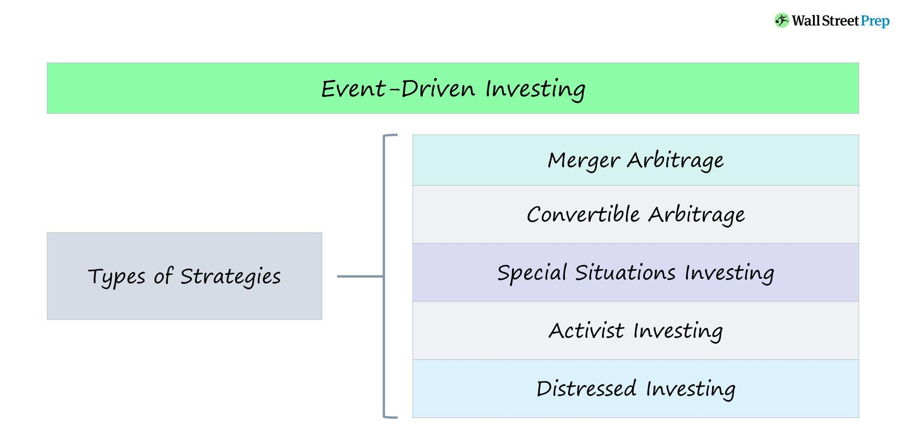

## Table of Contents

## What is event-driven trading?

Event-driven trading is a way of making investment decisions based on specific events or news that can affect the price of stocks or other financial assets. Traders who use this strategy pay close attention to things like company announcements, economic reports, or even global events like elections or natural disasters. When something important happens, they quickly buy or sell assets to take advantage of the changes in price that these events can cause.

This type of trading can be very profitable because it allows traders to react quickly to new information. However, it also comes with risks because the market's reaction to an event can be unpredictable. For example, if a company announces better-than-expected earnings, the stock price might go up, but it could also go down if investors think the news was already expected. Successful event-driven traders need to be good at analyzing information and making fast decisions.

## How does event-driven trading differ from traditional trading strategies?

Event-driven trading is different from traditional trading strategies because it focuses on specific events or news that can change the value of stocks or other assets. Traditional trading often uses long-term analysis, looking at trends and patterns over time to decide when to buy or sell. In contrast, event-driven traders watch for sudden changes, like a company's earnings report or a big news event, and they act quickly to take advantage of these changes.

Traditional trading strategies might involve methods like technical analysis, where traders look at charts and historical price data to predict future movements, or [fundamental analysis](/wiki/fundamental-analysis), where they study a company's financial health and industry conditions. Event-driven trading, on the other hand, is more about reacting to new information as it comes out. This means event-driven traders need to be fast and ready to make decisions based on the latest news, rather than waiting for long-term trends to play out.

## What types of events can trigger event-driven trading?

Events that can trigger event-driven trading include things like company announcements, economic reports, and big news stories. For example, if a company says it made more money than people expected, its stock price might go up. Or if a country's government releases a report showing the economy is doing well, that could make people want to buy stocks from that country. Even things like natural disasters or elections can affect what traders do, because these events can change how people feel about the economy.

Sometimes, smaller events can also trigger event-driven trading. For instance, if a company's CEO suddenly quits, that might make investors worry and sell the stock. Or if a new law is passed that helps a certain industry, people might start buying stocks from companies in that industry. The key thing is that event-driven traders are always looking for news that could change the value of stocks or other investments, and they act quickly when they see something important happen.

## What are the key components of an event-driven trading system?

An event-driven trading system has a few important parts that help traders make quick decisions based on new information. The first part is a way to get news and data fast. This could be through news feeds, social media, or special services that send alerts when something important happens. Traders need to know about events as soon as they happen, so they can react before the market does. The second part is a system to analyze this information. This might include tools that can quickly read through news articles or reports and figure out what they mean for different stocks or markets. This helps traders understand if an event is good or bad for their investments.

The third part of an event-driven trading system is a way to trade quickly. Once a trader knows about an event and understands its impact, they need to be able to buy or sell stocks fast. This often means using automated trading platforms that can execute trades in milliseconds. The last part is risk management. Because event-driven trading can be risky, traders need tools to help them decide how much to invest and when to stop trading if things go wrong. This might include setting limits on how much money they can lose or using other strategies to protect their investments.

## How can one identify profitable events for trading?

To identify profitable events for trading, you need to keep an eye on news and announcements that can move the market. This includes things like company earnings reports, economic data releases, and major news events like elections or natural disasters. You should focus on events that are likely to surprise the market. For example, if a company does much better or worse than people expected, that can cause a big change in its stock price. You can use news feeds, social media, and special services that send alerts to stay updated on these events.

Once you know about an event, you need to understand how it might affect the stocks or markets you're interested in. This means doing some research to see if the event is good or bad for the companies you're looking at. For instance, if a new law helps a certain industry, stocks in that industry might go up. You can use tools to analyze news and data quickly, so you can figure out the impact of an event before most other traders do. The key is to be quick and smart about understanding the news and how it can make stock prices change.

## What are the risks associated with event-driven trading?

Event-driven trading can be risky because it's hard to predict how the market will react to news. Sometimes, even good news can make stock prices go down if people think it was already expected. For example, if a company reports better earnings than last year but the market was expecting even better, the stock might fall instead of rise. This unpredictability can lead to big losses if the trader doesn't guess right.

Another risk is that event-driven trading often involves quick decisions. Traders need to act fast to take advantage of news, which means there's less time to think and plan. This can lead to mistakes, like buying or selling at the wrong time. Also, because the market can move quickly after an event, there's a chance that the trader might not be able to buy or sell at the price they want, which can make their trades less profitable or even result in losses.

## How do traders manage risk in event-driven trading?

Traders manage risk in event-driven trading by setting limits on how much money they can lose. They use something called a "stop-loss order," which automatically sells a stock if its price drops too much. This helps them avoid big losses if the market doesn't react to an event the way they thought it would. They also might not put all their money into one trade. Instead, they spread it out over different stocks or markets, so if one trade goes bad, it doesn't hurt them too much.

Another way traders manage risk is by doing a lot of research before they trade. They try to understand how the market might react to different events and plan their trades based on that. They also keep an eye on the news and are ready to change their plans if something unexpected happens. By being prepared and not betting too much on one event, traders can lower the chances of losing a lot of money in event-driven trading.

## What tools and technologies are essential for effective event-driven trading?

To do well in event-driven trading, traders need tools that help them get news and data quickly. They use news feeds, social media, and special services that send alerts when important events happen. These tools let traders know about events as soon as they happen, so they can act before the market does. Traders also use software that can quickly read through news articles and reports to understand what they mean for different stocks or markets. This helps them figure out if an event is good or bad for their investments.

Another important part of event-driven trading is having a way to trade quickly. Traders use automated trading platforms that can buy or sell stocks in milliseconds. This is important because they need to act fast once they know about an event and understand its impact. They also use risk management tools to help them decide how much to invest and when to stop trading if things go wrong. These tools can set limits on how much money they can lose or use other strategies to protect their investments.

## Can you explain how algorithmic trading integrates with event-driven strategies?

Algorithmic trading can work really well with event-driven strategies because it helps traders act fast and make smart decisions based on new information. When an important event happens, like a company announcing its earnings, an algorithm can quickly read the news, figure out what it means for the stock, and then buy or sell the stock without the trader having to do it by hand. This is important because in event-driven trading, being the first to react to news can make a big difference in making money.

The algorithms used in event-driven trading are set up to look for specific events and then act based on rules the trader has made. For example, if a company's earnings are better than expected, the algorithm might be told to buy the stock right away. But these algorithms also need to be careful. They use risk management rules to stop trading if things start to go wrong, like if the stock price starts to fall too much. By using algorithms, traders can take advantage of events more quickly and with less chance of making mistakes, but they still need to keep an eye on things to make sure the algorithms are working the way they should.

## What are some advanced techniques used in event-driven trading?

One advanced technique in event-driven trading is using machine learning to predict how the market will react to different events. Traders can feed lots of past data into a computer and teach it to find patterns. For example, the computer can learn that when a certain type of news comes out, stock prices usually go up or down. Then, when a new event happens, the computer can quickly guess what might happen to the stock price and help the trader decide what to do. This makes event-driven trading smarter and faster because the computer can find things that a person might miss.

Another advanced technique is using high-frequency trading ([HFT](/wiki/high-frequency-trading-strategies)) to take advantage of events. HFT uses very fast computers to buy and sell stocks in just a few seconds. When an important event happens, these computers can react almost instantly, buying or selling stocks before most other traders even know about the event. This can be really profitable, but it's also risky because the market can move very quickly and in unexpected ways. Traders using HFT need to have good risk management to stop trading if things start to go wrong.

## How does one evaluate the performance of an event-driven trading strategy?

To evaluate the performance of an event-driven trading strategy, traders look at how much money they made or lost over time. They check if the strategy made more money than it lost, and how it did compared to just holding onto stocks without trading. They also look at how often the strategy made money and how big those gains were. If the strategy made a lot of money most of the time, it's probably working well. But if it lost money a lot or the wins were small compared to the losses, then it might need to be changed.

Another important thing to check is how the strategy handled risk. Traders see if the strategy kept losses small and if it stopped trading when things went bad. They might use something called a "Sharpe ratio" to see if the strategy made good returns for the amount of risk it took. A high Sharpe ratio means the strategy did well for the risk it took. By looking at these things, traders can decide if their event-driven trading strategy is working and what they might need to do to make it better.

## What future trends might impact the effectiveness of event-driven trading?

One big future trend that might change event-driven trading is the use of [artificial intelligence](/wiki/ai-artificial-intelligence) (AI) and machine learning. These technologies can get better at predicting how the market will react to news. They can look at lots of past data to find patterns and make smarter guesses about what will happen next. This could make event-driven trading more accurate and profitable. But it also means traders need to keep learning and using the newest technology to stay ahead.

Another trend is the increase in the speed of information. With the internet and social media, news spreads faster than ever. This means traders need to be even quicker to react to events. High-frequency trading, where computers trade stocks in milliseconds, might become more common in event-driven trading. This can help traders take advantage of events before others, but it also makes the market more competitive and risky. Traders will need good risk management to handle these fast changes.

## What are the key components of event-driven trading?

Event-driven trading requires a combination of advanced technologies and strategic components to effectively harness opportunities presented by market events. Each component plays a pivotal role in enabling the swift and informed decision-making process that characterizes this trading strategy.

**News Analytics**

News analytics is a core component, leveraging Natural Language Processing (NLP) and [machine learning](/wiki/machine-learning) algorithms to extract actionable insights from an extensive array of unstructured data sources, including news articles, social media, and financial reports. This process anticipates how financial events might influence market behavior. For instance, sentiment analysis can evaluate the tone of earnings call transcripts, while machine learning models can predict the market's potential response to this sentiment.

```python
# Example of sentiment analysis using Python's TextBlob library

from textblob import TextBlob

def analyze_sentiment(text):
    return TextBlob(text).sentiment.polarity

news_article = "The company's recent expansion into Asia is expected to significantly boost revenue."
sentiment_score = analyze_sentiment(news_article)
print(f"Sentiment Score: {sentiment_score}")
```

**Event Databases**

Event-driven trading relies on comprehensive databases that compile both historical and real-time data. These databases are instrumental in back-testing trading strategies and providing context for decision-making. By analyzing past event outcomes, traders can refine their models and anticipate potential price movements. Real-time data feeds are equally crucial as they allow traders to react to unfolding events promptly.

**Algorithms and Models**

The automation aspect of event-driven trading is realized through sophisticated algorithms and predictive models. These tools facilitate the detection of events and automate the execution of trades, capitalizing on opportunities with precision and speed. Algorithms ingest vast datasets, analyze patterns, and execute trades within milliseconds, ensuring that traders can exploit market inefficiencies effectively.

**Risk Management**

Risk management is critical in the volatile environment of event-driven trading. Strategies such as stop-loss orders protect investors from significant losses by automatically selling a security when it reaches a certain price level. Diversification is another risk management strategy, where investments are spread across various assets to mitigate risks associated with any single event. Additionally, hedging strategies are employed to offset potential losses, thereby maintaining a balanced risk-reward ratio.

In equations, risk management could be viewed in terms of expected utility maximization, where an investor aims to maximize their utility $U(W)$:

$$

\max E[U(W)] = \int p(x) U(W(x)) dx 
$$

Here, $p(x)$ is the probability of different scenarios, and $W(x)$ is the wealth level in each scenario.

In essence, effective event-driven trading requires a synthesis of cutting-edge analytical tools, comprehensive data frameworks, and stringent risk management practices. This combination empowers traders to act swiftly and decisively in response to market-moving events.

## References & Further Reading

[1]: Lopez de Prado, M. (2018). ["Advances in Financial Machine Learning."](https://www.amazon.com/Advances-Financial-Machine-Learning-Marcos/dp/1119482089) Wiley.

[2]: Jansen, S. (2020). ["Machine Learning for Algorithmic Trading."](https://github.com/stefan-jansen/machine-learning-for-trading) Packt Publishing.

[3]: Chan, E. P. (2008). ["Quantitative Trading: How to Build Your Own Algorithmic Trading Business."](https://github.com/ftvision/quant_trading_echan_book) Wiley.

[4]: Kissell, R. (2014). ["The Science of Algorithmic Trading and Portfolio Management."](https://www.sciencedirect.com/book/9780124016897/the-science-of-algorithmic-trading-and-portfolio-management) Academic Press.

[5]: Aronson, D. R. (2007). ["Evidence-Based Technical Analysis: Applying the Scientific Method and Statistical Inference to Trading Signals."](https://www.amazon.com/Evidence-Based-Technical-Analysis-Scientific-Statistical/dp/0470008741) Wiley.