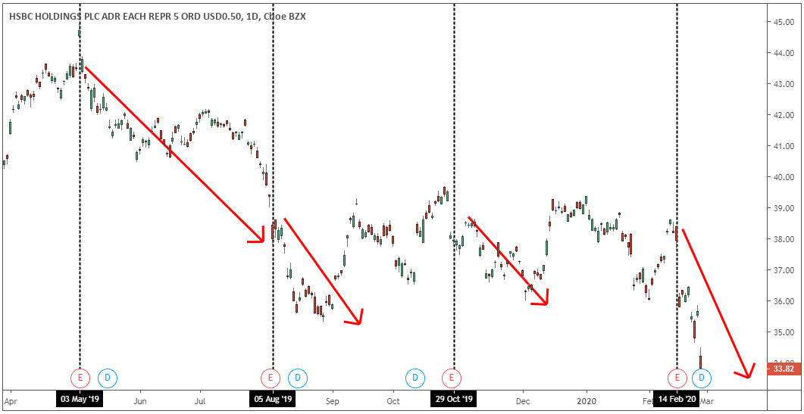

Event-driven trading is a strategy in the financial markets designed to exploit price inefficiencies brought about by significant corporate and macroeconomic events. This approach relies on the use of sophisticated algorithms to automate the trade execution process, basing decisions on various occurrences such as earnings reports, mergers, acquisitions, and regulatory developments. The primary goal of this strategy is to achieve rapid execution and precision, as timely recognition of these events can result in substantial profits.

The mechanism of event-driven trading is predicated on the identification and rapid response to relevant market stimuli. By capitalizing on these specific triggers, traders can make swift trading decisions that potentially translate into profit opportunities. This necessitates a comprehensive understanding of market dynamics and the interplay between various economic indicators and corporate actions.



The article provides an exploration of the various facets of event-driven trading. It covers the diverse range of events that can impact the financial markets, from corporate earnings releases to broader macroeconomic shifts. Additionally, it examines the key components involved in this strategy, including sophisticated news analytics, event databases, and advanced algorithms. The role of technology and platforms in facilitating effective event-driven trading is highlighted, illustrating how modern tools provide the necessary infrastructure for traders. Moreover, the piece addresses the challenges and considerations inherent in this approach, such as minimizing latency, ensuring data quality, and complying with regulatory requirements.

As the landscape of algorithmic trading evolves, event-driven trading distinguishes itself by harnessing new market conditions as they arise. The strategy integrates advancements in technology, such as machine learning and artificial intelligence, to adapt and enhance its predictive capabilities. This positions event-driven trading as a potent method to navigate and capitalize on the ever-changing financial environment.

## Table of Contents

## Types of Events

Various events affect stock prices and present trading opportunities, prominently featuring earnings announcements, mergers and acquisitions, product launches, regulatory changes, and macroeconomic indicators.

Earnings announcements are quarterly reports that provide a snapshot of a company’s financial performance, influencing trader expectations and stock valuations. These announcements typically reveal a firm’s revenue, earnings per share (EPS), and future guidance. A company surpassing earnings expectations often experiences a surge in stock price, while failing to meet forecasts can result in declines. For instance, a company announcing an EPS exceeding analyst predictions by $0.10 can cause significant upward price movements as investors adjust valuations based on improved financial outlooks.

Mergers and acquisitions (M&A) represent strategic corporate actions where companies consolidate to achieve synergies, operational efficiency, or market expansion. The announcement of an acquisition often leads to a rise in the target company’s stock price due to acquisition premiums, while the acquirer might experience a varied response depending on the perceived strategic fit and financial strain. For example, if Company A offers a 20% premium on Company B’s current stock price as an acquisition offer, Company B’s shares may rapidly increase to reflect this premium. 

Product launches, especially in sectors like technology and pharmaceuticals, can catalyze significant share price fluctuations. A successful product launch can enhance a company’s revenue prospects, driving stock prices higher. Conversely, product failures can result in negative market reactions. The launch of a new smartphone with groundbreaking features in a competitive market could see the producing company’s stock surge as investors anticipate increased future sales.

Regulatory changes engender market [volatility](/wiki/volatility-trading-strategies) by altering industry structures, compliance costs, and competitive dynamics. New regulations can either hinder or benefit companies, depending on their operational adaptability and strategic positioning. A regulatory shift imposing stricter emissions standards may impact automobile manufacturers differently, benefitting electric vehicle (EV) makers while imposing additional costs on traditional carmakers reliant on fossil fuels.

Macroeconomic indicators, such as [interest rate](/wiki/interest-rate-trading-strategies) announcements, GDP data, and employment figures, reflect broader economic conditions and influence stock market trends. Interest rate changes by central banks, for instance, directly affect borrowing costs and consumer spending. A lower interest rate may stimulate economic activity and elevate stock prices, whereas a rate hike could restrain growth and dampen stock valuations. In Python, analyzing such impacts can be modeled via econometric libraries like statsmodels to forecast stock trends based on macroeconomic data.

In summary, event-driven trading capitalizes on these diverse catalysts, requiring traders to evaluate and respond swiftly to the evolving market landscape.

## Key Components of Event-Driven Trading

Event-driven trading requires a combination of advanced technologies and strategic components to effectively harness opportunities presented by market events. Each component plays a pivotal role in enabling the swift and informed decision-making process that characterizes this trading strategy.

**News Analytics**

News analytics is a core component, leveraging Natural Language Processing (NLP) and [machine learning](/wiki/machine-learning) algorithms to extract actionable insights from an extensive array of unstructured data sources, including news articles, social media, and financial reports. This process anticipates how financial events might influence market behavior. For instance, sentiment analysis can evaluate the tone of earnings call transcripts, while machine learning models can predict the market's potential response to this sentiment.

```python
# Example of sentiment analysis using Python's TextBlob library

from textblob import TextBlob

def analyze_sentiment(text):
    return TextBlob(text).sentiment.polarity

news_article = "The company's recent expansion into Asia is expected to significantly boost revenue."
sentiment_score = analyze_sentiment(news_article)
print(f"Sentiment Score: {sentiment_score}")
```

**Event Databases**

Event-driven trading relies on comprehensive databases that compile both historical and real-time data. These databases are instrumental in back-testing trading strategies and providing context for decision-making. By analyzing past event outcomes, traders can refine their models and anticipate potential price movements. Real-time data feeds are equally crucial as they allow traders to react to unfolding events promptly.

**Algorithms and Models**

The automation aspect of event-driven trading is realized through sophisticated algorithms and predictive models. These tools facilitate the detection of events and automate the execution of trades, capitalizing on opportunities with precision and speed. Algorithms ingest vast datasets, analyze patterns, and execute trades within milliseconds, ensuring that traders can exploit market inefficiencies effectively.

**Risk Management**

Risk management is critical in the volatile environment of event-driven trading. Strategies such as stop-loss orders protect investors from significant losses by automatically selling a security when it reaches a certain price level. Diversification is another risk management strategy, where investments are spread across various assets to mitigate risks associated with any single event. Additionally, hedging strategies are employed to offset potential losses, thereby maintaining a balanced risk-reward ratio.

In equations, risk management could be viewed in terms of expected utility maximization, where an investor aims to maximize their utility $U(W)$:

$$

\max E[U(W)] = \int p(x) U(W(x)) dx 
$$

Here, $p(x)$ is the probability of different scenarios, and $W(x)$ is the wealth level in each scenario.

In essence, effective event-driven trading requires a synthesis of cutting-edge analytical tools, comprehensive data frameworks, and stringent risk management practices. This combination empowers traders to act swiftly and decisively in response to market-moving events.

## Technology and Platforms

Modern trading systems are increasingly dependent on sophisticated platforms designed to deliver comprehensive analytics and event-detection capabilities. These platforms play a critical role in executing event-driven trading strategies, enabling traders to respond swiftly to new information and market conditions.

Quantitative analysis and machine learning form the backbone of these platforms, allowing traders to identify patterns and derive insights from large datasets. Machine learning algorithms analyze historical data to generate predictive models that guide trading decisions. Additionally, platforms like Numerai leverage crowdsourced intelligence by inviting data scientists to develop forecasting models and rewarding them based on their performance. This approach harnesses collective expertise to improve the accuracy of predictive models.

Firms such as Kensho and Two Sigma are at the forefront of integrating advanced technologies into trading. Kensho employs cutting-edge machine learning techniques to parse and analyze real-time data, facilitating the identification of impactful financial events. Their platform enables users to interpret complex datasets, supporting informed decision-making. Similarly, Two Sigma utilizes machine learning and [artificial intelligence](/wiki/ai-artificial-intelligence) to maintain a competitive edge through continuous innovation in data analysis and trading strategies.

These platforms are equipped with high-speed data processing capabilities, ensuring that traders can act on events with minimal latency. They also incorporate advanced visualization tools, providing traders with intuitive views of market dynamics and potential trading opportunities. Additionally, APIs (Application Programming Interfaces) are commonly offered, allowing for the seamless integration of proprietary tools and strategies into the platforms.

In summary, the synergy between quantitative analysis, machine learning, and advanced trading platforms is pivotal in the execution of event-driven trading strategies. As technology progresses, these platforms will continue to evolve, offering traders refined tools to navigate the complexities of modern financial markets.

## Challenges and Considerations

Minimizing latency is a fundamental challenge in event-driven trading, as the slight delay between recognizing a market event and executing a trade can result in missed opportunities or reduced profitability. This latency can occur at various stages, including data acquisition, processing, and order execution. Traders employ high-frequency trading ([HFT](/wiki/high-frequency-trading-strategies)) systems and co-location services to reduce these delays, placing their servers in proximity to exchange facilities to execute trades in microseconds. Advanced optimization techniques, such as data compression and efficient network protocols, are also utilized to streamline data transfer and processing times.

Data quality is another critical [factor](/wiki/factor-investing), as accurate and reliable information is necessary for making informed trading decisions. Traders must ensure that data feeds are up-to-date, comprehensive, and free from errors. This requires a robust data verification process, incorporating techniques like anomaly detection and data cleansing. A consistent strategy is to use machine learning algorithms that can assess and improve the quality of input data in real time, reducing the likelihood of misinformed trades.

Market impact, or the effect of large trades on asset prices, poses another challenge. When executing substantial orders, it is possible to unintentionally influence market prices, leading to less favorable trade conditions. To mitigate this, traders use algorithmic execution strategies designed to minimize visible trade footprints. These include slicing large orders into smaller ones and executing them over time and across different trading venues. This technique, often referred to as "stealth trading," helps maintain market equilibrium and achieve better average prices.

Regulatory compliance is a crucial consideration, as trading practices must align with legal and ethical standards. Authorities such as the Securities and Exchange Commission (SEC) actively monitor trading activities to prevent market manipulation and protect investors. Firms must ensure that their trading algorithms and strategies comply with existing regulations, which include reporting requirements and restrictions on certain trading practices. To adhere to these rules, traders often employ compliance management systems that provide detailed record-keeping and audit trails of trading activities. This ensures transparency and accountability, reducing the risk of penalties or legal actions. 

In conclusion, addressing these challenges requires a sophisticated blend of technology, strategy, and a keen understanding of regulatory frameworks, essential for achieving success in event-driven trading.

## Conclusion

Event-driven trading stands at the vital confluence of finance and technology, offering significant opportunities for profit in fast-evolving markets. By leveraging this strategy, traders can swiftly respond to market inefficiencies caused by various events, thereby gaining a competitive edge. Achieving success in event-driven trading necessitates an in-depth grasp of market mechanics, state-of-the-art technology, and robust risk management frameworks. Key elements such as [algorithmic trading](/wiki/algorithmic-trading), natural language processing, and machine learning aid in interpreting complex data and executing timely trades. 

As machine learning and AI technologies progress, they present both new opportunities and challenges to event-driven trading. The increased complexity and potential rewards bring about innovative tactics and sophisticated models that enhance predictive accuracy and execution efficiency. Advanced algorithms now analyze immense datasets to identify subtle market signals, unlocking unprecedented forms of market engagement. Thus, continuous adaptation and strategic foresight become imperative for traders aiming to harness these evolving technological capabilities. 

In this ever-advancing landscape, the integration of cutting-edge tech solutions and meticulous risk strategies will determine the success and sustainability of event-driven trading practices, laying the groundwork for sustainable financial growth.

## References & Further Reading

[1]: Lopez de Prado, M. (2018). ["Advances in Financial Machine Learning."](https://www.amazon.com/Advances-Financial-Machine-Learning-Marcos/dp/1119482089) Wiley.

[2]: Jansen, S. (2020). ["Machine Learning for Algorithmic Trading."](https://github.com/stefan-jansen/machine-learning-for-trading) Packt Publishing.

[3]: Chan, E. P. (2008). ["Quantitative Trading: How to Build Your Own Algorithmic Trading Business."](https://github.com/ftvision/quant_trading_echan_book) Wiley.

[4]: Kissell, R. (2014). ["The Science of Algorithmic Trading and Portfolio Management."](https://www.sciencedirect.com/book/9780124016897/the-science-of-algorithmic-trading-and-portfolio-management) Academic Press.

[5]: Aronson, D. R. (2007). ["Evidence-Based Technical Analysis: Applying the Scientific Method and Statistical Inference to Trading Signals."](https://www.amazon.com/Evidence-Based-Technical-Analysis-Scientific-Statistical/dp/0470008741) Wiley.