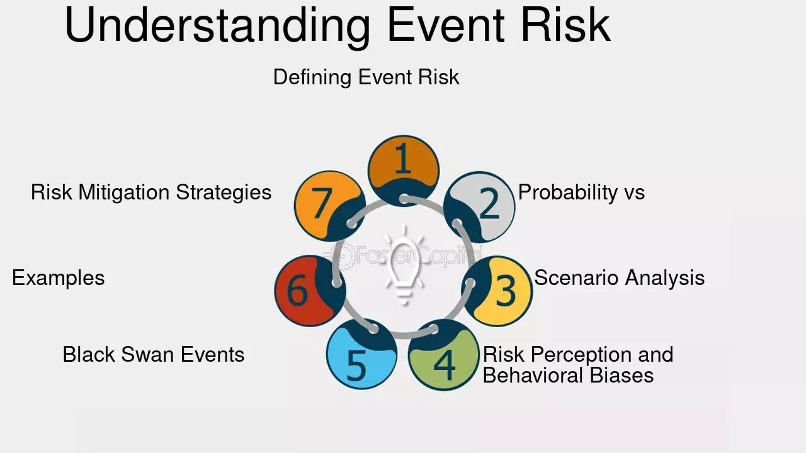

## Table of Contents

## What is event risk?

Event risk is when something unexpected happens that can affect a company's value or the price of its stocks and bonds. These events can be things like natural disasters, big lawsuits, or changes in government rules. When these events happen, they can make investors worried and cause them to sell their investments, which can lower the company's stock price.

For example, if a company gets sued for a lot of money, it might have to pay a big fine. This can make the company less valuable because it has less money to spend on growing its business. Investors might then decide to sell their stocks in that company, which makes the stock price go down. Event risk is important for investors to think about because it can change how much money they might make or lose.

## Can you provide a simple example of an event risk?

Imagine a toy company that makes a popular doll. One day, it turns out that the doll has a small part that can come off and be a choking hazard for kids. This is an example of an event risk. The company didn't know about this problem at first, but now they have to recall all the dolls they sold. This costs them a lot of money and makes people trust them less.

Because of the recall, people start selling their stocks in the toy company. They're worried that the company will lose money and the stock price will go down. And it does - the stock price drops because so many people are selling. This is how an unexpected event, like a product recall, can be a big risk for a company and its investors.

## How does event risk affect businesses?

Event risk can hurt businesses in many ways. When something unexpected happens, like a natural disaster or a big lawsuit, it can cost the business a lot of money. For example, if a factory burns down, the company has to pay to fix it and can't make products until it's fixed. This means they lose money while they can't sell anything. Also, if the event makes people trust the company less, like if they have to recall a dangerous product, customers might stop buying from them. This can make the company's sales go down and hurt their profits.

These unexpected events can also make investors worried. When investors hear about a big problem, they might sell their stocks in the company. This makes the stock price go down, which can make it harder for the company to get money to grow. If the stock price stays low for a long time, it can be hard for the business to recover from the event. So, event risk can affect a business's money, how much they can sell, and how much people trust them.

## What are the common types of event risks?

Event risks can come in many forms, but some of the most common ones are natural disasters, like earthquakes or hurricanes, that can destroy a company's buildings or stop them from working. Another type is when the government changes its rules or laws, which can make it harder for a company to do business or cost them more money. For example, if a new law says a company has to pay its workers more, it might have to spend more money, which can hurt its profits.

Another common event risk is a big lawsuit or legal problem. If a company gets sued and has to pay a lot of money, it can hurt their finances a lot. Also, if a company's product turns out to be dangerous and they have to recall it, this can cost them a lot of money and make people trust them less. This can make their sales go down and hurt their business.

Finally, event risks can also come from things like mergers and acquisitions, where one company buys another. These deals can be risky because they might not work out as planned, and the company might end up spending a lot of money for nothing. All these types of event risks can make it hard for a company to plan for the future and can cause big changes in their business.

## How can event risks be identified?

Event risks can be identified by keeping an eye on the world around the company. This means watching the news for things like natural disasters, new laws, or big lawsuits that might affect the business. Companies can also use special tools and reports that help them see risks coming. These tools might look at things like weather patterns or changes in government rules to guess what might happen next.

Another way to identify event risks is by talking to people inside and outside the company. Employees might know about problems with products or services that could lead to a recall or lawsuit. Talking to experts, like lawyers or scientists, can also help the company understand risks better. By listening to what these people say, a company can get ready for problems before they happen.

Finally, companies can use past events to learn about future risks. By looking at what went wrong before, like a factory fire or a big lawsuit, they can see what signs to watch for. This can help them plan better and maybe even stop some problems from happening again. Keeping an eye on the past, present, and future helps companies spot event risks early.

## What are some historical examples of event risks?

One big example of an event risk happened in 1982 with the Tylenol crisis. Tylenol, a popular pain medicine, was taken off the shelves because someone put poison in some bottles. Seven people died because of this, and it made people very scared to buy Tylenol. The company, Johnson & Johnson, had to recall 31 million bottles and it cost them a lot of money. Their stock price dropped a lot because people were worried about the company. But Johnson & Johnson did a good job of fixing the problem and making new, safer bottles, so people started trusting them again.

Another example is the Deepwater Horizon oil spill in 2010. This was a big disaster for BP, the oil company. One of their oil rigs in the Gulf of Mexico exploded and spilled a lot of oil into the ocean. It was one of the worst environmental disasters ever, and it cost BP billions of dollars to clean up. The spill made people very mad at BP, and their stock price went down a lot. It took a long time for BP to fix everything and for people to start trusting them again. This shows how a big event risk can hurt a company's money and reputation.

## How do event risks impact financial markets?

Event risks can shake up financial markets a lot. When something big and unexpected happens, like a natural disaster or a big lawsuit, it can make investors scared. They might start selling their stocks and bonds in the companies that are affected. This selling can make stock prices go down fast. If a lot of people are selling at the same time, it can cause a big drop in the market. This is why event risks can make financial markets go up and down a lot.

These events can also make it harder for companies to get money. If a company's stock price goes down because of an event risk, it might be harder for them to borrow money or sell new stocks. Banks and other investors might not want to give them money because they're worried the company won't be able to pay it back. This can slow down the whole economy because companies need money to grow and create jobs. So, event risks don't just affect one company; they can impact the whole financial market and make things more uncertain for everyone.

## What strategies can be used to mitigate event risks?

Companies can use different strategies to make event risks less harmful. One way is to have a good plan for emergencies. This means knowing what to do if something bad happens, like a fire or a product recall. Companies can practice these plans so everyone knows what to do. They can also buy insurance to help pay for damages if something goes wrong. Insurance can cover things like natural disasters or lawsuits, which can save the company a lot of money.

Another strategy is to keep an eye on what's happening around the world. By watching the news and using special tools, companies can see risks coming before they happen. They can talk to experts and their own employees to learn about possible problems. If they know about a risk early, they can do things to stop it or make it less bad. For example, if they hear about a new law that might hurt their business, they can start planning how to deal with it before it becomes a problem.

Finally, companies can spread out their risks. This means not putting all their money and effort into one thing. If a company has factories in different places, a natural disaster in one area won't hurt them as much. They can also sell different kinds of products so if one product has a problem, they still have other products to sell. By spreading out their risks, companies can protect themselves better from event risks and keep their business going strong.

## How do companies prepare for event risks?

Companies prepare for event risks by making plans for emergencies. They think about what could go wrong, like a fire or a product recall, and decide what to do if it happens. They practice these plans so everyone knows their job. Companies also buy insurance to help pay for damages if something bad happens. Insurance can cover things like natural disasters or lawsuits, which can save the company a lot of money and help them recover faster.

Another way companies prepare is by keeping an eye on what's happening around the world. They watch the news and use special tools to see risks coming before they happen. They talk to experts and their own employees to learn about possible problems. If they know about a risk early, they can do things to stop it or make it less bad. For example, if they hear about a new law that might hurt their business, they can start planning how to deal with it before it becomes a problem.

Finally, companies spread out their risks to protect themselves. They don't put all their money and effort into one thing. If a company has factories in different places, a natural disaster in one area won't hurt them as much. They can also sell different kinds of products so if one product has a problem, they still have other products to sell. By spreading out their risks, companies can keep their business going strong even if something unexpected happens.

## What role does insurance play in managing event risks?

Insurance helps companies deal with event risks by paying for damages when something bad happens. If a company has insurance, they don't have to pay for everything out of their own pocket if there's a fire, a natural disaster, or a big lawsuit. This can save them a lot of money and help them get back to normal faster. For example, if a factory burns down, insurance can help pay to fix it so the company can start making things again.

Companies can buy different kinds of insurance to cover different risks. Some insurance covers natural disasters like earthquakes or floods. Other insurance can help with lawsuits or product recalls. By having the right insurance, companies can feel more secure knowing they won't lose everything if something unexpected happens. It's like a safety net that helps them keep going even when things go wrong.

## How can advanced analytics help in predicting event risks?

Advanced analytics can help companies see event risks coming before they happen. By looking at a lot of data from different places, like weather reports, social media, and news, companies can find patterns that might show a risk is coming. For example, if there are a lot of people talking about a new law on social media, advanced analytics can help the company see that this law might affect their business. This way, they can start planning how to deal with it before it becomes a problem.

Using advanced analytics also helps companies understand what might happen if an event risk does happen. They can use past data to see how similar events affected other companies before. This can help them guess how much money they might lose or how their stock price might change. By knowing this, companies can make better plans to protect themselves and maybe even stop some problems from happening in the first place.

## What are the best practices for creating an event risk management plan?

Creating a good event risk management plan starts with knowing what risks might happen. Companies should look at their own history and other companies to see what went wrong before. They can talk to employees and experts to learn about possible problems. It's also important to keep an eye on the news and use tools like advanced analytics to see risks coming. Once they know what might happen, they can make a plan for emergencies. This plan should say what to do if something bad happens, like a fire or a product recall. Everyone in the company should know their job in the plan and practice it so they're ready.

The next step is to make sure the company is protected from event risks. Buying the right insurance can help pay for damages if something goes wrong. Companies should also spread out their risks by not putting all their money and effort into one thing. Having factories in different places and selling different kinds of products can help if something unexpected happens. It's also good to keep checking and updating the plan. As the world changes, new risks can come up, so the plan should change too. By doing these things, companies can be ready for event risks and keep their business going strong.

## What are effective risk management strategies?

Risk management is an essential component of a successful [algorithmic trading](/wiki/algorithmic-trading) strategy. It is crucial for traders to identify, assess, and prioritize risks and implement coordinated efforts to minimize, monitor, and control their impact. This process ensures that trading operations are not only secure but also optimized for performance.

One fundamental strategy is the use of stop-loss orders. A stop-loss order is an instruction to sell a security when it reaches a certain price. This approach helps limit potential losses on a trade, acting as an automatic trigger to [exit](/wiki/exit-strategy) a position if the market moves unfavorably. The formula for a stop-loss order can be described mathematically as:

$$
\text{SLP} = \text{EP} - (\text{P} \times \text{MRT})
$$

where:
- $\text{SLP}$ = Stop-Loss Price
- $\text{EP}$ = Entry Price
- $\text{P}$ = Position Size
- $\text{MRT}$ = Maximum Risk Tolerance (%)

Diversifying trading algorithms is another effective strategy. By implementing various trading strategies, traders can reduce reliance on a single approach and spread risk across different market conditions and asset classes. Diversification helps in mitigating losses that might accrue if one particular strategy fails due to unexpected market events.

Regular [backtesting](/wiki/backtesting) of algorithms is also critical. Backtesting involves running trading strategies against historical data to evaluate their effectiveness before they are deployed in real markets. This practice not only aids in identifying potential weaknesses in the strategies but also provides insights into their performance under different market conditions. A simple Python code snippet for backtesting might resemble the following:

```python
import backtrader as bt

class MyStrategy(bt.Strategy):
    def __init__(self):
        self.sma = bt.indicators.SimpleMovingAverage(self.data.close, period=15)

    def next(self):
        if self.data.close[0] > self.sma[0]:
            self.buy()
        elif self.data.close[0] < self.sma[0]:
            self.sell()

cerebro = bt.Cerebro()
cerebro.addstrategy(MyStrategy)
data = bt.feeds.YahooFinanceData(dataname='AAPL', fromdate=datetime(2020, 1, 1), todate=datetime(2020, 12, 31))
cerebro.adddata(data)
cerebro.run()
cerebro.plot()
```

Understanding the risk profile and tolerance of a trading operation is crucial for tailoring an effective risk management plan. Traders must evaluate their financial capacity to bear losses and their psychological readiness to handle high-pressure decision-making environments. The assessment of risk tolerance allows for the customization of trading strategies to ensure that they align with the trader's risk capacity and investment goals.

In conclusion, implementing a robust risk management framework in algorithmic trading involves a multi-faceted approach. By setting stop-loss orders, diversifying strategies, and conducting regular backtesting, traders can effectively manage risks. Moreover, aligning trading strategies with a well-understood risk profile ensures optimized operations, safeguarding investments while enhancing trading performance.

## References & Further Reading

[1]: Bergstra, J., Bardenet, R., Bengio, Y., & Kégl, B. (2011). ["Algorithms for Hyper-Parameter Optimization."](https://dl.acm.org/doi/10.5555/2986459.2986743) Advances in Neural Information Processing Systems 24.

[2]: ["Advances in Financial Machine Learning"](https://www.amazon.com/Advances-Financial-Machine-Learning-Marcos/dp/1119482089) by Marcos Lopez de Prado

[3]: ["Evidence-Based Technical Analysis: Applying the Scientific Method and Statistical Inference to Trading Signals"](https://www.amazon.com/Evidence-Based-Technical-Analysis-Scientific-Statistical/dp/0470008741) by David Aronson

[4]: ["Machine Learning for Algorithmic Trading"](https://github.com/stefan-jansen/machine-learning-for-trading) by Stefan Jansen

[5]: ["Quantitative Trading: How to Build Your Own Algorithmic Trading Business"](https://www.amazon.com/Quantitative-Trading-Build-Algorithmic-Business/dp/1119800064) by Ernest P. Chan