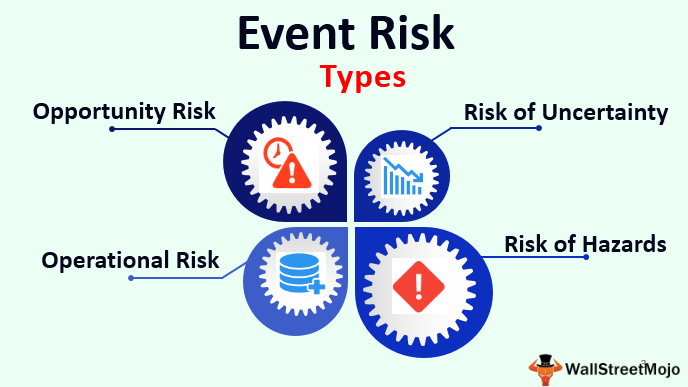

Algorithmic trading, commonly known as algo trading, has become an essential element in the landscape of financial markets. Utilized by institutional and individual traders alike, it involves deploying computer algorithms to automate trading decisions, taking advantage of speed and precision that far exceed human capabilities. As algo trading continues to rise in prominence, comprehending the importance of event risk management and risk mitigation is paramount for anyone involved in trading activities.

Understanding the various risks associated with algorithmic trading, such as event risks, is crucial. Such risks might include unforeseen political developments, significant economic announcements, or technological disruptions, all of which have the potential to cause considerable fluctuations in asset prices and trading outcomes. The ability to anticipate, manage, and mitigate these risks effectively significantly enhances a trader’s capacity to preserve capital and maximize profitability.



This article aims to explore fundamental aspects associated with risk in algo trading, providing insights on effective management and mitigation strategies. It offers a detailed examination of event risks, risk management strategies, and how technology supports risk mitigation efforts. Strategies such as risk diversification, setting stop-loss limits, and using advanced analytics to predict and respond to potential market disruptions will be discussed.

By thoroughly investigating these facets, traders can significantly enhance their understanding of the complex risk environment in algo trading. This in-depth understanding will aid in the development of robust trading strategies tailored to withstand market volatilities. Advanced technology, especially artificial intelligence and machine learning, offers powerful tools that can further fortify these strategies by facilitating real-time risk assessment and decision making. 

Join us in this exploration of algorithmic trading risks and management techniques to improve your trading approaches and secure a competitive advantage in today’s dynamic financial markets.

## Table of Contents

## Understanding Event Risk in Algo Trading

Event risk in algorithmic trading refers to the potential impact of unforeseen events on asset prices and trading outcomes. Such events can disrupt markets and result in significant volatility, posing challenges to the effectiveness of algorithmic trading strategies. Understanding and managing these risks is crucial for traders aiming to build robust and adaptive trading systems.

Economic announcements are among the most common sources of event risk. These include changes in interest rates, employment reports, and GDP figures. Such announcements can cause sudden price movements in financial markets as traders adjust their positions in response to new information. Algorithmic trading systems must be designed to account for these potential disruptions, incorporating mechanisms to adapt to rapid market shifts.

Political developments also play a significant role in shaping event risk. Elections, changes in government policies, and geopolitical tensions can lead to market uncertainty. For example, unexpected election outcomes or the imposition of tariffs can alter market sentiment abruptly. Traders must monitor political landscapes closely to anticipate potential impacts on their trading strategies.

Technological failures represent another critical aspect of event risk in [algorithmic trading](/wiki/algorithmic-trading). System outages, software bugs, and cyberattacks can disrupt trading operations, leading to financial losses. Ensuring robust technological infrastructure and implementing rigorous testing protocols can mitigate such risks.

The consequences of event risk often manifest as increased market [volatility](/wiki/volatility-trading-strategies). High volatility can lead to widened bid-ask spreads, reduced [liquidity](/wiki/liquidity-risk-premium), and unexpected price spikes or drops. These conditions can challenge the performance of trading algorithms, primarily if they rely on historical data that may not account for such anomalies. Traders must therefore employ strategies to recognize and respond to heightened volatility effectively.

To summarize, understanding event risk in algorithmic trading involves identifying economic, political, and technological factors that can impact market dynamics. By acknowledging these risks, traders can develop strategies that enhance the resilience of their trading systems, ultimately safeguarding their investments and optimizing market performance.

## Effective Risk Management Strategies

Risk management is an essential component of a successful algorithmic trading strategy. It is crucial for traders to identify, assess, and prioritize risks and implement coordinated efforts to minimize, monitor, and control their impact. This process ensures that trading operations are not only secure but also optimized for performance.

One fundamental strategy is the use of stop-loss orders. A stop-loss order is an instruction to sell a security when it reaches a certain price. This approach helps limit potential losses on a trade, acting as an automatic trigger to [exit](/wiki/exit-strategy) a position if the market moves unfavorably. The formula for a stop-loss order can be described mathematically as:

$$
\text{SLP} = \text{EP} - (\text{P} \times \text{MRT})
$$

where:
- $\text{SLP}$ = Stop-Loss Price
- $\text{EP}$ = Entry Price
- $\text{P}$ = Position Size
- $\text{MRT}$ = Maximum Risk Tolerance (%)

Diversifying trading algorithms is another effective strategy. By implementing various trading strategies, traders can reduce reliance on a single approach and spread risk across different market conditions and asset classes. Diversification helps in mitigating losses that might accrue if one particular strategy fails due to unexpected market events.

Regular [backtesting](/wiki/backtesting) of algorithms is also critical. Backtesting involves running trading strategies against historical data to evaluate their effectiveness before they are deployed in real markets. This practice not only aids in identifying potential weaknesses in the strategies but also provides insights into their performance under different market conditions. A simple Python code snippet for backtesting might resemble the following:

```python
import backtrader as bt

class MyStrategy(bt.Strategy):
    def __init__(self):
        self.sma = bt.indicators.SimpleMovingAverage(self.data.close, period=15)

    def next(self):
        if self.data.close[0] > self.sma[0]:
            self.buy()
        elif self.data.close[0] < self.sma[0]:
            self.sell()

cerebro = bt.Cerebro()
cerebro.addstrategy(MyStrategy)
data = bt.feeds.YahooFinanceData(dataname='AAPL', fromdate=datetime(2020, 1, 1), todate=datetime(2020, 12, 31))
cerebro.adddata(data)
cerebro.run()
cerebro.plot()
```

Understanding the risk profile and tolerance of a trading operation is crucial for tailoring an effective risk management plan. Traders must evaluate their financial capacity to bear losses and their psychological readiness to handle high-pressure decision-making environments. The assessment of risk tolerance allows for the customization of trading strategies to ensure that they align with the trader's risk capacity and investment goals.

In conclusion, implementing a robust risk management framework in algorithmic trading involves a multi-faceted approach. By setting stop-loss orders, diversifying strategies, and conducting regular backtesting, traders can effectively manage risks. Moreover, aligning trading strategies with a well-understood risk profile ensures optimized operations, safeguarding investments while enhancing trading performance.

## Risk Mitigation Techniques in Algorithmic Trading

Risk mitigation in algorithmic trading focuses on minimizing financial losses by identifying and addressing potential challenges before they impact trading performance. To achieve this, traders employ a range of strategies and tools that leverage advanced technologies.

A primary technique used in risk mitigation is advanced analytics combined with predictive modeling. These tools help forecast market conditions and identify emerging risks, enabling traders to adjust their algorithms proactively. For instance, statistical models such as ARIMA (AutoRegressive Integrated Moving Average) can be applied to predict price movements based on historical data, allowing traders to anticipate potential pitfalls.

Furthermore, the integration of [machine learning](/wiki/machine-learning) (ML) and [artificial intelligence](/wiki/ai-artificial-intelligence) (AI) into algorithmic trading systems significantly enhances the capability to manage risks. These technologies improve decision-making processes by learning from vast datasets and identifying patterns that may not be apparent to human analysts. For example, [reinforcement learning](/wiki/reinforcement-learning) can be used to optimize trading strategies in real-time, adapting to new information and market dynamics as they occur.

Keeping algorithms updated and stress-tested is another essential practice for mitigating risk in algorithmic trading. By regularly updating trading algorithms, traders ensure that they account for current market conditions and incorporate the latest financial data. Stress testing involves simulating various market scenarios, including extreme events, to evaluate the resilience of trading algorithms. This process helps traders identify potential weaknesses and makes it possible to fine-tune their strategies.

Python, with its rich ecosystem of libraries such as Pandas, scikit-learn, and TensorFlow, provides a versatile platform for implementing these risk mitigation techniques. For instance, a simple predictive model using Python might involve the following:

```python
import pandas as pd
from statsmodels.tsa.arima_model import ARIMA

# Load and prepare the historical data
data = pd.read_csv('market_data.csv')
prices = data['Close']

# Define the ARIMA model
model = ARIMA(prices, order=(5, 1, 0))
model_fit = model.fit(disp=0)

# Forecast future prices
forecast = model_fit.forecast(steps=5)[0]
print(f"Forecasted Prices: {forecast}")
```

This code snippet demonstrates how traders can harness historical data to predict future market movements, a fundamental component of managing risk in algorithmic trading. By combining predictive modeling, machine learning, and rigorous algorithm testing, traders can better navigate market complexities and minimize potential losses.

## The Role of Technology in Risk Management

Technology is a fundamental component in managing and mitigating risks associated with algorithmic trading. The increasing sophistication of high-frequency trading ([HFT](/wiki/high-frequency-trading-strategies)) systems and advanced software solutions facilitates real-time risk assessment and swift decision-making, crucial factors in the high-stakes environment of algo trading.

High-frequency trading systems operate by executing numerous trades in fractions of a second, exploiting minute price discrepancies across different markets. These systems enable traders to respond almost instantaneously to market fluctuations, which is vital for maintaining competitive advantage. Algorithms embedded within these systems assess risk factors in real time, leveraging vast datasets to make informed decisions without human intervention. This capability significantly reduces the latency in trading processes, which can be pivotal when markets are volatile.

Automation plays a crucial role in maintaining consistency and minimizing human errors during trade executions. By automating trading strategies, the potential for human-induced mistakes—such as errors in manual order placements or delays in responding to market signals—is drastically diminished. Automation ensures that trading strategies are executed precisely as intended, based on predefined criteria, even in rapidly changing market conditions.

Cloud computing and big data analytics further enhance the risk management capabilities of algorithmic trading operations. Cloud computing offers scalable and flexible computational resources, allowing traders to process and analyze large volumes of data efficiently. This technology supports the development and deployment of complex trading algorithms and facilitates continuous monitoring of risk parameters across multiple trading platforms.

Big data analytics empowers traders by providing tools to extract actionable insights from diverse and extensive datasets. Advanced data analytics techniques, such as machine learning and artificial intelligence, enable the identification of patterns and trends that might not be discernible through traditional analysis. These insights can be used to predict potential market movements and adjust trading strategies accordingly, thus mitigating risks.

In code, a basic Python script leveraging machine learning for risk assessment might look like this:

```python
from sklearn.ensemble import RandomForestClassifier
import numpy as np

# Sample dataset: features and target (0 = no risk, 1 = risk)
features = np.array([[0.1, 1.2, 1.5], [1.1, 1.9, 2.3], [0.5, 0.6, 0.9]])
target = np.array([0, 1, 0])

# Initialize and train the model
model = RandomForestClassifier()
model.fit(features, target)

# Predict risk for a new data point
new_data = np.array([[0.9, 1.3, 1.8]])
risk_prediction = model.predict(new_data)

print(f"Risk Prediction: {'Risk' if risk_prediction[0] else 'No Risk'}")
```

This script demonstrates how machine learning can be used to predict potential risks based on historical data, thus informing risk management decisions.

As technology continues to evolve, its role in risk management within algorithmic trading becomes ever more significant. By harnessing the power of technology, traders can enhance their risk management practices, allowing them to navigate the complexities of financial markets more effectively.

## Conclusion

In conclusion, the pursuit of effective event risk management and risk mitigation is central to achieving success in algorithmic trading. Traders who invest time and effort in comprehensively understanding these risks are better equipped to safeguard their investments and enhance their trading performance. Incorporating advanced technologies into trading strategies further bolsters risk management efforts, offering a distinct competitive advantage in the marketplace. As the algorithmic trading environment continues to change and grow, maintaining vigilance and adaptability is crucial for enduring success. Prioritizing risk management and mitigation enables traders to successfully navigate the complexities of the market and seize emerging opportunities. Thus, the integration of strategic risk management practices not only shields traders from potential losses but also positions them to thrive in an ever-evolving financial landscape.

## References & Further Reading

[1]: Bergstra, J., Bardenet, R., Bengio, Y., & Kégl, B. (2011). ["Algorithms for Hyper-Parameter Optimization."](https://dl.acm.org/doi/10.5555/2986459.2986743) Advances in Neural Information Processing Systems 24.

[2]: ["Advances in Financial Machine Learning"](https://www.amazon.com/Advances-Financial-Machine-Learning-Marcos/dp/1119482089) by Marcos Lopez de Prado

[3]: ["Evidence-Based Technical Analysis: Applying the Scientific Method and Statistical Inference to Trading Signals"](https://www.amazon.com/Evidence-Based-Technical-Analysis-Scientific-Statistical/dp/0470008741) by David Aronson

[4]: ["Machine Learning for Algorithmic Trading"](https://github.com/stefan-jansen/machine-learning-for-trading) by Stefan Jansen

[5]: ["Quantitative Trading: How to Build Your Own Algorithmic Trading Business"](https://www.amazon.com/Quantitative-Trading-Build-Algorithmic-Business/dp/1119800064) by Ernest P. Chan