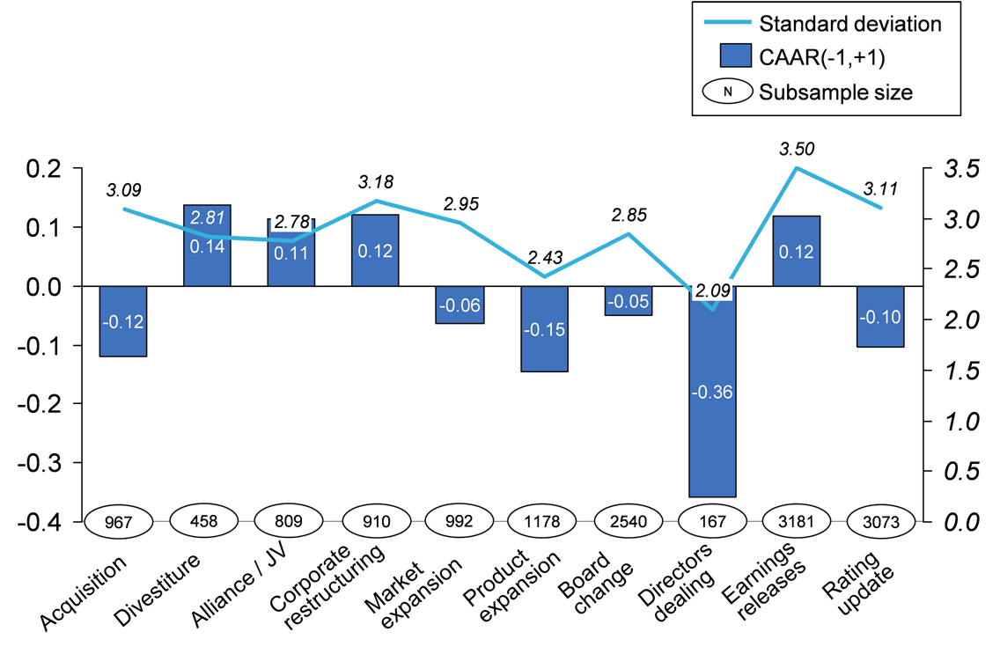

## Table of Contents

## What is an event study in the context of investing and economics?

An event study is a way to see how certain events affect the prices of stocks or other financial things. It looks at what happens to stock prices before, during, and after an event, like a company announcing good or bad news. By comparing the stock's performance to what it usually does, researchers can figure out if the event made a big difference.

For example, if a company says it made a lot more money than expected, an event study might show that the stock price went up a lot right after the announcement. This helps investors and economists understand how news and events can change the value of a company. It's like looking at a before-and-after picture to see what changed and why.

## Why are event studies important for investors and economists?

Event studies are important for investors because they help them understand how different news or events can change the value of their investments. By looking at how stock prices move around specific events, investors can make better guesses about what might happen to their stocks in the future. For example, if an event study shows that a company's stock usually goes up after good earnings reports, an investor might decide to buy the stock before the next earnings report comes out.

Economists also find event studies useful because they help explain how markets react to new information. This can give insights into how well markets work and how quickly they adjust to changes. For instance, if an event study shows that stock prices react quickly and accurately to news, it suggests that the market is efficient. This information can help economists make better models and predictions about the economy.

## What types of events are typically analyzed in event studies?

Event studies often look at news that can change how people think about a company. This can include things like earnings reports, where a company tells everyone how much money it made. If a company says it made more money than people thought, the stock price might go up. Other common events are announcements about new products, mergers with other companies, or changes in who runs the company. These events can make investors feel more or less confident about the company's future, which can move the stock price.

Sometimes, event studies also look at bigger events that affect many companies or the whole economy. For example, changes in laws or government rules can be studied to see how they affect different industries. If a new law makes it harder for companies to do business, their stock prices might go down. Natural disasters or big economic news, like changes in interest rates, can also be analyzed to see how they change stock prices. By studying these events, researchers can learn a lot about how markets work and react to new information.

## How do you select the event window and estimation window in an event study?

In an event study, the event window is the time period around the event that you want to study. This could be the day of the event, or it might include a few days before and after. The length of the event window depends on what you're studying. If you're looking at how stock prices react to earnings announcements, you might choose an event window that starts a few days before the announcement and ends a few days after. This helps you see if the stock price changes right away or if it takes some time to react.

The estimation window is a longer period of time before the event window. It's used to figure out what the stock usually does. You might choose an estimation window that starts a few months before the event and ends right before the event window starts. By looking at how the stock moved during the estimation window, you can compare it to what happens during the event window. This helps you see if the event made a big difference in the stock's behavior. Choosing the right lengths for both windows is important to make sure your event study gives you good information.

## What are the basic steps involved in conducting an event study?

To conduct an event study, you start by picking the event you want to study, like a company's earnings announcement. Then, you choose the event window, which is the time around the event you'll look at, and the estimation window, which is a longer time before the event to see what the stock usually does. You need to gather data on the stock's price during these windows. Next, you calculate what's called the "abnormal return," which is how much the stock's return during the event window is different from what you'd expect based on the estimation window. This shows if the event made the stock act differently than usual.

After you've figured out the abnormal returns, you need to check if they're big enough to matter. You do this by using statistical tests to see if the changes in the stock price are probably because of the event, or if they could just be random. If the abnormal returns are big and the tests say they're important, then you can say the event had a real effect on the stock price. Finally, you write up what you found, explaining how the event changed the stock's value and what it means for investors and the market.

## How do you calculate abnormal returns in an event study?

To calculate abnormal returns in an event study, you first need to find out what the normal return of the stock is. The normal return is what the stock usually does, and you figure this out by looking at the stock's performance during the estimation window, which is a time period before the event you're studying. You can use a model like the market model, which says the stock's return depends on the overall market's return. You take the stock's returns during the estimation window and the market's returns during the same time, and use these to make a formula that predicts what the stock's return should be.

Once you have the normal return figured out, you can calculate the abnormal return by comparing the actual return of the stock during the event window to the normal return you predicted. The event window is the time around the event you're studying. If the actual return is higher than the normal return, the abnormal return is positive, which means the stock did better than expected because of the event. If the actual return is lower, the abnormal return is negative, meaning the stock did worse than expected. By looking at these abnormal returns, you can see if the event made a big difference in the stock's performance.

## What statistical methods are used to test the significance of abnormal returns?

To check if the abnormal returns are important, researchers often use a statistical test called the t-test. This test helps figure out if the abnormal returns are big enough to say they happened because of the event, or if they could just be random chance. You do the t-test by comparing the average abnormal return during the event window to the normal returns you figured out from the estimation window. If the t-test shows that the abnormal returns are statistically significant, it means the event really did change the stock's performance.

Another method used is the non-parametric test, like the sign test or the rank test. These tests don't assume that the abnormal returns follow a normal distribution, which can be helpful if the data is a bit messy. The sign test looks at whether more stocks had positive or negative abnormal returns than you'd expect by chance. The rank test looks at the order of the abnormal returns to see if they're different from what you'd expect if the event didn't matter. Both of these tests help confirm if the event had a real impact on the stock prices.

## How can event study methodology be adjusted for different market conditions?

Event study methodology can be adjusted for different market conditions by changing how we measure normal returns. In times when the market is very volatile, or when it goes up and down a lot, we might use a shorter estimation window. This is because a shorter window can better show what the stock usually does during those wild times. We might also use different models to predict normal returns, like the market model or a more complex model that looks at other factors too. This helps make sure our predictions are as accurate as possible, even when the market is acting differently than usual.

Another way to adjust for different market conditions is by choosing the right event window. If the market is reacting quickly to news, we might use a shorter event window to catch those fast changes. But if the market takes longer to react, we might need a longer event window. We also need to think about how the market is doing overall. If the whole market is going up or down a lot, we might need to adjust our abnormal returns to take that into account. By making these changes, we can make sure our event study gives us good information, no matter what the market is doing.

## What are common challenges and pitfalls in conducting event studies?

One big challenge in doing event studies is figuring out the right time windows. If you pick a time window that's too short, you might miss important changes in the stock price. But if you pick a time window that's too long, you might include changes that have nothing to do with the event you're studying. It's also hard to know if the event you're looking at is the only thing affecting the stock price. Other news or events happening at the same time can mess up your results.

Another problem is that markets can be unpredictable. Sometimes, the stock price might not react to an event right away, or it might react in a way you didn't expect. This can make it hard to figure out if the event really made a difference. Also, the way you measure normal returns can be tricky. If you use a model that doesn't fit well with how the stock usually acts, your abnormal returns might not be accurate. It's important to be careful and think about all these things when you're doing an event study.

## How do you interpret the results of an event study?

When you look at the results of an event study, you're trying to see if an event, like a company announcing good news, made a big difference in the stock price. You do this by looking at the abnormal returns, which show how much the stock's return during the event was different from what it usually does. If the abnormal returns are big and the statistical tests say they're important, it means the event probably did change the stock price. For example, if a company says it made a lot more money than expected and the stock price goes up a lot right after, the event study might show that the good news made the stock more valuable.

But interpreting the results can be tricky. Sometimes, other things happening at the same time can affect the stock price too, so you have to be careful not to say the event was the only reason for the change. Also, if the market is acting differently than usual, like going up and down a lot, it can be hard to figure out what the normal return should be. So, when you're looking at the results, you need to think about all these things and maybe even do more research to make sure your conclusions are right.

## What are some advanced techniques for enhancing the accuracy of event studies?

One way to make event studies more accurate is by using better models to predict what the stock usually does. Instead of just using the market model, you can use more complex models that look at other things too, like how big the company is or what industry it's in. These models can give you a better idea of what the normal return should be, so your abnormal returns are more accurate. Another way is to use something called a "control sample." This means you look at stocks that are similar to the one you're studying but weren't affected by the event. By comparing the stock you're studying to these control stocks, you can see if the changes you're seeing are really because of the event or if they're happening to other stocks too.

Another advanced technique is to use different statistical tests to check your results. Instead of just using a t-test, you can use non-parametric tests like the sign test or the rank test. These tests can help you see if the abnormal returns are important even if the data doesn't follow a normal pattern. You can also use something called "bootstrapping," which is a way to check your results by making lots of fake samples from your real data. This helps you see if your results are strong and not just because of random chance. By using these advanced techniques, you can make your event study more accurate and trustworthy.

## Can you provide examples of influential event studies and their impact on economic policy or investment strategies?

One famous event study looked at how stock prices changed when companies announced they were going to be taken over by another company. Researchers found that the stock prices of the companies being taken over usually went up a lot right after the announcement. This study helped people understand that takeovers can make a company more valuable. It also showed investors that buying stocks of companies that might be taken over could be a good way to make money. Because of this study, some investors started to look more closely at companies that could be takeover targets.

Another important event study was about how stock prices react to changes in interest rates. When the government changes interest rates, it can affect the whole economy. The study showed that when interest rates go up, stock prices often go down, especially for companies that borrow a lot of money. This helped economists and policymakers understand how their decisions about interest rates could affect businesses and the stock market. It also helped investors think about how changes in interest rates might affect their investments, so they could make better choices about when to buy or sell stocks.

## What is the understanding of event studies?

An event study is a crucial analytical tool used to evaluate the impact of significant events on the value of securities, such as company stocks. This approach is heavily grounded in statistical methods to assess how markets react to specific occurrences and the degree of these reactions. One of the central concepts in event studies is the notion of abnormal returns, which is the difference between a security's actual return and its expected return, typically based on a benchmark model. The formula for calculating abnormal returns is given by:

$$
AR_{i,t} = R_{i,t} - E(R_{i,t})
$$

where $AR_{i,t}$ represents the abnormal return of security $i$ on day $t$, $R_{i,t}$ is the actual return, and $E(R_{i,t})$ is the expected return from a model such as the market model.

These studies serve as a powerful mechanism for understanding market efficiency and investor behavior. In efficient markets, all available information should be quickly incorporated into securities' prices, implying that abnormal returns around the event window should be minimal. However, if the market is inefficient, significant abnormal returns could indicate how new information impacts traders' actions and expectations.

Event studies analyze various scenarios, such as earnings announcements or mergers and acquisitions, to observe how new information alters investor perceptions and, consequently, securities' prices. For instance, a positive earnings surprise might result in positive abnormal returns, highlighting investor optimism and potential undervaluation prior to the announcement.

To conduct an event study, researchers follow a structured procedure: identifying the event of interest, defining the event window over which the analysis will be conducted, calculating the expected returns using a selected model, and analyzing the abnormal returns. This process often involves statistical tests, such as t-tests, to determine the significance of the abnormal returns. These methods help ensure that the observed price changes are indeed related to the event and not random fluctuations.

Through such rigorous statistical analysis, event studies provide insights into the nuances of market dynamics, allowing investors and researchers to infer how specific events influence market behavior. This understanding helps in forecasting future price movements based on similar events, thereby refining investment strategies and enhancing portfolio management practices.

## What role does economic analysis play in investing?

Economic analysis in investing is a critical process that involves leveraging data, models, and theories to understand market behavior and predict economic conditions. It is essential for making informed investment decisions and formulating strategies that are agile and responsive to economic shifts.

At its core, economic analysis considers a plethora of economic indicators that can signal potential market movements. Key indicators include Gross Domestic Product (GDP), inflation rates, unemployment rates, and consumer behavior metrics. GDP, for instance, measures the total economic output and is often a primary indicator of economic health. A rising GDP may suggest economic growth and potential positive market conditions, whereas a declining GDP can indicate economic contraction.

Inflation rates also play a significant role, as they reflect the rate at which the general level of prices for goods and services is rising. Inflation can erode purchasing power, influence interest rates, and affect investment returns. Central banks often adjust monetary policy, such as interest rates, in response to inflation levels, impacting stock and bond markets.

Consumer behavior, reflected in metrics like consumer confidence and spending patterns, is another critical aspect. High consumer confidence typically leads to increased spending, driving economic growth and potentially boosting markets. Conversely, low consumer confidence can lead to reduced spending and economic slowdown.

Incorporating macroeconomic and microeconomic factors into investment strategies is paramount. Macroeconomic factors include overarching phenomena that affect national and global economies, such as fiscal policy, taxation, and geopolitical stability. In contrast, microeconomic factors focus on individual firms and industries, emphasizing competitive dynamics, product demand, and company-specific financial health.

Event studies in economics particularly focus on assessing the impact of economic events on stock prices and markets. These studies examine the effects of events such as policy changes, regulatory amendments, or major economic reports on market valuations. The idea is to determine whether such events lead to abnormal returns, defined as the difference between actual returns and those predicted by market models.

A common approach to identify abnormal returns involves the use of the following formula:

$$
AR_{it} = R_{it} - E(R_{it})
$$

where $AR_{it}$ represents the abnormal return of a security $i$ at time $t$, $R_{it}$ is the actual return, and $E(R_{it})$ is the expected return, often calculated using a market model like the Capital Asset Pricing Model (CAPM).

Economic analysis, through integrating macroeconomic and microeconomic indicators with event studies, provides a multifaceted approach to forecasting and strategizing in financial markets. This fusion enables investors to make data-driven decisions that align with broader economic trends and specific market conditions. As a result, the process not only illuminates potential opportunities but also highlights risks, aiding investors in navigating the complexities of modern financial landscapes.

## What is the relationship between Algorithmic Trading and Event Studies?

Algorithmic trading uses computer algorithms to execute trades swiftly, adhering to pre-established criteria for investment decisions. This approach benefits significantly from event studies, which analyze market responses to specific events, aiding in the development and refinement of trading algorithms. Event studies offer insights into how markets react to events such as corporate announcements, economic data releases, or geopolitical developments, providing a crucial foundation for [algorithmic trading](/wiki/algorithmic-trading) strategies.

The integration of event studies into algorithmic trading strategies involves understanding and harnessing the [volatility](/wiki/volatility-trading-strategies) and price movements triggered by events. This process necessitates comprehensive data analysis, where traders evaluate historical events and their impact on asset prices. By identifying patterns in the data, trading algorithms can be optimized to predict and capitalize on future market movements. The quality of this analysis directly influences the effectiveness of the algorithmic strategy, making high-quality data and sophisticated analytical tools indispensable.

Backtesting is another essential component in refining algorithmic trading strategies. It involves applying trading algorithms to historical data to evaluate their potential performance. By simulating trades over historical periods, traders can assess the algorithm's responsiveness to past events, adjusting the strategy as needed to improve its effectiveness. The goal of [backtesting](/wiki/backtesting) is to ensure that the algorithm performs well under various market conditions, reducing the risk of significant losses during live trading.

Event-driven trading, a subset of algorithmic trading, relies heavily on the outcomes of event studies. This strategy focuses on exploiting price movements caused by specific events, such as earnings reports or product launches. Traders using event-driven strategies must quickly interpret the significance and potential market impact of these events, which often requires sophisticated statistical methods.

Statistical tests play a crucial role in this context, helping traders determine the significance of price changes following an event. A common method involves calculating the "abnormal return," which is the difference between an asset's expected return and its actual return post-event. This calculation can be expressed as:

$$
AR_{it} = R_{it} - E(R_{it})
$$

where $AR_{it}$ is the abnormal return for security $i$ at time $t$, $R_{it}$ is the actual return, and $E(R_{it})$ is the expected return. By statistically analyzing these abnormal returns, traders can ascertain whether the price movements warrant triggering trades based on their predefined criteria.

In summary, the synthesis of event studies within algorithmic trading strategies enhances the capacity of algorithms to react to market events effectively. Through rigorous data analysis, backtesting, and statistical assessment, these strategies can be made robust, allowing for informed trading decisions that align with evolving market dynamics.

## References & Further Reading

[1]: Fama, E. F., Fisher, L., Jensen, M. C., & Roll, R. (1969). ["The Adjustment of Stock Prices to New Information."](http://www.empirical.net/wp-content/uploads/2014/12/Fama-Fisher-Jensen-and-Roll-The-Adjustment-of-Stock-Prices-to-New-Information.pdf) International Economic Review, 10(1), 1-21.

[2]: MacKinlay, A. C. (1997). ["Event Studies in Economics and Finance."](https://www.jstor.org/stable/2729691) Journal of Economic Literature, 35(1), 13-39.

[3]: Campbell, J. Y., Lo, A. W., & MacKinlay, A. C. (1997). ["The Econometrics of Financial Markets."](https://www.researchgate.net/publication/23775223_The_Econometrics_of_Financial_Market) Princeton University Press.

[4]: Lopez de Prado, M. (2018). ["Advances in Financial Machine Learning."](https://www.amazon.com/Advances-Financial-Machine-Learning-Marcos/dp/1119482089) Wiley.

[5]: Chan, E. (2008). ["Quantitative Trading: How to Build Your Own Algorithmic Trading Business."](https://github.com/ftvision/quant_trading_echan_book) Wiley.