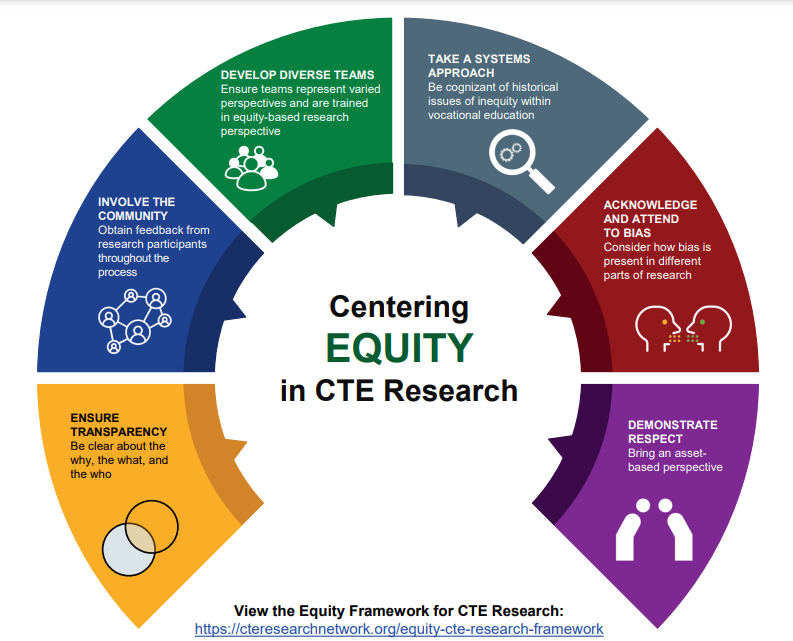

## Table of Contents

## What is equity research and why is it important?

Equity research is when experts study and analyze companies to help people decide if they should invest in them. These experts look at things like how much money a company makes, how it is run, and what is happening in the world that could affect the company. They then write reports that tell investors if they think a company's stock is a good buy, a good sell, or if they should hold onto it.

This work is important because it helps people make smarter choices with their money. When investors read these reports, they get a better understanding of a company's value and future possibilities. This can lead to better investment decisions, which can help grow their savings or retirement funds. Plus, equity research keeps the stock market fair and open by giving everyone the same information to make choices.

## How has the role of equity research evolved over the past century?

Over the past century, the role of equity research has changed a lot. At first, it was mostly about giving basic information about companies to investors. People doing equity research would look at a company's profits and how much it was worth. They would share this information through simple reports or newsletters. But as time went on, the stock market grew bigger and more complex, and so did equity research. Researchers started to use more detailed ways to analyze companies, including looking at things like how the economy was doing or what was happening in the world that could affect a company.

In recent decades, the role of equity research has become even more important and sophisticated. With the rise of technology and the internet, researchers now have access to a huge amount of data and can use advanced tools to analyze it. This means they can give investors very detailed and up-to-date information. Also, regulations have changed to make sure that equity research is fair and unbiased. Today, equity researchers not only help investors make decisions but also play a key role in keeping the market transparent and efficient. This evolution has made equity research a crucial part of the financial world.

## What were the key drivers behind the evolution of equity research?

The evolution of equity research over the past century has been driven by several key factors. One major driver was the growth of the stock market itself. As more people started investing, the demand for detailed and reliable information about companies increased. This led equity researchers to develop more sophisticated methods to analyze companies, looking at not just their profits but also broader economic trends and global events that could impact them. The need for deeper analysis helped push the field forward.

Another important driver was the advancement of technology. The rise of computers and the internet gave researchers access to vast amounts of data that they could analyze quickly and accurately. This allowed them to produce more detailed and timely reports for investors. Tools like financial modeling software and data analytics platforms became essential, making equity research more precise and valuable. Technology also made it easier for researchers to share their findings with a global audience, increasing the reach and impact of their work.

Regulatory changes also played a significant role in shaping equity research. Over time, governments and financial authorities introduced rules to ensure that research was fair and unbiased. This was important to maintain trust in the financial markets. Regulations like the Global Settlement in the early 2000s helped separate research from investment banking, aiming to reduce conflicts of interest. These changes pushed equity research to become more independent and transparent, further enhancing its role in the investment world.

## How have technological advancements impacted equity research practices?

Technological advancements have changed equity research a lot. Before, researchers had to look through big [books](/wiki/algo-trading-books) and papers to find information about companies. Now, they use computers and the internet to get all the data they need quickly. They can use special software to analyze this data and make predictions about how companies will do in the future. This makes their reports more accurate and useful for investors. Also, technology lets researchers share their findings with people all over the world, making it easier for anyone to get the information they need to make smart investment choices.

Another big impact of technology is the use of big data and [artificial intelligence](/wiki/ai-artificial-intelligence) (AI). Researchers can now look at huge amounts of information from different places, like social media, news, and financial reports. AI helps them find patterns and trends that they might not see otherwise. This means they can give investors even better advice about which stocks to buy or sell. Technology has also made it easier to keep track of how companies are doing in real-time, so researchers can update their reports quickly if something changes. Overall, technology has made equity research faster, more detailed, and more helpful for everyone.

## What changes have occurred in regulatory frameworks affecting equity research?

Over the years, rules about equity research have changed a lot. In the past, there were not many rules, so it was easy for problems to happen. For example, some researchers worked for banks and might have given advice that was good for the bank but not always best for investors. To fix this, governments and financial groups made new rules. One big change was the Global Settlement in the early 2000s. This rule made sure that research was separate from banking, so researchers could give honest advice without worrying about the bank's profits.

These new rules have made equity research more fair and trustworthy. Now, researchers have to follow strict guidelines to make sure their reports are honest and clear. This helps investors trust the information they get and make better choices. The rules also make sure that everyone has the same information, which keeps the stock market fair. Overall, these changes have made equity research a more reliable part of the financial world.

## How has the demand for equity research changed among different types of investors?

The demand for equity research has changed a lot over time among different types of investors. In the past, big institutions like banks and investment firms were the main ones using equity research. They had the money and resources to pay for detailed reports and analysis. But now, more and more individual investors are also using equity research. This is because the internet has made it easier for everyone to get this information. Websites and apps now offer research reports that anyone can read, not just big investors.

Even though more people are using equity research, the way they use it has changed. Big institutions still need in-depth reports to make big investment decisions. They often pay for special research that looks at things like a company's future growth or risks. On the other hand, individual investors might use simpler reports to get a quick understanding of a company. They might look at summaries or ratings to decide if they should buy or sell a stock. This shows that while the demand for equity research has grown, different investors use it in different ways based on their needs and resources.

## What are the current trends in equity research methodologies?

Right now, a big trend in equity research is using technology to look at lots of data. Researchers use computers and special programs to gather information from places like social media, news, and company reports. This helps them see patterns and trends that they might miss if they were just looking at numbers. They can use this to make better predictions about how a company will do in the future. This kind of research is called "big data analytics" and "artificial intelligence" and it's becoming more and more important.

Another trend is focusing on things like how a company treats the environment, its workers, and the community. This is called [ESG](/wiki/esg-investing) (Environmental, Social, and Governance) research. More and more investors want to know if a company is doing good things for the world, not just making money. Researchers now look at these factors when they write reports, to help investors choose companies that fit their values. This shows that what people care about is changing, and equity research is changing with it.

## How do modern equity research firms differ from those in the past?

Modern equity research firms are very different from those in the past. In the old days, these firms mostly looked at a company's profits and what it was worth. They wrote simple reports and shared them in newsletters or through the mail. Now, with computers and the internet, they can look at a lot more information quickly. They use special tools like big data and artificial intelligence to find patterns and predict how companies will do in the future. This makes their reports much more detailed and useful for investors.

Another big change is that modern firms care about more than just money. They also look at how a company treats the environment, its workers, and the community. This is called ESG research, and it's important because many investors want to support good companies. In the past, this wasn't something researchers thought about much. Also, today's firms have to follow strict rules to make sure their research is fair and honest. This is different from the past when there were fewer rules, and it helps keep the stock market fair for everyone.

## What role does data analytics play in today's equity research?

Data analytics is really important in today's equity research. It helps researchers look at a lot of information from different places, like social media, news, and company reports. They use special computer programs to find patterns and trends that they might not see if they were just looking at numbers. This makes their reports more accurate and helps them predict how a company will do in the future. It's like having a superpower that lets them see things others can't.

Because of data analytics, equity research has become more detailed and useful for investors. Researchers can now give investors a lot more information than they could before. This helps investors make better choices about which stocks to buy or sell. Plus, data analytics makes it easier to keep track of how companies are doing in real-time, so researchers can update their reports quickly if something changes. Overall, data analytics has made equity research faster, more accurate, and more helpful for everyone.

## How have global economic shifts influenced equity research focus and strategies?

Global economic shifts have changed what equity researchers look at and how they do their work. When the world's economy changes, like during a big crisis or when countries start trading more with each other, researchers have to pay attention to new things. For example, if there's a global recession, they might focus more on how companies are handling their money and cutting costs. Or if there's a big shift towards technology and digital businesses, researchers will spend more time looking at tech companies and how they're growing.

These changes also make researchers use different strategies. They might start using more data from around the world to understand how global events affect companies. For instance, if there's a trade war between big countries, researchers will look at how this impacts companies that rely on those markets. They might also use more advanced tools to predict how these shifts will affect different industries. Overall, global economic changes make equity research more complex but also more important for helping investors understand what's happening in the world.

## What are the challenges faced by equity researchers in the modern era?

In the modern era, equity researchers face a lot of challenges. One big challenge is dealing with so much information. With the internet and technology, there's a huge amount of data to look at, and it can be hard to figure out what's important. Researchers have to use special tools to sort through all this data and find the patterns that matter. This can be time-consuming and tricky, but it's important to get it right so they can give good advice to investors.

Another challenge is keeping up with fast changes in the world. Things like economic shifts, new laws, and global events can change quickly and affect companies in big ways. Researchers need to stay on top of all these changes and understand how they might impact the companies they're looking at. This means they have to be ready to update their reports fast and make sure their predictions are still accurate. It's a lot of work, but it's necessary to help investors make smart choices.

## What future trends are anticipated in the field of equity research?

In the future, equity research is likely to use even more technology. Researchers will use advanced tools like artificial intelligence and [machine learning](/wiki/machine-learning) to look at huge amounts of data quickly. This will help them find patterns and make predictions about how companies will do in the future. They might also use more real-time data, so they can update their reports faster when things change. This will make their advice to investors more accurate and helpful.

Another trend will be a bigger focus on how companies treat the environment, their workers, and the community. This is called ESG (Environmental, Social, and Governance) research, and it's becoming more important because many investors want to support good companies. Researchers will look at these factors more closely when they write their reports. This will help investors choose companies that fit their values, not just ones that make money. Overall, the future of equity research will be about using technology to give better, more detailed advice that considers the whole picture of a company.

## References & Further Reading

[1]: Bergstra, J., Bardenet, R., Bengio, Y., & Kégl, B. (2011). ["Algorithms for Hyper-Parameter Optimization."](https://papers.nips.cc/paper/4443-algorithms-for-hyper-parameter-optimization) Advances in Neural Information Processing Systems 24.

[2]: ["Advances in Financial Machine Learning"](https://www.amazon.com/Advances-Financial-Machine-Learning-Marcos/dp/1119482089) by Marcos Lopez de Prado

[3]: ["Evidence-Based Technical Analysis: Applying the Scientific Method and Statistical Inference to Trading Signals"](https://books.google.com/books/about/Evidence_Based_Technical_Analysis.html?id=jbD47VkOHAEC) by David Aronson

[4]: ["Machine Learning for Algorithmic Trading"](https://github.com/stefan-jansen/machine-learning-for-trading) by Stefan Jansen

[5]: ["Quantitative Trading: How to Build Your Own Algorithmic Trading Business"](https://www.amazon.com/Quantitative-Trading-Build-Algorithmic-Business/dp/1119800064) by Ernest P. Chan