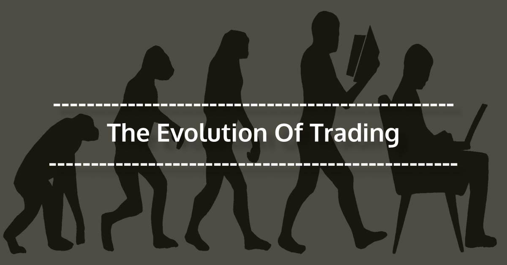

The intersection of traditional trading systems and modern-day algorithmic trading presents an intriguing study of evolution within financial markets. At the core of this transformation lies the historical context of the barter system, the earliest form of trade where goods and services were exchanged directly without a standardized monetary medium. In this archaic system, value was determined through mutual agreements, demanding a "double coincidence of wants"—the challenge of ensuring that two parties each had something the other wanted. This inefficiency, which often hindered trade, underscores the advancements made in contemporary trading practices that strive to eliminate such barriers.

In modern trading, algorithmic strategies have redefined market transactions, rooting out inefficiencies akin to those found in the barter system. Algorithms leverage computational power to analyze vast datasets, deploy trading strategies, and execute orders at speeds unachievable by human traders. Fundamental to the process of algorithmic trading is the transformation of complex data into comprehensible formats, through which visual representation plays a critical role. Visual tools simplify intricate algorithmic models, aiding traders in understanding patterns and relationships within the data.



The concept of "barter system images" serves as a metaphorical bridge between historic trading methods and technology-driven practices. It encompasses the idea of visualizing trading concepts in a manner reminiscent of how primitive societies once relied on physical objects to measure value. Today, such images manifest not as tangible items but as graphical displays and analytical charts. These visual representations, ranging from candlestick charts conveying price movements to heat maps illustrating market trends, distill complex data into actionable insights.

Technological advancements in trading are significant, marking a paradigm shift from manual approaches to algorithmic and high-frequency trading. This evolution is not only a testament to the progress in computational power and data analytics but also highlights the growing importance of visual literacy in trading environments. As we witness the integration of artificial intelligence and machine learning into trading platforms, the ability to interpret visual data has become indispensable. Traders equipped with the facility to navigate these visual landscapes are better poised to harness the full potential of algorithmic techniques.

In an era where the pace of technological innovation continues unabated, visual representation in trading underscores a broader narrative of adaptability and progress. By embracing this evolution, traders position themselves at the forefront of market efficiency and strategic acumen, heralding a sophisticated future where age-old trading principles and modern technology converge.

## Table of Contents

## Understanding the Barter System

The barter system is widely regarded as the earliest form of trade, preceding the use of money as a medium of exchange. This ancient method of commerce involves the direct exchange of goods and services without the intermediary of a standardized currency. Historical records indicate that the barter system was practiced in various forms by cultures around the globe, facilitating trade even in the absence of a formal monetary system.

In a barter system, the value of goods and services is established through mutual agreements between the parties involved. This subjective valuation process often depends on the relative needs and desires of the traders. For instance, an individual with surplus grain might exchange it for livestock from another individual who values the grain more heavily than their livestock. Such exchanges are inherently reliant on the participants’ assessment of equivalency and necessity, often requiring negotiation to reach a consensus.

One of the primary challenges of the barter system is the requirement for a double coincidence of wants. This refers to the scenario where two parties must each possess something the other desires at the exact time of the exchange. For example, if a farmer wants to trade his grain for a tailor's clothing, it is essential that the tailor also wants grain. If either party does not desire what the other offers, the trade cannot occur, posing substantial inefficiencies in facilitating transactions.

These hurdles highlight the limitations of the barter system, particularly in terms of scalability and practicality. As economies grew more complex, the constraints of bartering—such as lack of standardization and divisibility of goods—rendered it inefficient. This inefficiency mirrors the complexities [algorithmic trading](/wiki/algorithmic-trading) seeks to address in modern financial systems. Algorithmic trading employs advanced computational techniques to facilitate trade, determining the best possible outcomes using precise, data-driven strategies. 

Algorithmic trading mitigates the inefficiencies of the bartering process by automating the matching of buy and sell orders in financial markets. It leverages technology to overcome the delay in finding a matching party, akin to addressing the double coincidence of wants in bartering. Algorithms can assess market conditions in real-time and execute trades with enhanced speed and accuracy, optimizing financial transactions without the limitations of manual, subjective negotiation. This evolution represents a shift from the direct person-to-person exchanges of bartering to complex, automated processes that cater to modern trading demands.

## Evolution of Trading Practices

The evolution of trading practices from the barter system to modern electronic trading is marked by significant milestones driven by technological advancements and changing market demands. Initially, the barter system served as the earliest form of trade, where goods and services were exchanged directly without an intermediary medium. This system, while innovative in its time, faced challenges such as the 'double coincidence of wants,' where each party needed to possess something the other desired. As communities grew and trade networks expanded, the inefficiencies of barter necessitated the development of more practical solutions.

The introduction of currency represented a pivotal shift in trading practices. By providing a universally accepted medium of exchange, currency overcame the limitations of barter. Early forms of currency included commodities like gold and silver, which eventually led to the creation of minted coins for easier handling. This development laid the foundation for more complex economic activities and paved the way for the emergence of stock exchanges in the 17th century. The establishment of the Amsterdam Stock Exchange in 1602 is commonly recognized as one of the first formal stock exchanges, signifying the institutionalization of trading.

With the industrial revolution and subsequent technological progress, trading practices continued to evolve. The advent of the telegraph and telephone introduced new dynamics, enabling more rapid communication of market information and orders over long distances. This era represented a transition from manual to telephone-based trading, where orders were communicated verbally, though still vulnerable to human error and latency.

The late 20th century witnessed the rise of electronic trading platforms, driven by advances in computer technology. The NASDAQ, launched in 1971, was the first electronic stock exchange, providing an automated process for trading securities and setting a new standard for market efficiency. These platforms eliminated the need for physical trading floors and facilitated global participation by offering transparency and enhanced speed.

The progression from electronic trading to algorithmic and high-frequency trading ([HFT](/wiki/high-frequency-trading-strategies)) marks a sophisticated phase in trading practices. Algorithmic trading leverages mathematical models and extensive data analysis to execute trades automatically based on predetermined criteria. High-frequency trading further capitalizes on speed, executing a large number of orders within fractions of a second, aiming to capture small price discrepancies. The connectivity and processing power afforded by modern computing technology have been instrumental in this evolution, alongside increasing demands for market efficiency and [liquidity](/wiki/liquidity-risk-premium).

In summary, the evolution of trading practices highlights the continual adaptation and integration of technology to meet the growing complexity and demands of global financial markets. Each transition—from barter to currency, manual to electronic platforms, and algorithmic to high-frequency trading—reflects innovations in technology and the ongoing pursuit of more efficient, scalable, and sophisticated trading systems.

## The Role of Imagery in Trading

Images and visual data play a significant role in conveying complex trading concepts by transforming abstract information into intuitive representations. These visual aids simplify understanding and decision-making, especially in the intricate world of algorithmic trading, where vast amounts of data are analyzed and acted upon.

Cognitive benefits of visual representation are well-documented, providing traders with the ability to comprehend complex algorithmic models more effectively. Visual aids like charts, graphs, and heat maps enable the quick assimilation of data patterns and trends that might be overlooked in numerical data alone. Research indicates that the human brain processes visual information 60,000 times faster than text, which is particularly beneficial in trading, where timely decision-making is crucial.

Imagery can effectively represent trading strategies and risk management, offering a more accessible means to analyze and convey the outcomes of various trading models. For instance, candlestick patterns provide traders with a visual depiction of price action, capturing open, high, low, and close prices over a set period. These patterns help traders infer market sentiment and predict future price movements. Similarly, risk management tools such as portfolio heat maps offer a snapshot of asset allocation and exposure, enabling traders to balance risk and optimize returns efficiently.

The concept of 'barter system images' introduces a metaphorical approach where images serve as conceptual tools to bridge traditional trading practices with modern tech-driven systems. Just as the barter system relied on tangible goods as a medium of exchange, modern trading platforms use visual imagery to represent abstract concepts like market liquidity, [volatility](/wiki/volatility-trading-strategies), and algorithmic efficiency. This metaphor can simplify the complexity of these modern systems, making them more tangible and understandable for traders. By likening algorithmic models to barter images, traders can grasp the essence of complex strategies and assess their effectiveness in a more grounded manner.

In summary, the strategic use of imagery in trading not only aids in the understanding and execution of complex algorithms but also connects modern trading methodologies with their historical counterparts, reinforcing the ongoing evolution of trade.

## Algorithmic Trading and Visual Representation

Algorithmic trading refers to the use of computer algorithms to automate trading decisions, relying on vast amounts of data processed in real time. The key components of algorithmic trading include data analysis, strategy development, and execution. These systems utilize historical and real-time data to create and refine trading strategies that align with pre-defined objectives and constraints.

Algorithms process real-time data through a sequence of steps designed to ensure optimal trading outcomes. This involves constant monitoring and analysis of financial markets, adapting to market conditions, and executing trades at speeds unattainable by human traders. For example, statistical [arbitrage](/wiki/arbitrage) strategies use mean reversion algorithms to capitalize on price discrepancies between correlated assets.

The integration of big data and [artificial intelligence](/wiki/ai-artificial-intelligence) (AI) has transformed visual analytics and strategy refinement processes. The vast amounts of data generated by markets can be overwhelming, but AI-driven analytics enhance the ability to identify patterns and trends, improving the precision of trading strategies. Machine learning models in particular are adept at uncovering insights from data, leading to more effective trading strategies. Python libraries such as Pandas and TensorFlow are prevalent in developing these models, enabling efficient data manipulation and AI model training.

Visual tools play an essential role in the [backtesting](/wiki/backtesting) and optimization of algorithmic trading strategies. Backtesting involves simulating a trading strategy on historical data to evaluate its performance, often visualized through various chart types, such as line charts or scatter plots, which assist in identifying patterns and measuring profitability. Tools like TradingView facilitate this by providing a robust platform for visual strategy testing and optimization.

Consider the following Python snippet illustrating a simple moving average crossover strategy backtesting using the Pandas library:

```python
import pandas as pd

# Load historical market data
data = pd.read_csv('historical_data.csv', parse_dates=True, index_col='Date')

# Calculate moving averages
data['Short_MA'] = data['Close'].rolling(window=50).mean()
data['Long_MA'] = data['Close'].rolling(window=200).mean()

# Generate trading signals
data['Signal'] = 0
data['Signal'][50:] = np.where(data['Short_MA'][50:] > data['Long_MA'][50:], 1, 0)

# Compute daily returns
data['Returns'] = data['Close'].pct_change()

# Calculate strategy returns
data['Strategy_Returns'] = data['Returns'] * data['Signal'].shift(1)

# Plot results
data[['Returns', 'Strategy_Returns']].cumsum().plot()
plt.title('Strategy Backtesting Results')
plt.show()
```

This example demonstrates how visual tools, through graphical representations, can elucidate the effectiveness of trading strategies. By leveraging such visual tools, traders can optimize strategies by dissecting past performance and adjusting parameters accordingly.

In conclusion, the interplay between algorithmic trading and visual representation of data provides a comprehensive approach to refining trading strategies, incorporating real-time data processing and leveraging AI for enhanced decision-making. This integration marks a significant advancement in trading practices, offering a competitive edge in an increasingly data-driven market environment.

## Case Studies: Imagery in Algorithmic Trading

### Case Studies: Imagery in Algorithmic Trading

Visual representations have significantly enhanced trading outcomes by enabling more intuitive analysis of data patterns and trends. Platforms like TradingView have played a pivotal role in this enhancement by integrating chart-based analysis with algorithmic trading strategies. TradingView’s user-friendly interface allows traders to create and share custom indicators and strategies, fostering a community-driven approach to trading. This platform provides a suite of tools such as interactive charts, financial modeling, and social networking functionalities, which together form a comprehensive environment for both novice and expert traders.

**Platforms Integrating Chart-Based Analysis**

TradingView stands out for its ability to merge traditional visual trading methods with modern algorithmic strategies. This integration allows traders to apply custom scripts and backtest them using historical data. The platform supports Pine Script, a proprietary scripting language that helps traders create their own custom indicators and strategies. This blend of visual and algorithmic capabilities empowers traders to visualize and automate complex trading strategies effectively. 

**Use of Heat Maps, Candlestick Patterns, and Sentiment Visualizations**

Heat maps offer another layer of visualization by representing data visually through color shading, allowing traders to quickly identify high and low concentrations of trade activity. They provide a means to evaluate patterns based on [volume](/wiki/volume-trading-strategy) and price movements, which are crucial for determining market sentiment and potential price shifts.

Candlestick patterns, a longstanding tool in trading analysis, are visual cues that help in identifying market sentiment and predicting future price movements. Their effectiveness arises from their ability to encapsulate data on opening, closing, high, and low prices over a specific period. These patterns, when integrated with algorithmic models, can improve prediction accuracy and inform decision-making processes.

Sentiment visualizations aggregate social media data, news articles, and market reports to gauge the overall market mood. Machine learning and natural language processing algorithms can analyze this text data, converting it into sentiment scores. Visual aids such as word clouds or sentiment line graphs then help traders understand market consensus, which is essential for devising responsive trading strategies.

**Research and Innovations in Visual Methodologies**

Recent research has underscored the impact of visual methodologies in trading. For instance, studies have explored the application of neural networks for pattern recognition in candlestick charts, demonstrating improved accuracy in predicting price movements. The use of convolutional neural networks (CNNs) allows for automated pattern recognition, which can then inform algorithmic strategies.

Innovations have also focused on enhancing the user experience by incorporating augmented reality (AR) and virtual reality (VR) into trading platforms. These technologies aim to offer immersive data visualization, where traders can manipulate 3D data models and gain insights that static charts may not provide.

In conclusion, the integration of imagery in algorithmic trading through platforms such as TradingView and the use of visual tools including heat maps, candlestick patterns, and sentiment visualizations has substantially elevated the efficiency of trading strategies. Furthermore, continuous research and the advent of VR and AR in trading platforms promises a future oriented towards more intuitive and dynamic visual analytics.

## Challenges and Opportunities

Adopting visual tools in algorithmic trading presents both significant challenges and remarkable opportunities. The accuracy of data and the capability for real-time processing are paramount in this context. Visual tools rely heavily on the integrity and precision of incoming and historical data. Any discrepancies can lead to erroneous interpretations, potentially resulting in adverse trading decisions. Real-time processing adds another layer of complexity, as visual analytics must match the speed and accuracy of rapid market changes. This demand for high-speed data processing and display in trading environments can be technically challenging and resource-intensive.

The learning curve associated with mastering visual data analytics is another challenge. Traders and analysts must develop new skills to effectively utilize advanced visual tools. The integration of data visualization techniques with algorithmic trading strategies requires a robust understanding of both domains. Users must familiarize themselves with software platforms, charting techniques, and the interpretation of complex visual patterns, which can be daunting for professionals accustomed to more traditional trading methods.

On the opportunity side, the use of enhanced visual interfaces can significantly sharpen decision-making processes. Visual analytics enable traders to synthesize large datasets into accessible and interpretable formats, facilitating quicker and more informed decision-making. Advanced visual tools can uncover insights and trends that might remain hidden in numerical data alone, allowing traders to anticipate market movements more effectively.

Looking forward, the integration of imagery with algorithmic trading could embrace emerging technologies such as virtual reality (VR) and augmented reality (AR). These technologies offer immersive environments that could transform traditional trading desks by providing 3D visualizations of data and market trends. Such advancements could offer traders a more intuitive sense of market dynamics, potentially offering a competitive edge.

In conclusion, while there are substantial challenges in adopting visual tools in algorithmic trading—including data accuracy, real-time processing demands, and steep learning curves—the opportunities for enhanced decision-making and future trends like VR and AR integration are vast. These innovations promise to redefine trading interfaces and improve market comprehension substantially.

## Conclusion

The intersection of imagery and algorithmic trading, often referred to in this context as 'barter system images,' presents a unique opportunity to enhance trading strategies through visual analytics. These images are not just decorative; they serve as metaphors for simplifying complex trading systems, akin to how traditional barter systems simplified early trade by assigning visual equivalence to goods. By leveraging such visual metaphors, traders can break down and comprehend intricate algorithmic functions more efficiently.

Technological adoption has always played a pivotal role in the evolution of trading practices. From the shift from the barter to currency systems, and onto electronic and algorithmic trading, advancements in technology have continuously redefined how market participants engage. As trading becomes increasingly automated, the need to translate complex data into comprehensible and actionable insights becomes ever more critical. This is where visual analytics offers substantial value, enabling traders to grasp market dynamics through graphical and visually intuitive representations.

For traders, embracing visual analytics is not merely a trend but a valuable tool that enhances market understanding and decision-making processes. Platforms that offer chart-based analysis and integrate algorithmic strategies, such as TradingView, exemplify the benefits of clear visual representations. Tools like heat maps, candlestick patterns, and sentiment visualizations simplify the interpretation of market movements and the potential impacts of trading decisions.

The exploration of integrating 'barter system images' highlights the continuous journey of innovation in trading. As we look forward, the landscape of trading will likely be marked by further innovations, possibly incorporating emerging technologies like Virtual Reality (VR) and Augmented Reality (AR) into trading platforms. These technologies could provide traders with even more immersive and interactive data visualization tools.

In conclusion, the assimilation of visual metaphors into algorithmic trading systems not only enhances comprehension and strategy but is an essential aspect of embracing technological advancements. Traders are encouraged to view visual analytics as an integral component of their trading toolkit, ensuring they remain adept in an ever-evolving market landscape. As the trading community continues to innovate, the journey promises new possibilities for integrating imagery with technology, paving the way for smarter and more informed trading decisions.

## References & Further Reading

[1]: Bergstra, J., Bardenet, R., Bengio, Y., & Kégl, B. (2011). ["Algorithms for Hyper-Parameter Optimization."](https://papers.nips.cc/paper/4443-algorithms-for-hyper-parameter-optimization) Advances in Neural Information Processing Systems 24.

[2]: ["Advances in Financial Machine Learning"](https://www.amazon.com/Advances-Financial-Machine-Learning-Marcos/dp/1119482089) by Marcos Lopez de Prado

[3]: ["Evidence-Based Technical Analysis: Applying the Scientific Method and Statistical Inference to Trading Signals"](https://www.amazon.com/Evidence-Based-Technical-Analysis-Scientific-Statistical/dp/0470008741) by David Aronson

[4]: ["Machine Learning for Algorithmic Trading"](https://github.com/stefan-jansen/machine-learning-for-trading) by Stefan Jansen

[5]: ["Quantitative Trading: How to Build Your Own Algorithmic Trading Business"](https://books.google.com/books/about/Quantitative_Trading.html?id=j70yEAAAQBAJ) by Ernest P. Chan