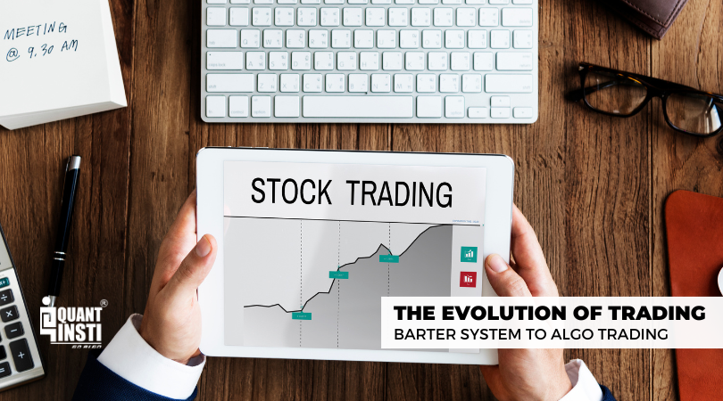

## Table of Contents

## What is the basic concept of trading?

Trading is the act of buying and selling things to make money. It can involve stocks, which are shares in a company, or other things like currencies, commodities, or even cryptocurrencies. The main idea is to buy something at a low price and then sell it at a higher price. Traders look at market trends and use different strategies to decide when to buy and sell. They hope to make a profit from the difference between the buying and selling prices.

There are many ways to trade. Some people trade every day, looking for small price changes to make quick profits. This is called day trading. Others might hold onto their investments for a longer time, hoping the value will go up over weeks, months, or even years. This is known as long-term investing. Trading can be risky because the value of what you're trading can go down as well as up. That's why it's important for traders to learn about the markets and manage their risks carefully.

## How did barter systems work in ancient times?

In ancient times, people used barter systems to trade goods and services without using money. If someone had something they didn't need, like extra food or tools, they could trade it for something they did need, like clothes or a different type of food. For example, a farmer might trade some of his wheat for a potter's clay pots. This system worked because both people got something they wanted, and they agreed on the value of what they were trading.

However, barter systems had some problems. It was hard to find someone who wanted what you had and also had what you wanted. This is called the "double coincidence of wants." Also, it was difficult to decide how much of one thing was worth compared to another thing. If a farmer wanted to trade wheat for a cow, how much wheat should he give? Because of these problems, as societies grew and became more complex, people started using other ways to trade, like using coins and paper money.

## When and why did societies transition from barter to using currency?

Societies started using currency instead of bartering a long time ago, around 5,000 years ago in places like Mesopotamia. The main reason for this change was that bartering had big problems. It was hard to find someone who had what you wanted and also wanted what you had. Plus, it was tough to agree on how much of one thing was worth compared to another thing. For example, how many chickens should you trade for a cow? Using currency made trading easier and fairer.

Currency, like coins and paper money, solved these problems. With money, you could buy anything you needed without finding someone who wanted your specific item. Money also made it easier to decide the value of things. You could say a cow is worth 50 coins, and everyone would understand that. As societies got bigger and more complicated, using currency became even more important. It helped people trade with others far away and made the economy grow.

## What are the key differences between commodity money and fiat money?

Commodity money is money that has value because it is made from something useful, like gold or silver. People wanted these things even if they were not used as money. For example, you can use gold to make jewelry or silver to make dishes. Because commodity money has real value, it can be hard to control how much of it there is. If someone finds a new gold mine, there can suddenly be a lot more gold money.

Fiat money is different. It is money that has value because the government says it does. It is not made from something valuable like gold. Instead, it is usually paper or digital. Examples are the US dollar or the Euro. The value of fiat money comes from people trusting that they can use it to buy things. Governments can control how much fiat money there is, which can help manage the economy. But if people stop trusting it, fiat money can lose its value quickly.

## How did the introduction of stock markets change trading practices?

The introduction of stock markets changed trading practices a lot. Before stock markets, people traded things like food, tools, and money directly with each other. But when stock markets started, people could buy and sell pieces of companies, called stocks. This meant that anyone could own a part of a big business, not just rich people. It made it easier for companies to get money to grow by selling stocks to many people instead of just a few.

Stock markets also made trading more organized and easier to do. Instead of meeting someone in person to trade, people could buy and sell stocks through a stock exchange. This made trading faster and more efficient. It also let people trade stocks from all over the world, not just in their own town or country. The stock market helped the economy grow by making it easier for businesses to raise money and for people to invest and make money from their investments.

## What role did the telegraph and telephone play in the evolution of trading?

The telegraph and telephone made big changes in how trading worked. Before these inventions, traders had to send messages by mail or meet in person, which took a lot of time. The telegraph let traders send messages quickly over long distances using Morse code. This meant they could find out about prices and make deals faster. The telegraph helped make trading faster and more efficient.

Then came the telephone, which made trading even easier. With the telephone, traders could talk to each other directly and make deals in real time. They didn't have to wait for a telegraph message to be sent and received. The telephone made trading more personal and immediate, which helped traders react quickly to changes in the market. Both the telegraph and telephone helped the trading world grow and become more connected.

## How have computers and the internet transformed trading?

Computers and the internet have changed trading a lot. Before, traders had to call each other or meet in person to buy and sell things. Now, they can use computers to trade from anywhere. They can see prices and make deals in seconds. This makes trading much faster and easier. Computers also help traders keep track of their trades and analyze data to make better decisions. They can use special programs to look at market trends and predict what might happen next.

The internet has made trading even more accessible. People can trade stocks, currencies, and other things online from their homes. They don't need to go to a stock exchange or use a broker to make trades. Websites and apps let people buy and sell things anytime, day or night. The internet also gives traders a lot of information. They can read news, look at charts, and learn about the market. This helps them make smarter trades. Overall, computers and the internet have made trading quicker, easier, and more available to everyone.

## What is electronic trading and how does it differ from traditional trading?

Electronic trading is when people buy and sell things like stocks or currencies using computers and the internet. Instead of calling someone or going to a place like a stock exchange, traders use websites or apps to make their trades. This means they can trade anytime and from anywhere, even at home. Electronic trading is fast and easy, and it uses special programs to help traders make decisions based on lots of data and market trends.

Traditional trading is different because it involves more direct communication and physical presence. Traders used to call each other on the phone or meet at places like stock exchanges to buy and sell things. This way of trading could take longer because it depended on people talking to each other and agreeing on deals. Traditional trading also often needed the help of a broker, someone who makes trades for you, which could make it more complicated and sometimes more expensive.

## What are the basics of algorithmic trading and how does it work?

Algorithmic trading, or algo trading, is when computers use special math formulas, called algorithms, to buy and sell things like stocks or currencies. These algorithms are set up to follow certain rules, like when to buy or sell based on price changes or other market information. Traders can program these rules into the computer, and the computer will do the trading automatically, without needing someone to watch it all the time. This can make trading faster and can help traders make more money by taking advantage of small price changes that happen quickly.

Algo trading works by using a lot of data to make decisions. The computer looks at things like stock prices, news, and other information to decide what to do. For example, if the price of a stock goes up a little bit, the algorithm might tell the computer to buy more of that stock. Or if the price goes down, it might tell the computer to sell. This happens very quickly, sometimes in just a few seconds. Because computers can handle a lot of information and make decisions faster than people, [algorithmic trading](/wiki/algorithmic-trading) can be very effective. But it also needs careful setting up and watching to make sure the algorithms are working right and not making mistakes.

## How do high-frequency trading (HFT) strategies impact modern markets?

High-frequency trading ([HFT](/wiki/high-frequency-trading-strategies)) strategies have a big impact on modern markets. HFT is when computers use special programs to buy and sell things like stocks very quickly, often in just a few seconds. These strategies can make markets more liquid, which means it's easier to buy and sell things because there are more trades happening. This can help keep prices stable and make it easier for everyone to trade. But HFT can also make markets move very fast, which can be risky if prices change a lot in a short time.

HFT can also change how other traders act. Some people think HFT can give an unfair advantage to big companies with fast computers and special programs. This can make it harder for smaller traders to compete. Also, if many HFT traders are using the same strategies, it can lead to sudden big changes in the market, like what happened during the "Flash Crash" of 2010. So, while HFT can help make trading faster and more efficient, it also brings new challenges and risks that need to be managed carefully.

## What are the regulatory challenges associated with algo trading?

Algo trading brings up some big challenges for people who make the rules, called regulators. One big problem is making sure that the computer programs used in algo trading are fair and don't give some traders an unfair advantage. Regulators need to check these programs to make sure they follow the rules and don't do things like trick the market or cause big price changes. This can be hard because the programs can be very complicated and change quickly.

Another challenge is keeping the markets safe and stable. Algo trading can happen very fast, and if something goes wrong, it can cause big problems, like the "Flash Crash" in 2010. Regulators have to find ways to stop these kinds of problems from happening. They need to make rules that slow down trading a bit when things get too wild or stop trading if prices start to change too much too fast. Balancing the need for fast trading with keeping the markets safe is a big job for regulators.

## What future trends might further evolve trading practices?

In the future, trading might change a lot because of new technology. One big thing that could happen is more use of [artificial intelligence](/wiki/ai-artificial-intelligence), or AI. AI can look at a lot of data very quickly and make smart decisions. This could make trading even faster and more accurate. Traders might use AI to find good deals or predict what the market will do next. But using AI also means we need to be careful about making sure it's fair and doesn't cause problems in the market.

Another trend that could change trading is blockchain technology. Blockchain is a way to keep track of trades that is very safe and clear. It could make trading more trustworthy because everyone can see what's happening. This might be especially important for things like cryptocurrencies. Also, more people might start trading from their phones or other devices, making it easier to trade anytime and anywhere. As these technologies grow, they could make trading simpler and more open to everyone, but they will also bring new challenges for people who make the rules.

## References & Further Reading

[1]: Bergstra, J., Bardenet, R., Bengio, Y., & Kégl, B. (2011). ["Algorithms for Hyper-Parameter Optimization."](https://papers.nips.cc/paper/4443-algorithms-for-hyper-parameter-optimization) Advances in Neural Information Processing Systems 24.

[2]: ["Advances in Financial Machine Learning"](https://www.amazon.com/Advances-Financial-Machine-Learning-Marcos/dp/1119482089) by Marcos Lopez de Prado

[3]: ["Evidence-Based Technical Analysis: Applying the Scientific Method and Statistical Inference to Trading Signals"](https://www.amazon.com/Evidence-Based-Technical-Analysis-Scientific-Statistical/dp/0470008741) by David Aronson

[4]: ["Machine Learning for Algorithmic Trading"](https://github.com/stefan-jansen/machine-learning-for-trading) by Stefan Jansen

[5]: ["Quantitative Trading: How to Build Your Own Algorithmic Trading Business"](https://books.google.com/books/about/Quantitative_Trading.html?id=j70yEAAAQBAJ) by Ernest P. Chan