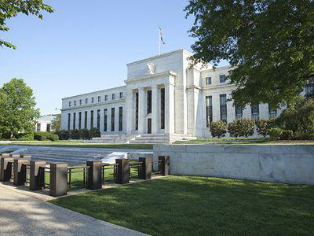

Financial regulations serve as the backbone for stable and secure financial markets, essential for safeguarding both the broader economy and individual consumers. These legal frameworks are designed to prevent market failures, protect consumer interests, and ensure transparency and accountability within the financial system. Among the numerous regulations that have shaped the financial landscape, the Dodd-Frank Act and the Glass-Steagall Act stand out for their significant impact and enduring relevance.

The Glass-Steagall Act, enacted in 1933, emerged as a response to the banking failures and economic turmoil of the Great Depression. Its primary objective was to rebuild public trust in the banking system by mandating a separation between commercial and investment banking activities. This delineation was intended to minimize the risks posed by speculative investments to depositors' funds. For over six decades, the Glass-Steagall Act played a crucial role in maintaining stability within the banking sector until its repeal in 1999, which led to significant changes in how financial institutions operated.

Conversely, the Dodd-Frank Wall Street Reform and Consumer Protection Act of 2010 was introduced in the wake of the 2008 global financial crisis. This comprehensive legislation sought to enhance financial stability through improved regulatory oversight, increased transparency, and consumer protection measures. The Dodd-Frank Act represents a significant shift in regulatory strategy, addressing modern financial challenges by implementing stringent reforms and establishing new regulatory bodies.

In addition to exploring the historical and current impacts of these regulations, this article examines how algorithmic trading interacts with them. Algorithmic trading, characterized by high-speed and high-volume transactions executed by complex algorithms, presents unique challenges and risks like market volatility and flash crashes. Understanding the interplay between technology-driven trading practices and existing financial regulations is crucial for adapting to the evolving landscape.

The goal of this article is to offer a comprehensive overview of these pivotal regulations, providing invaluable insights for financial professionals and enthusiasts alike. By understanding the foundations and implications of the Dodd-Frank and Glass-Steagall Acts, stakeholders can better navigate the intricacies of today's financial environment and anticipate future regulatory developments.

## Table of Contents

## Background of the Glass-Steagall Act

The Glass-Steagall Act, officially known as the Banking Act of 1933, was introduced in the United States in response to the financial turmoil precipitated by the 1929 stock market crash. This legislation was implemented to restore public trust in the banking system, which had been severely undermined during the Great Depression. By instituting a clear demarcation between commercial and investment banking activities, the Act sought to protect depositor funds from the volatility associated with speculative investments undertaken by investment banks. 

Prior to the Glass-Steagall Act, banks often engaged in both commercial banking, such as accepting deposits and providing loans, and investment banking, like underwriting securities. The blending of these functions was believed to contribute to the systemic risks that led to widespread bank failures during the Great Depression. In order to mitigate these risks, the Act imposed significant restrictions. It prohibited commercial banks from owning or affiliating with firms that were primarily engaged in securities activities.

The Act's implementation was based on the view that separating these banking functions would not only reduce the risk of bank failures but also prevent conflicts of interest and curb excessive speculation. The Glass-Steagall Act’s provisions aimed to build a more stable foundation for the financial sector, reinstating confidence among the American public. 

This regulatory framework remained a cornerstone of U.S. financial regulation for several decades. However, over time, certain provisions were gradually eroded through various exemptions and changes in the financial landscape, ultimately leading to its repeal in 1999 with the passage of the Gramm-Leach-Bliley Act.

## Repeal of Glass-Steagall and Its Consequences

In 1999, the landmark Glass-Steagall Act, which had been a cornerstone of U.S. financial regulation since its enactment in 1933, was effectively repealed through the introduction of the Gramm-Leach-Bliley Act. This legislation, officially known as the Financial Services Modernization Act of 1999, was designed to dismantle the barriers between banking, securities, and insurance services, thereby allowing financial institutions to merge and offer a wider range of services. The repeal marked a significant shift away from the regulatory constraints that isolated commercial banking from investment banking, which had been intended to protect depositors’ funds from risky speculative activities.

The abolishment of these barriers facilitated the growth of financial institutions in terms of size and complexity, enabling them to expand their operations into multiple sectors. As a result, financial entities began to adopt riskier financial practices, contributing to heightened systemic risks. Numerous analysts and commentators have suggested that such deregulation was a significant contributing [factor](/wiki/factor-investing) to the global financial crisis of 2008. The removal of the Glass-Steagall safeguards is thought to have allowed conflicts of interest, where financial institutions could engage in speculative investment operations while holding significant portions of consumer deposits.

The repercussions of this shift were profound. Critics of the repeal argue that these regulatory changes removed essential checks and balances that were necessary to ensure financial stability. The blurring of lines between different types of financial services introduced new vulnerabilities, as the potential for conflicts of interest and lack of transparency increased. With larger and more intertwined financial institutions, the risk of a single entity's failure affecting the entire financial system rose substantially. 

The discourse surrounding the repeal of Glass-Steagall continues to inform the regulatory debate, as it underscores the need for a delicate balance between promoting financial innovation and safeguarding the stability of financial markets. The events following the repeal highlighted the interconnectedness of financial institutions and the potential systemic risks inherent in such integration, fundamentally shaping perspectives on financial regulation and the need for effective oversight.

 to the Dodd-Frank Act

The Dodd-Frank Wall Street Reform and Consumer Protection Act, commonly known as the Dodd-Frank Act, was enacted in 2010 in response to the global financial crisis of 2008. This landmark legislation aimed to create a safer and more stable financial system by imposing substantial regulatory changes to increase transparency and accountability within the industry.

A central goal of the Dodd-Frank Act was to mitigate systemic risk and prevent another financial meltdown akin to that which precipitated the crisis. To that end, the Act introduced a series of comprehensive reforms. These included stricter oversight of financial institutions, particularly those identified as "too big to fail," which posed significant risks to the wider economy due to their size and interconnectedness.

Consumer protection was another cornerstone of the Dodd-Frank legislation. The Act established the Consumer Financial Protection Bureau (CFPB), a regulatory body dedicated to enforcing consumer finance laws and ensuring that consumers receive clear information and protection from abusive financial practices. The CFPB's role underscored a shift towards prioritizing consumer rights and transparency.

Overall, the Dodd-Frank Act represented a sweeping effort to restructure financial regulation. It sought to impose discipline within the financial sector through rigorous oversight, placing checks on the excesses that contributed to the financial turmoil of 2008. This reformative approach was designed to not only reinforce market integrity but also restore public confidence in the financial system.

## Key Provisions of the Dodd-Frank Act

The Dodd-Frank Wall Street Reform and Consumer Protection Act, enacted in 2010, introduced several key provisions to enhance the stability and transparency of the U.S. financial system. A central feature of the Act is the Volcker Rule, named after former Federal Reserve Chairman Paul Volcker. This rule prohibits banks from engaging in proprietary trading, where they trade for their own profit rather than on behalf of clients. It also restricts banks from investing in hedge funds and private equity, aiming to reduce the risk of financial entities engaging in speculative activities that could threaten their stability.

The Financial Stability Oversight Council (FSOC) was another crucial component established by the Dodd-Frank Act. The FSOC is tasked with monitoring systemic risks within the financial system. Comprising various regulatory authorities, the council has the authority to identify and respond to emerging threats to financial stability, ensuring that appropriate preventive measures are in place.

The concept of "too big to fail" gained substantial attention following the 2008 financial crisis. In response, the Dodd-Frank Act implemented enhanced regulatory scrutiny for large financial institutions that pose a potential systemic risk. These institutions are subject to higher capital requirements and stricter oversight to prevent their failure from destabilizing the broader financial market.

Another significant provision of the Act is the requirement for annual stress tests for banks. These tests are designed to evaluate whether banks have sufficient capital to survive during periods of economic and financial stress. By simulating adverse economic scenarios, regulators can assess a bank's ability to maintain operations and continue lending under challenging conditions.

Additionally, the Dodd-Frank Act aimed to improve transparency in the derivatives market, which was largely opaque before the financial crisis. Derivatives, financial instruments whose value is derived from underlying assets, were implicated in the 2008 crisis due to their complexity and lack of oversight. The Act mandates central clearing and exchange trading for certain types of derivatives, reducing counterparty risk and enhancing market transparency.

These provisions collectively aim to mitigate the risk of another financial crisis by enforcing stricter regulations and improving oversight within the financial system. While the effectiveness of these measures continues to be debated, the Dodd-Frank Act represents significant regulatory reform aimed at promoting financial stability and protecting consumers.

## Algorithmic Trading and Financial Regulations

Algorithmic trading employs sophisticated algorithms to conduct trades at an unparalleled speed and [volume](/wiki/volume-trading-strategy), drastically transforming modern financial markets. Despite its efficiency and precision, this practice has introduced significant risks, including heightened market [volatility](/wiki/volatility-trading-strategies) and the potential for flash crashes. Such incidents occur when rapid trading overwhelms market systems, leading to abrupt price collapses before recovery.

The Dodd-Frank Act, a cornerstone of contemporary financial regulation, endeavors to mitigate these risks by enhancing market transparency and imposing stricter oversight. By mandating more comprehensive reporting requirements and stress tests for financial institutions, the Act seeks to identify and manage systemic risks associated with high-frequency trading activities.

Regulatory authorities face ongoing challenges in keeping pace with the rapid technological advancements that characterize [algorithmic trading](/wiki/algorithmic-trading). As trading algorithms become increasingly complex and markets more interlinked, regulators must adapt existing frameworks to ensure effective oversight without stifling innovation. Python programming, extensively used in developing and testing trading algorithms, exemplifies the technological proficiency necessary in this sector. 

Balancing the pursuit of technological innovation in trading with the imperative of maintaining market stability continues to be a pivotal area of focus for policymakers. Innovations in [artificial intelligence](/wiki/ai-artificial-intelligence) and [machine learning](/wiki/machine-learning) could exacerbate existing risks if not appropriately monitored. Therefore, revising regulatory measures to reflect the dynamic nature of algorithmic trading remains essential to safeguard the financial ecosystem from potential disruptions.

## Impact and Criticisms

The Dodd-Frank Act, introduced to enhance financial stability, has been subject to extensive scrutiny and divergent opinions. On one hand, it has undeniably contributed to a more robust regulatory framework intended to mitigate systemic risks within the financial system. Nonetheless, the Act has been criticized for its complexity and the significant costs associated with compliance.

Critics argue that the extensive regulations imposed by Dodd-Frank have inadvertently stifled economic growth. The intricate web of regulatory requirements can pose substantial barriers to smaller financial institutions, potentially limiting their ability to extend credit. This complexity may manifest in higher operational costs, as institutions are obliged to allocate resources towards compliance rather than innovation or expansion.

The debate surrounding the Dodd-Frank Act is emblematic of broader economic policy discussions. Proponents assert that the Act's stringent measures are necessary to preclude the types of financial practices that precipitated the 2008 crisis. However, detractors suggest that its rigid structure could impede flexibility and dynamism within financial markets, emphasizing the need for a regulatory balance that ensures safety without stifling growth.

In response to these regulatory pressures, many financial institutions have pivoted towards strengthening their compliance and risk management frameworks. This strategic shift highlights the institutional adaptation required to navigate the complexities introduced by Dodd-Frank, aligning business practices with regulatory expectations to maintain operational viability.

The effectiveness of the Dodd-Frank Act continues to be a subject of rigorous analysis and debate. While it has instilled greater transparency and oversight in financial markets, questions persist regarding its long-term efficacy in fostering a stable yet dynamic economic environment. The evolution of financial regulations and their impact on market practices will likely remain an area of critical examination as policymakers seek to refine contemporary financial governance.

## Conclusion

The Glass-Steagall and Dodd-Frank Acts are landmark legislations in the evolution of financial regulation. Enacted at different times, they both responded to distinct economic crises and challenges. Each act has profoundly influenced how financial markets function and are perceived both domestically and globally.

The Glass-Steagall Act, established in 1933 after the Great Depression, sought to create a clear division between commercial and investment banking. Its legacy lies in its foundational approach to minimizing risks associated with speculative banking activities. Although repealed in 1999, its principles continue to inform current discussions on financial regulation, particularly concerning the separation of banking activities to prevent conflicts of interest.

The Dodd-Frank Act of 2010 emerged in response to the 2008 financial crisis, aiming to increase transparency and accountability in the financial system. Through various reforms, including the implementation of the Volcker Rule and the establishment of the Consumer Financial Protection Bureau, it sought to mitigate systemic risks and enhance consumer protection. These measures reflect an ongoing effort to balance market freedom with necessary oversight, ensuring financial stability while supporting economic growth.

Technological advancements, particularly in algorithmic trading, present additional challenges to such regulatory frameworks. The speed and complexity of modern trading necessitate continual adaptation of regulatory approaches. Regulators must find ways to integrate technological innovations while safeguarding market stability and protecting against potential abuses. 

Looking ahead, future reforms will likely need to address these rapidly evolving challenges, navigating the intricate dynamics of modern finance. The interplay between regulation and innovation remains crucial to fostering a stable yet dynamic financial environment that can withstand emerging threats while supporting sustainable economic development.

## References & Further Reading

[1]: ["The Glass-Steagall Act: A Legal and Political Analysis"](https://crsreports.congress.gov/product/pdf/R/R44349) by Larry D. Wall & Timothy W. Koch, published in Duke Law Journal

[2]: ["Too Big to Fail: The Dodd-Frank Act and its Impact on Financial Regulation"](https://www.brookings.edu/articles/ending-too-big-to-fail/) by Arthur E. Wilmarth Jr., published in St. John's Law Review

[3]: ["The Repeal of the Glass-Steagall Act and the U.S. Financial Crisis: An Analysis"](https://www.cato.org/policy-analysis/repeal-glass-steagall-act-myth-reality) by Saule T. Omarova, published in South Carolina Law Review

[4]: ["Advances in Financial Machine Learning"](https://www.amazon.com/Advances-Financial-Machine-Learning-Marcos/dp/1119482089) by Marcos Lopez de Prado

[5]: ["Derivatives Pricing and Risk Management"](https://www.amazon.com/Financial-Derivatives-Pricing-Risk-Management/dp/0470499109) by R. Whaley

[6]: ["How High Frequency Trading Has Changed the Dynamics of Derivative Pricing"](https://link.springer.com/article/10.1007/s11408-019-00331-6) by Mark Paddrik, et. al, available on SSRN

[7]: ["Algorithmic and High-Frequency Trading"](https://assets.cambridge.org/97811070/91146/frontmatter/9781107091146_frontmatter.pdf) by Álvaro Cartea, Sebastián Jaimungal, and José Penalva