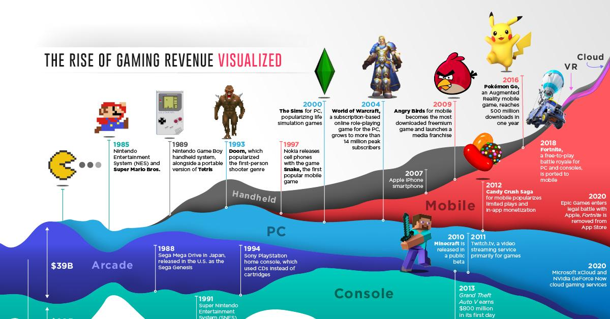

## Table of Contents

## What are the earliest known video games and when were they developed?

The earliest known video game is "Tennis for Two," which was created in 1958 by physicist William Higinbotham. This game was made on an oscilloscope, a device used to display electronic signals. In "Tennis for Two," players used knobs and buttons to control a small dot that represented a tennis ball, and they tried to hit it over a net. It was a simple game, but it was a lot of fun for the people who played it at the time.

Another early video game was "Spacewar!," which was developed in 1962 by a group of computer programmers at the Massachusetts Institute of Technology (MIT). "Spacewar!" was played on a computer called the PDP-1, and it involved two spaceships fighting each other in space. Players used the computer's controls to move their ships and shoot at each other. This game was more complex than "Tennis for Two" and showed that video games could be more than just simple sports simulations.

## How did the transition from arcade games to home consoles occur?

The transition from arcade games to home consoles started in the late 1970s and early 1980s. At first, arcade games were popular because they were fun and exciting, but they were only found in public places like malls and amusement centers. People wanted to play these games at home, so companies started making home versions of popular arcade games. The first successful home console was the Atari 2600, released in 1977. It let people play games like "Pong" and "Space Invaders" at home, which was a big change from going out to play at an arcade.

As technology improved, more companies started making home consoles. In the 1980s, the Nintendo Entertainment System (NES) came out and became very popular. It had better graphics and sound than earlier consoles, and it introduced many famous games like "Super Mario Bros." and "The Legend of Zelda." This made home gaming even more popular and helped move people away from arcades. By the 1990s, home consoles were the main way people played video games, and arcades began to decline.

## What were the major technological advancements that influenced video game development in the 1980s?

In the 1980s, one big change that helped video games get better was the improvement in computer chips. These chips made games run faster and look nicer. For example, the Nintendo Entertainment System (NES) used a special chip that let games have more colors and better sound than before. This made games more fun to play and look at. Also, game makers started using more memory in their consoles, which let them make bigger and more detailed game worlds.

Another important change was the way games were made. Before the 1980s, games were often made by just one person or a small team. But in the 1980s, bigger teams started working together to make games. This meant games could be more complex and have better stories. Companies like Nintendo and Sega hired lots of people to work on games, and this led to classics like "Super Mario Bros." and "Sonic the Hedgehog." These games showed what was possible with the new technology and changed the way people thought about video games.

## How did the video game crash of 1983 affect the industry, and what led to its recovery?

The video game crash of 1983 was a tough time for the video game industry. Too many games were being made, and a lot of them were not very good. This made people stop buying games, and many companies went out of business. Stores were left with lots of unsold games, and it seemed like the video game industry might not survive.

The recovery started with the release of the Nintendo Entertainment System (NES) in 1985. Nintendo was careful about which games they let on their console, making sure they were good quality. They also made popular games like "Super Mario Bros." which brought people back to video games. By focusing on quality and fun, Nintendo helped the video game industry start to grow again.

## What role did the introduction of 3D graphics play in the evolution of video games?

The introduction of 3D graphics was a big change for video games. Before 3D, games were mostly flat and looked like they were drawn on paper. But when 3D graphics came along, games started to look more like real life. This made games more exciting and fun to play. The first popular game to use 3D graphics was "Wolfenstein 3D" in 1992. It let players move around in a 3D world and shoot enemies, which was a new experience for gamers.

After "Wolfenstein 3D," more games started using 3D graphics. In 1996, "Super Mario 64" came out and showed how 3D could make games even better. Players could explore a big 3D world and do things they couldn't do in flat games. This made 3D graphics very popular, and soon, most new games were using them. The use of 3D graphics helped video games grow and become more like movies, with detailed worlds and stories that players could really get into.

## How has the rise of the internet and online gaming changed the video game industry?

The internet and online gaming have changed the video game industry a lot. Before the internet, games were usually played alone or with friends in the same room. But with the internet, people can play games with others all over the world. This has made games more social and fun. Games like "World of Warcraft" and "Fortnite" let millions of people play together and even talk to each other while they play. This has made gaming a big way for people to connect and make friends.

Online gaming has also changed how games are made and sold. Now, games can be updated and changed even after they are released. This means game makers can fix problems and add new things to keep players interested. Also, games can be sold directly over the internet, without needing to go to a store. This has made it easier for new game makers to share their games with players. The rise of the internet and online gaming has made the video game industry bigger and more exciting than ever.

## What impact have mobile gaming and app stores had on the video game market?

Mobile gaming and app stores have made a big difference in the video game market. Before, people mostly played games on computers or special game consoles. But with smartphones, anyone can play games anytime and anywhere. This has made gaming a lot more popular because it's so easy to start playing. App stores like the Apple App Store and Google Play let people find and download games right on their phones. This has made it easier for new game makers to share their games with lots of people.

The rise of mobile gaming has also changed what kinds of games people play. Many mobile games are free to download but make money by selling things inside the game, like extra lives or special items. This is called the "freemium" model, and it has made gaming more accessible to people who might not want to spend a lot of money upfront. Mobile games are often simpler and quicker to play than big console games, which has brought in new players who might not have tried gaming before. Overall, mobile gaming and app stores have made the video game market bigger and more diverse.

## How have independent (indie) game developers influenced the industry's growth and diversity?

Indie game developers have made the video game industry more exciting and diverse. They are smaller teams or even single people who make games without big company support. Because they are smaller, indie developers can try new ideas and make games that are different from what big companies make. Games like "Minecraft" and "Stardew Valley" started as indie projects and became very popular. These games show that indie developers can make games that people love, even if they don't have big budgets or lots of people working on them.

Indie games have also helped the video game industry grow by bringing in new players. Many indie games are cheaper and easier to play than big console games. This means more people can try them out. Also, indie games often tell unique stories or let players do things in new ways. This has made gaming more interesting to people who might not have played games before. By adding variety and new ideas, indie developers have helped make the video game industry bigger and more fun for everyone.

## What are the current trends in video game development and distribution?

Right now, a big trend in video game development is making games that can be played on lots of different devices, like phones, computers, and game consoles. This is called "cross-platform" gaming. It lets people play with their friends no matter what device they use. Another trend is using new technology like virtual reality (VR) and augmented reality (AR). These technologies make games feel more real and exciting. For example, VR games let players feel like they are inside the game world, which can make the experience more fun and immersive.

In terms of distribution, more games are being sold directly through the internet. This means players can download games right away without going to a store. Services like Steam, the Epic Games Store, and app stores on phones make it easy to find and buy games. Another trend is the growth of subscription services, like Xbox Game Pass and PlayStation Now. These services let players pay a monthly fee to play a lot of different games, kind of like a Netflix for video games. This has made gaming more accessible and affordable for a lot of people.

## How has the concept of esports emerged and evolved within the video game industry?

Esports, or electronic sports, started to grow in the late 1990s and early 2000s. At first, it was just a few people playing games like "StarCraft" and "Quake" in competitions. These early events were small, but they showed that people liked watching others play video games. As the internet got better, more people could watch these games online. This made esports bigger and more popular. Companies started to see that esports could make money, so they began to sponsor teams and events.

Over time, esports has become a big part of the video game industry. Now, there are huge tournaments with big prizes, like the "League of Legends" World Championship and "The International" for "Dota 2." These events fill big stadiums and are watched by millions of people online. Esports has also become a real career for some players, who can make money by playing games and streaming their gameplay on sites like Twitch. This has changed how people think about video games, showing that they can be more than just fun—they can be a serious sport too.

## What are the ethical and social considerations surrounding modern video game development and consumption?

Modern video game development and consumption bring up some important ethical and social issues. One big concern is how games can affect people's behavior, especially kids. Some games have a lot of violence or bad language, and people worry that playing these games might make players act the same way in real life. There's also the issue of how much time people spend playing games. Some people play so much that it can hurt their schoolwork, jobs, or relationships with family and friends. Game makers need to think about these things and try to make games that are fun but also good for players.

Another important issue is fairness and inclusion in video games. Some games have been criticized for not showing different kinds of people, like people of different races, genders, or abilities. This can make some players feel left out or not seen. Also, there's the problem of "loot boxes" and other ways games make money. These can be like gambling and can be unfair, especially to young players who might spend a lot of money without understanding the risks. Game makers should try to make their games fair and welcoming to everyone, and be careful about how they make money from players.

## What future technologies are predicted to further revolutionize the video game industry?

In the future, virtual reality (VR) and augmented reality (AR) are expected to change video games a lot. Right now, VR games let players feel like they are inside the game world. This makes games more exciting and real. As VR technology gets better, games will become even more immersive. Players might be able to feel things in the game, like wind or heat, which would make the experience even more lifelike. AR, on the other hand, mixes the real world with the game world. This means players can see and interact with game characters and objects in their own homes or neighborhoods. As AR technology improves, it could make games more fun and interactive.

Another big change could come from [artificial intelligence](/wiki/ai-artificial-intelligence) (AI). AI can make games smarter and more interesting. Right now, AI is used to make game characters act more like real people. In the future, AI could create whole game worlds that change and grow based on what players do. This would make every game unique and keep players interested for longer. Also, cloud gaming is becoming more popular. With cloud gaming, players don't need a powerful computer or console to play big games. They can play them over the internet on any device. As internet speeds get faster, cloud gaming could make high-quality games available to more people, making gaming even more accessible.

## References & Further Reading

[1]: Kushner, D. (2013). ["Masters of Doom: How Two Guys Created an Empire and Transformed Pop Culture"](https://www.amazon.com/Masters-Doom-Created-Transformed-Culture/dp/0812972155). Random House.

[2]: Kent, S. L. (2001). ["The Ultimate History of Video Games: From Pong to Pokémon and Beyond – The Story Behind the Craze That Touched Our Lives and Changed the World"](https://archive.org/details/ultimatehistoryo0000kent). Three Rivers Press.

[3]: Wolf, M. J. P. (2008). ["The Video Game Explosion: A History from PONG to Playstation and Beyond"](https://archive.org/details/videogameexplosi0000unse). Greenwood Press.

[4]: Davidson, D. (Ed.). (2008). ["Beyond Barbie and Mortal Kombat: New Perspectives on Gender and Gaming"](https://archive.org/details/beyondbarbiemort0000unse). MIT Press.

[5]: Kücklich, J. R. (2005). "Precarious Playbour: Modders and the Digital Games Industry," *Fibreculture Journal*, (5). [View online](https://doaj.org/article/8c55373d52334369b1708c1f0ac07fee).

[6]: Nakamura, L. (2009). "Race In/For Cyberspace: Identity Tourism and Racial Passing on the Internet," *Works and Days* 13, (1&2): 181–192. [PDF](https://www.semanticscholar.org/paper/%22Race-In-For-Cyberspace%3A-Identity-Tourism-and-on-by-Nakamura/3531da9329d2b7158bd697e1aa8ef073f78de6fb). 

[7]: Schiesel, S. (2021). ["How the Blockchain Could Change the Video Game Industry"](https://www.sciencedirect.com/science/article/pii/S2772662223001844). The New York Times.

[8]: Deterding, S. et al. (2011). "Gamification: Using Game Design Elements in Non-Gaming Contexts," *CHI '11 Extended Abstracts on Human Factors in Computing Systems*: 2425–2428. [DOI link](https://dl.acm.org/doi/10.1145/1979742.1979575).