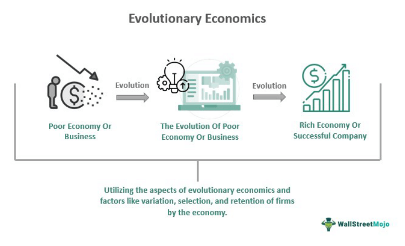

The interplay between economic history, evolutionary economics, and algorithmic trading presents a compelling study of how historical precedents and theoretical frameworks inform modern financial markets. Historical economic milestones have long influenced the development of contemporary theories and trading practices. Examining these events, such as the Industrial Revolution or the Great Depression, reveals their enduring impact on today's economic thought and policy-making. These historical narratives have paved the way for the emergence of evolutionary economics, which seeks to explain the adaptive nature of economic systems. By viewing the economy as a dynamic and ever-evolving entity, evolutionary economics incorporates biological metaphors and concepts, emphasizing innovation, competition, and institutional change.

In conjunction with these transformative economic theories and histories, algorithmic trading represents a significant evolution in financial markets. Enabled by technological progress, algorithmic trading utilizes complex algorithms to execute trades at unprecedented speeds and volumes, profoundly affecting market dynamics. This modern financial phenomenon is both a product of and a contributor to the ongoing evolution of markets, presenting both opportunities and challenges. Algorithmic trading impacts liquidity and volatility and necessitates regulatory oversight to ensure market stability.



Through this convergence of economic history, evolutionary economics, and algorithmic trading, we gain valuable insights into the mechanisms of market behavior and the potential for future economic evolution. The intersection of these areas highlights the importance of interdisciplinary approaches in understanding the complexities of economics and finance. This introduction sets the stage for a deeper exploration of how these interconnected themes continue to shape the global economic landscape.

## Table of Contents

## Economic Examples from History

The evolution of economic thought has been heavily influenced by pivotal historical events. Among these, the Industrial Revolution stands out for its profound impact on shaping capitalist economies. Beginning in the late 18th century, the Industrial Revolution marked a significant shift from agrarian economies to industrialized and urbanized societies. It facilitated the widespread mechanization of production processes, leading to exponential increases in productivity and the accumulation of capital. This era also saw the development of factories, which centralized labor and transformed the labor market. The changes brought about during this period set the foundation for modern capitalism, highlighting the importance of technological innovation, division of labor, and capital accumulation.

The Great Depression of the 1930s further shaped economic thought and policy. Triggered by the stock market crash of 1929, this period of severe global economic downturn led to widespread unemployment, deflation, and significant declines in industrial output. The economic disarray prompted a re-evaluation of classical economic theories, giving rise to Keynesian economics. John Maynard Keynes advocated for active government intervention to stabilize economic fluctuations, influencing economic policies worldwide. The New Deal programs in the United States exemplify this shift, emphasizing fiscal stimulus and social safety nets. The lessons learned during the Great Depression continue to resonate, informing contemporary economic policy responses to recessions and financial crises.

Milestones such as the Bretton Woods Conference in 1944 were crucial in establishing a new international economic order post-World War II. The conference led to the creation of the International Monetary Fund (IMF) and the World Bank, institutions designed to ensure global monetary stability and facilitate economic development. The establishment of the World Trade Organization (WTO) in 1995 marked another significant milestone, promoting international trade by reducing tariffs and establishing rules for trade policies. These institutions and agreements have been pivotal in promoting economic globalization, encouraging free trade, and fostering international economic cooperation.

These historical events continue to influence modern economic perspectives, as they provide critical insights into the development and application of economic theories. The Industrial Revolution underscores the transformative power of technological advancement, the Great Depression illustrates the necessity of macroeconomic management, and the creation of international economic bodies highlights the importance of global economic governance. By understanding these historical contexts, economists and policymakers can better navigate present and future economic challenges, drawing from past experiences to inform strategies that foster economic stability and growth.

## The Basics of Evolutionary Economics

Evolutionary economics is a framework within economics that emphasizes the process of economic change and adaptation. It challenges the traditional notion of equilibrium-based economic models by focusing on how real economies evolve over time through innovation, competition, and institutional transformations. Unlike classical economics, which often considers [agents](/wiki/agents) as rational and markets as static, evolutionary economics views the economy as an adaptive and dynamic system, continually influenced by technological advancements and changes in societal structures.

The economy, according to evolutionary economics, resembles a biological system characterized by various interacting agents that adapt and evolve in response to changing environments. This perspective aligns with how biological systems function, where entities must innovate and adapt to survive and thrive. The incorporation of biological metaphors into economic theory allows for a more nuanced understanding of economic dynamics. Concepts such as "natural selection" and "survival of the fittest" have been applied metaphorically to explain how certain business practices persist over time while others become obsolete.

Core to evolutionary economics is the idea that innovation is the primary driver of economic progress. Innovation leads to new technologies, products, and processes, facilitating economic growth and competitive advantage. Joseph Schumpeter, a key figure in evolutionary economics, introduced the concept of "creative destruction," where old industries and technologies are incessantly destroyed and replaced by new ones. This cyclical process is fundamental to economic evolution, as it underscores how markets adapt and transform over time.

Competition is another crucial element in evolutionary economics. It acts as a catalyst for innovation while simultaneously encouraging efficiency and diversity. Firms that adapt and innovate are more likely to succeed in competitive markets, while those that fail to do so are eventually phased out. This competitive pressure fosters an environment in which continuous improvement and adaptation are necessary for economic survival.

Institutional change also plays a significant role in evolutionary economics. Institutions, defined as the norms, rules, and behaviors that structure economic activity, evolve alongside technological and market changes. Thorstein Veblen, another foundational thinker in this field, emphasized the significance of social and cultural factors in shaping economic behavior. Veblen posited that economic actions are often driven by social norms and evolutionary instincts, which in turn influence the institutions governing economic transactions.

In summary, evolutionary economics provides a comprehensive approach to understanding how economies develop and adapt over time. Through the lenses of innovation, competition, and institutional change, this framework offers insights into the dynamic and complex nature of economic systems. It underscores the importance of adaptability and evolution in ensuring economic vitality, reflecting the interconnectedness of economic agents, technological advancements, and societal norms.

## Algorithmic Trading: A Modern Financial Evolution

Algorithmic trading, a cornerstone of the modern financial system, utilizes computer algorithms to automate trading strategies, enabling trades to be executed at unparalleled speeds and high volumes. This transformation in trading methodologies has been significantly driven by technological advancements and has profoundly impacted the structure and dynamics of financial markets.

Technological advancements, particularly in computing power and data processing capabilities, have been crucial in the rise of [algorithmic trading](/wiki/algorithmic-trading). High-frequency trading ([HFT](/wiki/high-frequency-trading-strategies)), a subset of algorithmic trading, leverages ultra-fast data transmission and sophisticated algorithms to buy and sell securities in fractions of a second, capitalizing on minute price discrepancies.

The core mechanics of algorithmic trading involve the use of complex algorithms to optimize trade execution and timing. Algorithms analyze vast datasets to identify trading opportunities based on predetermined criteria such as price, timing, and [volume](/wiki/volume-trading-strategy). A typical algorithm may look like a simple moving average crossover strategy:

```python
# Example of a simple moving average crossover strategy in Python

def moving_average(prices, window_size):
    return sum(prices[-window_size:]) / window_size

def trading_strategy(price_data, short_window, long_window):
    short_avg = moving_average(price_data, short_window)
    long_avg = moving_average(price_data, long_window)

    if short_avg > long_avg:
        return "Buy"
    elif short_avg < long_avg:
        return "Sell"
    return "Hold"
```

The benefits of algorithmic trading are evident in enhanced market [liquidity](/wiki/liquidity-risk-premium) and reduced transaction costs, as algorithms can execute trades more efficiently than human traders. Moreover, it minimizes human errors and allows for the [backtesting](/wiki/backtesting) of trading strategies on historical data before deploying them in live markets.

However, algorithmic trading also poses significant challenges. It can lead to increased market [volatility](/wiki/volatility-trading-strategies), often attributed to HFT, as rapid trades may exacerbate price swings. Algorithms might produce unintended effects due to programming errors, leading to significant financial losses within short timeframes, as seen in notable flash crashes.

Regulatory considerations play a crucial role in mitigating the risks associated with algorithmic trading. Financial regulators worldwide continue to evolve rules to address issues like market manipulation, systemic risks, and ensure transparency and fair market access. Concerns about fairness, as algorithmic trading predominantly benefits those with access to high-speed technology and market data, also necessitate ongoing scrutiny.

The impact of algorithmic trading on traditional trading practices is considerable. While it offers new avenues for strategy execution and risk management, it has also altered traditional broker relationships, requiring them to adapt to the evolving demands of algorithm-driven environments. Overall, algorithmic trading represents both an evolution and a revolution within financial markets, necessitating continued balance between innovation and regulation to safeguard market integrity.

## Interconnections and Implications

Economic history plays a crucial role in shaping evolutionary economic theory. Historical economic events provide empirical evidence and contextual frameworks that help formulate and test evolutionary models. These models emphasize dynamic processes, adaptation, and innovation, illustrating how economies evolve over time. For example, the Industrial Revolution introduced significant technological and institutional changes, which are central themes in evolutionary economics. Understanding these historical contexts allows economists to identify patterns of economic development, adaptation mechanisms, and innovation cycles.

Evolutionary economics, with its focus on change and adaptation, offers valuable insights into market dynamics. By viewing the economy as an evolving ecosystem, it sheds light on how firms innovate, compete, and respond to changing environments. This perspective helps in predicting market behavior by analyzing the adaptive strategies of market participants. For instance, firms that successfully innovate and adapt to technological changes can gain competitive advantages, influencing market structures and outcomes. Evolutionary economics thus provides a robust framework for understanding the forces driving market behavior and predicting potential shifts.

The confluence of historical and evolutionary perspectives also significantly impacts algorithmic trading strategies. These strategies often incorporate evolutionary algorithms that simulate natural selection processes to optimize trading decisions. By learning from past historical market data and adapting strategies based on current market conditions, these algorithms are designed to evolve and improve over time. This approach mirrors the principles of evolutionary economics, where adaptation and innovation play key roles. Consequently, algorithmic trading benefits from the historical insights of market behavior and the adaptive processes highlighted by evolutionary theories.

Algorithmic trading has the potential to drive evolutionary change in financial markets. As algorithms become more sophisticated, they can adapt to new information at a rapid pace, promoting efficiency and innovation in trading practices. This capacity for evolution can lead to more competitive and dynamic markets, as traditional trading strategies may become obsolete in favor of more adaptive techniques. Moreover, as more market participants adopt algorithmic trading, the collective adaptation of these strategies can lead to significant shifts in market dynamics and structures.

These interconnections hold broader implications for policymakers, investors, and economists. Policymakers must consider the rapid adaptive nature of algorithmic trading when designing regulations to ensure market stability and fairness. Investors need to understand the evolutionary strategies behind algorithmic trading to make informed decisions and manage risks effectively. Economists can benefit from integrating historical and evolutionary perspectives to analyze and interpret market developments accurately. Understanding these complex interactions can lead to more informed decision-making and policy formulations that align with the evolving nature of financial markets.

## Conclusion

The intersection of economic history, evolutionary economics, and algorithmic trading offers a profound understanding of modern financial systems. Historical economic events, such as the Industrial Revolution, the Great Depression, and the establishment of institutions like the World Trade Organization, continue to shape contemporary economic policies and perspectives. These events highlight the importance of understanding past economic phenomena to interpret and navigate current markets effectively.

Evolutionary economics, with its emphasis on dynamism, adaptation, and innovation within economic systems, provides a compelling framework for analyzing market dynamics. By drawing on concepts similar to biological evolution, this field illuminates the importance of innovation, competition, and institutional change. Key figures like Thorstein Veblen and Joseph Schumpeter have significantly contributed to our understanding of these processes, offering insights into how economies grow and transform over time.

Algorithmic trading represents a significant evolution in financial markets, facilitating rapid, high-volume trades that were previously unimaginable. The role of technology in enabling such sophisticated trading mechanisms showcases the ongoing evolution within financial systems, driven by both historical precedence and innovative economic theories. The benefits of enhanced market efficiency and liquidity are counterbalanced by challenges such as increased volatility and regulatory concerns.

Interconnecting these domains underscores the value of interdisciplinary approaches in navigating the intricate landscape of global finance. Economic history provides crucial lessons and context, while evolutionary economics offers a framework to understand and predict market behaviors in the face of constant change. Algorithmic trading strategies, informed by these insights, further demonstrate the potential for continuous innovation and adaptation in financial markets.

Encouraging further research into these intersecting fields promises to expand our comprehension of economic evolution and innovation. As these domains evolve, the synergy between historical understanding and economic theory will remain indispensable. By embracing these interdisciplinary insights, policymakers, investors, and economists can better anticipate and respond to the ever-evolving economic landscape, ensuring a more robust and adaptive financial future.

## References & Further Reading

[1]: Schumpeter, J. A. (1942). "Capitalism, Socialism, and Democracy." Harper & Brothers.

[2]: Veblen, T. (1899). "The Theory of the Leisure Class: An Economic Study of Institutions." Macmillan.

[3]: Lopez de Prado, M. (2018). "Advances in Financial Machine Learning." Wiley.

[4]: Jansen, S. (2020). "Machine Learning for Algorithmic Trading." Packt Publishing.

[5]: Chan, E. P. (2009). "Quantitative Trading: How to Build Your Own Algorithmic Trading Business." Wiley. 

[6]: Keynes, J. M. (1936). "The General Theory of Employment, Interest and Money." Macmillan.

[7]: Aronson, D. R. (2006). "Evidence-Based Technical Analysis: Applying the Scientific Method and Statistical Inference to Trading Signals." Wiley.

[8]: Friedman, M. (1977). "Nobel Lecture: Inflation and Unemployment." Journal of Political Economy, 85(3), 451-472.

[9]: Harford, T. (2011). "Adapt: Why Success Always Starts with Failure." Farrar, Straus and Giroux. 

[10]: Origuy, Ivan & Elie Bouri, & David Roubaud. (2023). ["Algorithmic trading impacts on market efficiency: New frontiers."](https://www.researchgate.net/profile/Elie-Bouri) International Review of Financial Analysis.