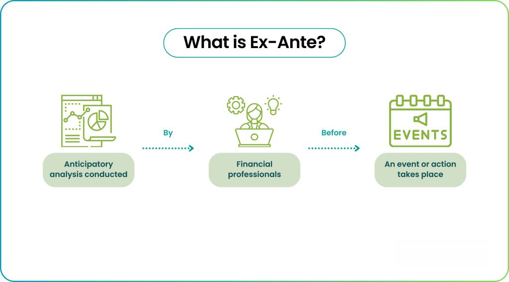

Understanding the rapidly evolving landscape of financial markets is crucial for both investors and financial analysts. Financial markets are dynamic ecosystems where prices continuously change based on myriad factors, including economic data, investor sentiment, and geopolitical events. As markets have become more complex and global, the ability to anticipate future trends and price movements has grown increasingly valuable. This is where ex-ante forecasting offers substantial promise.

Incorporating ex-ante forecasting into financial analysis and algorithmic trading provides significant advantages. Ex-ante forecasting refers to predicting future events or conditions, aiding investors and analysts in making informed decisions before market movements occur. It contrasts with ex-post analysis, which focusses on the evaluation of past performance. In the context of trading, having a forward-looking strategy can allow market participants to gain a competitive edge by preemptively positioning themselves before others recognize shifts in the market.



This article examines the integration of ex-ante forecasting into financial analysis and algorithmic trading, considering the methodologies and potential challenges involved in applying these techniques. Algorithmic trading has emerged as a primary method for executing trades in modern markets, leveraged for its ability to process large amounts of data swiftly and without the biases inherent in human decision-making. By incorporating ex-ante forecasting, algorithmic models can predict market trends with greater accuracy and adjust strategies proactively, mitigating risks and optimizing returns.

We will explore various benefits of this integration, examining how statistical models and machine learning can enhance ex-ante forecasts. Traditional financial analysis approaches, including both fundamental and technical analysis, also play a critical role, and their combination with ex-ante forecasting techniques can yield more robust algorithmic trading strategies. Additionally, the potential challenges of data quality, regulatory constraints, and the balance between model complexity and interpretability will be discussed.

The goal is to provide readers with a comprehensive overview and insight into the future of algo trading strategies. As technology advances, the landscape of financial trading continues to transform, introducing new possibilities for traders and analysts. By understanding and integrating these concepts, market participants can not only anticipate changes in financial markets but also strategically adapt to them, ensuring success in an increasingly competitive arena.

## Table of Contents

## What is Ex-Ante Forecasting?

Ex-ante forecasting is the practice of predicting future market movements using current data and methodologies designed to anticipate changes before they occur. This approach is in contrast to ex-post analysis, which focuses on examining historical data to understand past market behaviors. The primary goal of ex-ante forecasting is to provide insights that inform trading decisions and contribute to the development of effective algorithmic trading strategies, allowing traders to proactively adjust their strategies based on expected market conditions.

Several techniques form the foundation of ex-ante forecasting, ranging from traditional statistical models to advanced [machine learning](/wiki/machine-learning) algorithms. Statistical models often rely on time series analysis, utilizing methodologies like Autoregressive Integrated Moving Average (ARIMA) or Generalized Autoregressive Conditional Heteroskedasticity (GARCH) to identify patterns and predict future price movements. Machine learning algorithms, such as decision trees, random forests, and neural networks, offer more sophisticated means of capturing complex non-linear relationships and contextual factors influencing market trends.

One of the critical advancements in ex-ante forecasting is the integration of sentiment analysis. This technique involves analyzing textual data from news articles, social media, and financial reports to gauge market sentiment. By quantifying investor sentiment, traders can incorporate psychological and behavioral factors into their forecasts, potentially enhancing predictive accuracy. Sentiment analysis tools, leveraging natural language processing (NLP), can be implemented in Python using libraries like `nltk` and `textblob`, which assist in capturing nuanced market views.

Moreover, macroeconomic indicators such as Gross Domestic Product (GDP), employment rates, and interest rates are vital in shaping market predictions. By understanding the broader economic environment, ex-ante models can adjust forecasts to account for economic cycles and geopolitical events that may affect market dynamics. Combining these indicators with traditional and modern forecasting techniques provides a comprehensive approach to anticipating market shifts.

In conclusion, ex-ante forecasting is a forward-looking analytical process essential for informed trading decisions. By employing a mix of statistical models, machine learning techniques, sentiment analysis, and macroeconomic indicators, traders can enhance the precision and reliability of their forecasts. This strategic foresight is crucial in developing adaptive [algorithmic trading](/wiki/algorithmic-trading) strategies capable of responding to evolving market conditions.

## The Role of Financial Analysis in Algo Trading

Financial analysis is crucial in developing successful algorithmic trading models. It provides the foundational elements needed to understand and interpret market behaviors, enabling the creation of algorithms that can effectively navigate and capitalize on market opportunities.

Integrating financial ratios, economic indicators, and company data into these models enhances their reliability. Financial ratios, such as the price-to-earnings (P/E) ratio and return on equity (ROE), offer insights into a company's financial health and valuation. Economic indicators, including GDP growth rates and unemployment figures, help gauge the broader economic conditions influencing market trends. By incorporating these data types, algorithms can make more informed predictions about asset prices and market movements.

Quantitative techniques and data mining play vital roles in identifying trading opportunities and recognizing market trends. These include methods like linear regression, time-series analysis, and clustering algorithms, which help uncover patterns in historical data. Machine learning algorithms, such as decision trees and neural networks, are particularly effective at identifying complex relationships within large datasets, giving traders a competitive advantage.

Both fundamental and technical analysis are key components in developing trading algorithms. Fundamental analysis focuses on evaluating an asset's intrinsic value by examining related economic, financial, and qualitative and quantitative factors. Technical analysis, on the other hand, analyzes statistical trends derived from trading activity, such as price movement and [volume](/wiki/volume-trading-strategy). The integration of these methodologies allows for a comprehensive analysis, improving the accuracy and effectiveness of trading strategies.

Backtesting and validation are essential in ensuring the reliability and effectiveness of financial analysis within algorithmic trading. Backtesting involves testing a trading strategy on historical data to evaluate its performance and viability. This process helps identify potential flaws and allows adjustments to be made prior to implementing the strategy in live markets. Validation ensures that the models perform as expected in various market conditions and remain robust over time.

In summary, the role of financial analysis in algorithmic trading is multifaceted, incorporating diverse data sources and techniques to develop models that are both accurate and adaptable. By leveraging the strengths of financial analysis, traders can enhance their algorithmic strategies, increasing their chances of success in the financial markets.

## Benefits of Combining Ex-Ante Forecasting with Algo Trading

Merging ex-ante forecasting with algorithmic trading presents a compelling strategy for gaining a competitive edge in financial markets. By predicting future market movements based on current data, ex-ante forecasting enables traders to make informed decisions, thereby anticipating market shifts and mitigating risks effectively. This approach is in sharp contrast to relying solely on ex-post analysis, which only evaluates past data and events. 

Algorithmic models that integrate ex-ante forecasts possess the capability to adapt swiftly to ever-changing market conditions. This adaptability is crucial, as financial markets are characterized by [volatility](/wiki/volatility-trading-strategies) and rapid shifts influenced by a myriad of factors, including economic indicators, geopolitical developments, and investor sentiment. By leveraging ex-ante forecasting, these models are not only reactive but also proactive, positioning trades ahead of anticipated market trends, potentially leading to significant returns.

Several real-world examples and case studies highlight the efficacy of combining ex-ante forecasting with algorithmic trading. For instance, hedge funds and institutional investors have successfully utilized machine learning algorithms that incorporate ex-ante data to automate trading strategies, optimizing their portfolios and achieving superior returns compared to traditional methods. A study might showcase how an algorithm integrating GDP growth predictions and [interest rate](/wiki/interest-rate-trading-strategies) forecasts outperformed a baseline model relying solely on historical price movements.

Additionally, the fusion of ex-ante forecasting with algorithmic trading enhances the potential for automation and scalability in trading operations. Automated systems can process vast amounts of data in real-time, executing trades with precision and speed beyond human capability. This scalability permits the handling of large volumes of trades across diverse markets, reducing operational costs and enhancing overall efficiency.

As traders and analysts increasingly adopt this combined approach, they benefit not only from improved risk management and enhanced return prospects but also from the operational advantages inherent in automation and scalability. The integration of ex-ante forecasting into algorithmic strategies, thus, represents a forward-thinking approach to financial market participation, aligning with the dynamic nature of global markets.

## Challenges and Considerations

Incorporating ex-ante forecasting into algorithmic trading strategies provides traders with a significant edge, yet it also introduces several challenges that must be addressed to achieve effective and robust trading performance. Key challenges include data quality, model complexity, computational requirements, interpretability, regulatory constraints, and market dynamics.

Data quality is paramount, as unreliable data can lead to inaccurate forecasts and flawed algorithmic decisions. Anomalies, missing values, and data lags are common issues. Ensuring high-quality data involves rigorous cleaning, validation, and imputation techniques. For instance, machine learning models like k-Nearest Neighbors (k-NN) and iterative imputation methods can address missing data. Furthermore, data sources should be vetted for reliability and timeliness.

Model complexity and computational requirements also pose significant hurdles. Advanced models such as deep neural networks and ensemble methods can provide superior forecasting accuracy but demand substantial computational resources. This can result in latency issues, particularly in high-frequency trading environments. To address these challenges, optimizing algorithms through techniques like dimensionality reduction and parallel processing can enhance performance. For example, implementing the Principal Component Analysis (PCA) can reduce feature space, thereby decreasing computational load.

```python
from sklearn.decomposition import PCA
import numpy as np

# Example: Applying PCA for dimensionality reduction
X = np.random.rand(100, 20)  # Random data with 20 features
pca = PCA(n_components=10)   # Reduce to 10 principal components
X_reduced = pca.fit_transform(X)
```

Interpreting complex models is crucial for gaining trust from stakeholders and navigating regulatory landscapes. While sophisticated models like [deep learning](/wiki/deep-learning) are powerful, their black-box nature can make them difficult to interpret. Techniques such as LIME (Local Interpretable Model-Agnostic Explanations) and SHAP (SHapley Additive exPlanations) can elucidate model predictions, offering a balance between interpretability and performance.

Regulatory considerations and market dynamics further complicate the implementation of ex-ante forecasting in algo trading. Regulations such as the MiFID II in Europe or the SEC’s guidelines in the United States require transparency and accountability in trading strategies. Adhering to these regulations necessitates a thorough understanding of compliance requirements and the ability to audit and explain algorithmic decisions.

Market dynamics, characterized by sudden shifts and non-linear behavior, require adaptive models capable of updating forecasts in real-time. Strategies to overcome these challenges include the use of adaptive algorithms and continuous model training. Utilizing online learning algorithms, which update their models incrementally as new data comes in, can help maintain performance in volatile markets.

In conclusion, while ex-ante forecasting can significantly enhance algorithmic trading strategies, addressing these challenges is crucial for realizing its full potential. By ensuring data integrity, managing model complexity, and complying with regulatory standards, traders can successfully integrate these techniques into their trading operations.

## Future Trends in Financial Analysis and Algo Trading

Technology advancements continue to fuel significant innovations in financial analysis and algorithmic trading, with [artificial intelligence](/wiki/ai-artificial-intelligence) (AI) and machine learning at the forefront of these developments. These technologies allow for more sophisticated ex-ante forecasting, whereby traders can predict future market trends with greater accuracy. Machine learning algorithms, particularly those employing deep learning techniques, improve the ability to recognize patterns and make predictions from vast datasets. For instance, support vector machines (SVM) and random forests are among the models often used for predictive analysis in trading systems.

The integration of [alternative data](/wiki/best-alternative-data) sources is another major trend shaping the future of financial trading. Insights derived from social media, sentiment analysis, and satellite data offer a more comprehensive view of market dynamics, providing unique opportunities to capture alpha. Sentiment analysis tools scan social media platforms to gauge public mood and opinion, which can serve as early indicators of market movements. Satellite data can be used to assess retail activity, agricultural output, or transportation flows, granting traders access to non-traditional information streams that enhance market predictions.

Ethical considerations in algorithmic decision-making processes are gaining prominence as these technologies become more pervasive. Concerns around bias in AI models, data privacy, and the transparency of algorithmic decisions pose significant challenges. To address these issues, financial institutions are increasingly focusing on developing ethical frameworks that guide the deployment and governance of AI in trading. This includes ensuring fairness in algorithmic outcomes, maintaining accountability, and implementing robust data protection measures.

The convergence of these trends suggests a transformative shift in the landscape of financial trading. As computational power accelerates and data availability expands, the boundaries of algorithmic trading will likely broaden, facilitating the execution of more complex and efficient trading strategies. Moreover, the adoption of cloud computing and blockchain technology may offer further enhancements in terms of speed, security, and transparency in trading processes.

Looking ahead, it is expected that emerging tools and methodologies will lead to more adaptive and resilient trading systems. Financial institutions that successfully integrate AI-driven ex-ante forecasting and diverse data analytics into their operations will likely gain a competitive edge. However, navigating the ethical and regulatory challenges associated with these technologies will be crucial to sustainable adoption. As the field evolves, staying informed and adaptable will be key for traders and analysts in harnessing the potential of these innovations.

## Conclusion

Ex-ante forecasting has proven to be a transformative addition to financial analysis, significantly enhancing algorithmic trading strategies. By allowing traders and analysts to anticipate market movements based on robust predictive models, it offers a strategic advantage in navigating the complexities of modern financial markets. This proactive approach not only aids in risk mitigation but also enhances the adaptability of trading algorithms to swiftly evolving market conditions. 

The integration of ex-ante forecasting into algorithmic trading strategies, while presenting certain challenges, opens the door to promising opportunities fueled by technological advancements. The continuing evolution of data analytics techniques and technologies, including machine learning and artificial intelligence, suggests a bright future for those who can effectively harness these innovations. By leveraging cutting-edge forecasting methods along with traditional financial analysis, traders can achieve unparalleled market insights and decision-making precision.

Furthermore, staying informed about these technological and analytical advancements is critical. As the financial landscape becomes increasingly data-driven, the ability to adapt and leverage new tools will distinguish successful traders and analysts. This conclusion underscores the importance of continuous learning and adaptation in a rapidly changing environment. 

This article aims to be a resource for understanding the benefits and challenges of integrating ex-ante forecasting with algorithmic trading, offering a foundation for further exploration and application of these synergistic domains. The ability to foresee market trends before they unfold provides an invaluable edge, emphasizing the necessity of innovative thinking and application in financial markets.

## References & Further Reading

[1]: Bergstra, J., Bardenet, R., Bengio, Y., & Kégl, B. (2011). ["Algorithms for Hyper-Parameter Optimization."](https://papers.nips.cc/paper/4443-algorithms-for-hyper-parameter-optimization) Advances in Neural Information Processing Systems 24.

[2]: ["Advances in Financial Machine Learning"](https://www.amazon.com/Advances-Financial-Machine-Learning-Marcos/dp/1119482089) by Marcos Lopez de Prado

[3]: ["Evidence-Based Technical Analysis: Applying the Scientific Method and Statistical Inference to Trading Signals"](https://www.amazon.com/Evidence-Based-Technical-Analysis-Scientific-Statistical/dp/0470008741) by David Aronson

[4]: ["Machine Learning for Algorithmic Trading"](https://github.com/stefan-jansen/machine-learning-for-trading) by Stefan Jansen

[5]: ["Quantitative Trading: How to Build Your Own Algorithmic Trading Business"](https://www.amazon.com/Quantitative-Trading-Build-Algorithmic-Business/dp/1119800064) by Ernest P. Chan