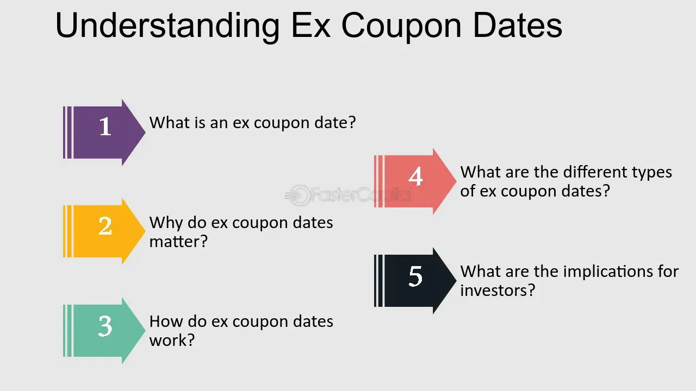

## Table of Contents

## What does 'Ex-Coupon' mean in the context of finance?

In finance, 'Ex-Coupon' refers to a period when a bond is traded without the right to receive the next interest payment. When you buy a bond, you usually expect to get regular interest payments, called coupons. But if you buy a bond during its ex-coupon period, you won't get the next coupon payment. Instead, the seller keeps that payment.

The ex-coupon date is important because it marks the cutoff for who gets the next coupon. If you own the bond before the ex-coupon date, you'll get the next interest payment. But if you buy it on or after this date, the payment goes to the previous owner. This system helps keep things fair and clear for both buyers and sellers in the bond market.

## How does the ex-coupon date affect bond pricing?

The ex-coupon date can change how much a bond costs. When a bond is sold before the ex-coupon date, the buyer will get the next interest payment. This makes the bond a bit more valuable because the buyer gets the full benefit of the next coupon. So, the price of the bond might be higher to reflect this.

But if the bond is sold on or after the ex-coupon date, the buyer won't get the next interest payment. The seller keeps it. This makes the bond less valuable to the buyer at that moment because they have to wait longer for the next payment. As a result, the bond's price might be lower around the ex-coupon date to account for the missing coupon payment.

## What is the significance of the ex-coupon date for bondholders?

The ex-coupon date is important for bondholders because it tells them if they will get the next interest payment. If a bondholder owns the bond before the ex-coupon date, they will receive the next coupon payment. This is good for them because they get the money they were expecting. But if they sell the bond before the ex-coupon date, they keep the right to the next payment, which can make the bond more valuable to them.

On the other hand, if a bondholder buys a bond on or after the ex-coupon date, they will not get the next interest payment. This means they have to wait longer to get any money from the bond, which can make the bond less valuable at that time. Knowing the ex-coupon date helps bondholders plan when to buy or sell their bonds to get the best deal.

## Can you explain the difference between the record date and the ex-coupon date?

The record date and the ex-coupon date are two important dates for bondholders, but they serve different purposes. The record date is the date set by the bond issuer to determine which bondholders are eligible to receive the next interest payment. If you own the bond on the record date, you will get the next coupon payment. It's like a snapshot that the issuer takes to see who should get paid.

The ex-coupon date, on the other hand, is the first day a bond trades without the right to the next interest payment. If you buy a bond on or after the ex-coupon date, you won't get the next coupon payment because it goes to the person who owned the bond before that date. The ex-coupon date is usually set a few days before the record date to give time for the trade to settle. So, the ex-coupon date helps make sure that the right person gets the coupon payment based on who owned the bond on the record date.

## How do investors determine the ex-coupon date for a bond?

Investors can find out the ex-coupon date for a bond by looking at the bond's prospectus or the information given by the bond issuer. The prospectus is like a guidebook for the bond that tells you all the important dates and rules. Sometimes, financial websites and bond trading platforms also show the ex-coupon date. It's important for investors to check these sources carefully so they know when the bond will trade without the next interest payment.

The ex-coupon date is usually set a few days before the record date. The record date is when the bond issuer checks who owns the bond to see who gets the next interest payment. By setting the ex-coupon date a bit earlier, it gives time for the trade to settle, making sure the right person gets the payment. Knowing the ex-coupon date helps investors plan their buying and selling to make the most of their investments.

## What happens if a bond is purchased on its ex-coupon date?

If you buy a bond on its ex-coupon date, you won't get the next interest payment. The person who owned the bond before the ex-coupon date will keep that payment. This means you have to wait until the next payment date to get any money from the bond.

The ex-coupon date is set a few days before the record date. The record date is when the bond issuer checks who owns the bond to decide who gets the next interest payment. By setting the ex-coupon date earlier, it gives time for the trade to settle, making sure the right person gets the payment. So, buying a bond on its ex-coupon date means you miss out on the next coupon, but you know exactly what to expect.

## How does the ex-coupon period influence investment strategies?

The ex-coupon period is an important time for investors because it affects when they get their money from a bond. If an investor wants to get the next interest payment, they need to buy the bond before the ex-coupon date. This can be a good strategy if they need the money soon. But if they buy the bond on or after the ex-coupon date, they won't get that next payment. They'll have to wait longer for their money, which might not be good if they need it right away.

Knowing about the ex-coupon period can help investors make smart choices about when to buy or sell bonds. For example, if an investor thinks the bond's price will go down right after the ex-coupon date, they might sell it just before that date to get a better price and keep the next interest payment. On the other hand, if they think the bond's price will go up after the ex-coupon period, they might wait to buy it until after that date, even though they'll miss the next payment. This way, they can plan their investments to match their goals and needs.

## What are the tax implications of buying a bond before versus after the ex-coupon date?

When you buy a bond before the ex-coupon date, you will get the next interest payment. This means you have to pay taxes on that interest. The interest you get from bonds is usually taxed as regular income. So, if you buy the bond before the ex-coupon date, you need to think about how that extra money will affect your taxes.

If you buy a bond on or after the ex-coupon date, you won't get the next interest payment. This means you won't have to pay taxes on that interest because you didn't get it. But you still need to think about the taxes on any interest you get in the future. Knowing when the ex-coupon date is can help you plan your taxes better, depending on when you want to get the interest and pay the taxes on it.

## How do market conventions for ex-coupon dates vary across different countries?

Market conventions for ex-coupon dates can be different in different countries. In the United States, the ex-coupon date is usually two business days before the record date. This gives time for the trade to settle so the right person gets the interest payment. But in the United Kingdom, the ex-coupon date is set one business day before the record date. These differences can affect when investors buy and sell bonds because they need to know when they will get the next interest payment.

In some countries, like Australia, the ex-coupon date might be set differently depending on the type of bond. For example, government bonds might have different rules than corporate bonds. This can make it more complicated for investors who trade in different markets. Knowing the local rules is important because it helps investors plan their buying and selling to make the most of their investments and manage their taxes.

## What role does the ex-coupon date play in the calculation of yield to maturity?

The ex-coupon date can change how you figure out the yield to maturity (YTM) of a bond. YTM is like a guess of how much money you'll make each year from the bond until it's paid back. When you buy a bond before the ex-coupon date, you get the next interest payment. This means you can add that payment to your total earnings when you calculate the YTM. So, buying before the ex-coupon date can make the YTM look a bit better because you get that extra interest sooner.

If you buy a bond on or after the ex-coupon date, you won't get the next interest payment. This means you have to wait longer for your first payment, which can make the YTM look a bit worse. Knowing when the ex-coupon date is helps you figure out the right YTM. It's like planning when to start counting your money to see how good the bond really is for your investment.

## How can understanding ex-coupon dates help in optimizing a bond portfolio?

Knowing about ex-coupon dates can help you make better choices with your bond portfolio. If you want to get the next interest payment, you need to buy the bond before the ex-coupon date. This can be good if you need the money soon. But if you buy the bond on or after the ex-coupon date, you won't get that next payment. You'll have to wait longer for your money, which might not be good if you need it right away. By understanding when the ex-coupon date is, you can plan when to buy or sell bonds to match your money needs.

Understanding ex-coupon dates can also help you make your bond portfolio more profitable. If you think the bond's price will go down right after the ex-coupon date, you might sell it just before that date to get a better price and keep the next interest payment. On the other hand, if you think the bond's price will go up after the ex-coupon period, you might wait to buy it until after that date, even though you'll miss the next payment. This way, you can plan your investments to make the most money and manage your taxes better.

## What are the advanced trading strategies that leverage the timing of ex-coupon dates?

One advanced trading strategy that uses the timing of ex-coupon dates is called "coupon stripping." This means buying a bond just before the ex-coupon date and then selling it right after. The idea is to get the next interest payment and then sell the bond at a slightly lower price, but still make a profit from the coupon. It's like getting the best of both worlds - the interest payment and a quick sale. But it needs careful timing because if you miss the ex-coupon date, you won't get the interest, and your plan won't work.

Another strategy is "riding the yield curve." This means buying bonds that are about to go ex-coupon and then holding them until the price goes up after the ex-coupon date. After the ex-coupon date, the bond's price might rise because it's closer to its next payment. By selling the bond at a higher price later, you can make a profit. This strategy needs you to understand how bond prices change over time and how the ex-coupon date affects them. It's all about timing and knowing when to buy and sell to get the most money.

## What is Understanding Ex-Coupon?

Ex-coupon refers to a specific condition in bond trading where a bond is sold without the entitlement to the next scheduled interest payment or coupon. The absence of this right typically results in the bond being sold at a lower price to account for the missed interest payment. This adjustment aims to compensate the buyer, who will not receive the next coupon payment, thereby aligning the bond's market value with its actual financial benefit to the new holder.

The concept of ex-coupon in bond markets is analogous to the practice of stocks trading ex-dividend. In both scenarios, the purchaser forgoes the next scheduled payment, whether it be interest in the case of bonds or dividends in the case of stocks. The ex-coupon period begins shortly before the coupon payment date and continues until the payment is made. Understanding this period is crucial for traders, as it influences the bond's pricing dynamics.

Ex-coupon trades, while less prevalent in the United States, are a standard practice in European markets. In Europe, bonds often trade ex-coupon automatically as part of the settlement process, whereas in the U.S., the bond's price typically incorporates the accrued interest right up until the coupon payment is due. This difference highlights the importance of market-specific knowledge when engaging in international bond trading.

Accrued interest is a key term related to ex-coupon trading. It represents the interest earned on a bond since the last coupon payment, up until the point of sale. In the context of an ex-coupon trade, the bond's price will reflect the accrued interest up to the ex-coupon date but exclude any interest that would accrue beyond that point. Accurately calculating and understanding accrued interest is essential to evaluating the bond's worth and making informed trading decisions.

For example, consider a bond with a face value of $1,000 and an annual coupon rate of 5%, paying semi-annual interest. If the bond is purchased ex-coupon one month after the last coupon payment, the accrued interest for the purchaser would be calculated as follows:

$$
\text{Accrued Interest} = \frac{\text{Coupon Rate}}{\text{Number of Payments Per Year}} \times \text{Face Value} \times \frac{\text{Days Since Last Coupon}}{\text{Days in Coupon Period}}
$$

In Python, this calculation can be expressed to automate the accrued interest calculation and help assess the appropriate discount in the bond price:

```python
def accrued_interest(coupon_rate, face_value, days_since_last_coupon, days_in_coupon_period):
    payment_per_period = coupon_rate / 2  # Semi-annual payments
    return payment_per_period * face_value * (days_since_last_coupon / days_in_coupon_period)

coupon_rate = 0.05
face_value = 1000
days_since_last_coupon = 30
days_in_coupon_period = 180  # Approximation for half-year

accrued_interest_amount = accrued_interest(coupon_rate, face_value, days_since_last_coupon, days_in_coupon_period)
print(f"Accrued Interest: ${accrued_interest_amount:.2f}")
```

Mastering the details of ex-coupon trading and accrued interest calculations empowers traders to navigate bond markets effectively, optimizing their investment strategies and aligning their actions with anticipated market movements and financial goals.

## What is the Role of Yield and Price in Bond Trading around Ex-Coupon Dates?

Yield and price share an inverse relationship in bond trading, a fundamental concept crucial for understanding market dynamics during ex-coupon periods. When a bond's price decreases, its yield increases, and vice versa. This principle becomes particularly significant around ex-coupon dates, as the bond price typically adjusts to reflect the absence of the forthcoming interest payment.

### Yield-to-Maturity Considerations

The yield-to-maturity (YTM) is an essential metric for investors assessing the expected return when holding a bond until its maturity date. YTM takes into account not only the bond's coupon payments but also the capital gain or loss an investor will realize upon maturity. Calculating YTM requires solving for the discount rate that equates the present value of a bond's future cash flows to its current price. The formula for YTM can be expressed as:

$$
P = \sum_{t=1}^{n} \frac{C}{(1 + YTM)^t} + \frac{F}{(1 + YTM)^n}
$$

where $P$ is the current bond price, $C$ is the coupon payment, $F$ is the face value of the bond, $n$ is the total number of periods until maturity, and $YTM$ is the yield-to-maturity.

Investors use YTM to determine if bonds are being traded at a premium or discount, particularly around ex-coupon dates, which impacts their investment decisions.

### Capitalizing on Yield and Price Fluctuations

Traders can exploit the fluctuations in yield and price to capitalize on market opportunities around ex-coupon periods. Before an ex-coupon date, the anticipation of the upcoming coupon payment can maintain higher bond prices. However, as the bond transitions to its ex-coupon status, its price generally falls equal to the coupon amount, which can trigger strategic trading decisions.

Algorithmic trading tools enhance the ability of traders to track these price movements precisely, allowing them to optimize trade execution. For instance, traders can set algorithms to automatically buy bonds shortly after they go ex-coupon, capturing potential increases in yield due to the reduced purchase price.

The relationship between yield and price around ex-coupon dates requires continuous monitoring and adaptive strategies to optimize return on investments. By leveraging analytics and automated trading systems, investors can effectively navigate the shifting dynamics and pinpoint profitable opportunities within the bond market.

## What is the impact of interest rates on ex-coupon dates and bond prices?

Interest rates are a critical [factor](/wiki/factor-investing) influencing ex-coupon dates and bond prices. When interest rates rise, the market value of existing bonds tends to decrease, as newer issues come with higher yields, making older bonds less attractive. This depreciation in the bond's value can lead to adjustments in the timing of ex-coupon dates. Consequently, strategic investment realignments become essential to mitigate potential losses and optimize portfolio performance.

A significant implication of rising interest rates is the alteration in ex-coupon dates. If interest rates increase, investors might anticipate forward adjustments to ex-coupon dates to align with the higher yield expectations of new market conditions. Consequently, this requires investors to reassess their strategies, ensuring that their portfolios remain balanced and aligned with desired yield levels.

The relationship between interest rates and bond pricing can be illustrated using the formula for calculating the price of a bond:

$$
P = \sum_{t=1}^{n} \frac{C}{(1 + r)^t} + \frac{F}{(1 + r)^n}
$$

where:
- $P$ is the price of the bond,
- $C$ is the annual coupon payment,
- $r$ is the discount rate (or yield),
- $F$ is the face value of the bond, and
- $n$ is the number of periods until maturity.

As the discount rate $r$ increases, the present value of future cash flows $C$ and $F$ decreases, leading to a lower bond price $P$.

Investors must dynamically adjust their portfolios in response to [interest rate](/wiki/interest-rate-trading-strategies) fluctuations. This adjustment involves monitoring how changing rates impact expected yields and the timing of coupon payments. By doing so, they ensure that their investments meet specific objectives, whether focused on income generation or capital preservation.

Moreover, maintaining a diversified bond portfolio can help in managing the risks associated with interest rate changes. This diversification can include bonds with varying maturities, credit qualities, and coupon structures, which together can offer both stability and flexibility in an unpredictable interest rate environment. Effective management of ex-coupon schedules and interest rate exposure can not only safeguard against potential downturns but also position investors to capitalize on favorable market conditions.

## References & Further Reading

[1]: ["Bond Markets, Analysis, and Strategies"](https://mitpress.mit.edu/9780262046275/bond-markets-analysis-and-strategies/) by Frank J. Fabozzi

[2]: Vayanos, D., & Vila, J. L. (2009). ["A Preferred-Habitat Model of the Term Structure of Interest Rates."](https://www.nber.org/papers/w15487) Econometrica, 77(6), 1781-1803.

[3]: ["Fixed Income Securities: Tools for Today's Markets"](https://www.amazon.com/Fixed-Income-Securities-Markets-Finance/dp/1119835550) by Frank J. Fabozzi

[4]: Duffie, D. (2010). ["Dynamic Asset Pricing Theory."](https://www.semanticscholar.org/paper/Dynamic-Asset-Pricing-Theory-Duffie/baa776c75062e0506a8e739fda10dc409e340aad) Princeton University Press.

[5]: Haugen, R. A. (2001). ["Modern Investment Theory."](https://archive.org/details/moderninvestment00haug_0) Prentice Hall.