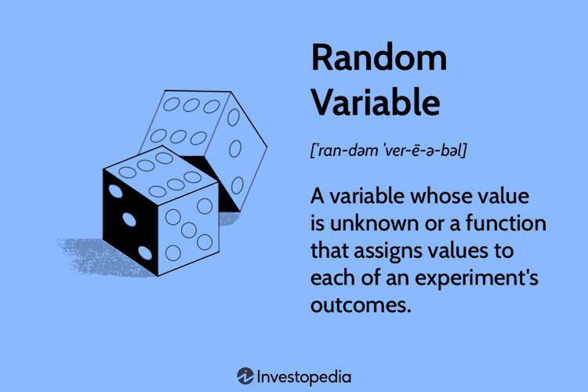

The financial landscape continually evolves, compelling investors to adopt innovative methods for optimizing strategies around key investment opportunities. Dividend distribution in finance is a pivotal event that significantly influences stock market dynamics. For many traders, dividends are not only a source of regular income but also an opportunity to enhance shareholder value, leading to informed investments in dividend-paying stocks.

Algorithmic trading has emerged as a transformative tool in the finance sector, enhancing precision and agility. By employing sophisticated algorithms, traders can effectively navigate dividend-related opportunities with increased accuracy and speed. The implementation of computational power has revolutionized trading strategies, enabling investors to exploit microsecond-level market movements and optimize their financial outcomes.



This article addresses the intricate interplay between ex-distribution finance, dividends, and algorithmic trading. By examining these elements in detail, investors can gain valuable insights into leveraging them for improved investment outcomes. The content will explore essential concepts such as how ex-distribution functions, the importance of key dates in dividend strategies, and the influence of algorithmic trading on modern investment approaches.

Understanding the interaction of these components can significantly enhance trading strategies. Leveraging such knowledge ensures that investors capitalize on opportunities presented by the market, securing a competitive advantage in a dynamic and challenging environment. As investors strive to stay ahead, grasping these key aspects will be crucial in refining and elevating their strategies within the financial market.

## Table of Contents

## Understanding Ex-Distribution in Finance

Ex-distribution refers to trading assets such as mutual funds or income trusts, where the buyer does not receive certain scheduled payments, typically dividends. This concept is similar to the more widely known term "ex-dividend," but it extends to a variety of financial instruments beyond stocks, often encompassing mutual funds and related entities that distribute income to unit holders.

When a financial instrument enters its ex-distribution period, it is traded without the right to receive the forthcoming payment. The primary aim is to differentiate between the owners eligible for income payments and those who are not. As a result, on the ex-distribution date, the security's price typically adjusts downward by approximately the amount of the expected distribution. This price adjustment reflects that the asset no longer offers the impending income benefit to new buyers.

The formula for price adjustment on the ex-distribution date can be represented as:

$$
\text{Adjusted Price} = \text{Closing Price on Previous Day} - \text{Distribution Amount}
$$

For example, suppose a mutual fund has a closing price of $100 on the day before the ex-distribution date and is scheduled to pay a distribution of $2. The adjusted price on the ex-distribution date would be $98.

The preceding owner of the asset retains the right to receive the payment, regardless of if they sell the asset during this period. This right creates strategic opportunities for investors. Those seeking income may choose to sell their holdings just before the ex-distribution date, thereby collecting the payout while potentially passing on a slightly depreciated asset. Conversely, buyers can acquire these assets at a lower price, albeit without benefiting immediately from the incoming distribution.

Understanding the mechanics of ex-distribution is vital for investors looking to optimize their portfolio income. By recognizing when and how these adjustments occur, investors can better time their transactions to align with income acquisition or asset valuation goals. This understanding allows for better planning and potentially improved returns on investments.

## Dividend Strategies and Key Dates

Dividends are payments made by a corporation to its shareholders, usually derived from the company’s profits. These payouts serve as a tangible benefit to holding stock, providing continuous income and enhancing shareholder value. To effectively incorporate dividend income into investment strategies, it's important to understand the key dates in the dividend distribution process: declaration date, ex-dividend date, record date, and payment date.

The declaration date is when a company's board of directors announces the dividend payment, specifying the amount and the essential dates associated with it. Following the announcement, the ex-dividend date is of primary importance as it is the cutoff for new or prospective shareholders to be eligible to receive the upcoming dividend. If one purchases a stock on or after this date, they will not receive the dividend. Generally, a stock price will fall by approximately the amount of the dividend on the ex-dividend date to reflect the payout.

The record date, which follows the ex-dividend date, identifies the shareholders entitled to receive the dividend. An investor must be listed on the company’s [books](/wiki/algo-trading-books) by this date to qualify for the distribution. Lastly, the payment date is when dividends are disbursed to shareholders, typically a few weeks after the record date.

These key dates present various strategic opportunities. For instance, investors might employ a dividend capture strategy, which involves buying stocks just before the ex-dividend date to earn the dividend and then selling them shortly after. This strategy aims to capitalize on the price adjustments that occur around the ex-dividend date. Monitoring and understanding how these dates affect stock prices can enable investors to maximize their returns by integrating these opportunities deliberately into broader investment strategies.

Incorporating these dates into financial analysis and trading strategies requires precise timing and an understanding of market behavior. For example, using historical price data and analyzing variations in stock value around these dates can give traders insights into potential market movements, making them better equipped to anticipate and respond to price changes efficiently. By integrating these dates into a comprehensive financial plan, investors can enhance their portfolios and strategically leverage fluctuations in the market to their advantage.

## Ex-Dividend Date and Market Impacts

The ex-dividend date is a pivotal element in the trading of dividend-paying stocks. It signifies the cutoff threshold for investors to purchase shares if they wish to receive the upcoming dividend payment. This date plays a crucial role in shaping stock market dynamics, as it impacts both stock prices and trading strategies.

On the ex-dividend date, stock prices typically undergo a downward adjustment roughly equivalent to the dividend's value, which reflects the fact that new buyers of the stock will not receive the dividend. This adjustment can be represented mathematically as:

$$
P_{\text{ex-dividend}} = P_{\text{cum-dividend}} - D
$$

where:
- $P_{\text{ex-dividend}}$ is the stock price on the ex-dividend date,
- $P_{\text{cum-dividend}}$ is the stock price before the ex-dividend adjustment,
- $D$ is the dividend amount.

This adjustment can influence investor behavior and trading dynamics significantly. Strategic investors, who engage in dividend capture strategies, might buy stocks shortly before the ex-dividend date and sell them after the dividend is captured, aiming to benefit from both the dividend payment and potential price recovery. This strategy, however, requires careful consideration of transaction costs and tax implications to ensure profitability.

Analyzing market conditions around ex-dividend dates offers valuable insights into potential price movements and trading opportunities. Market sentiment, [liquidity](/wiki/liquidity-risk-premium) levels, and broader economic conditions can all affect how a stock price reacts to the ex-dividend date. For instance, during bullish market conditions, the price might recover rapidly post-ex-dividend, offering profitable opportunities for swift trading.

Real-world examples illustrate the varied responses of stock prices to ex-dividend events. In some cases, positive market sentiment or favorable economic indicators may cushion the price drop, whereas in times of market uncertainty or bearish trends, the price may fall more sharply or take longer to recover.

Understanding these dynamics enables investors to develop informed strategies tailored to their risk appetite and market outlook, optimizing returns and minimizing potential downsides associated with dividend-related trades.

## Algorithmic Trading: Enhancing Dividend Strategies

Algorithmic trading employs sophisticated computer algorithms to systematically execute trades based on predefined criteria. This approach significantly enhances the speed and precision with which transactions are conducted, optimizing dividend strategies in the process. By integrating dividend dates into these algorithms, traders can refine their strategies for more efficient execution, leveraging the predictability of dividend events to boost portfolio income.

Dividend capture strategies are particularly well-suited to [algorithmic trading](/wiki/algorithmic-trading). These strategies involve purchasing stocks just before the ex-dividend date and selling them shortly after the dividend is received. Algorithms can facilitate this process by swiftly executing buy and sell orders around key dividend dates, maximizing the yield obtained from the dividends.

Technical strategies such as [momentum](/wiki/momentum) trading and mean reversion are often deployed within algorithmic frameworks. Momentum trading capitalizes on continued trends in asset prices, whereas mean reversion assumes that prices will return to their historical averages. These strategies can be encoded into algorithms, allowing for trades that anticipate expected price trends, thus optimizing earnings from dividend fluctuations.

Risk management is a critical component of algorithmic trading. Robust [backtesting](/wiki/backtesting) procedures are essential to ensure that algorithms are aligned with market dynamics and capable of mitigating potential losses. Backtesting involves simulating the algorithm's performance using historical data to evaluate its effectiveness and make necessary adjustments. This process helps traders understand potential risks and refine their strategies to avoid losses in unpredictable market conditions.

Consider a simple Python implementation for a momentum strategy targeting dividend capture:

```python
import numpy as np
import pandas as pd
import yfinance as yf  # For more datasets, visit: https://paperswithbacktest.com/datasets

def fetch_data(ticker, start, end):
    return yf.download(ticker, start=start, end=end)

def momentum_strategy(data, window_length=10):
    data['Returns'] = data['Close'].pct_change()
    data['Signal'] = np.where(data['Returns'].rolling(window=window_length).mean() > 0, 1, -1)
    data['Strategy_Returns'] = data['Signal'].shift(1) * data['Returns']
    return data

def strategy_performance(data):
    cumulative_returns = (1 + data['Strategy_Returns']).cumprod() - 1
    return cumulative_returns

# Example usage
stock_data = fetch_data("AAPL", "2023-01-01", "2023-10-01")
strategy_data = momentum_strategy(stock_data)
performance = strategy_performance(strategy_data)
print(performance.tail())
```

This code fetches historical price data for a specified stock, applies a simple momentum strategy by calculating rolling average returns, and determines buy/sell signals from those averages. The strategy returns are then computed to evaluate performance.

Algorithmic trading not only enhances the efficiency of executing dividend strategies but also empowers investors to manage risks effectively. The integration of advanced algorithms into trading strategies holds the potential to yield consistently better returns by navigating the complex [volatility](/wiki/volatility-trading-strategies) and opportunities presented by dividend cycles.

## Integrating Ex-Distribution and Algorithmic Approaches

Integrating ex-distribution dynamics and algorithmic trading requires a structured approach to harness data and technology effectively. The analysis of historical price movements around ex-distribution and ex-dividend dates is essential for developing predictive models. By examining past securities transactions, investors can identify patterns such as price dips and rebounds, which inform algorithmic trading strategies.

The design of algorithms that incorporate these key dividend dates enables more precise timing in trades. A well-tuned algorithm considers several inputs, including historical data, real-time market conditions, and company-specific financial indicators. For example, incorporating dividend yield and payout ratio into the algorithm could enhance its predictive accuracy by accounting for intrinsic value adjustments. Python, with libraries such as Pandas and NumPy, provides powerful tools for data manipulation and analysis, aiding in this task.

```python
import pandas as pd
import numpy as np

# Assuming historical_data is a DataFrame with columns ['date', 'price', 'dividend']
def compute_price_adjustment(historical_data):
    # Calculate price adjustment due to dividend
    historical_data['adjusted_price'] = historical_data['price'] - historical_data['dividend']
    return historical_data

historical_data = pd.DataFrame({
    'date': pd.date_range(start='2023-01-01', periods=4, freq='D'),
    'price': [100, 102, 98, 101],
    'dividend': [0, 1, 0, 0]
})

adjusted_data = compute_price_adjustment(historical_data)
print(adjusted_data)
```

Simulating and backtesting these strategies using historical data is pivotal for assessing their efficacy and making necessary refinements. A rigorous backtesting framework evaluates strategy performance under various market conditions, ensuring it is robust and adaptable. Strategies should be tested against different market phases, including bullish, bearish, and sideways trends, to validate their consistency.

Algorithmic trading approaches must evolve with shifting market dynamics, necessitating continuous updates and technological enhancements. As market conditions change, so do correlations and volatility patterns, requiring algorithms to be regularly re-optimized. New methods in [machine learning](/wiki/machine-learning) and [artificial intelligence](/wiki/ai-artificial-intelligence) can further enhance these systems, allowing for more sophisticated pattern recognition and predictive abilities.

Ultimately, integrating ex-distribution and algorithmic approaches offers a competitive edge by enabling traders to capitalize on structured opportunities using precision and speed in trade execution. Through continuous learning and adaptation, investors can ensure their strategies remain effective in a dynamic financial landscape.

## Conclusion

An in-depth understanding of ex-distribution, dividends, and algorithmic trading is crucial for developing strategic investment capabilities in today's fast-paced financial markets. Each of these elements plays a significant role in determining how investors can achieve optimal portfolio performance.

Recognizing and leveraging key dividend dates, such as the ex-dividend date and the payment date, can substantially enhance portfolio returns. By strategically purchasing stocks just before the ex-dividend date—when the stock price typically drops by the dividend amount—investors can capitalize on dividend capture strategies, thus securing a tangible return.

Algorithmic trading refines these approaches by providing tools that increase precision and efficiency in executing trades. Algorithms can automate the buy and sell decisions based on predefined criteria, such as stock price fluctuations and key dividend event dates, allowing investors to respond swiftly to market movements and minimize risks. Mathematical models and algorithms, like momentum trading or mean reversion techniques, can be effectively used to predict and react to expected price trends, ensuring timely and profitable trading actions.

By integrating an understanding of ex-distribution effects, dividend timing, and computational trading strategies, investors can enhance profitability and improve their competitive stance in the market. Advanced algorithms, supported by rigorous data analysis and backtesting, ensure that investment strategies remain robust and adaptable to evolving financial environments. Here is a basic example of a Python script implementing a simple dividend capture strategy:

```python
import pandas as pd

def dividend_capture_strategy(stock_data):
    # A simple strategy based on moving average
    stock_data['Moving_Avg'] = stock_data['Close'].rolling(window=3).mean()

    for i in range(1, len(stock_data)):
        if stock_data['Close'].iloc[i] < stock_data['Moving_Avg'].iloc[i]:
            print(f"Buy signal on {stock_data.index[i]}: Price = {stock_data['Close'].iloc[i]}")
        elif stock_data['Close'].iloc[i] > stock_data['Moving_Avg'].iloc[i]:
            print(f"Sell signal on {stock_data.index[i]}: Price = {stock_data['Close'].iloc[i]}")

# Example usage with hypothetical data.
data = {'Close': [100, 101, 105, 104, 102, 107, 110]}
dates = pd.date_range(start='2023-01-01', periods=7)

stock_data = pd.DataFrame(data, index=dates)
dividend_capture_strategy(stock_data)
```

In this evolving landscape, investors are encouraged to continuously learn and update their strategies, incorporating technological advancements and market insights. By doing so, they can effectively capture and capitalize on new opportunities, securing a future-proof investment strategy in a highly competitive environment.

## References & Further Reading

Explore academic papers, books, and market reports to gain a comprehensive understanding of algorithmic trading and dividend strategies. For those interested in the technical and strategic underpinnings of algorithmic trading, "Algorithmic Trading and DMA: An Introduction to Direct Access Trading Strategies" by Barry Johnson provides valuable insights into how algorithms can be designed and implemented effectively. Johnson's work is known for offering practical perspectives alongside theoretical approaches, making it a crucial resource for both novices and experienced traders.

Additionally, "Quantitative Trading: How to Build Your Own Algorithmic Trading Business" by Ernest P. Chan is a recommended read. This book details the step-by-step process of creating and operating algorithmic trading systems with a focus on market microstructure, statistical [arbitrage](/wiki/arbitrage), and risk management.

For dividend strategies, "The Intelligent Investor" by Benjamin Graham is a classic. While not solely focused on dividends, it provides a foundational understanding of investment principles, emphasizing the importance of stable, dividend-paying stocks as part of a resilient investment strategy.

In the academic sphere, papers such as "A Survey of the Algorithms Used in Algorithmic Trading" by Davarzani et al., explore a wide variety of algorithms employed in the trading sector, discussing their applications, limitations, and the future of automated trading systems.

Market reports from investment banks and consulting firms often provide insights into current trends affecting dividends and algorithmic trading. These reports can include in-depth analyses of market conditions, regulatory changes, and technological advancements that impact trading strategies.

Online platforms like Coursera and edX offer courses on trading technologies and algorithmic finance, often taught by industry experts or university professors. These courses cover topics such as computational finance, machine learning for trading, and the use of Python for algorithm development.

Websites and forums dedicated to algorithmic trading, such as QuantConnect and Quantopian (though now integrated into Robinhood), offer tools for backtesting strategies and a wealth of user-generated content for learning and collaboration. These platforms enable aspiring traders to engage with broader trading communities, refine their strategies, and access backtesting environments.

