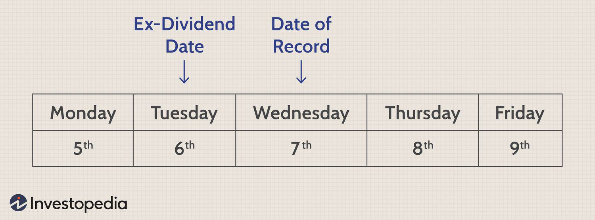

In the world of investing, dividend payments play a significant role for investors who seek a steady stream of income from their stock holdings. Dividends are periodic payments made by companies to their shareholders, typically as a distribution of profits. For investors, understanding key dates in the dividend distribution process, such as the ex-dividend date and the date of record, is essential to effectively manage and optimize their investments.

The dividend distribution process involves several important dates that determine which shareholders are entitled to receive dividends. The ex-dividend date is particularly crucial as it dictates the window in which an investor must own the stock to qualify for the upcoming dividend. Generally, if an investor purchases a stock before the ex-dividend date, they become eligible to receive the dividend. Conversely, purchasing on or after this date means they will not receive the current dividend but will qualify for future ones. Similarly, the date of record, set shortly after the ex-dividend date, is another significant milestone. This date captures the official list of shareholders entitled to the dividend. Understanding these dates helps investors align their purchasing and selling strategies to maximize their dividend income.



In recent years, the rise of algorithmic trading has further elevated the importance of these dividend-related dates. Algorithmic trading, which employs computer algorithms to execute trades based on predefined criteria, often incorporates dividend dates as a key factor in developing trading strategies. By analyzing these dates, algorithms can optimize transactions for dividend capture or engage in arbitrage, thereby influencing stock price movements and trading volumes. This approach has allowed both institutional and individual traders to refine their strategies and enhance portfolio performance.

This article examines the nuances of dividend-related dates and their impact on various trading activities, offering insights into how both traditional and algorithmic traders can leverage this knowledge for improved investment returns. By understanding and tracking key dividend dates, investors can make informed decisions to boost their financial outcomes in the marketplace.

## Table of Contents

## Understanding Dividend Dates

Dividend dates are essential markers in the timeline of dividend distribution, keeping investors informed about their entitlement to earnings from their equity investments. These dates help determine who gets a dividend payment from profits an entity allocates for distribution to shareholders. Understanding the role of these dates can be crucial for making informed investment decisions.

There are four pivotal dividend-related dates:

1. **Declaration Date**: This is the first official acknowledgment when a company's board of directors announces a dividend payment. The declaration includes vital information such as the size of the dividend, the ex-dividend date, the date of record, and the payment date. It signals to the market and shareholders that a dividend will be distributed.

2. **Ex-Dividend Date**: This significant date serves as a cutoff point for eligibility. If an investor purchases a stock on or after the ex-dividend date, they will not receive the upcoming dividend. Instead, it will be paid to the seller. The stock typically begins trading ex-dividend one business day before the date of record to account for the T+2 settlement period, which is the time taken to finalize a stock transaction.

3. **Date of Record (or Record Date)**: On this date, a company reviews its records to determine the list of shareholders eligible to receive the dividend. Stockholders must be registered on or before this date to qualify for the dividend. This date is usually set a couple of business days after the ex-dividend date, allowing time for the settlement of stock trades.

4. **Payment Date**: As the name suggests, this is when the dividend payment is disbursed to the eligible shareholders. It marks the completion of the dividend process, where the company distributes the profit shares to its investors.

Each of these dates plays an integral role in the dividend distribution chain, providing essential information for investors planning to capitalize on dividend-paying stocks. Understanding these dates not only aids in portfolio management but also in strategizing around dividend capture, by purchasing stocks just before the ex-dividend date to receive the dividend and selling just after to potentially profit from the dividend payment.

## Ex-Dividend Date Explained

The ex-dividend date is a key component of the dividend distribution timeline in the stock market. It represents the cutoff point for investors to be eligible to receive the next declared dividend payment from a company. Specifically, an investor must own the stock prior to the ex-dividend date to qualify for the upcoming dividend. On the ex-dividend date, a stock typically begins trading without the value of its next dividend payment incorporated into its price.

To illustrate, consider a stock priced at $50 with a forthcoming dividend of $1 per share. On the ex-dividend date, the opening price of the stock is generally expected to decrease by approximately the dividend amount, so it opens at $49. This reduction reflects the removal of the dividend value from the stock's price since new buyers after the ex-dividend date are not entitled to the dividend.

Trading platforms and financial news sources often provide visual indicators for stocks trading ex-dividend. The 'XD' symbol is commonly placed next to a stock's ticker on trading screens to signify that the stock is trading without its next dividend. This marking serves as an important cue for investors, alerting them to the fact that the investment will not include the imminent dividend payment if purchased on or after this particular date.

The mechanics of the ex-dividend date play a fundamental role in many trading strategies, especially those focused on dividend capture, where investors aim to purchase shares just before the ex-dividend date to secure the dividend, and then sell soon afterward. Understanding these nuances allows investors and automated trading systems to strategically position their trades to capitalize on dividend-related opportunities.

## Date of Record and Its Importance

The date of record, often referred to as the record date, is a pivotal component in the dividend distribution process. This date establishes which shareholders are eligible to receive declared dividends, functioning as a critical checkpoint for both the company and its shareholders. On the record date, a company reviews its list of shareholders to determine dividend recipients. This precise identification is essential for the accurate distribution of dividend payments, ensuring that only shareholders who own the stock as of a specific date receive payouts.

Typically, the record date is scheduled one business day following the ex-dividend date. This sequence allows the stock markets to account for the standard two-business-day (T+2) settlement period. In practice, when investors purchase a stock, they officially become shareholders on the settlement date, which is two business days after the trade date. Consequently, to qualify for dividends, investors must buy the shares before the ex-dividend date so that by the record date, their ownership is officially recognized by the company.

For companies, keeping precise records of shareholder information on the record date is vital to avoid discrepancies in payment distributions, which can lead to financial inconsistencies and administrative complexity. This process aids companies in maintaining transparency and upholding shareholder trust, crucial aspects of shareholder relations and corporate governance. Understanding the importance of the record date can help investors plan their transactions strategically to guarantee their inclusion in dividend payments, thereby optimizing their investment returns.

In conclusion, the record date plays an integral role in the logistics of dividend disbursements, bridging the timelines between dividend announcements and payouts. Being aware of this date is indispensable for investors who aim to capture dividends and for companies striving to maintain precise shareholder records.

## Algorithmic Trading and Dividend Dates

Algorithmic trading, often referred to as algo-trading, involves using complex algorithms to execute transactions based on predefined criteria. One area where algo-trading proves particularly advantageous is in the context of dividend payments. For investors aiming to capitalize on dividends, understanding key dividend dates, especially the ex-dividend date, is vital. The ex-dividend date marks the threshold beyond which shareholders are not eligible to receive the upcoming dividend.

Integrating this knowledge into algorithms can result in strategies such as dividend capture. This strategy involves purchasing a stock just before the ex-dividend date to qualify for the dividend and subsequently selling it soon after. By timing these transactions, algo-trading systems aim to profit from the dividend earnings, factoring in the expected drop in stock price equivalent to the dividend amount on the ex-dividend date.

Mathematically, the expected stock price adjustment on the ex-dividend date can be represented as:

$$
P_{\text{post-ex}} = P_{\text{pre-ex}} - D
$$

where $P_{\text{post-ex}}$ is the stock price after the dividend is detached, $P_{\text{pre-ex}}$ is the stock price before the ex-dividend date, and $D$ is the dividend amount. Algorithms that account for this formula can efficiently manage and predict the impact on stock prices, enabling refined trading strategies.

Algo-trading also leverages [arbitrage](/wiki/arbitrage) opportunities that arise from discrepancies between the expected and actual price adjustments. By rapidly executing trades, algorithms can capitalize on even minute differences in price, thereby enhancing portfolio performance. These strategies are executed at a speed and precision unattainable by human traders, highlighting the synergetic relationship between technology and finance.

Incorporating dividend dates into algorithmic systems is a strategic maneuver to optimize investment returns. The automation and execution speed offered by algo-trading facilitate the timely application of strategies designed around these dates, maximizing the potential yield from dividend stocks. Thus, for both individual and institutional investors, aligning trading algorithms with dividend cycles provides an edge in optimizing portfolio outcomes.

## Impact on Stock Prices

On the ex-dividend date, a stock usually experiences a decrease in price approximately equal to the dividend paid to reflect the payout's impact. This price adjustment occurs because new buyers who purchase the stock on or after the ex-dividend date are not entitled to the upcoming dividend, aligning the market price with the equity's intrinsic value excluding the upcoming payout. For example, if a company declares a dividend of $1 per share, one might expect the stock price to drop by $1 on the ex-dividend date.

However, market factors can cause variations in this standard adjustment. These factors include investor sentiment, market conditions, and the relative size of the dividend in comparison to the stock price. Non-dividend factors such as changes in market perception, economic indicators, or broader market [volatility](/wiki/volatility-trading-strategies) can also influence stock price movements, causing deviations from the expected price drop.

For traders, particularly those using algorithmic strategies, understanding these variations is crucial. Algorithmic trading strategies can incorporate dividend dates to optimize buy and sell decisions. Algorithms can be programmed to adjust for expected price changes using models that consider historical data, expected dividend amounts, and current market conditions. Here is an example of a simple Python script to simulate stock price adjustment on an ex-dividend date:

```python
def adjust_price_for_dividend(current_price, dividend_amount):
    adjusted_price = current_price - dividend_amount
    return adjusted_price

# Example usage
stock_price = 100  # Current stock price
dividend = 1.5     # Expected dividend

new_price = adjust_price_for_dividend(stock_price, dividend)
print(f"Adjusted stock price on ex-dividend date: ${new_price}")
```

This simplistic model assumes a perfect market response. In practice, algorithmic traders employ more sophisticated techniques, considering variables like changes in trading [volume](/wiki/volume-trading-strategy) or macroeconomic data, to predict and respond to stock price movements around ex-dividend dates.

Incorporating dividend dates into trading algorithms is a potent strategy to capture short-term gains from predictable price changes and enhance portfolio performance. Nonetheless, traders must vigilantly manage risks and remain adaptive to the dynamic nature of financial markets.

## Real-World Applications

Companies like Apple Inc. and Procter & Gamble Co. exemplify corporations with regular dividend payouts, with consistently announced ex-dividend dates being crucial for both individual and institutional investors. Leveraging these dates can lead to strategic opportunities in stock trading, ensuring that investors receive optimal returns from their dividend-[earning](/wiki/earning-announcement) equities.

The ex-dividend date serves as a strategic point for traders aiming to capture dividends. An investor must own shares before the ex-dividend date to be entitled to the upcoming dividend. Thus, many investors adjust their trading activities around these dates to qualify for dividends while also considering the implications for stock price movement. For instance, stock prices typically drop by approximately the dividend amount on the ex-dividend date, prompting traders to potentially buy shares ahead of this drop and sell them post-payout to capitalize on both dividend earnings and subsequent price recovery.

To illustrate this concept, consider a trader using a simple strategy coded in Python:

```python
def dividend_capture(symbol, ex_dividend_date, dividend_amount):
    # Fetch historical price data
    price_data = get_price_data(symbol)

    # Determine price before ex-dividend date
    price_before = price_data[ex_dividend_date - 1]

    # Simulate buying shares before ex-dividend date
    shares_bought = capital / price_before

    # Estimate price drop on ex-dividend date
    price_on_ex = price_before - dividend_amount
    shares_held_value = shares_bought * price_on_ex

    # Calculate income from dividend within the payout period
    dividend_income = shares_bought * dividend_amount

    # Simulate selling shares after dividend capture
    post_ex_price = recover_price(symbol, ex_dividend_date)
    selling_price = shares_bought * post_ex_price

    # Total returns from both dividend and selling shares
    total_returns = dividend_income + selling_price
    return total_returns
```

In this strategy, the function `get_price_data` fetches historical price data for the given stock symbol. The `recover_price` function estimates the stock price for the period after the dividend payout, based on market behavior. Such a strategy aims to benefit not only from receiving dividends but also from potential gains when the stock price rebounds, exemplifying how dividends and stock price movements can be profitably navigated.

For investors in high-dividend regular stocks like Procter & Gamble, similar strategies are applicable. Here, identifying a consistent pattern in price recovery post-ex-dividend can enhance a portfolio’s total return, effectively using predictable cash flows and dividend-driven price changes to an investor's advantage.

Ultimately, the ability to anticipate and respond strategically to ex-dividend dates and ensuing market behavior underlines an important facet of investment expertise that can significantly amplify returns on dividend-paying stocks, reinforcing the value of disciplined market engagement informed by key dividend milestones.

## Conclusion

Dividend dates are pivotal in shaping financial markets, influencing investor income and guiding trading strategies. A comprehensive understanding of the ex-dividend date and the date of record is beneficial for both traditional and algorithmic traders. For traditional investors, precise knowledge of these dates helps secure dividend payments and align investment timelines for optimal returns. Algorithmic traders, on the other hand, can incorporate these dates into automated strategies to take advantage of price fluctuations and arbitrage opportunities.

For instance, traders can develop algorithms that identify stocks approaching their ex-dividend dates. By executing buy or sell orders before significant price adjustments, traders can capture dividend income while mitigating potential losses from post-dividend price drops. Moreover, understanding how these dates influence stock prices allows for the optimization of portfolio performance through timing and strategic asset allocation.

Investors who seamlessly integrate dividend dates into their analysis and trading processes often see enhanced returns. Tracking these dates ensures dividends are not missed, strategies are aligned with market cycles, and opportunities for strategic trades are maximized. With the exponential growth in [algorithmic trading](/wiki/algorithmic-trading), knowledge of dividend-related dates becomes even more essential, offering a competitive edge in dynamic financial markets.

## References & Further Reading

[1]: Theisen, M. J. (2017). ["Dividends and Dividend Policy."](https://www.sciencedirect.com/science/article/pii/S1044028317301862) ISBN: 978-1-506-33105-2

[2]: Fabozzi, F. J., & Peterson Drake, P. (2009). ["Finance: Capital Markets, Financial Management, and Investment Management."](https://books.google.com/books/about/Finance.html?id=mUBsAwAAQBAJ) Wiley, ISBN: 978-0-470-19770-8.

[3]: Lopez de Prado, M. (2018). ["Advances in Financial Machine Learning."](https://www.amazon.com/Advances-Financial-Machine-Learning-Marcos/dp/1119482089) Wiley, ISBN: 978-1-119-44808-0.

[4]: Chan, E. P. (2009). ["Quantitative Trading: How to Build Your Own Algorithmic Trading Business."](https://github.com/ftvision/quant_trading_echan_book) Wiley, ISBN: 978-0-470-28449-1.

[5]: Frankel, R., & Lee, C. M. C. (1998). ["Accounting Valuation, Market Expectation, and Cross-Sectional Stock Returns."](https://www.sciencedirect.com/science/article/pii/S0165410198000263) Journal of Accounting and Economics, 25(3), 283-319.