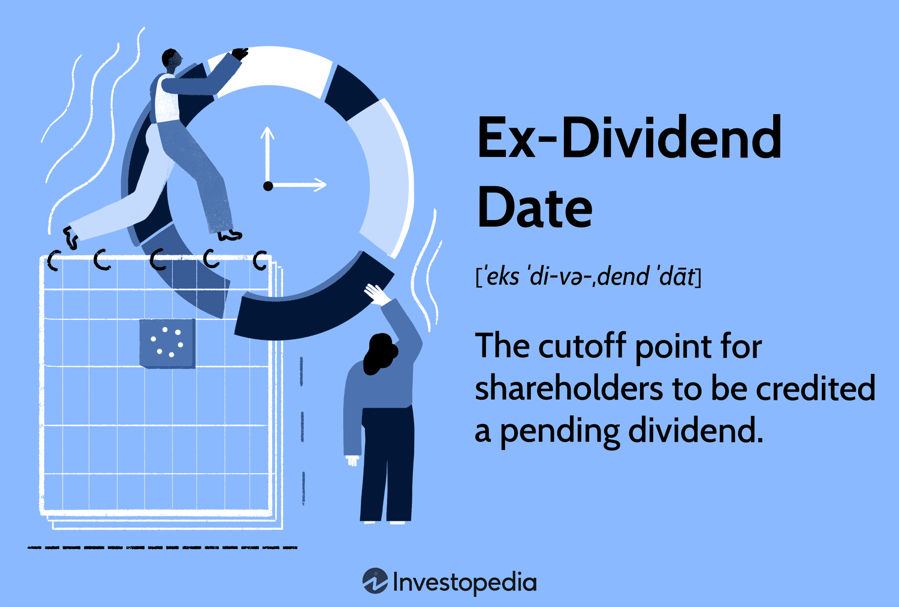

Dividends have traditionally played a significant role in investing. As a portion of a company's earnings distributed to its shareholders, dividends not only serve as a source of income but also signal a company's financial health and profitability. They are an essential component of total shareholder return, which combines price appreciation with dividends received over a period. For many investors, particularly those seeking income or wishing to reinvest dividends for compound growth, understanding the dynamics of dividend distribution is crucial.

Key dates surrounding dividends are pivotal for investors. The declaration date marks when a company announces its intention to pay a dividend, setting off a series of important events. The ex-dividend date, typically set a few days before the record date, is critical as it determines eligibility for receipt of the dividend; if a stock is purchased on or after this date, the new holder is not entitled to the dividend. The record date follows, identifying which shareholders are eligible to receive the dividend based on company records. Finally, the payment date is when the dividend is actually disbursed to shareholders. Familiarity with these dates ensures that investors can make informed decisions regarding their holdings and potential gains.



In the rapidly evolving landscape of finance, algorithmic trading introduces a sophisticated method to optimize strategies around dividend-related dates. By leveraging computational power and advanced algorithms, traders can identify and act on opportunities more efficiently than traditional methods permit. Algorithmic trading allows for the automation of trading strategies, potentially increasing precision and minimizing response times to market events.

This article aims to explore the intersection of dividend key dates and algorithmic trading, shedding light on how investors can utilize these two concepts to potentially enhance their investment outcomes. By integrating an understanding of key dates with algorithmic approaches, investors may unlock new pathways to optimize their portfolios. Readers are encouraged to familiarize themselves with these strategies to leverage dividend investing and algorithmic trading for better returns in an increasingly competitive market environment.

## Table of Contents

## Understanding Dividends and Their Key Dates

Dividends represent a portion of a company's earnings distributed to its shareholders. They are a mechanism by which companies share profits with investors and serve as a regular income source. By providing returns in addition to potential capital gains from stock price appreciation, dividends enhance shareholder value and contribute to the attractiveness of dividend-paying stocks.

The process of dividend distribution involves several critical dates, each playing a specific role:

1. **Declaration Date**: This is when a company's board of directors announces the intention to pay a dividend. The declaration includes the amount of the dividend and the subsequent key dates. This announcement can positively impact stock price as it signals financial health and profitability.

2. **Ex-Dividend Date**: A pivotal date in the dividend process, the ex-dividend date determines eligibility for receiving the declared dividend. To qualify, an investor must own the stock before this date. Stocks typically decrease in price by approximately the dividend amount on the ex-dividend date, reflecting the value that is no longer part of the company's assets. This price adjustment is critical for investors implementing dividend capture strategies.

3. **Record Date**: Occurring one or two business days after the ex-dividend date, this is the date when a company reviews its records to determine the eligible shareholders. Although significant, it is less influential on stock price since the eligibility is based on holdings as of the ex-dividend date.

4. **Payment Date**: This is when the dividend is actually distributed to shareholders. While it does not impact eligibility, it signifies the completion of the dividend cycle.

The ex-dividend date holds particular importance due to its direct influence on market dynamics and price adjustments. Missing the ex-dividend date can result in ineligibility for the dividend, affecting an investor's income and potential returns. 

Typically, companies follow a quarterly dividend distribution pattern, announcing the declaration at the same time as quarterly earnings. This is followed by the ex-dividend and record dates within a week or two, and the payment date usually occurs within a month. Being aware of these timelines and actively monitoring them allows investors to formulate strategies that capitalize on these recurring opportunities, ensuring that dividends are effectively integrated into their broader investment objectives.

## The Ex-Dividend Date: A Closer Look

The ex-dividend date is a critical component in the timeline of dividend distribution for publicly traded companies. It represents the cutoff point at which investors must own shares to be eligible to receive the declared dividend. This date is typically set one business day before the record date, reflecting the current T+2 settlement cycle in U.S. markets, where trades settle two business days after the transaction date.

### Impact on Stock Price Adjustments and Market Dynamics

The market often adjusts the stock price on the ex-dividend date to account for the forthcoming dividend payment. Ideally, the share price decreases by approximately the amount of the dividend after the market opens. If a company declares a dividend of $D$ per share, theoretically, the stock price $P$ on the ex-dividend date should decrease from the previous day's closing price by $D$. However, real-world conditions such as market sentiment, [liquidity](/wiki/liquidity-risk-premium), and demand could cause the price adjustment to deviate from this simple linear expectation.

### Strategies for Trading Around the Ex-Dividend Date

Investors deploy various strategies around the ex-dividend date. Some may opt to purchase stocks just before the ex-dividend date to qualify for the dividend—a tactic known as dividend capture. Post-dividend, traders might sell the stock and potentially reinvest in another security following a similar cycle. However, this strategy requires careful consideration of transaction costs, tax implications, and market [volatility](/wiki/volatility-trading-strategies) impacts, which can diminish potential gains.

### Real-World Examples

The price adjustments seen on ex-dividend dates have been observed in numerous instances. For example, if a blue-chip stock, historically stable in price, announces a significant dividend decline (e.g., due to a downturn in earnings), the ex-dividend date might see a more pronounced drop than the dividend amount would suggest. Conversely, companies in high demand or with significant growth potential might witness less pronounced drops, reflecting underlying confidence from investors that transcends the dividend effect.

### Tips for Investors

To maximize benefits from dividends, investors should:

1. **Monitor Dividend Announcements:** Keeping a calendar of upcoming ex-dividend dates for stocks of interest can aid in timely decision-making.
2. **Analyze Market Conditions:** Consider external factors that may influence price behavior, such as notable earnings reports or macroeconomic conditions coinciding with dividend dates.
3. **Evaluate Cost Implications:** Account for brokerage fees and trading costs relative to the expected dividend, as excessive costs can erode the benefits of any strategy applied.
4. **Incorporate Tax Strategies:** Understand the tax treatment of dividends in one's jurisdiction to optimize net returns, as qualified dividends may be taxed at a lower rate compared to ordinary income.

Overall, the ex-dividend date holds considerable importance in strategic investment planning, offering potential opportunities and posing risks that require informed navigation to enhance portfolio returns effectively.

## Algorithmic Trading and Dividend Strategies

Algorithmic trading refers to the use of computer programs to execute trades based on predetermined criteria. This technology-driven approach provides significant advantages in today’s financial markets, including increased speed, efficiency, and accuracy, which traditional human trading cannot match. By minimizing human intervention, [algorithmic trading](/wiki/algorithmic-trading) can also reduce the emotional and psychological biases that often affect decision-making processes.

Algorithms can be designed to identify profitable trading opportunities around dividend dates. Key dividend dates, such as the ex-dividend date, often see fluctuations in stock prices, creating opportunities for traders. Algorithms can analyze historical stock data and price patterns to predict such movements. For instance, a simple algorithm might buy a stock just before the ex-dividend date and sell it immediately after, capitalizing on any temporary price changes. This strategy could be expressed as:

```python
def dividend_trading_strategy(stock_data, ex_dividend_date):
    for date, price in stock_data:
        if date == ex_dividend_date - timedelta(days=1):
            buy_stock(price)
        elif date == ex_dividend_date + timedelta(days=1):
            sell_stock(price)
```

This pseudo-code algorithm highlights an elementary strategy focused on the timing of buying and selling around the ex-dividend date.

Among the various approaches to algorithmically trading ex-dividend stocks, [momentum](/wiki/momentum) trading and mean reversion strategies are notable. Momentum trading involves purchasing stocks that show an upward price trend and selling those on a downward trend. Conversely, mean reversion strategies bet on the price reversing to a historical average.

Risk management and [backtesting](/wiki/backtesting) are also crucial components of dividend-focused algorithmic trading. Backtesting involves simulating a trading strategy using historical data to estimate how it would have performed in the past. This allows traders to refine their algorithms before applying them to actual trades, which is vital for mitigating risks.

A Python-based backtesting framework might involve:

```python
import pandas as pd

def backtest_strategy(stock_data, strategy_func):
    for index, row in stock_data.iterrows():
        strategy_func(row['Date'], row['Price'])

# Sample historical data
stock_data = pd.DataFrame({'Date': ['2023-01-01', '2023-01-02'], 'Price': [100, 102]})
backtest_strategy(stock_data, dividend_trading_strategy)
```

Several case studies illustrate the profitable application of algorithmic trading around dividend key dates. For example, statistical [arbitrage](/wiki/arbitrage) has been effectively used to exploit minimal price differentials across different markets for dividend stocks. Proprietary trading firms and hedge funds often deploy sophisticated algorithms that integrate vast amounts of data to make informed trading decisions, turning traditionally minor dividend capture strategies into significant profit sources.

These strategies require a comprehensive understanding of market dynamics and a robust technological setup, ensuring timely and efficient execution of trades. As technology advances, the scope for more refined and automated dividend strategies continues to broaden, offering promising opportunities for investors who can successfully integrate algorithmic trading with knowledge of dividend dates.

## Integrating Dividend Key Dates with Algorithmic Trading

Integrating dividend key dates with algorithmic trading requires a strategic approach that combines financial knowledge with technology. Understanding the timeline of dividend distribution—declaration date, ex-dividend date, record date, and payment date—serves as the foundation for implementing effective algorithms. Here is a step-by-step guide to integrating these dates into trading algorithms:

1. **Data Collection and Analysis**: Gather historical data on dividend key dates for targeted stocks. This includes identifying patterns in price movements around the ex-dividend date. Tools such as Python libraries (Pandas for data manipulation, NumPy for numerical calculations) can facilitate this process.

   ```python
   import pandas as pd
   import numpy as np

   data = pd.read_csv('dividend_data.csv')
   ex_dividend_movements = data[data['date'] == data['ex_dividend_date']]['price_change']
   ```

2. **Algorithm Design**: Develop algorithms that trigger buy or sell signals based on dividend dates. For instance, a common strategy involves purchasing shares just before the ex-dividend date to capture the dividend and selling shortly after.

3. **Platform Utilization**: Utilize trading platforms that support algorithmic strategies. QuantConnect and Interactive Brokers provide environments conducive for backtesting and deploying algorithms.

4. **Risk Management**: Implement risk management measures to mitigate potential losses. This can involve setting stop-loss orders or using options to hedge positions. Backtesting strategies using historical data can refine the algorithm to minimize risks.

   ```python
   # Example of a simple moving average crossover strategy for risk management
   data['SMA_20'] = data['price'].rolling(window=20).mean()
   data['SMA_50'] = data['price'].rolling(window=50).mean()
   data['signal'] = np.where(data['SMA_20'] > data['SMA_50'], 1, 0)
   ```

5. **Simulation and Evaluation**: Conduct simulations to evaluate the performance of algorithms over multiple dividend cycles. Use platforms like Quantopian for backtesting against historical dividend data.

**Challenges and Solutions**:
Implementing these strategies comes with challenges such as data discrepancies and market volatility. To overcome these, ensure data accuracy by cross-verifying sources and develop algorithms capable of adapting to market conditions. Moreover, setting realistic expectations regarding the return on investment is crucial for consistent long-term performance.

**Future Outlook**:
Algorithmic trading in dividend capture processes is expected to become increasingly sophisticated. With advancements in AI and [machine learning](/wiki/machine-learning), algorithms will become more adept at predicting stock movements around dividend dates, potentially increasing returns. Enhanced real-time analytics will further enable adaptive and responsive trading strategies.

**Industry Insights**:
Experts advocate for continuous monitoring and iteration of trading algorithms. Regular assessment of algorithmic performance, combined with staying informed about industry trends, can help traders optimize their strategies. Integrating dividend capture strategies with other investment approaches may also enhance portfolio diversification and reduce overall risk.

By merging knowledge of dividend key dates with algorithmic trading, investors can systematically harness the predictable patterns around dividend events to potentially achieve better investment outcomes.

## Conclusion

Understanding dividend key dates is essential for investors aiming to maximize their returns through dividend investing. Central to this knowledge is the ex-dividend date, which determines shareholders' eligibility for dividend payments. Investors aware of these critical dates can strategically time their trades to benefit from dividend distributions, avoiding missing out due to oversight of the timeline. This understanding facilitates informed decision-making, enabling more precise execution of investment strategies.

Algorithmic trading offers distinct advantages in dividend investing by enabling the rapid analysis of vast market data to identify profitable opportunities. Algorithms can effortlessly adjust for price discrepancies following ex-dividend dates, offering a strategic edge over traditional manual approaches. By programming algorithms to consider dividend key dates, investors can enhance their capacity to engage in dividend capture, efficiently executing trades and optimizing returns. 

Integrating the knowledge of dividend timelines with algorithmic strategies allows investors to optimize their portfolios through systematic and precise execution. Utilizing platforms and tools specifically designed for algorithmic trading, investors can surmount the challenges of real-time market dynamics and capitalize on opportunities that align with dividend distributions. 

As the financial landscape continually evolves, adopting new trading technologies and strategies becomes imperative. Investors are encouraged to engage in continual learning and adaptation, ensuring they stay abreast of market innovations and new techniques in algorithmic trading and dividend investing. This proactive approach not only enhances the potential for improved returns but also strategically positions investors to exploit emerging opportunities.

As a call to action, investors should evaluate their current strategies concerning dividend investing and consider incorporating algorithmic trading to amplify their portfolio’s performance. By aligning investment strategies with an algorithmic approach, informed by an understanding of dividend key dates, investors can enhance their ability to achieve consistent and profitable outcomes in their investment pursuits.

## References & Further Reading

[1]: Bodie, Z., Kane, A., & Marcus, A. J. (2014). ["Investments"](https://www.mheducation.com/highered/product/Investments-Bodie.html). McGraw-Hill Education.

[2]: Fabozzi, F. J., & Peterson Drake, P. (2009). ["Finance: Capital Markets, Financial Management, and Investment Management"](https://books.google.com/books/about/Finance.html?id=mUBsAwAAQBAJ). Wiley.

[3]: Harris, L. (2002). ["Trading and Exchanges: Market Microstructure for Practitioners"](https://academic.oup.com/book/52292). Oxford University Press.

[4]: ["Algorithmic and High-Frequency Trading"](https://assets.cambridge.org/97811070/91146/frontmatter/9781107091146_frontmatter.pdf) by Álvaro Cartea, Sebastian Jaimungal, and José Penalva.

[5]: ["Dividend Policy: Its Impact on Firm Value"](https://www.academia.edu/28702066/Dividend_Policy_and_Its_Impact_on_Firm_Value_A_Review_of_Theories_and_Empirical_Evidence) by Ronald C. Lease, Kose John, Avner Kalay, Uri Loewenstein, and Oded H. Sarig.