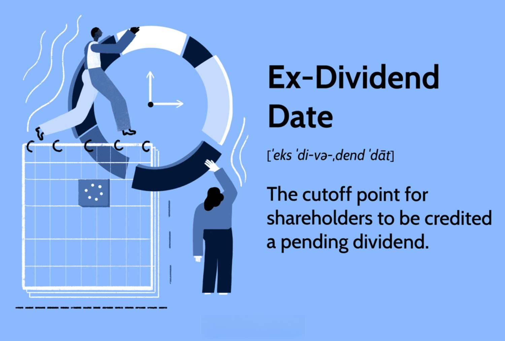

Dividends represent a crucial aspect of financial markets, serving as a reflection of a company's profitability and its commitment to rewarding shareholders. As periodic payouts from company earnings, dividends are integral to investor returns and market evaluations of corporate health. The introduction of technology, particularly algorithmic trading, has revolutionized traditional approaches to dividend investing. Algorithms facilitate rapid data analysis and execution of trading strategies, enabling investors to identify and act on trading opportunities with precision and speed.

Ex-dividend dates become particularly significant within this context. On these dates, a stock typically experiences a price drop equivalent to the dividend declared, influencing trading patterns and opportunities. Understanding this relationship offers investors the ability to enhance their strategic decisions.



This article explores the synergy between ex-dividend dates, dividend investing, and algorithmic trading. By leveraging mathematical models and advanced trading algorithms, investors can potentially optimize their strategies, achieve effective risk management, and maximize returns within the competitive landscape of financial markets.

## Table of Contents

## Understanding Dividends and Key Dates

Dividends are periodic payments distributed by a company's board of directors to its shareholders from the company's earnings. They serve as a tangible reflection of a company's financial health and indicate a consistent revenue stream. By providing regular income, dividends can significantly enhance the total return of an investment portfolio. Companies that possess steady cash flow and profitability often distribute dividends as a means to retain and attract investors.

The distribution of dividends is governed by specific key dates, each playing a distinct role within the overall process:

1. **Declaration Date**: This is the date on which a company's board announces its intention to pay a dividend. The announcement includes critical information such as the dividend amount, payment date, and record date. The declaration establishes the legal commitment to distribute dividends to shareholders.

2. **Ex-Dividend Date**: Marked typically two business days before the record date, the ex-dividend date is crucial for determining shareholder eligibility for the declared dividend. On this date, a stock's price typically decreases by approximately the dividend amount, as new buyers will not receive the upcoming payment. Investors seeking to capture the dividend must purchase the stock before the ex-dividend date.

3. **Record Date**: This is the cut-off date established by the company to determine which shareholders are eligible to receive the dividend. Only shareholders officially registered on the books by this date will receive the declared dividend.

4. **Payment Date**: As the concluding step of the dividend process, the payment date is when the dividend is distributed to shareholders. This completes the dividend distribution cycle, transferring a portion of the company's profits to its investors.

Understanding these key dates is vital for investors looking to harness dividend strategies effectively. They must consider the timing of their stock acquisition relative to these dates to optimize their investment outcomes. Moreover, dividend policies can influence investor perceptions and market value, leading companies to strategize carefully around these dates to maximize shareholder satisfaction and company valuation.

## The Ex-Dividend Date: Impact and Strategies

The ex-dividend date is a critical moment in the lifecycle of dividend-paying stocks. It determines whether an investor is eligible to receive an upcoming dividend payout. For a shareholder to qualify for the next dividend, they must purchase the stock before the ex-dividend date; any acquisition of shares on or after this date results in ineligibility for the dividend payout. This peculiarity has significant implications on stock prices and investor behaviors.

On the ex-dividend date, it is common to observe a drop in the stock price approximately equal to the dividend amount. This price drop reflects the distribution of company profits that are no longer attributed to shareholders buying the stock on the ex-dividend date itself. For example, if a stock is trading at $100 and the dividend amount is $2, the stock price typically opens at $98 on the ex-dividend date, assuming all other factors remain constant.

Investors often deploy various strategies around the ex-dividend date to capitalize on these predictable price movements. One common strategy is known as the "dividend capture strategy." In this approach, investors purchase the stock just before the ex-dividend date to qualify for the dividend payout and sell it shortly thereafter, ideally for a similar price to that at which it was purchased, plus the dividend.

Market dynamics during the ex-dividend date can be influenced by several factors, including market sentiment, broader economic conditions, and investor perceptions of the stock's future performance. Real-world examples illustrate these dynamics: a stock expected to recover quickly post-dividend drop might see minimal price decline, while one with looming uncertainty might experience a more significant drop.

Moreover, [algorithmic trading](/wiki/algorithmic-trading) has introduced sophisticated methods to exploit ex-dividend date opportunities. Algorithms can be programmed to automatically execute trades that align with pre-determined criteria, such as the dividend amount, to optimize entry and [exit](/wiki/exit-strategy) points. The use of algorithms can enhance precision and efficiency in trading, minimizing the manual workload and emotional biases traditionally associated with investment decisions.

In conclusion, the ex-dividend date offers both opportunities and challenges for investors. Understanding the price adjustments that typically occur and employing strategies like the dividend capture can offer potentially lucrative trading ventures. However, it's crucial to consider additional factors such as transaction costs, tax implications, and the company's overall financial health when trading around these dates.

## Algorithmic Trading and Dividend Strategies

Algorithmic trading offers investors the capability to analyze vast amounts of data and execute trades swiftly, significantly enhancing the efficiency of implementing dividend strategies. When dividends are a central component of investment plans, algorithmic trading provides an edge in optimizing the timing and execution of trades to maximize returns. This involves the use of strategies such as [momentum](/wiki/momentum) trading and mean reversion, particularly in relation to dividend dates.

Momentum trading is a strategy that capitalizes on the continuance of existing trends in the market. Around dividend dates, this strategy can be used by investors to benefit from the expected upward or downward trends in stock prices. For instance, a stock may experience an upward momentum as the ex-dividend date approaches due to increased buying interest from investors seeking to qualify for the dividend payment. An algorithm can be designed to detect such trends using historical price data and execute buy or sell orders accordingly, maximizing gains from price movements.

Mean reversion is another technique suited for dividend investing, based on the assumption that asset prices will revert to their historical mean over time. When stock prices fluctuate due to dividend announcements or payments, they often deviate from their typical range. An algorithm can track these deviations and predict the likelihood of price reversion, allowing investors to make informed trades. During these periods, if a stock's price drops significantly on the ex-dividend date, an algorithm might suggest buying, anticipating a rebound to the mean price level in subsequent days.

Both strategies require diligent risk management and rigorous [backtesting](/wiki/backtesting). Risk management involves setting appropriate stop-loss and take-profit levels to protect against adverse price movements. Backtesting, on the other hand, allows investors to apply their algorithms to historical data, testing their performance before deploying them in real-time markets. This step is crucial to identify potential weaknesses in the strategy and adjust parameters to align with market conditions.

An example of a Python implementation for backtesting a mean reversion strategy could involve utilizing historical stock price data, calculating the moving average, and simulating trades based on deviations from this average. Here is a simple pseudocode example:

```python
import pandas as pd

def mean_reversion_strategy(data, window_size, threshold):
    # Calculate the moving average
    data['Moving_Avg'] = data['Close'].rolling(window=window_size).mean()

    # Generate trading signals based on mean reversion
    data['Signal'] = 0
    data['Signal'][data['Close'] < data['Moving_Avg'] - threshold] = 1
    data['Signal'][data['Close'] > data['Moving_Avg'] + threshold] = -1

    return data

# Sample implementation
historical_data = pd.read_csv('stock_prices.csv')
result = mean_reversion_strategy(historical_data, window_size=20, threshold=2)

# The resulting DataFrame will include trading signals
```

In conclusion, integrating algorithmic trading with dividend strategies like momentum trading and mean reversion can significantly optimize investment decisions. With carefully designed algorithms, proper risk management, and thorough backtesting, investors can boost their dividend-related returns efficiently in today's competitive markets.

## Integrating Dividend Dates with Algorithmic Trading

To effectively integrate dividend dates into trading algorithms, investors must navigate the intricate processes of data analysis and algorithm design. This integration can improve the precision and profitability of trading strategies, leveraging crucial market events such as dividend distributions.

### Data Analysis

Data analysis begins with the collection and interpretation of relevant financial data, including historical stock prices, dividend payout histories, and associated dates such as ex-dividend, record, and payment dates. This data forms the foundation on which algorithms operate, allowing them to make informed predictions and decisions. 

An effective approach to analyzing ex-dividend effects on stock prices involves statistical methods to model expected price movements. For instance, investors often observe a price drop approximately equal to the dividend amount on the ex-dividend date. Historical data can be analyzed using statistical tools such as the average price change and standard deviations around ex-dividend dates to identify patterns.

A typical model might involve calculating the expected drop $\Delta P$ in stock price using:
$$
\Delta P = D \times (1 - T_c)
$$
where $D$ is the dividend amount and $T_c$ represents the tax credit rate applicable to the dividend. This helps in estimating price behavior and designing trading strategies accordingly.

### Algorithm Design

The algorithm design process begins with selecting a suitable computational platform and programming language. Python, with libraries such as Pandas for data manipulation and NumPy for numerical processing, is often preferred. The design involves developing algorithms that can enter and exit trades based on the insights drawn from data analysis.

Investors typically employ strategies like momentum trading or mean reversion in conjunction with dividend dates. A basic momentum strategy could involve buying stocks before the ex-dividend date and selling them after capturing the dividends and anticipated price corrections. Conversely, a mean reversion strategy might exploit price drops post-dividend to buy stock at a lower price, anticipating a return to mean price levels.

#### Example Strategy Implementation in Python

Here's a simplified Python example outlining how such a strategy might be coded:

```python
import pandas as pd

# Assuming df is a DataFrame containing historical stock data with 'Date', 'Close', and 'Dividend' columns
def calculate_expected_price_drop(df, tax_credit_rate=0.15):
    df['Expected_Price_Drop'] = df['Dividend'] * (1 - tax_credit_rate)
    df['Adjusted_Close'] = df['Close'] - df['Expected_Price_Drop']
    return df

historical_data = pd.read_csv('historical_stock_data.csv')
strategy_data = calculate_expected_price_drop(historical_data)

strategy_data.head()
```

### Risk Management

Incorporating a robust risk management framework is essential when integrating dividend-based strategies in algorithmic trading. This includes setting stop losses and using leverage cautiously to prevent significant losses on unfavorable trades. Additionally, backtesting strategies on historical data enables investors to gauge potential performance and refine algorithms by simulating trades across varying market conditions.

### Case Studies and Examples

Consider a scenario where a tech company consistently offers dividends and exhibits predictable price behavior around dividend dates. By applying backtested algorithmic strategies, an investor manages to exploit these patterns. For example, during a 3-year period, the implemented strategy outperforms a baseline market index due to precise, algorithm-driven decisions made around ex-dividend periods, emphasizing the practical benefits of integrating dividend dates into algorithmic frameworks.

Effectively, aligning dividend dates with algorithmic trading requires meticulous data analysis, well-designed algorithms, and strategic risk management to fully harness the potential of this integration, thereby optimizing investment returns.

## Conclusion

A comprehensive understanding of dividend key dates and their strategic significance, when coupled with the precision of algorithmic trading, can markedly enhance an investor's portfolio strategy and returns. Dividends represent a reliable metric of a company's fundamental health and long-term growth potential. Recognizing the pivotal dates—the declaration date, ex-dividend date, record date, and payment date—enables investors to position themselves advantageously to capture dividend yields while anticipating market adjustments.

Algorithmic trading leverages computational power to parse vast datasets and execute trades at speeds and efficiencies unattainable by human traders. By integrating dividend key dates into algorithmic models, investors can exploit predictable patterns and price adjustments surrounding these events. For instance, the typical price drop on the ex-dividend date due to dividend payouts can be modeled and anticipated, allowing trading algorithms to execute profitable buy or sell orders based on these insights.

Additionally, advanced algorithms such as momentum trading can capitalize on short-term trends post-dividend announcements, while mean reversion strategies might anticipate and benefit from stock price corrections following the ex-dividend date's initial [volatility](/wiki/volatility-trading-strategies). Risk management remains paramount in these strategies, necessitating rigorous backtesting against historical data to refine algorithms and minimize potential losses.

Investors are encouraged to evolve their strategies continually, integrating technological innovations like algorithmic trading with traditional dividend investing insights. Such an approach not only enhances profitability but also maintains competitiveness in a financial landscape characterized by rapid technological advancements and market fluctuations. By embracing these tools and strategies, investors can more effectively leverage market opportunities and sustain long-term growth in their investment portfolios.

## References & Further Reading

1. **"Stocks for the Long Run" by Jeremy J. Siegel** - This book provides a comprehensive analysis of the long-term performance of stocks and includes insights into dividend investing strategies. Siegel discusses the historical significance of dividends and their impact on total stock returns.

2. **"The Intelligent Investor" by Benjamin Graham** - A classic in investment literature, this book elaborates on the principles of value investing and the importance of dividends in constructing a balanced portfolio. Graham's strategies lay foundational concepts for dividend strategy optimization.

3. **"Algorithmic Trading: Winning Strategies and Their Rationale" by Ernie Chan** - This book offers in-depth knowledge on developing and implementing algorithmic trading strategies. Specifically, it explores various quantitative finance methods, including those applicable to dividend investing.

4. **"A Practical Guide to Algorithmic Strategies and Trading Systems" by Emilio Tomasini and Urban Jaekle** - This guide contains practical examples and case studies that address the creation and execution of algorithmic strategies, providing context for integrating dividend strategies within algorithmic frameworks.

5. **Research Paper: "Dividend Payments and Information Asymmetry: Signaling or Agency?" by Bhattacharya, S. (1979)** - This paper explores the theoretical underpinnings of dividend payments and their signaling effect in financial markets, useful for understanding the fundamental reasons companies may choose to pay dividends.

6. **"Python for Finance: Mastering Data-Driven Finance" by Yves Hilpisch** - A comprehensive resource on utilizing Python for financial analysis and trading strategy development, this book includes examples pertinent to implementing algorithmic trading systems that can incorporate dividend data.

7. **"Quantitative Value, + Web Site: A Practitioner's Guide to Automating Intelligent Investment and Eliminating Behavioral Errors" by Wesley R. Gray and Tobias E. Carlisle** - The book provides insights into making data-driven investment decisions, emphasizing reducing human error in trading strategies, including dividend strategies.

8. **Online Resource: Investopedia's Guide to Dividend Investing** - This online guide offers an overview of fundamental concepts in dividend investing and advanced strategies, including the implications of different key dividend dates such as the ex-dividend date.

9. **Website: QuantInsti's Blogs on Algorithmic Trading** - QuantInsti provides a wealth of blogs and educational content on algorithmic trading strategies, including basics and advanced techniques relevant to integrating dividend dates into trading strategies.

10. **Journal of Financial Economics** - This journal publishes high-quality research articles that cover the economics of dividends and algorithmic trading strategies. It is an academic resource for those looking to explore empirical studies and theoretical advancements.

