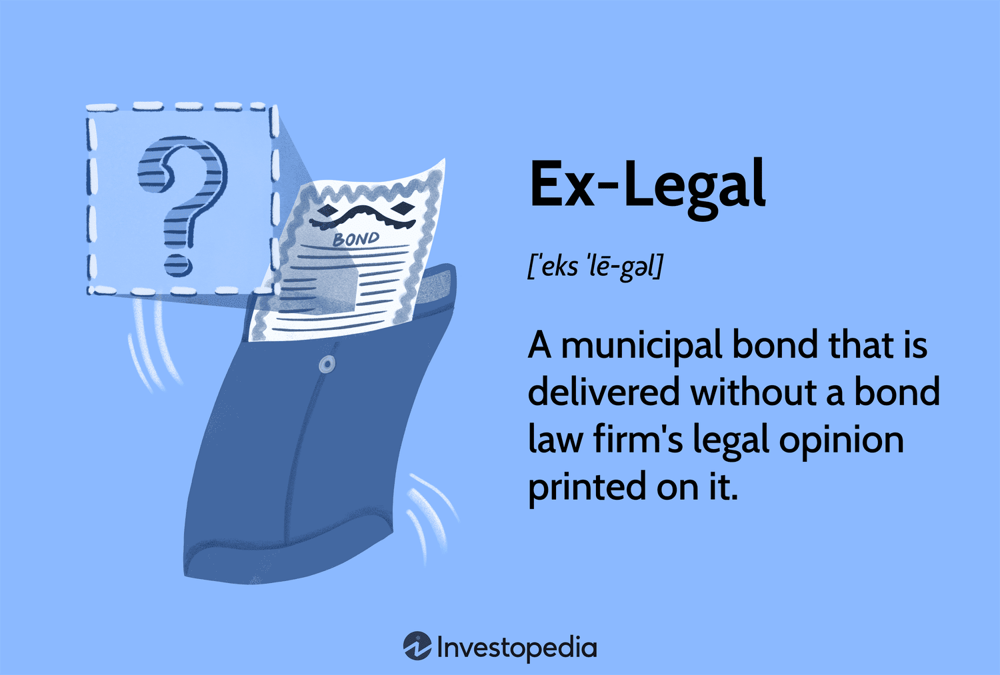

In today's fast-paced financial environment, where the rapid evolution of technologies and financial instruments reshapes the investment landscape, legal considerations assume a critical role. This holds particularly true in specialized areas such as algorithmic trading and municipal bonds. These sectors necessitate a nuanced understanding of the legal terminologies and obligations they entail. This article aims to elucidate key legal terms and definitions associated with 'Ex-Legal' and the regulatory landscape impacting algorithmic trading. 

In the context of municipal bonds, an 'Ex-Legal' bond is one that is issued without the accompanying legal opinion that is typically provided by a bond law firm. This absence elevates the legal risks involved since the bond lacks the standard legal endorsement which usually assures its legality, tax exemption status, and payment guarantees. Understanding what constitutes an Ex-Legal bond is crucial for investors looking to gauge the associated risks and potential opportunities that might appeal due to higher yields.

In the dynamic field of algorithmic trading, where computer algorithms define trading strategies, regulatory compliance is paramount. Key regulatory bodies, such as the Securities and Exchange Commission (SEC) in the United States and the Markets in Financial Instruments Directive II (MiFID II) in the European Union, oversee the practices to prevent illicit activities, including market manipulation. The evolving regulatory landscape demands that traders understand legal frameworks to maintain compliance and mitigate risks effectively.

For investors and traders, remaining compliant and mitigating risks is an ongoing challenge, underscoring the necessity of a solid grasp of legal implications. As we explore what constitutes an Ex-Legal bond and analyze algorithmic trading from a regulatory standpoint, our goal is to offer clarity on these legal concepts. This understanding is vital for navigating the complex financial terrain, fostering informed investment decisions, and maintaining adherence to legal standards.

## Table of Contents

## Understanding Ex-Legal Bonds

Ex-Legal bonds, commonly found in the municipal bond market, are securities issued without the traditional legal opinion that is generally provided by a bond law firm. These legal opinions are crucial as they typically confirm the validity of the bond issuance, its tax-exempt status, and the assurance of payment to bondholders. When a bond is designated as Ex-Legal, it implies that it lacks this endorsement, thereby presenting a higher legal risk to investors.

The absence of a legal opinion signals that investors should proceed with heightened caution. Legal opinions serve as a verifier of the bond’s structural integrity and compliance with applicable laws and regulations. Without this assurance, investors face uncertainties regarding the bond’s legal standing, which could potentially affect its tax-exempt status or even the bond's validity. Such uncertainties inherently increase the investment risk.

Despite the elevated risk, Ex-Legal bonds may appeal to certain investors, particularly those with a higher risk tolerance or those seeking potentially higher yields associated with these securities. The lack of a legal opinion might deter typical risk-averse investors, thereby reducing demand and consequently lowering the bond's price. This reduction in demand could translate into higher yields as issuers might need to offer more attractive returns to entice investors.

Investors interested in Ex-Legal bonds typically undertake additional due diligence to assess the risk. This might include analyzing the financial health of the issuer, understanding the reasons for the absence of a legal opinion, and evaluating the municipal market's current conditions.

In conclusion, Ex-Legal bonds are a niche category in the municipal bond market that requires a sophisticated understanding of the associated risks and rewards. These bonds are not inherently defective but demand greater scrutiny and thorough analysis, aligning with the risk appetite and due diligence capability of the investors considering them.

## Legal Framework of Algorithmic Trading

Algorithmic trading, an automated approach to executing orders using pre-programmed instructions, is now widespread in global financial markets. Its legality is universally acknowledged, though it falls under stringent regulatory regimes similar to those applied to traditional trading.

Key regulatory bodies oversee the compliance of [algorithmic trading](/wiki/algorithmic-trading) practices to ensure market integrity and prevent illegal activities such as market manipulation. In the United States, the Securities and Exchange Commission (SEC) regulates algorithmic trading under rules that encompass market integrity and investor protection. The Commodity Futures Trading Commission (CFTC) also plays a crucial role, especially in the derivatives market.

In the European Union, the legal framework is largely dictated by the Markets in Financial Instruments Directive II (MiFID II). This directive aims to enhance transparency and reduce systemic risks in the trading environment. Algorithmic traders are required to be licensed and comply with strict reporting standards under MiFID II. This legal framework mandates that firms maintain robust risk controls and monitoring systems to prevent erroneous trades or unintended market impacts.

Asian markets follow a similar trend, though the regulatory frameworks can vary considerably between countries. In Japan, the Financial Services Agency (FSA) regulates algorithmic trading, emphasizing risk management and disclosure requirements. Meanwhile, the regulatory approach in China and Singapore is more cautious, focusing primarily on preventing market abuse and ensuring trading transparency.

Compliance with these regulations is critical for traders to operate within legal boundaries. Algorithmic trading platforms, such as Gridcap, must adapt to these regulatory changes promptly. These platforms typically incorporate advanced compliance features, including real-time monitoring, risk alerts, and audit trails, to satisfy regulatory requirements.

A standardized set of compliance requirements has emerged, entailing regular system testing for operational resilience, maintaining comprehensive audit trails, and demonstrating the capacity to withdraw algorithms that potentially disrupt market harmony. Adhering to these standards helps trading firms mitigate risks associated with algorithmic errors and ensures their alignment with legal mandates.

In summary, the legal framework governing algorithmic trading is complex and multifaceted, involving national and supranational regulatory agencies across major markets. These frameworks are designed to safeguard market efficiency, transparency, and fairness, necessitating constant vigilance and adaptability from all participants engaged in algorithmic trading.

## Regulatory Agencies and Their Stance

Globally, regulatory agencies have adopted supportive yet cautious approaches towards algorithmic trading, balancing innovation with potential market risks. Recognizing the capability of algorithmic trading to enhance efficiency, regulatory bodies understand the necessity of establishing robust frameworks to mitigate associated challenges, such as increased market [volatility](/wiki/volatility-trading-strategies) and potential manipulation.

In the United States, the Securities and Exchange Commission (SEC) and the Commodity Futures Trading Commission (CFTC) are the primary regulatory agencies overseeing algorithmic trading. These bodies enforce regulations essential for maintaining market stability and integrity. Under the SEC's purview, algorithmic trading is scrutinized to prevent unfair practices like spoofing, where traders place misleading orders to manipulate market prices. The CFTC enforces similar guidelines, focusing on futures and derivatives markets, ensuring that algorithmic trading does not distort market conditions or disadvantage investors.

In Europe, the Markets in Financial Instruments Directive II (MiFID II) provides a comprehensive regulatory framework overseeing algorithmic trading. Its rules emphasize transparency and the prevention of market abuse through detailed reporting requirements and risk management protocols for trading firms. MiFID II mandates that firms trading algorithmically must have robust systems and controls, ensuring that algorithms do not disrupt fair and orderly trading.

Asian markets, including major players such as Japan and Hong Kong, also enforce stringent regulations. Japan's Financial Services Agency (FSA) and the Hong Kong Securities and Futures Commission (SFC) require algorithmic trading firms to adhere to standards that prevent market disturbances and promote transparency. These agencies focus on ensuring that trading technologies are tested and monitored to avoid erratic market behaviors.

Globally, these regulatory frameworks aim to uphold transparency and fairness in financial markets by imposing requirements such as pre-trade and post-trade transparency, stringent compliance measures for algorithmic systems, and regular audits. As algorithmic trading continues to evolve, these regulatory agencies undergo constant evaluation of their strategies to accommodate technological advancements while safeguarding market integrity.

## Compliance and Ethical Considerations

In algorithmic trading, compliance with regulations such as the EU's Markets in Financial Instruments Directive II (MiFID II) and the U.S. Securities and Exchange Commission (SEC) guidelines is paramount. These regulatory frameworks ensure that trading practices are transparent, fair, and devoid of manipulation. MiFID II, for instance, imposes rigorous requirements on reporting and risk management to protect investors and enhance market structure [1]. Similarly, the SEC enforces guidelines to prevent misleading activities and maintain equitable trading conditions [2].

Ethical considerations extend compliance to uphold market integrity and investor trust. Central to this is the prevention of conflicts of interest, which can arise when traders or trading firms prioritize personal gain over client welfare. Ensuring transparency in trading strategies is critical; traders must disclose information that could affect decision-making. This transparency fosters an environment where investors are aware of potential risks and rewards, aligning interests between parties.

The protection of intellectual property (IP) is another vital aspect in algorithmic trading. Proprietary trading algorithms and strategies represent significant investments in research and development. Protecting these assets not only safeguards competitive advantage but also encourages innovation. Legal mechanisms such as patents and trade secrets can be employed to protect the IP associated with these trading algorithms.

In conclusion, adherence to legal standards like MiFID II and SEC regulations, combined with ethical practices, fortifies market integrity and enhances investor confidence. Traders must navigate the complexities of regulatory compliance while fostering a culture of ethical transparency and IP protection.

**References:**
1. European Securities and Markets Authority. "Markets in Financial Instruments Directive (MiFID II)." Accessed October 2023.
2. U.S. Securities and Exchange Commission. "Regulatory Guidance." Accessed October 2023.

## Navigating Legal Challenges in Algorithmic Trading

The landscape of algorithmic trading is dynamic, with innovations and regulatory changes necessitating continuous adaptation. Traders need to remain vigilant in monitoring regulatory updates to maintain compliance and protect their operations from potential legal repercussions.

A critical aspect of navigating this evolving terrain is collaboration with legal experts who possess specialized knowledge in financial regulations. Legal advisors can help traders understand and interpret complex legislative frameworks, ensuring that their algorithmic strategies adhere to all relevant guidelines. This approach is particularly pertinent in jurisdictions with stringent regulatory regimes such as the United States, governed by the Securities and Exchange Commission (SEC), or the European Union under the Markets in Financial Instruments Directive II (MiFID II).

Intellectual property management is another crucial component for algorithmic traders. Protecting proprietary algorithms and trading strategies can be challenging due to their abstract nature and technological complexity. Traders should consider employing comprehensive strategies to safeguard their intellectual assets, such as obtaining patents where feasible, utilizing confidentiality agreements, and rigorously monitoring and enforcing their rights against infringement. Additionally, keeping detailed and accurate documentation of algorithm development processes can be beneficial in establishing ownership and originality in the event of legal disputes.

The utilization of third-party algorithms introduces additional considerations. Traders engaging third-party solutions must ensure these external algorithms comply with existing regulations and do not expose the trading firm to undue liabilities. This may involve conducting thorough due diligence on the algorithm providers, including reviewing their compliance records and verifying their adherence to industry standards. Additionally, legal agreements should clearly delineate the responsibilities and liabilities of each party to mitigate risks associated with algorithmic errors or malfunctions.

Regular compliance audits and continuous education on regulatory changes are recommended best practices for sustaining compliance in algorithmic trading. Implementing robust risk management systems can prevent inadvertent breaches and facilitate quick responses to regulatory challenges.

In conclusion, successful navigation of the legal challenges inherent in algorithmic trading requires a proactive approach to both compliance and intellectual property management. By engaging with legal experts and maintaining vigilant oversight of regulatory developments, traders can mitigate risks and ensure long-term success in an increasingly complex market environment.

## Conclusion

Both Ex-Legal bonds and algorithmic trading present complex legal environments that demand diligent navigation by investors and traders. These facets of the financial market not only require a robust understanding of specific legal terminology but also a thorough comprehension of the regulatory frameworks governing them. For Ex-Legal bonds, the lack of a formal legal opinion necessitates heightened discernment by investors, as the traditional assurances of validity, tax exemption, and payment are absent, thereby increasing legal risk.

Algorithmic trading, while legal across most markets, operates within a sophisticated regulatory landscape. These regulations, crafted to prevent fraudulent activities such as market manipulation, necessitate a detailed understanding by practitioners to maintain compliance. Regulatory frameworks from bodies like the U.S. Securities and Exchange Commission (SEC) and the Markets in Financial Instruments Directive II (MiFID II) in the European Union impose stringent compliance and reporting standards on algorithmic traders. Ensuring that trading algorithms and strategies conform to these guidelines is crucial for avoiding legal pitfalls.

As the financial sector continuously evolves, it is imperative for market participants to stay informed of new and emerging legal requirements to ensure compliance and operational integrity. The dynamic nature of regulations means that staying ahead in the market requires not just adherence to current rules but also anticipation of regulatory shifts. For example, technological advances might bring changes in how data privacy or intellectual property related to trading algorithms is regulated.

To mitigate legal risks, emphasis on compliance and ethical considerations is paramount. Ethical trading practices foster not only market integrity but also invoke investor confidence, thus enhancing the overall stability of the financial markets. Ensuring fair trading, transparency in strategies, and safeguarding intellectual property rights are critical measures for sustaining long-term success.

In conclusion, understanding and navigating the legal intricacies associated with Ex-Legal bonds and algorithmic trading is essential for making prudent investment and trading decisions. By maintaining a focus on compliance and ethics, individuals and organizations can achieve success while effectively mitigating the risks inherent in the evolving financial landscape.

## References & Further Reading

[1]: Campisi, D. (2007). ["Understanding Municipal Bonds."](https://investologyhub.com/municipal-bonds-explained/) Investopedia.

[2]: Karsner, M. (2020). ["A Guide to Municipal Bond Investing."](https://www.fool.com/investing/how-to-invest/bonds/) The Balance.

[3]: Securities and Exchange Commission. ["Algorithmic Trading."](https://www.sec.gov/files/Algo_Trading_Report_2020.pdf) Accessed October 2023.

[4]: European Securities and Markets Authority. ["Markets in Financial Instruments Directive (MiFID II)."](https://www.esma.europa.eu/publications-and-data/interactive-single-rulebook/mifid-ii) Accessed October 2023.

[5]: Narang, R. (2009). ["Inside the Black Box: The Simple Truth About Quantitative Trading."](https://onlinelibrary.wiley.com/doi/book/10.1002/9781118267738) John Wiley & Sons.

[6]: Burgess, K. (2016). ["Understanding and Managing Algorithmic Risk."](https://www.researchgate.net/publication/323651524_Understanding_perception_of_algorithmic_decisions_Fairness_trust_and_emotion_in_response_to_algorithmic_management) Risk.net.