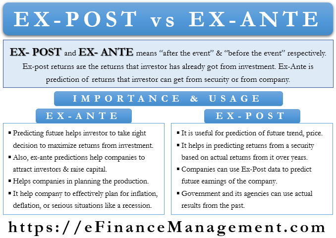

## Table of Contents

## What does 'ex-post' mean in the context of financial analysis?

In financial analysis, 'ex-post' refers to looking at data or events after they have happened. It's like checking the results of a test after it's been graded. Analysts use ex-post analysis to see how well investments or strategies performed in the past. This helps them understand what worked and what didn't.

For example, if an investor wants to know how a stock did last year, they would use ex-post data to see the actual returns. This is different from 'ex-ante,' which means looking at expected future results. Ex-post analysis is useful for making better decisions in the future because it gives a clear picture of past performance.

## What does 'ex-ante' refer to in economic forecasting?

In economic forecasting, 'ex-ante' means looking at things before they happen. It's like trying to guess what will happen in the future based on what we know now. Economists use ex-ante analysis to make predictions about how the economy might do, how much people might spend, or how businesses might grow. This helps them plan and make decisions based on what they think will happen.

For example, if a government wants to know how a new tax might affect the economy, they would use ex-ante analysis to estimate the impact before the tax is put in place. This kind of forecasting is important because it helps policymakers and businesses prepare for different possible outcomes. Even though ex-ante predictions aren't always right, they give a useful starting point for planning and decision-making.

## How do ex-post and ex-ante differ in their application?

Ex-ante and ex-post are two ways to look at things, but they are used at different times and for different reasons. Ex-ante is all about looking forward and trying to guess what might happen. For example, if a company wants to know how much money they might make next year, they use ex-ante analysis to make a guess based on what they know now. This helps them plan and make decisions about things like how much to invest or how many people to hire.

On the other hand, ex-post looks at what has already happened. It's like checking the score after the game is over. For instance, if that same company wants to see how much money they actually made last year, they would use ex-post analysis to look at the real numbers. This helps them understand what worked and what didn't, so they can make better plans for the future.

Both ex-ante and ex-post are important, but they serve different purposes. Ex-ante helps with planning and preparing for the future, while ex-post helps with learning from the past. By using both, people can make smarter decisions and improve their strategies over time.

## Can you provide a simple example of an ex-post calculation?

Imagine you saved money in a piggy bank last year, and you want to know how much you saved. To find out, you open the piggy bank and count all the money inside. That's an ex-post calculation because you're looking at what actually happened after the year was over. You might find you saved $100, which is the real, final amount.

This kind of calculation is useful because it tells you the truth about the past. If you thought you'd save $150 but only saved $100, you can see where you went wrong. Maybe you spent more than you planned, or maybe you didn't put as much money into the piggy bank as you thought. Knowing this helps you make better plans for saving money next year.

## What is an example of an ex-ante calculation in a business scenario?

Imagine a small bakery wants to know how much money they might make next month. They use an ex-ante calculation to make a guess. They look at how many cakes and cookies they usually sell, how much they charge for each, and how much it costs to make them. They also think about any special events happening next month, like a big festival that might bring in more customers. By putting all this information together, they predict they might make $5,000 next month.

This kind of guess helps the bakery plan for the future. If they think they'll make $5,000, they can decide how much flour and sugar to buy, how many workers they need, and if they can afford to buy a new oven. Even though their guess might not be exactly right, it gives them a good starting point for making decisions. It's like trying to plan a trip without knowing the exact weather; you use what you know to make the best plan possible.

## How are ex-post evaluations used in assessing investment performance?

Ex-post evaluations are used in assessing investment performance by looking at how an investment actually did after a certain period of time. For example, if you bought a stock a year ago, an ex-post evaluation would tell you exactly how much money you made or lost from that stock over that year. This kind of evaluation is important because it gives you the real numbers, not just guesses or predictions. By looking at these actual results, investors can see which investments were successful and which ones were not.

Using ex-post evaluations helps investors learn from their past choices. If an investor sees that a certain stock did really well, they might decide to invest more in similar stocks in the future. On the other hand, if a stock did poorly, they might choose to avoid similar investments. This learning process is key to improving investment strategies over time. By understanding what worked and what didn't, investors can make smarter decisions and hopefully do better in the future.

## What role does ex-ante analysis play in risk management?

Ex-ante analysis is like looking into a crystal ball to guess what might happen in the future. In risk management, this means trying to predict what risks might come up and how bad they could be. By doing this, people can plan ahead to avoid or reduce those risks. For example, a company might use ex-ante analysis to guess how likely it is that a big storm could damage their factory. If they think it's very likely, they might buy insurance or build stronger walls to protect their business.

Even though ex-ante predictions aren't always right, they help a lot with planning. When you know what might go wrong, you can set up ways to handle it before it happens. This could mean saving money for emergencies, having backup plans, or making sure everyone knows what to do if something bad happens. By thinking about risks ahead of time, businesses and people can be better prepared and feel more secure about the future.

## What are the common challenges faced when performing ex-post analysis?

One common challenge when doing ex-post analysis is getting the right data. Sometimes the information you need is hard to find or not complete. For example, if you want to know how much money you made from an investment, you need to have all the records of what you bought and sold, and any fees you paid. If some of those records are missing or wrong, your analysis won't be accurate.

Another challenge is making sure you're comparing things fairly. When you look at how well something did in the past, you need to think about all the things that could have affected it. For example, if you're looking at how a stock did, you need to consider things like the overall economy, news about the company, or even world events. If you don't take these things into account, you might think the stock did well or poorly for the wrong reasons.

Lastly, it can be hard to learn the right lessons from ex-post analysis. Just because something worked in the past doesn't mean it will work the same way in the future. For example, if a certain investment made a lot of money last year, it might not do the same this year if conditions change. So, it's important to be careful about what you take away from the analysis and not jump to conclusions too quickly.

## How can biases affect the accuracy of ex-ante predictions?

Biases can make ex-ante predictions less accurate because they can make people see things in a way that isn't completely true. For example, if someone really wants a certain thing to happen, like a new project at work to be successful, they might only look at the good things that could happen and ignore the bad things. This is called optimism bias. Because of this, they might think the project will do better than it really will. Another bias is confirmation bias, where people pay more attention to information that agrees with what they already think. If someone believes a certain stock will go up, they might only look at news that says it will, and miss out on news that says it might go down.

These biases can lead to big mistakes in planning and decision-making. If people's guesses about the future are off because of biases, they might not prepare for the right things. For example, if a business thinks a new product will sell really well because they're too optimistic, they might make too many and end up losing money. Or, if they only look at information that supports their ideas, they might miss important warnings and be surprised when things don't go as planned. Being aware of these biases and trying to see things from different angles can help make ex-ante predictions more accurate and useful.

## What advanced statistical methods are used in ex-post analysis for more precise results?

In ex-post analysis, one common advanced statistical method is regression analysis. This method helps figure out how different things affect the results you're looking at. For example, if you want to know what made a stock go up or down, regression analysis can show you how much things like the economy, company news, or even the weather mattered. By using this, you can get a clearer picture of why things turned out the way they did. It's like solving a puzzle to see which pieces were most important.

Another method is time series analysis, which looks at how things change over time. This is helpful for understanding patterns and trends in the data. For instance, if you're looking at how a company's profits have changed over the last few years, time series analysis can help you spot if there are seasons when the company does better or worse. It can also help predict what might happen next based on what's happened before. By using these advanced methods, ex-post analysis becomes more precise and gives a deeper understanding of past events.

## How do financial models incorporate both ex-ante and ex-post data for better forecasting?

Financial models use both ex-ante and ex-post data to make better guesses about the future. Ex-ante data helps the model predict what might happen by looking at things like expected sales, costs, and economic trends. For example, if a company wants to know how much money it might make next year, the model can use ex-ante data to guess based on what they know now. This helps the company plan for things like how much to spend on new projects or how many people to hire.

Ex-post data, on the other hand, gives the model real information about what has already happened. This helps the model learn from the past and check if its guesses were right. For instance, after the year is over, the company can look at how much money they actually made and compare it to what the model predicted. By using both types of data, the financial model can improve its guesses over time. It's like using a map to plan a trip and then using the trip's actual route to make the map better for the next journey.

## What are the latest research findings on improving the integration of ex-ante and ex-post analyses in economic policy-making?

Recent research in economic policy-making shows that combining ex-ante and ex-post analyses can lead to better decision-making. Researchers have found that using ex-ante analysis helps policymakers predict the effects of new policies before they are put in place. For example, if a government wants to know how a new tax might affect the economy, they can use ex-ante analysis to make guesses. This helps them plan and prepare for different outcomes. By also using ex-post analysis, policymakers can check how well their predictions matched up with what actually happened. This allows them to learn from their mistakes and make more accurate guesses in the future.

One important finding is that integrating these two types of analyses requires good data and strong communication between different parts of the government. Researchers have suggested using advanced statistical methods like machine learning to improve how ex-ante and ex-post data are analyzed together. This can help find patterns and connections that might be missed otherwise. For instance, machine learning can help predict how a policy might affect different groups of people and then check those predictions against real results. By doing this, policymakers can make more informed decisions and adjust their strategies based on what they learn from the past.

## What are Ex-Ante Forecasting Techniques in Algo Trading?

Ex-ante forecasting techniques are central to the strategic framework of [algorithmic trading](/wiki/algorithmic-trading), as they provide a predictive outlook based on current and historical data. These techniques enable traders to anticipate market movements and make informed trading decisions. The primary methods utilized in ex-ante forecasting include statistical models, [machine learning](/wiki/machine-learning) algorithms, and sentiment analysis.

Statistical models form the foundation of quantitative forecasting, with techniques such as Autoregressive Integrated Moving Average (ARIMA) and Generalized Autoregressive Conditional Heteroskedasticity (GARCH) being particularly prevalent. The ARIMA model is used to understand and predict future points in a time series by utilizing its past values. It combines differencing to handle non-stationary data with autoregression and moving average components to model temporal dependencies. The mathematical representation of an ARIMA (p, d, q) model is:

$$
Y_t = c + \phi_1 Y_{t-1} + \phi_2 Y_{t-2} + \cdots + \phi_p Y_{t-p} + \epsilon_t + \theta_1 \epsilon_{t-1} + \theta_2 \epsilon_{t-2} + \cdots + \theta_q \epsilon_{t-q}
$$

where $\phi$ and $\theta$ represent the autoregressive and moving average parameters, respectively, and $\epsilon_t$ is the white noise error term.

GARCH models, on the other hand, are employed to forecast and model the [volatility](/wiki/volatility-trading-strategies) of returns, addressing the clustering phenomena often observed in financial markets. The GARCH (p, q) model predicts the variance of the current error term as a function of the squared errors and variances from past periods:

$$
\sigma_t^2 = \alpha_0 + \sum_{i=1}^{p} \alpha_i \epsilon_{t-i}^2 + \sum_{j=1}^{q} \beta_j \sigma_{t-j}^2
$$

where $\sigma_t^2$ is the forecasted variance, $\epsilon_{t-i}^2$ are the lagged squared returns, and $\alpha$ and $\beta$ are parameters.

Machine learning techniques enhance ex-ante forecasting by uncovering patterns that traditional models might miss. Decision trees and neural networks are widely used in this domain. Decision trees split data based on feature values, providing a hierarchical decision process that is easy to interpret. Neural networks, however, offer the ability to model complex, non-linear relationships between inputs and outputs, making them powerful tools in capturing intricate market patterns.

Incorporating macroeconomic indicators such as interest rates, employment data, and GDP growth can enhance predictive accuracy. These indicators provide contextual information about the broader economic landscape, influencing asset prices and market behaviors. Sentiment analysis, achieved through natural language processing (NLP) techniques, assesses market sentiment by analyzing textual data from news articles, financial reports, and social media platforms. This analysis aids in understanding public perception and its potential impact on market trends.

Python has emerged as a popular language for implementing these techniques, thanks to its extensive libraries such as statsmodels for statistical models, scikit-learn for machine learning, and nltk or transformers for sentiment analysis. For example, implementing an ARIMA model can be achieved with:

```python
import pandas as pd
from statsmodels.tsa.arima.model import ARIMA

# Load time series data
data = pd.read_csv('historical_data.csv')
model = ARIMA(data['price'], order=(5, 1, 0)) 
fit = model.fit()

# Forecast future values
forecast = fit.forecast(steps=10)
print(forecast)
```

In summary, ex-ante forecasting techniques in algorithmic trading combine statistical models, machine learning, macroeconomic indicators, and sentiment analysis to predict market trends. This multifaceted approach enhances predictive accuracy, aiding traders in making data-driven decisions.

## What is Ex-Post Analysis in Algo Trading?

Ex-post analysis plays a crucial role in evaluating the performance of trading strategies by leveraging historical data to identify successful elements and pinpoint areas requiring improvement. This retrospective assessment is vital for continuously refining trading strategies, effectively managing risk, and optimizing future trading outcomes.

The use of performance metrics is central to ex-post analysis. Key metrics include Return on Investment (ROI), the Sharpe Ratio, and Maximum Drawdown. ROI measures the profitability of a trading strategy by comparing the net profit to the initial investment. It is expressed as:

$$
\text{ROI} = \left(\frac{\text{Current Value of Investment} - \text{Cost of Investment}}{\text{Cost of Investment}}\right) \times 100\%
$$

The Sharpe Ratio is another fundamental metric, providing insights into risk-adjusted returns. Developed by William F. Sharpe, this ratio indicates how much excess return is received for the extra volatility endured by holding a riskier asset. It is calculated as:

$$
\text{Sharpe Ratio} = \frac{\text{Expected Portfolio Return} - \text{Risk-Free Rate}}{\text{Standard Deviation of Portfolio Return}}
$$

A higher Sharpe Ratio indicates a more favorable risk-adjusted return, helping traders choose strategies that reward them for the risks assumed.

Maximum Drawdown (Max Drawdown) is crucial for understanding the potential risk associated with a trading strategy. It measures the largest peak-to-trough decline in the value of an investment before a new peak is reached, providing insight into potential losses. It is expressed as:

$$
\text{Max Drawdown} = \frac{\text{Trough Value} - \text{Peak Value}}{\text{Peak Value}} \times 100\%
$$

These performance metrics provide a framework for assessing the effectiveness of trading strategies. By analyzing these metrics, traders can determine which strategies yield consistent returns, which are too volatile, and which fail to deliver adequate risk-adjusted returns.

Incorporating ex-post analysis allows traders to fine-tune their strategies by retaining beneficial components and discarding ineffective ones. This ongoing refinement process not only enhances risk management by helping limit future losses but also optimizes strategy performance to align with evolving market conditions. Moreover, ex-post analysis facilitates learning from past experiences, thereby fostering improvement and adaptability in trading methods.

Overall, ex-post analysis provides traders with vital insights to continuously enhance their trading strategies' effectiveness, manage risks efficiently, and ultimately achieve better financial performance in the dynamic landscape of algorithmic trading.

## References & Further Reading

1. Tsay, R. S. (2005). "Analysis of Financial Time Series." John Wiley & Sons. This book provides comprehensive coverage of financial time series analysis techniques, including ARIMA and GARCH models, which are essential for ex-ante forecasting.

2. Hull, J. (2018). "Options, Futures, and Other Derivatives." Pearson. Hull's book offers insights into financial derivatives and risk management strategies, which are relevant for understanding the role of ex-post analysis in trading.

3. Murphy, J. J. (1999). "Technical Analysis of the Financial Markets." New York Institute of Finance. A fundamental resource for technical analysis techniques used in both ex-ante and ex-post analyses to predict and evaluate market trends.

4. Goodfellow, I., Bengio, Y., & Courville, A. (2016). "Deep Learning." MIT Press. This book explores deep learning technologies, which are transforming ex-ante forecasting through the application of neural networks.

5. Tetlock, P. C., Saar-Tsechansky, M., & Macskassy, S. (2008). "More than Words: Quantifying Language to Measure Firms' Fundamentals." Journal of Finance, 63(3), 1437-1467. An academic paper discussing the use of sentiment analysis in financial forecasting, contributing to ex-ante methodologies.

6. Lo, A. W. (2005). "Reconciling efficient markets with behavioral finance: the adaptive markets hypothesis." Journal of Investment Consulting, 7(2), 21-44. This article is critical for understanding market dynamics and their implications for algorithmic trading strategies.

7. Chan, E. (2013). "Algorithmic Trading: Winning Strategies and Their Rationale." Wiley. Eric Chan provides practical insights and strategies for implementing algorithmic trading, integrating both ex-ante and ex-post analyses.

8. Armstrong, J. S. (2001). "Principles of Forecasting: A Handbook for Researchers and Practitioners." Springer. A collection of forecasting principles applicable to ex-ante analysis within financial markets.

9. Jorion, P. (2007). "Value at Risk: The New Benchmark for Managing Financial Risk." McGraw-Hill. This book is essential for those interested in risk management techniques, aligned with the goals of ex-post analysis in identifying and mitigating trading risks.

10. Schwab, K. (2016). "The Fourth Industrial Revolution." Currency. Provides insights into the technological advancements transforming sectors, including financial markets, where algorithmic trading is significantly impacted.

Further readings can include articles and working papers available in financial journals and conference proceedings, exploring the latest developments in financial analysis. Online platforms providing courses on machine learning and algorithmic trading, such as Coursera and edX, contribute to a deeper understanding of the topics discussed.

