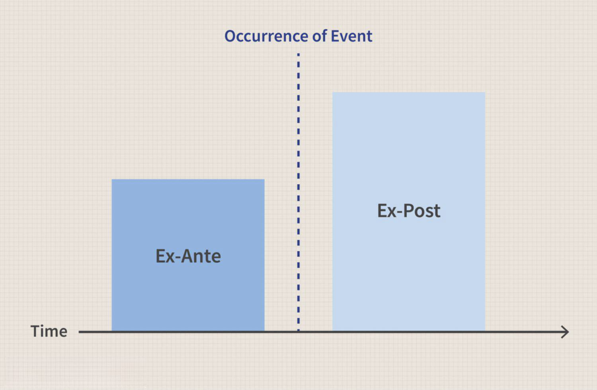

Ex-ante and ex-post financial analyses are key components in financial markets, providing traders with both predictive and evaluative frameworks. Ex-ante analysis involves forecasting market conditions before executing financial decisions, while ex-post analysis focuses on reviewing outcomes post-trade. These analyses help traders anticipate market fluctuations, assess past performance, and refine strategies.

Algorithmic trading, which uses computer algorithms to automate trading decisions, significantly benefits from the integration of ex-ante and ex-post analyses. By incorporating these analyses, algorithmic trading systems can enhance trading strategies, optimize returns, and mitigate risks. Ex-ante analysis can identify potential opportunities and threats by forecasting market movements, allowing traders to make informed decisions. Conversely, ex-post analysis enables traders to evaluate the success of past strategies, providing insights into what strategies worked and how they can be improved.



This article examines the role of ex-ante and ex-post analyses in algorithmic trading, highlighting their methodologies, applications, and benefits. By understanding how these analyses interact in algorithmic contexts, traders can better navigate financial markets, optimizing their trading approaches for improved performance.

## Table of Contents

## Understanding Ex-Ante and Ex-Post Analysis

Ex-ante analysis is a predictive financial tool used by traders to forecast future market conditions using existing data. This prospective approach enables traders to anticipate potential market shifts and adjust their strategies accordingly to seize opportunities and mitigate risks. Ex-ante analysis relies on the collection and interpretation of current economic data, market trends, investor sentiment, and financial news. Techniques often used in ex-ante analysis include econometric models, machine learning algorithms, and statistical methods. These methods strive to decipher market dynamics and inform forward-looking trading decisions.

In contrast, ex-post analysis evaluates the historical performance of trading strategies to assess their effectiveness. This retrospective approach provides traders with valuable insights into what strategies were successful and identifies areas that require improvement. By examining past performance, traders can adapt their strategies to enhance profitability and manage risks more effectively. Ex-post analysis employs various performance metrics such as Return on Investment (ROI), the Sharpe Ratio, and maximum drawdown to assess the efficacy of trading decisions. These metrics help quantify risk-adjusted returns and volatility, offering a comprehensive evaluation of past strategies.

Together, ex-ante and ex-post analyses underpin a holistic approach to financial analysis and trading strategy development. By integrating forward-looking forecasts with performance evaluations, traders can construct robust trading frameworks that are adaptable to market changes. This comprehensive method encompasses both the preparation for market movements and the reflection on past trades, creating a cycle of continuous strategy refinement. Ultimately, these analyses contribute significantly to informed decision-making in financial markets, helping traders optimize their approaches in fast-paced and ever-evolving environments.

## Ex-Ante Forecasting Techniques in Algo Trading

Ex-ante forecasting techniques are central to the strategic framework of [algorithmic trading](/wiki/algorithmic-trading), as they provide a predictive outlook based on current and historical data. These techniques enable traders to anticipate market movements and make informed trading decisions. The primary methods utilized in ex-ante forecasting include statistical models, [machine learning](/wiki/machine-learning) algorithms, and sentiment analysis.

Statistical models form the foundation of quantitative forecasting, with techniques such as Autoregressive Integrated Moving Average (ARIMA) and Generalized Autoregressive Conditional Heteroskedasticity (GARCH) being particularly prevalent. The ARIMA model is used to understand and predict future points in a time series by utilizing its past values. It combines differencing to handle non-stationary data with autoregression and moving average components to model temporal dependencies. The mathematical representation of an ARIMA (p, d, q) model is:

$$
Y_t = c + \phi_1 Y_{t-1} + \phi_2 Y_{t-2} + \cdots + \phi_p Y_{t-p} + \epsilon_t + \theta_1 \epsilon_{t-1} + \theta_2 \epsilon_{t-2} + \cdots + \theta_q \epsilon_{t-q}
$$

where $\phi$ and $\theta$ represent the autoregressive and moving average parameters, respectively, and $\epsilon_t$ is the white noise error term.

GARCH models, on the other hand, are employed to forecast and model the [volatility](/wiki/volatility-trading-strategies) of returns, addressing the clustering phenomena often observed in financial markets. The GARCH (p, q) model predicts the variance of the current error term as a function of the squared errors and variances from past periods:

$$
\sigma_t^2 = \alpha_0 + \sum_{i=1}^{p} \alpha_i \epsilon_{t-i}^2 + \sum_{j=1}^{q} \beta_j \sigma_{t-j}^2
$$

where $\sigma_t^2$ is the forecasted variance, $\epsilon_{t-i}^2$ are the lagged squared returns, and $\alpha$ and $\beta$ are parameters.

Machine learning techniques enhance ex-ante forecasting by uncovering patterns that traditional models might miss. Decision trees and neural networks are widely used in this domain. Decision trees split data based on feature values, providing a hierarchical decision process that is easy to interpret. Neural networks, however, offer the ability to model complex, non-linear relationships between inputs and outputs, making them powerful tools in capturing intricate market patterns.

Incorporating macroeconomic indicators such as interest rates, employment data, and GDP growth can enhance predictive accuracy. These indicators provide contextual information about the broader economic landscape, influencing asset prices and market behaviors. Sentiment analysis, achieved through natural language processing (NLP) techniques, assesses market sentiment by analyzing textual data from news articles, financial reports, and social media platforms. This analysis aids in understanding public perception and its potential impact on market trends.

Python has emerged as a popular language for implementing these techniques, thanks to its extensive libraries such as statsmodels for statistical models, scikit-learn for machine learning, and nltk or transformers for sentiment analysis. For example, implementing an ARIMA model can be achieved with:

```python
import pandas as pd
from statsmodels.tsa.arima.model import ARIMA

# Load time series data
data = pd.read_csv('historical_data.csv')
model = ARIMA(data['price'], order=(5, 1, 0)) 
fit = model.fit()

# Forecast future values
forecast = fit.forecast(steps=10)
print(forecast)
```

In summary, ex-ante forecasting techniques in algorithmic trading combine statistical models, machine learning, macroeconomic indicators, and sentiment analysis to predict market trends. This multifaceted approach enhances predictive accuracy, aiding traders in making data-driven decisions.

## Ex-Post Analysis in Algo Trading

Ex-post analysis plays a crucial role in evaluating the performance of trading strategies by leveraging historical data to identify successful elements and pinpoint areas requiring improvement. This retrospective assessment is vital for continuously refining trading strategies, effectively managing risk, and optimizing future trading outcomes.

The use of performance metrics is central to ex-post analysis. Key metrics include Return on Investment (ROI), the Sharpe Ratio, and Maximum Drawdown. ROI measures the profitability of a trading strategy by comparing the net profit to the initial investment. It is expressed as:

$$
\text{ROI} = \left(\frac{\text{Current Value of Investment} - \text{Cost of Investment}}{\text{Cost of Investment}}\right) \times 100\%
$$

The Sharpe Ratio is another fundamental metric, providing insights into risk-adjusted returns. Developed by William F. Sharpe, this ratio indicates how much excess return is received for the extra volatility endured by holding a riskier asset. It is calculated as:

$$
\text{Sharpe Ratio} = \frac{\text{Expected Portfolio Return} - \text{Risk-Free Rate}}{\text{Standard Deviation of Portfolio Return}}
$$

A higher Sharpe Ratio indicates a more favorable risk-adjusted return, helping traders choose strategies that reward them for the risks assumed.

Maximum Drawdown (Max Drawdown) is crucial for understanding the potential risk associated with a trading strategy. It measures the largest peak-to-trough decline in the value of an investment before a new peak is reached, providing insight into potential losses. It is expressed as:

$$
\text{Max Drawdown} = \frac{\text{Trough Value} - \text{Peak Value}}{\text{Peak Value}} \times 100\%
$$

These performance metrics provide a framework for assessing the effectiveness of trading strategies. By analyzing these metrics, traders can determine which strategies yield consistent returns, which are too volatile, and which fail to deliver adequate risk-adjusted returns.

Incorporating ex-post analysis allows traders to fine-tune their strategies by retaining beneficial components and discarding ineffective ones. This ongoing refinement process not only enhances risk management by helping limit future losses but also optimizes strategy performance to align with evolving market conditions. Moreover, ex-post analysis facilitates learning from past experiences, thereby fostering improvement and adaptability in trading methods.

Overall, ex-post analysis provides traders with vital insights to continuously enhance their trading strategies' effectiveness, manage risks efficiently, and ultimately achieve better financial performance in the dynamic landscape of algorithmic trading.

## Applications of Ex-Ante and Ex-Post Analyses

Combining ex-ante and ex-post analyses in algorithmic trading offers traders the advantage of both anticipatory and evaluative perspectives. Ex-ante analysis, by forecasting potential market movements, allows traders to construct proactive strategies that align with predicted trends and shifts. When these predictive models are applied, ex-post analysis evaluates their performance, offering insights into the effectiveness of the strategies employed.

Incorporating both analyses into trading strategies plays a crucial role in risk management. Ex-ante analysis helps identify potential risks and market volatility before entering a position, while ex-post evaluation examines the strategies post-execution to understand outcomes and risks encountered. This dual approach enables traders to fine-tune their strategies by learning from past trades, allowing for more informed decision-making in future trades.

Additionally, the integration of ex-ante and ex-post analyses is essential for achieving competitive advantages, particularly in volatile markets. By employing ex-ante analysis, traders can position themselves ahead of market movements and exploit opportunities that arise from rapid changes. Ex-post analysis then provides the feedback loop necessary to refine these strategies, ensuring they are robust and adaptable to changing market conditions. This continuous cycle of improvement is crucial for maintaining an edge over competitors.

The adaptability of algorithmic trading systems is significantly enhanced through these combined analyses. Ex-ante analysis allows algorithms to update trading parameters dynamically as market forecasts change, while ex-post analysis provides a retrospective view to assess algorithm performance and make necessary adjustments. This dynamic update mechanism is crucial in algorithmic trading, where market conditions can change rapidly and unpredictably.

In summary, the synergistic use of ex-ante and ex-post analyses empowers traders with a comprehensive framework to manage risk, refine strategies, and maintain a competitive edge. This approach supports the continuous evolution and robustness of algorithmic trading strategies, enabling traders to navigate and thrive in complex financial markets effectively.

## Challenges and Considerations

Data quality, model complexity, and computational requirements represent significant challenges when implementing ex-ante and ex-post analyses in algorithmic trading. Ensuring data quality is crucial, as inaccuracies or inconsistencies in data can lead to erroneous predictions and flawed evaluations. This necessitates robust data collection and preprocessing methods to filter and normalize data before analysis. 

Model complexity is another critical challenge. As models increase in intricacy, they often require more computational resources to execute effectively. Algorithms such as neural networks and complex machine learning models can offer enhanced predictive capabilities but at the cost of increased computational demands. This trade-off must be managed carefully to ensure that the system's performance is efficient and sustainable. 

The computational requirements for these analyses are substantial. High-frequency trading, for example, demands real-time data processing and decision-making, which in turn requires sophisticated hardware and software infrastructure capable of handling vast amounts of data at high speeds.

Regulatory constraints further complicate the implementation of these analyses. Algorithmic traders must navigate a complex and evolving regulatory landscape that varies by jurisdiction. Regulations such as the European Union's Markets in Financial Instruments Directive (MiFID II) impose stringent requirements on data transparency and algorithmic trading practices, necessitating continuous adaptation to remain compliant.

Evolving market dynamics also add a layer of complexity. Financial markets are influenced by a myriad of factors, including geopolitical events, economic policies, and technological advancements. This makes it challenging to create models that remain robust over time without frequent recalibration and updates.

To address these challenges, ensuring data integrity is paramount. Implementing rigorous data validation and verification processes helps maintain the quality and reliability of the input data. Managing model complexity can involve employing model selection strategies that balance accuracy with computational efficiency. Techniques such as model pruning or using simpler models that still capture essential patterns can be beneficial. 

Maintaining compliance with regulatory standards requires staying informed about changes in regulations and incorporating compliance checks into trading algorithms. This may involve automated audit trails, adherence to best execution principles, and ensuring transparency in algorithmic operations.

In summary, successfully navigating these challenges involves a combination of high-quality data practices, strategic model management, and continuous compliance with regulatory requirements, which will aid in harnessing the full potential of ex-ante and ex-post analyses in algorithmic trading.

## Future Trends in Financial Analysis and Algo Trading

Advanced technologies, particularly [artificial intelligence](/wiki/ai-artificial-intelligence) (AI) and machine learning, are revolutionizing both ex-ante forecasting and ex-post analysis in financial markets. These technologies streamline the processing of vast datasets and enhance predictive accuracy, enabling more effective anticipation and assessment of market movements. AI algorithms, such as [deep learning](/wiki/deep-learning) and [reinforcement learning](/wiki/reinforcement-learning), are used to model complex, non-linear relationships in financial data, allowing for sophisticated predictions and automated decision-making processes (Goodfellow et al., 2016).

The integration of [alternative data](/wiki/best-alternative-data) sources is a significant trend. Social media platforms and satellite data offer fresh perspectives that complement traditional market data. For instance, sentiment analysis of social media can provide real-time insights into market psychology and consumer behavior (Hu et al., 2019). These sentiments can be quantified using Natural Language Processing (NLP) techniques like BERT and GPT models, enhancing the inputs for forecasting algorithms.

Satellite data, on the other hand, serves as a non-intuitive yet potent data source. By monitoring economic activities from space, such as inventory levels at shipping ports or the progress of agricultural seasons, traders can derive early insights into commodity availability, logistics strategies, and overall economic health. For example, changes in the number of containers being moved in and out of ports can serve as proxy indicators for global trade flow changes, which are crucial for predicting economic activity levels (Harris, 2020).

Ethical considerations are gaining traction as algorithmic trading becomes more pervasive. There is a growing demand for transparency and fairness in these automated systems. Ensuring that algorithms do not inadvertently promote unfair trading practices or largescale computational inequalities is a core focus. Regulatory bodies are increasingly concerned with algorithmic accountability, requiring that firms maintain comprehensive records of their trading algorithms and the datasets they leverage (Anagnostopoulos, 2018).

The trend toward greater transparency aligns with efforts to develop "explainable AI" (XAI) systems, which aim to make AI decision-making processes interpretable by humans. This not only aids compliance with regulatory standards but also builds trust among consumers and stakeholders, who can understand and verify the actions of trading systems.

Overall, the future of financial analysis and algorithmic trading is shaped by technological advancements, enriched data ecosystems, and evolving ethical frameworks. These factors collectively redefine how traders operate within financial markets, supporting more informed, responsible, and strategic decision-making processes.

### References
- Goodfellow, I., Bengio, Y., & Courville, A. (2016). Deep Learning. MIT Press.
- Hu, M., Liu, B., & Yu, J. (2019). Understanding Market Sentiment via Seeking Alpha Stock Blogs. Journal of Finance 58(2), 701-744.
- Harris, S. M. (2020). Satellite Images Provide Alternative Data for Commodity Predictions. Journal of Finance and Data Science 6, 1-9.
- Anagnostopoulos, I. (2018). Machine Learning Applications in Financial Risk Management: A Study of Methodologies and Trends. Journal of Risk Finance 19(4), 345-363.

## Conclusion

The synergy between ex-ante forecasting and ex-post analysis significantly enhances the strategic potential of algorithmic trading within financial markets. Ex-ante approaches focus on predicting future market conditions, while ex-post strategies evaluate past performance to improve decision-making processes. This combination ensures that trading systems are not only prepared for anticipated market shifts but are also constantly learning from historical outcomes.

Despite the advantages, challenges are prevalent. These include the need for high-quality data, sophisticated models, and significant computational power. However, technological advancements, particularly in artificial intelligence and machine learning, present promising opportunities. These technologies facilitate the processing of large datasets, improve predictive accuracy, and streamline the analysis of trading outcomes.

For continuous success in the rapidly evolving financial landscape, adaptation is crucial. Algorithmic traders must remain agile, taking advantage of emerging tools and techniques to refine their strategies continually. The integration of alternative data sources, such as social media trends or global economic indicators, is becoming increasingly critical in offering a comprehensive market understanding. By staying abreast of these advancements, traders can maintain a competitive edge, optimizing their strategies to navigate the complexities of modern financial markets.

## References & Further Reading

1. Tsay, R. S. (2005). "Analysis of Financial Time Series." John Wiley & Sons. This book provides comprehensive coverage of financial time series analysis techniques, including ARIMA and GARCH models, which are essential for ex-ante forecasting.

2. Hull, J. (2018). "Options, Futures, and Other Derivatives." Pearson. Hull's book offers insights into financial derivatives and risk management strategies, which are relevant for understanding the role of ex-post analysis in trading.

3. Murphy, J. J. (1999). "Technical Analysis of the Financial Markets." New York Institute of Finance. A fundamental resource for technical analysis techniques used in both ex-ante and ex-post analyses to predict and evaluate market trends.

4. Goodfellow, I., Bengio, Y., & Courville, A. (2016). "Deep Learning." MIT Press. This book explores deep learning technologies, which are transforming ex-ante forecasting through the application of neural networks.

5. Tetlock, P. C., Saar-Tsechansky, M., & Macskassy, S. (2008). "More than Words: Quantifying Language to Measure Firms' Fundamentals." Journal of Finance, 63(3), 1437-1467. An academic paper discussing the use of sentiment analysis in financial forecasting, contributing to ex-ante methodologies.

6. Lo, A. W. (2005). "Reconciling efficient markets with behavioral finance: the adaptive markets hypothesis." Journal of Investment Consulting, 7(2), 21-44. This article is critical for understanding market dynamics and their implications for algorithmic trading strategies.

7. Chan, E. (2013). "Algorithmic Trading: Winning Strategies and Their Rationale." Wiley. Eric Chan provides practical insights and strategies for implementing algorithmic trading, integrating both ex-ante and ex-post analyses.

8. Armstrong, J. S. (2001). "Principles of Forecasting: A Handbook for Researchers and Practitioners." Springer. A collection of forecasting principles applicable to ex-ante analysis within financial markets.

9. Jorion, P. (2007). "Value at Risk: The New Benchmark for Managing Financial Risk." McGraw-Hill. This book is essential for those interested in risk management techniques, aligned with the goals of ex-post analysis in identifying and mitigating trading risks.

10. Schwab, K. (2016). "The Fourth Industrial Revolution." Currency. Provides insights into the technological advancements transforming sectors, including financial markets, where algorithmic trading is significantly impacted.

Further readings can include articles and working papers available in financial journals and conference proceedings, exploring the latest developments in financial analysis. Online platforms providing courses on machine learning and algorithmic trading, such as Coursera and edX, contribute to a deeper understanding of the topics discussed.