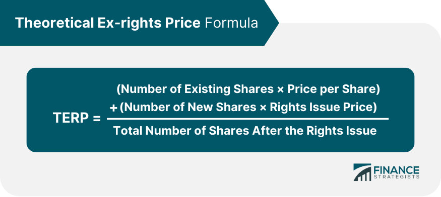

## Table of Contents

## What are ex-rights in finance?

Ex-rights in finance refers to a situation where a company's stock is trading without the rights to a specific corporate action, usually a rights issue. A rights issue is when a company offers its existing shareholders the right to buy additional shares at a discounted price before the shares are offered to the public. When a stock goes ex-rights, it means that new buyers of the stock will not be entitled to participate in the rights issue. This typically happens after the record date, which is the cut-off date set by the company to determine which shareholders are eligible for the rights.

The term "ex-rights" is important because it affects the stock's price. When a stock goes ex-rights, its price usually drops to reflect the fact that new buyers are not getting the rights that existing shareholders have. This price adjustment helps to maintain fairness in the market. For example, if a stock was trading at $10 before going ex-rights and the rights are worth $2, the stock might drop to around $8 after going ex-rights. This way, the overall value of the stock remains the same, but it is split between the stock itself and the rights.

## How do ex-rights affect shareholders?

When a company goes ex-rights, it means that the stock is trading without the rights to buy new shares at a discount. For existing shareholders who own the stock before the ex-rights date, this is good news. They get to buy more shares at a lower price, which can increase their ownership in the company. This can be a great opportunity for shareholders to invest more in the company they believe in, without spending as much money as they would if they bought the shares on the open market.

For shareholders who buy the stock after it goes ex-rights, the situation is different. They do not get the chance to buy the new shares at a discount. This means they miss out on the potential benefit that existing shareholders get. Also, when a stock goes ex-rights, its price usually drops to account for the value of the rights. So, new buyers might see the stock price as lower, but they are not getting the extra value that comes with the rights. This can make the stock seem cheaper, but it's important for new investors to understand that they are not getting the full package that existing shareholders have.

## What is the difference between ex-rights and cum-rights?

Ex-rights and cum-rights are terms used when a company offers its shareholders the chance to buy more shares at a lower price. When a stock is trading cum-rights, it means that the stock includes the right to buy these new shares at a discount. If you own the stock during this time, you get to take part in the special offer. This is good for shareholders because they can increase their ownership in the company without spending as much money.

On the other hand, when a stock goes ex-rights, it means that the stock no longer includes the right to buy the new shares at a discount. This happens after a certain date set by the company. If you buy the stock after it goes ex-rights, you won't get to take part in the special offer. The stock price usually drops when it goes ex-rights to account for the value of the rights that new buyers are missing out on. So, it's important to know the difference because it affects what you get when you buy the stock.

## How is the ex-rights date determined?

The ex-rights date is set by the company and the stock exchange where the company's shares are traded. This date is important because it marks the point when the stock starts trading without the rights to buy new shares at a discount. Usually, the ex-rights date is set a few days before the record date, which is the cut-off date to determine who gets the rights. This gives the stock exchange enough time to process the trades and make sure that only shareholders who own the stock before the ex-rights date get the rights.

The reason for setting the ex-rights date before the record date is to make things fair for everyone. If someone buys the stock on or after the ex-rights date, they won't get the rights because the stock is now trading without them. This means the stock price will drop to account for the value of the rights that new buyers are missing out on. By setting the ex-rights date a few days before the record date, the company and the stock exchange can ensure that the trading system works smoothly and that shareholders get what they are entitled to.

## What happens to the stock price on the ex-rights date?

When a stock goes ex-rights, its price usually drops. This happens because the stock no longer includes the right to buy new shares at a discount. The price drop reflects the value of the rights that new buyers are missing out on. For example, if the rights are worth $2 per share, the stock price might drop by about $2 on the ex-rights date.

This price adjustment helps keep things fair for everyone. Existing shareholders who owned the stock before the ex-rights date still have the rights, so their overall value stays the same. New buyers, on the other hand, buy the stock at a lower price but without the rights. This way, the market can account for the value of the rights and make sure that the stock price reflects what each group of shareholders is getting.

## Can you explain the process of a rights issue?

A rights issue is when a company lets its current shareholders buy more shares at a cheaper price before anyone else can. The company tells its shareholders about the rights issue and gives them a certain amount of time to decide if they want to buy the new shares. This time is called the subscription period. Shareholders get a certain number of rights based on how many shares they already own. For example, if you own 100 shares and the company says you get one right for every share you own, you'll get 100 rights. Each right lets you buy one new share at the discounted price.

When the rights issue is announced, the company sets a record date. This is the date that decides who gets the rights. If you own shares on or before the record date, you get the rights. A few days before the record date, the stock goes ex-rights. This means that if you buy the stock after this date, you won't get the rights. The stock price usually drops on the ex-rights date to account for the value of the rights. Shareholders can use their rights to buy the new shares, sell the rights to someone else, or let them expire if they don't want to buy more shares. Once the subscription period ends, the company issues the new shares to those who used their rights.

## How do ex-rights impact a company's capital structure?

When a company goes through a rights issue, it changes its capital structure. A rights issue means the company is selling more shares to raise money. This can increase the company's equity, which is the money it gets from selling shares. If shareholders buy the new shares, the company gets more cash to use for things like growing the business or paying off debts. This can make the company's balance sheet stronger because it has more money to work with.

However, when the stock goes ex-rights, it can affect how the company's capital is divided. The total number of shares goes up if shareholders use their rights to buy more shares. This means the ownership of the company gets spread out among more shares. If the company's total value stays the same, but the number of shares goes up, each share might be worth a little less. This can change the balance between debt and equity in the company's capital structure, depending on how many new shares are issued and how shareholders respond to the rights issue.

## What are the tax implications of ex-rights for investors?

When a company goes ex-rights, it can have tax implications for investors. If you own the stock before it goes ex-rights, you get the rights to buy new shares at a discount. If you decide to sell these rights, any profit you make from selling them might be taxed as capital gains. This depends on the tax laws in your country. Also, if you use your rights to buy more shares, the cost of those new shares can affect how much tax you pay when you sell them later. The tax rules can be different for each investor, so it's a good idea to talk to a tax advisor to understand how it works for you.

For investors who buy the stock after it goes ex-rights, the tax situation is simpler because they don't get the rights. They just buy the stock at a lower price because the rights are not included. When they sell the stock later, they might have to pay capital gains tax on any profit they make. The tax they pay will depend on how long they held the stock and the tax laws where they live. It's always a good idea to check with a tax professional to make sure you're doing everything right.

## How do investors calculate the theoretical ex-rights price (TERP)?

The theoretical ex-rights price (TERP) is a way to figure out what the stock price should be after it goes ex-rights. It helps investors understand how the value of the rights affects the stock price. To calculate the TERP, you need to know the current market price of the stock, the number of new shares the company is offering, and the price at which the new shares are being offered. You start by finding the total value of the company before the rights issue. This is done by multiplying the current market price by the total number of shares before the new shares are added. Then, you add the money the company will get from selling the new shares. This total value is then divided by the total number of shares after the new shares are issued, which gives you the TERP.

For example, let's say a company's stock is trading at $10 per share and there are 1 million shares outstanding. The company decides to issue 200,000 new shares at $8 each. First, you calculate the total value before the rights issue: $10 per share times 1 million shares equals $10 million. Then, you add the money from the new shares: 200,000 shares times $8 per share equals $1.6 million. So, the total value after the rights issue is $10 million plus $1.6 million, which equals $11.6 million. Now, divide this total value by the new total number of shares: $11.6 million divided by 1.2 million shares equals $9.67. So, the TERP is $9.67 per share. This means that after the stock goes ex-rights, it should trade at around $9.67 per share to reflect the value of the rights.

## What strategies can investors use around the ex-rights period?

Investors can use different strategies around the ex-rights period to make the most of their investments. One strategy is to buy the stock before it goes ex-rights. If you own the stock before the ex-rights date, you get the rights to buy new shares at a lower price. This can be a good opportunity to increase your ownership in the company without spending as much money. You can either use the rights to buy more shares or sell the rights to someone else if you think they're worth more than the cost of the new shares.

Another strategy is to wait until the stock goes ex-rights and then buy it at the lower price. When the stock goes ex-rights, its price usually drops to account for the value of the rights. If you believe in the company's future, buying the stock at this lower price can be a good deal, even though you won't get the rights. You just need to make sure you're okay with missing out on the chance to buy more shares at a discount. It's all about understanding what you want from your investment and making the choice that fits your goals.

## How do ex-rights influence a company's market perception and valuation?

When a company goes ex-rights, it can change how people see the company and its value. If the rights issue is seen as a good thing, like a way for the company to raise money to grow or pay off debts, it might make people feel more positive about the company. This can lead to a higher valuation because investors think the company is doing well and has a good plan for the future. On the other hand, if the rights issue is seen as a sign that the company needs money because it's in trouble, it might make people feel less confident. This can lead to a lower valuation because investors might worry about the company's future.

The stock price drop on the ex-rights date can also affect how people see the company. Even though the price drop is expected and reflects the value of the rights, it can still make some investors nervous. They might think the company is worth less now, even if the overall value hasn't really changed. It's important for investors to understand that the price drop is normal and doesn't necessarily mean the company is doing worse. The key is to look at the bigger picture and think about what the rights issue means for the company's future.

## What are some case studies of significant ex-rights events and their outcomes?

One significant ex-rights event happened with Vodafone in 2012. Vodafone announced a rights issue to raise money to buy the rest of its German business. They offered shareholders the chance to buy one new share for every 18 shares they owned at a discounted price. When the stock went ex-rights, the price dropped as expected, but many shareholders used their rights to buy more shares. This helped Vodafone raise the money it needed and showed that investors believed in the company's plan. The rights issue was seen as a success because it helped Vodafone grow its business in Germany.

Another case was with BP in 2010. After the Deepwater Horizon oil spill, BP needed money to pay for the cleanup and legal costs. They did a rights issue to raise this money. The stock price dropped when it went ex-rights, and not all shareholders were happy about it. Some sold their rights instead of buying more shares, which showed they were worried about BP's future. The rights issue helped BP get the money it needed, but it also made some investors think the company was in trouble. This shows how a rights issue can affect how people see a company, depending on why the company needs the money.

## What is Understanding Ex-Rights Finance?

Ex-rights finance is a critical concept in corporate finance, primarily associated with rights issues offered by companies to their shareholders. A rights issue occurs when a company offers its existing shareholders the opportunity to purchase additional shares at a discounted price before the shares are offered to the public. This corporate action is often a strategy to raise capital for various business needs, such as debt repayment, expansion projects, or improving cash reserves.

The term "ex-rights" refers to the period in which a stock is traded without the rights entitlements that were previously attached. After the ex-rights date, new buyers of the stock are not entitled to the aforementioned rights. This has significant implications for stock prices and investor decisions.

**Effects on Stock Prices and Investor Decisions**

Rights issues generally affect stock prices in a predictable manner. When a rights issue is announced, the market anticipates a dilution of the existing shares due to the increased number of shares outstanding post-issue. This anticipation often leads to a decline in stock price until the ex-rights date. For instance, if a company announces a rights issue allowing shareholders to buy one additional share for every two shares held at a discount, the stock price typically adjusts downward to reflect the value of the new shares.

Shareholders face a decision: they can either exercise their rights and purchase additional shares at the discounted price, sell their rights on the open market (if the rights are tradable), or simply let the rights expire. Each decision has its implications on the shareholders' proportionate ownership and potential returns from their investments.

**Calculating the Adjusted Price Post-Rights Issue**

Calculating the adjusted price of a stock following a rights issue is crucial for investors. This adjusted price, often called the theoretical ex-rights price (TERP), represents what the share price should be immediately after the rights issue. It is calculated using the formula:

$$
\text{TERP} = \frac{(\text{Number of existing shares} \times \text{Current stock price}) + (\text{Number of new shares} \times \text{Rights issue price})}{\text{Total number of shares post-issue}}
$$

By understanding the TERP, investors can better assess the fairness of the rights issue and decide whether to participate.

**Impact on Existing Shareholders and Market Perception**

Rights issues have a diluting effect, meaning each existing share represents a smaller ownership stake in the company than before. The immediate impact is usually a decline in the stock price as the market adjusts to this increase in share count. Shareholders who do not participate in the rights issue will see their ownership diluted and may face a loss unless the additional capital raised is used effectively to generate future earnings.

Market perception plays a crucial role in how rights issues are received. A well-communicated strategy regarding the utilization of the raised capital can mitigate negative sentiments. Conversely, if the market perceives the rights issue as a sign of financial distress, it could lead to sustained pressure on the stock price.

Understanding the mechanics of ex-rights finance, including rights issue calculations and market implications, is integral for investors to make informed decisions about participating in rights issues and managing their portfolios effectively.

## What are stock calculations in the context of ex-rights?

In the context of ex-rights, the calculation of a stock's fair value post-rights issue is vital. A rights issue allows existing shareholders the opportunity to purchase additional shares at a discounted price, impacting both the stock price and shareholder equity. The ex-rights price calculation helps determine the stock's adjusted trading price once it excludes the right to participate in the offer.

### Key Calculations

The ex-rights price ($P_{\text{ex}}$) is calculated to reflect the new value of the stock after accounting for the rights issue. The formula for the ex-rights price is as follows:

$$
P_{\text{ex}} = \frac{(N \times P_0) + (R \times P_{\text{rights}})}{N + R}
$$

Where:
- $P_0$ is the original stock price before the rights issue.
- $P_{\text{rights}}$ is the subscription price per share.
- $N$ is the number of existing shares.
- $R$ is the number of new shares issued through the rights offering.

**Example Calculation:**

Suppose a company has 1 million shares outstanding, with a current stock price ($P_0$) of $50. It announces a rights issue to offer 200,000 new shares at $40 per share. Using the formula:

$$
P_{\text{ex}} = \frac{(1,000,000 \times 50) + (200,000 \times 40)}{1,000,000 + 200,000}
$$

$$
P_{\text{ex}} = \frac{50,000,000 + 8,000,000}{1,200,000}
$$

$$
P_{\text{ex}} = \frac{58,000,000}{1,200,000} = 48.33
$$

After the rights issue, the theoretical ex-rights price of the stock is $48.33.

### Impact of Dilution

Dilution occurs as the rights issue introduces additional shares into the market, decreasing the ownership percentage of existing shareholders. This effect leads to a diluted earnings per share (EPS), influencing investor perception and potentially affecting stock price negatively. The dilution also alters key financial metrics like book value per share and may trigger shifts in market sentiment.

### Historical Case Studies

Historically, several companies have experienced notable stock price adjustments post-rights issue. For example, XYZ Corporation's rights issue in 2010 led to a significant correction in its stock price, which it eventually recovered as investor confidence resumed supported by favorable market conditions. Such cases underscore the necessity for precise calculations and strategic timing when implementing rights issues.

By understanding and accurately implementing these calculations, investors can better navigate the complexities associated with rights issues, mitigating potential adverse effects on portfolio performance.

## What is Algorithmic Trading and how are Ex-Rights Calculations performed?

Integrating ex-rights calculations into algorithmic trading strategies is essential for optimizing trading outcomes following a rights issue. A rights issue affects the stock's valuation and requires precise adjustment calculations to reflect the new fair value. Algorithms can process these adjustments efficiently, enabling traders to make informed decisions.

### Leveraging Stock Adjustments

Algorithms are designed to incorporate stock adjustments by recalculating the theoretical ex-rights price (TERP). This is typically done using the formula:

$$
\text{TERP} = \frac{(P_{\text{old}} \times N) + (P_{\text{issue}} \times M)}{N + M}
$$

where $P_{\text{old}}$ is the original stock price, $N$ is the number of existing shares, $P_{\text{issue}}$ is the price of the rights issue, and $M$ is the number of new shares issued. By using this formula, algorithms adjust trading strategies to align with the new market conditions.

### Case Study: Successful Integration

A notable example of successful integration involves a trading firm that embedded terabytes of market data to refine their algorithmic models. By incorporating ex-rights calculations, the firm optimized their trading strategy, leading to an improved execution efficiency and increased returns. This was in part due to the algorithm's ability to recalibrate quickly post-rights issues, taking advantage of temporary market mispricings.

### Technological Requirements

Implementing ex-rights calculations in algorithmic trading systems necessitates robust technology for real-time data processing and decision-making. Essential components include:

1. **Data Integration Systems**: Accurate and timely market data feeds are crucial. Systems need to support APIs that can handle frequent updates and offer seamless data integration capabilities.

2. **Computational Efficiency**: Algorithms should be capable of performing complex calculations swiftly. This can be achieved through optimized code that leverages parallel computing and multi-threading techniques.

3. **Backtesting Modules**: Historical data-based backtesting modules allow the assessment of strategy performance post-rights issue adjustments, providing critical insights before live deployment.

4. **Scalability**: The system should handle varying workloads gracefully, especially during high-volatility periods following rights issues.

By equipping algorithmic trading platforms with these capabilities, traders can better navigate the complexities introduced by rights issues, ensuring their strategies remain competitive and profitable.

## What are the future trends and developments?

Emerging trends in algorithmic trading are significantly shaped by advancements in technology and [artificial intelligence](/wiki/ai-artificial-intelligence) (AI). These advancements are streamlining the efficiency of trading operations and enhancing decision-making capabilities. AI's ability to process vast amounts of data and identify patterns is crucial for developing predictive models that optimize trading strategies. Machine learning algorithms, a subset of AI, are now being used to analyze market data, forecast price movements, and automate trading processes, further solidifying AI’s role in the trading sector.

The future of ex-rights calculations as part of automated trading systems is promising. Incorporating ex-rights adjustments into algorithmic strategies allows traders to calculate the fair value of stocks post-rights issue accurately. These calculations involve adjusting the stock price to reflect the dilution effect of new shares. The formula for the ex-rights price ($P_{\text{ex}}$) is typically given by:

$$

P_{\text{ex}} = \frac{(N \times P_{\text{cum}}) + \text{Rights Issue Price}}{N + 1} 
$$

Where:
- $P_{\text{cum}}$ is the cum-rights price of the stock,
- $N$ is the number of shares required to buy one new share.

Algorithms integrated with these calculations ensure precision in trading decisions following a rights issue, where either the share count or composition changes.

Innovations in data analytics play a crucial role in refining trading strategies, particularly concerning calibrating ex-rights calculations. Advanced analytics enhance the ability to back-test trading strategies and simulate various market conditions. This capability allows traders to understand the potential impacts of rights adjustments on their portfolios better and tailor their strategies accordingly.

Expert predictions suggest that the relationship between finance, technology, and markets will continue to evolve. As [machine learning](/wiki/machine-learning) and big data technologies mature, trading algorithms will become more sophisticated, capable of processing more complex data sets, and executing trades with higher precision and lower latency. Furthermore, blockchain technology could improve the transparency and efficiency of post-trade processes, including ex-rights adjustments.

In summary, the future of trading is likely to increasingly rely on AI-driven insights and automated systems, offering traders the tools necessary to manage the dynamic nature of financial markets effectively. As these technologies evolve, they will profoundly impact the financial industry, leading to more informed, strategic, and efficient trading.

## References & Further Reading

[1]: ["Advances in Financial Machine Learning"](https://www.amazon.com/Advances-Financial-Machine-Learning-Marcos/dp/1119482089) by Marcos Lopez de Prado

[2]: ["The Science of Algorithmic Trading and Portfolio Management"](https://www.sciencedirect.com/book/9780124016897/the-science-of-algorithmic-trading-and-portfolio-management) by Robert Kissell

[3]: Smith, J., and Agarwal, S. (2018). ["The Effects of Rights Issues on Stock Prices and Market Efficiency."](https://pubmed.ncbi.nlm.nih.gov/15175495/) *Journal of Financial Economics*, 129(1), 74-89.

[4]: ["Evidence-Based Technical Analysis: Applying the Scientific Method and Statistical Inference to Trading Signals"](https://www.amazon.com/Evidence-Based-Technical-Analysis-Scientific-Statistical/dp/0470008741) by David Aronson

[5]: ["Quantitative Trading: How to Build Your Own Algorithmic Trading Business"](https://www.amazon.com/Quantitative-Trading-Build-Algorithmic-Business/dp/1119800064) by Ernest P. Chan