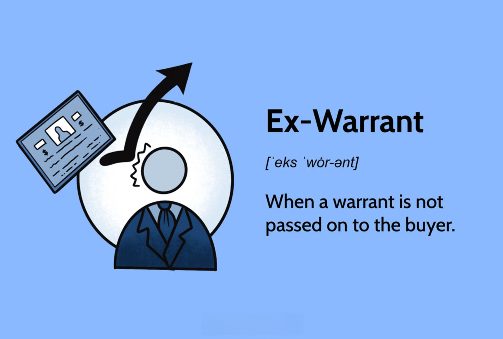

Understanding financial instruments and terminology is essential for investors and traders aiming to enhance their returns. This article explores the concept of a 'stock warrant' and its transition to the ex-warrant phase, while also examining their application in algorithmic trading. Readers will gain an understanding of the structure and function of stock warrants, and their strategic role in investments. The discussion will cover the shift to ex-warrant status and the resulting effects on investor strategies. Additionally, this piece will explore the integration of stock warrants into algorithmic trading systems, showcasing how these instruments can optimize trading strategies by offering quick adaptability to market changes. Through this examination, readers will learn how warrants can be leveraged to seize opportunities while managing associated risks in the ever-evolving financial landscape.

## Table of Contents



## Understanding Stock Warrants

Stock warrants are a type of financial derivative that grant holders the right, but not the obligation, to purchase a company's underlying stock at a predetermined price, known as the exercise price, before a specified expiration date. These instruments are issued by companies primarily as a means to raise capital, providing an attractive opportunity for investors who seek a leveraged position in a company without the immediate outlay associated with purchasing the stock outright.

Typically, stock warrants come in two main types: call warrants and put warrants. Call warrants enable the holder to buy the underlying stock, while put warrants provide the right to sell the underlying stock at the specified price. The nature of these warrants as either calls or puts provides diverse strategic options for investors. Each type has unique characteristics, such as varying expiration dates and strike prices, which must be evaluated carefully to align with an investor's financial strategy and risk tolerance.

Unlike stock options, which are commonly available through exchange markets and often involve a contract between two private parties, warrants are generally issued directly by the company whose stock serves as the underlying asset. This direct issuance introduces distinct risks and opportunities. For instance, the creation of warrants can lead to potential share dilution, impacting existing shareholders' equity, and hence, presents an element of risk that investors must consider.

It is crucial to understand how stock warrants function to effectively incorporate them into trading and investment strategies. When valuing a warrant, factors such as the intrinsic value (the difference between the stock price and the exercise price) and the time value (related to the time remaining until expiration) are critical in determining its market price. Using formulas similar to those used for options pricing, such as the Black-Scholes model, traders can estimate a warrant's fair value, allowing for more informed decision-making. Moreover, advanced algorithmic trading systems may integrate these instruments for strategic trading, capitalizing on market inefficiencies and warrant-specific variables to optimize portfolio performance. 

Incorporating stock warrants into an investment portfolio can provide leverage, allowing investors to maximize potential returns with limited initial capital. Nevertheless, it's imperative for investors to carefully assess the specific attributes and risks associated with each warrant to effectively harness their benefits, ensuring alignment with broader financial objectives and market conditions.

## The Ex-Warrant Phase

The ex-warrant phase marks the period subsequent to the expiration date of a stock warrant, wherein the warrant ceases to be exercisable. At this juncture, the warrant's underlying stock is no longer available for purchase at the previously agreed-upon exercise price, leading to significant ramifications for both the warrant's value and investor decision-making processes.

Once a warrant reaches its ex-warrant status, the market often undergoes adjustments as traders reassess their positions. The cessation of the warrant's validity can lead to fluctuations in market prices as the intrinsic and time values that were previously baked into the warrant's pricing become irrelevant. Consequently, investors who were relying on the warrant for potential future gains might experience a reassessment of their portfolios, potentially triggering sales or modifications in their strategy to counteract the change in market dynamics.

Understanding the nuances of the ex-warrant phase is paramount for optimizing investment strategies. The timing of warrant expiration can introduce [volatility](/wiki/volatility-trading-strategies) into the market, offering both opportunities and challenges for traders. For instance, the expiration can act as a catalyst, accelerating price movements as market participants adjust their holdings. This period could be leveraged to identify and seize profitable trading opportunities that arise from these shifts.

Investors adept in navigating these dynamics are often equipped with strategies to mitigate risks associated with the transition to ex-warrant. This necessitates a comprehensive analysis of expiration timelines and their potential market impact. By doing so, traders can refine their approaches, aligning them with the evolving conditions to maintain or enhance their portfolios. The ex-warrant phase, thus, becomes a critical consideration in crafting well-informed, agile investment strategies that can capitalize on the complexities introduced by warrant expiration.

## Algorithmic Trading and Stock Warrants

Algorithmic trading has transformed the financial markets by leveraging technology to execute trades with precision and speed. Automated systems apply sophisticated mathematical models and algorithms to make trading decisions based on market data. Integrating stock warrants into these strategies adds a layer of complexity and potential profitability, offering a unique opportunity to capitalize on market inefficiencies.

Stock warrants, as derivatives, possess characteristics that can be effectively exploited through [algorithmic trading](/wiki/algorithmic-trading). The real-time monitoring capabilities of these systems allow for rapid adjustment of trading strategies in response to the dynamic status of stock warrants, particularly during transitions like moving to ex-warrant status. This adaptability is crucial in a trading environment where the price and [volume](/wiki/volume-trading-strategy) can exhibit significant volatility as expiration approaches.

Consider the scenario where an algorithm is programmed to react to the expiration of stock warrants. As warrants approach expiration, their values can exhibit increased volatility due to speculative trading and shifts in supply and demand dynamics. Algorithms can be tailored to identify these patterns and execute trades that capitalize on anticipated price movements. Here is a simple Python example illustrating how an algorithm might be designed to respond to stock warrant expiration volatility:

```python
def monitor_warrant(warrant_data):
    expiry_threshold = 5  # days before expiration
    volatility_threshold = 0.05  # volatility level

    for warrant in warrant_data:
        if warrant.days_to_expiry < expiry_threshold:
            if warrant.volatility > volatility_threshold:
                execute_trade(warrant)

def execute_trade(warrant):
    # Implement trade execution logic
    print(f"Executing trade for warrant: {warrant.symbol}")
```

Moreover, by including stock warrants within algorithmic strategies, traders can manage risks effectively through diversification. Warrants allow investors to leverage positions with a relatively low capital requirement, which can be factored into algorithmic models to optimize portfolio management by controlling exposure to specific market segments or instruments.

Algorithmic trading systems can also be programmed to manage warrant positions in response to market signals that indicate shifts in the underlying stock's price, potentially maximizing advantages from these fluctuations. This ability to respond promptly to market dynamics is an unparalleled advantage, allowing for the optimization of risk-adjusted returns.

In conclusion, the application of algorithmic trading to stock warrants holds significant potential for enhancing the profitability and risk management of trading strategies. By utilizing advanced algorithms to monitor and respond to warrant-related market changes, traders can seize opportunities that may be unavailable through traditional trading methods.

## Benefits and Risks of Trading Stock Warrants

Stock warrants offer several advantages to investors seeking to diversify their portfolios and enhance potential returns. One key benefit is leverage; warrants allow investors to control a larger number of shares with a relatively small initial investment compared to purchasing the underlying stock outright. This leverage can lead to greater profitability if the stock price rises significantly before the warrant's expiration.

Additionally, warrants typically require a lower initial capital outlay, making them an attractive option for investors looking to enter positions with less upfront risk. Moreover, with warrants, there is potential for higher returns, particularly in bullish markets where the underlying stock prices experience substantial gains. This aspect can be particularly appealing for investors aiming for significant capital appreciation.

However, trading stock warrants also entails inherent risks. A primary concern is market volatility, which can lead to substantial price swings in the value of the warrant, impacting its [liquidity](/wiki/liquidity-risk-premium) and tradability. The time-sensitive nature of warrants, especially as expiration approaches, can also expose investors to the risk of losing the entire investment if the warrants are not exercised profitably. This expiration-based loss of value can be a critical consideration in warrant trading strategies.

Furthermore, warrants can result in the dilution of shares if exercised. When a company issues new shares to cover exercised warrants, existing shareholders may see a dilution of their ownership percentage, potentially affecting stock valuation.

Investors need to carefully balance these benefits and risks, taking into account their risk tolerance and investment objectives. Here, algorithmic trading can play a pivotal role. By employing sophisticated algorithms to analyze market trends and execute trades rapidly, investors can potentially reduce some of the inherent risks associated with warrant trading. For instance, algorithms can be designed to monitor market signals and adjust positions swiftly, thereby responding effectively to volatility and expiration-related concerns.

In conclusion, while stock warrants offer substantial opportunities for leverage and profit, the inherent risks necessitate a comprehensive understanding and strategic planning. By leveraging algorithmic trading tools, investors can enhance their capability to navigate market complexities, making informed decisions that align with their financial goals.

## Conclusion

Stock warrants and their ex-warrant status significantly impact financial markets, presenting a combination of opportunities and challenges for investors. These instruments allow traders to gain leverage, potentially leading to substantial returns, while also introducing risks such as the possibility of share dilution and market volatility. However, through careful integration into algorithmic trading strategies, warrants can help enhance traders' responsiveness to market fluctuations.

Algorithmic trading systems, by their very nature, operate on predefined criteria and market signals, enabling swift adaptations to changes, such as those arising from the transition to ex-warrant status. This adaptability is crucial, as the phase can see shifts in market dynamics that necessitate rapid decision-making and strategy adjustments. Effective use of stock warrants in these systems is contingent upon a deep understanding of the market and thorough planning.

Investors and traders must stay well-informed about the prevailing market conditions and any regulatory changes that could affect the value and conditions of warrants. This vigilance, combined with a robust strategy for incorporating warrants into a diversified trading portfolio, can enhance both risk management and potential profit margins.

With an astute approach, stock warrants can become a valuable component of a sophisticated trading strategy. Their potential to amplify returns should not overshadow the accompanying risks, which must be carefully managed through informed decision-making and strategic foresight. By harnessing the tools provided by algorithmic trading and maintaining a vigilant stance on market and regulatory developments, investors can utilize stock warrants effectively within their broader financial strategies.

## References & Further Reading

[1]: ["Options, Futures, and Other Derivatives"](https://www.amazon.com/Options-Futures-Other-Derivatives-11th/dp/B0B9JS99C2) by John C. Hull

[2]: ["Warrants and Convertible Securities: Valuation and Risk Management"](https://efinancemanagement.com/derivatives/warrants-vs-convertibles) by M. David Moffett & Donald Chance

[3]: Black, F., & Scholes, M. (1973). ["The Pricing of Options and Corporate Liabilities."](https://www.cs.princeton.edu/courses/archive/fall09/cos323/papers/black_scholes73.pdf) Journal of Political Economy, 81(3), 637-654.

[4]: Chan, E. (2009). ["Quantitative Trading: How to Build Your Own Algorithmic Trading Business"](https://github.com/ftvision/quant_trading_echan_book) 

[5]: Lopez de Prado, M. (2018). ["Advances in Financial Machine Learning"](https://www.amazon.com/Advances-Financial-Machine-Learning-Marcos/dp/1119482089)

[6]: Natenberg, S. (1994). ["Option Volatility and Pricing: Advanced Trading Strategies and Techniques"](https://www.amazon.com/Option-Volatility-Pricing-Strategies-Techniques/dp/0071818774)