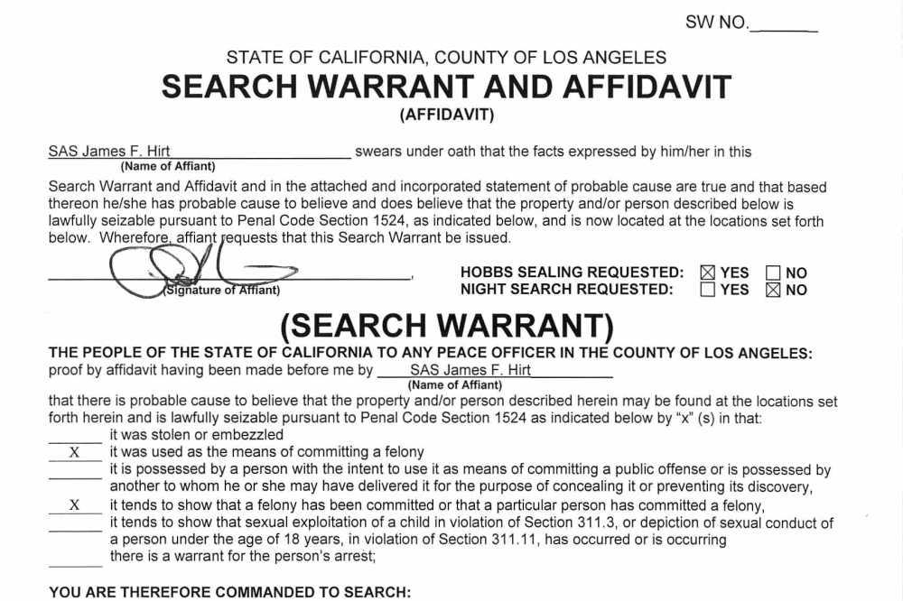

## Table of Contents

## What is an ex-warrant?

An ex-warrant is a type of financial document that gives the owner the right to buy a certain amount of stock at a set price before a specific date. It's like a special ticket that lets you buy shares in a company at a lower price than what others might have to pay. People often get ex-warrants when a company wants to raise money or as part of a bigger financial deal.

Once the ex-warrant is used, it's gone, and you can't use it again. If you don't use it before the deadline, it becomes worthless. This makes it important to keep track of when the ex-warrant expires. They can be a good way to invest in a company if you think the stock price will go up before the ex-warrant expires.

## How does an ex-warrant differ from a stock warrant?

An ex-warrant and a stock warrant are similar because they both give you the right to buy a company's stock at a set price before a certain date. The main difference is when you can use them. A stock warrant can be used right away or anytime before it expires. But an ex-warrant is a bit different. It usually comes into play after a specific event, like a company splitting its stock or doing a rights issue. So, you can only use an ex-warrant after that event happens.

Another key difference is how you get them. Stock warrants are often given out directly by the company as part of a financial deal or to raise money. You might get them when you buy new shares or bonds. On the other hand, ex-warrants are usually what's left after a stock goes ex-rights. This means if you own a stock that goes ex-rights, you might end up with an ex-warrant instead of the original rights. Both can be valuable, but understanding when and how to use them is important.

## What are the key features of an ex-warrant?

An ex-warrant gives you the right to buy a company's stock at a set price before a certain date. It's like a special ticket that lets you buy shares at a lower price than what others might have to pay. You can only use an ex-warrant after a specific event happens, like a stock split or a rights issue. This is different from a regular stock warrant, which you can use anytime before it expires.

Ex-warrants are usually what you get after a stock goes ex-rights. If you own a stock and it goes ex-rights, you might end up with an ex-warrant instead of the original rights. It's important to know when the ex-warrant expires because if you don't use it before that date, it becomes worthless. Ex-warrants can be a good way to invest in a company if you think the stock price will go up before the ex-warrant expires.

## How is the value of an ex-warrant determined?

The value of an ex-warrant is determined by a few important things. The first thing is the difference between the stock's current price and the price you can buy it at with the ex-warrant. This difference is called the intrinsic value. If the stock price is higher than the price on the ex-warrant, the ex-warrant has value because you can buy the stock for less than it's worth. The second thing is how much time is left before the ex-warrant expires. The more time you have, the more valuable the ex-warrant can be because there's a better chance the stock price will go up.

Another thing that affects the value of an ex-warrant is how much the stock price might change. If the stock price can change a lot, the ex-warrant might be worth more because there's a bigger chance the price will go above the price on the ex-warrant. Also, things like how much the company is expected to grow and what's happening in the market can change the value of the ex-warrant. All these things together help figure out how much an ex-warrant is worth.

## What are the common uses of ex-warrants in financial markets?

Ex-warrants are often used in financial markets as a way for companies to raise money or to give shareholders extra benefits. When a company issues new shares or does a rights issue, it might give out ex-warrants to make the deal more attractive. This can help the company get more money because people might be more willing to buy the new shares if they also get the chance to buy more shares at a lower price later. It's like a bonus that can make the investment seem better.

Investors also use ex-warrants as a way to bet on a company's future. If someone thinks a company's stock price will go up, they might buy the ex-warrant to get the stock at a lower price later. This can be a smart move if the stock price does go up before the ex-warrant expires. But it's risky too, because if the stock price stays the same or goes down, the ex-warrant might not be worth anything. So, ex-warrants can be a useful tool for both companies and investors, but they need to be used carefully.

## Can you explain the process of exercising an ex-warrant?

Exercising an ex-warrant means you are using it to buy the company's stock at the special price it offers. To do this, you need to tell your broker or the company that you want to use your ex-warrant. You'll have to pay the price that's written on the ex-warrant for each share you want to buy. It's important to do this before the ex-warrant expires, or you'll lose the chance to buy the stock at that price.

Once you've told your broker or the company and paid the money, they will give you the shares. These shares will be added to your account, just like any other shares you own. After you use the ex-warrant, it's gone and you can't use it again. So, make sure you really want to buy the stock at that time because you can't change your mind later.

## What are the risks associated with investing in ex-warrants?

Investing in ex-warrants can be risky because they have an expiration date. If you don't use the ex-warrant before it expires, it becomes worthless. This means you could lose all the money you spent on the ex-warrant if the stock price doesn't go above the price on the ex-warrant before the deadline. It's like buying a ticket to a concert that you can only use on a certain day. If you don't go on that day, the ticket is useless.

Another risk is that the stock price might not go up as much as you hope. If the stock price stays the same or goes down, the ex-warrant won't be worth much. This can be disappointing because you were hoping to buy the stock at a lower price and then sell it for a profit. It's like betting on a horse race; if your horse doesn't win, you don't get your money back. So, it's important to think carefully before investing in ex-warrants because they can be a bit like gambling.

## How do ex-warrants affect the issuing company's financial statements?

When a company issues ex-warrants, it can affect the company's financial statements in a few ways. First, when the company gives out ex-warrants, it doesn't get any money right away. But if people use their ex-warrants to buy stock, the company will get money from selling those shares. This money will show up as an increase in the company's cash on the balance sheet. It's like getting paid later for something you offered now.

Second, the ex-warrants themselves might be shown as a part of the company's equity on the balance sheet. This is because they give people the right to buy more stock in the future. If the ex-warrants are used, the company's equity will change because more shares will be out there. This can make the value of each share go down a little bit, but the company will have more cash to use for its business. It's a trade-off that the company has to think about when deciding to issue ex-warrants.

## What are the tax implications of trading ex-warrants?

When you trade ex-warrants, you need to think about taxes. If you make money by selling your ex-warrants for more than you paid for them, you might have to pay capital gains tax. This tax depends on how long you held the ex-warrants. If you held them for a year or less, it's a short-term capital gain, and you'll pay tax at your regular income tax rate. If you held them for more than a year, it's a long-term capital gain, and the tax rate is usually lower.

If you use your ex-warrants to buy stock, you also need to think about taxes. The price you pay for the stock with the ex-warrant is your cost basis for the stock. If you sell the stock later for more than this cost basis, you'll have to pay capital gains tax on the profit. It's important to keep good records of when you bought the ex-warrants, how much you paid for them, and when you used them to buy stock, so you can figure out your taxes correctly.

## How do market conditions influence the pricing of ex-warrants?

Market conditions can really change how much an ex-warrant is worth. If the stock market is doing well and people think the company's stock price will go up, the ex-warrant might be worth more. This is because more people will want to buy the ex-warrant to get the stock at a lower price later. But if the market is not doing well and people are worried about the company's future, the ex-warrant might not be worth as much. People won't want to buy it if they think the stock price won't go up before the ex-warrant expires.

Another thing that affects the price of an ex-warrant is how much the stock price might change. If the stock price can go up or down a lot, the ex-warrant might be worth more because there's a bigger chance it will be useful. But if the stock price stays the same most of the time, the ex-warrant might not be worth as much. So, it's important to keep an eye on what's happening in the market and how people feel about the company when you're thinking about buying or selling an ex-warrant.

## What strategies can investors use to trade ex-warrants effectively?

One good strategy for trading ex-warrants is to keep an eye on the stock's price and the time left before the ex-warrant expires. If you think the stock price will go up a lot before the ex-warrant expires, it might be a good time to buy the ex-warrant. This way, you can use it to buy the stock at a lower price later and make a profit. But if the stock price isn't moving much or if there's not much time left, it might be better to wait or look for another investment. It's like trying to catch a bus; you need to know when it's coming and if it's worth the wait.

Another strategy is to use ex-warrants as part of a bigger plan. For example, you could buy the ex-warrant and also buy some of the company's stock. This way, you can make money from the stock going up and also from using the ex-warrant to buy more stock at a lower price. It's like having two chances to win. But remember, ex-warrants can be risky, so it's important to think carefully and not put all your money into one thing. Always have a plan for what you'll do if things don't go the way you hope.

## Can you provide a real-world example of an ex-warrant and its impact on the market?

A good example of an ex-warrant is what happened with Tesla in 2020. Tesla issued warrants as part of a financing deal to raise money. These warrants allowed investors to buy Tesla stock at a set price before a certain date. When Tesla's stock price started to go up a lot, the value of these warrants also went up. People who had the warrants could use them to buy Tesla stock at a lower price than what it was trading for on the market. This made the warrants very valuable and helped Tesla raise more money than they would have just by selling stock.

The impact of these ex-warrants on the market was big. Because the warrants were tied to Tesla's stock, they added more interest and excitement to Tesla's stock. More people wanted to buy Tesla stock because they could also get the chance to buy more shares at a lower price with the warrants. This helped push Tesla's stock price even higher. But it was also risky for investors because if Tesla's stock price didn't keep going up, the warrants would lose their value. So, the ex-warrants made Tesla's stock more exciting but also added more risk for everyone involved.

## References & Further Reading

[1]: ["Options, Futures, and Other Derivatives"](https://www.amazon.com/Options-Futures-Other-Derivatives-11th/dp/B0B9JS99C2) by John C. Hull

[2]: ["Warrants and Convertible Securities: Valuation and Risk Management"](https://efinancemanagement.com/derivatives/warrants-vs-convertibles) by M. David Moffett & Donald Chance

[3]: Black, F., & Scholes, M. (1973). ["The Pricing of Options and Corporate Liabilities."](https://www.cs.princeton.edu/courses/archive/fall09/cos323/papers/black_scholes73.pdf) Journal of Political Economy, 81(3), 637-654.

[4]: Chan, E. (2009). ["Quantitative Trading: How to Build Your Own Algorithmic Trading Business"](https://github.com/ftvision/quant_trading_echan_book) 

[5]: Lopez de Prado, M. (2018). ["Advances in Financial Machine Learning"](https://www.amazon.com/Advances-Financial-Machine-Learning-Marcos/dp/1119482089)

[6]: Natenberg, S. (1994). ["Option Volatility and Pricing: Advanced Trading Strategies and Techniques"](https://www.amazon.com/Option-Volatility-Pricing-Strategies-Techniques/dp/0071818774)