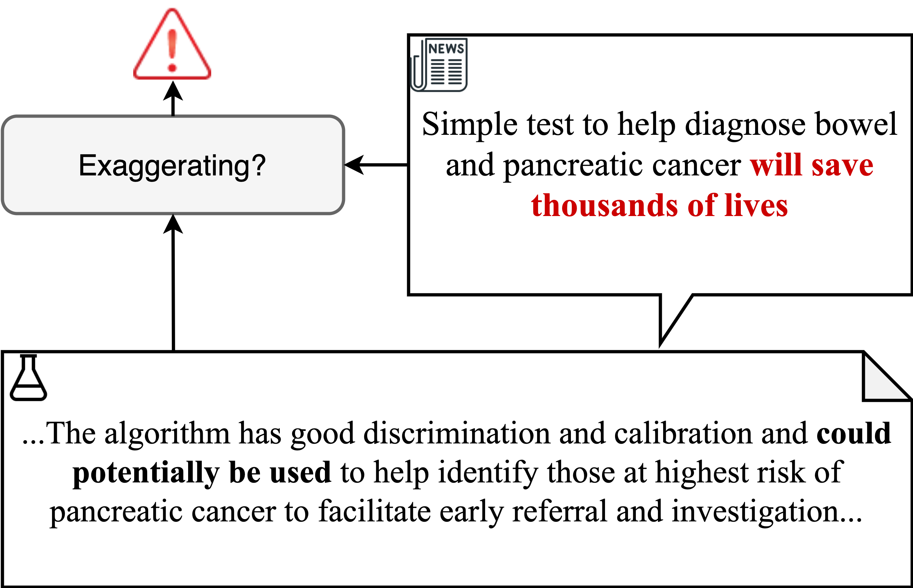

## Table of Contents

## What is exaggeration detection in the context of machine learning?

Exaggeration detection in machine learning is about teaching computers to spot when someone is overstating or stretching the truth in texts or speech. This is useful in many areas, like social media where people might exaggerate to get more attention, or in customer reviews where someone might exaggerate their experience to make a point. To do this, machine learning models are trained on lots of examples where exaggeration is labeled. The model learns patterns and clues that suggest exaggeration, like certain words or phrases that are often used in exaggerated statements.

Once trained, these models can then analyze new texts or speech to find exaggerations. They look for the same patterns they learned during training. For example, if someone says "This is the best burger in the entire universe," the model might flag it as an exaggeration because of the extreme language. The accuracy of these models depends on the quality and quantity of the training data, and how well the model can generalize from the training examples to new, unseen cases. This field is still growing, and researchers are working on making these models better at understanding context and subtlety in language.

## Why is detecting exaggeration important in natural language processing?

Detecting exaggeration is important in natural language processing because it helps us understand what people really mean when they talk or write. When someone exaggerates, they might say something is "the worst" or "the best" when they don't really mean it literally. If computers can spot these exaggerations, they can better understand the true feelings or opinions of the person. This is useful in many places, like social media where people often exaggerate to get attention, or in product reviews where someone might exaggerate to make a strong point.

Understanding exaggeration also helps in making better conversations between people and machines. If a machine can tell when someone is exaggerating, it can respond in a more human-like way. For example, if someone says, "I'm so hungry I could eat a horse," the machine might understand that the person is just very hungry, not literally wanting to eat a horse. This makes the machine's responses more natural and helpful, improving how we communicate with technology.

## What are the basic components of an exaggeration detection model?

The first part of an exaggeration detection model is the dataset. This is a big collection of texts where some are labeled as exaggerations and others are not. The model learns from these examples, looking for patterns in words or phrases that often show exaggeration. For example, if many sentences with "the best ever" are labeled as exaggerations, the model might learn to recognize this phrase as a sign of exaggeration.

The second part is the algorithm or model itself. This is like a smart math formula that takes the texts and decides if they are exaggerations or not. The model is trained on the dataset, adjusting itself to get better at spotting exaggerations. Once trained, it can look at new texts and predict if they contain exaggerations. The model's accuracy depends on how well it was trained and how much data it used.

The third part is evaluation. After the model is trained, it needs to be tested to see how well it works. This is done by using a separate set of texts that the model hasn't seen before. The model's guesses are compared to the real labels to see how often it's right. If it's not good enough, the model might need more training or a different approach. This step helps make sure the model is useful and reliable when it's used in real situations.

## How does the MT-PET model approach exaggeration detection?

The MT-PET model, which stands for "Multi-Task Pretrained Encoder for Exaggeration Detection," is a special kind of [machine learning](/wiki/machine-learning) model designed to spot exaggerations in texts. It uses a technique called transfer learning, where the model is first trained on a large amount of general text data to understand language well. Then, it's fine-tuned on a smaller dataset that specifically includes examples of exaggeration. This two-step process helps the model learn both the general patterns of language and the specific signs of exaggeration, like extreme words or phrases.

Once trained, the MT-PET model looks at new texts and decides if they contain exaggerations. It does this by breaking down the text into smaller parts and analyzing them for signs of exaggeration. The model uses a scoring system to decide how likely it is that a text is exaggerated. If the score is high, the model flags the text as an exaggeration. This method helps the MT-PET model be more accurate and useful in real situations, like analyzing social media posts or customer reviews.

## What datasets are commonly used to train exaggeration detection models?

To train exaggeration detection models, researchers often use datasets that are specifically labeled for exaggerations. One common dataset is the SemEval-2017 Task 7 dataset, which includes social media posts labeled as either exaggerated or not. This dataset helps models learn to spot the kind of overstatements that people often make on social media. Another useful dataset is the Exaggeration Corpus, which contains a variety of texts from different sources like news articles, reviews, and blogs, all labeled for exaggeration. These diverse sources help the model understand exaggeration in different contexts.

In addition to these specialized datasets, models can also be trained on more general datasets like the Stanford Sentiment Treebank (SST) or the IMDb movie reviews dataset. While these datasets are not specifically labeled for exaggeration, they can help the model understand sentiment and language patterns that might be useful in detecting exaggeration. By using a combination of these datasets, models can be trained to recognize exaggeration more accurately across a wide range of texts.

## What are the key performance metrics for evaluating exaggeration detection models?

The main way to see how well an exaggeration detection model works is by looking at its accuracy. Accuracy is just how often the model gets it right when it says a text is exaggerated or not. If the model says a text is exaggerated and it really is, or if it says a text isn't exaggerated and it's not, that counts as a correct guess. Accuracy is important because it shows how reliable the model is overall. You can calculate accuracy with this formula: $$ \text{Accuracy} = \frac{\text{Number of Correct Predictions}}{\text{Total Number of Predictions}} $$.

Another important metric is precision. Precision tells us how many of the texts the model labeled as exaggerated were actually exaggerated. High precision means that when the model says something is exaggerated, it's usually right. This is good if you want to avoid calling things exaggerated when they're not. The formula for precision is: $$ \text{Precision} = \frac{\text{True Positives}}{\text{True Positives + False Positives}} $$. Along with precision, recall is also key. Recall shows how many of the actual exaggerated texts the model found. If the model misses a lot of exaggerations, its recall will be low. The formula for recall is: $$ \text{Recall} = \frac{\text{True Positives}}{\text{True Positives + False Negatives}} $$. Balancing precision and recall helps make sure the model is both accurate and thorough.

## How can feature engineering improve the performance of exaggeration detection models?

Feature engineering can make exaggeration detection models better by creating new ways for the model to understand texts. When we engineer features, we look at the texts and find special things that might show exaggeration. For example, we might count how many times words like "best," "worst," or "never" appear in a text. These words often show exaggeration. We can also look at how strong the feelings in the text are, like if it's very positive or very negative. By adding these new features, the model can learn more about what makes a text exaggerated, which can help it guess better.

Using feature engineering can also help the model understand the context of the text better. For example, we might create features that look at the topic of the text or who wrote it. If a text is about food and uses a lot of strong words, it might be more likely to be an exaggeration than a text about a serious topic. By adding these context-based features, the model can learn to spot exaggerations more accurately. This can make the model's precision and recall better, which means it will be more reliable at finding exaggerations in new texts.

## What are the challenges faced when training models like MT-PET for exaggeration detection?

Training models like MT-PET for exaggeration detection can be tricky because it's hard to get enough good data. Exaggeration is a bit like a special language trick that people use, and it can be different in every text. To teach the model well, we need lots of examples where we know for sure if something is exaggerated or not. But finding and labeling these examples takes a lot of time and work. If the data isn't good enough, the model might not learn the right patterns and could make more mistakes when it tries to spot exaggerations in new texts.

Another challenge is that exaggeration can be very subtle and depend a lot on the context. People might exaggerate in different ways depending on what they're talking about or who they're talking to. For example, saying "I'm so tired I could sleep for a week" might be an exaggeration, but understanding it needs knowing that the person is probably just very tired, not actually planning to sleep for a week. The model needs to learn these subtle differences, which can be hard. If it doesn't, it might miss some exaggerations or think normal statements are exaggerated, making its accuracy lower. Balancing precision and recall, which are important measures of how well the model works, can also be tough. Precision is how often the model is right when it says something is exaggerated, and recall is how many of the real exaggerations it finds. The formulas for these are $$ \text{Precision} = \frac{\text{True Positives}}{\text{True Positives + False Positives}} $$ and $$ \text{Recall} = \frac{\text{True Positives}}{\text{True Positives + False Negatives}} $$. Getting both high can be a challenge.

## How does the MT-PET model handle different types of exaggerations?

The MT-PET model is smart because it can spot different kinds of exaggerations in texts. It does this by learning from a lot of examples where exaggerations are labeled. The model looks for patterns in words and phrases that often show exaggeration, like saying "the best ever" or "the worst thing." It also pays attention to how strong the feelings in the text are. If a text has a lot of strong feelings and uses extreme words, the model might think it's an exaggeration. This way, the MT-PET model can catch different types of exaggerations, from small ones to big ones, by understanding the special signs that show up in texts.

Understanding context is also important for the MT-PET model. Exaggerations can be different depending on what the text is about or who wrote it. For example, if someone is talking about food and says "This is the best burger in the world," the model knows that's probably an exaggeration because people often use strong words when they talk about food. But if the same words are used in a serious topic, the model might not think it's an exaggeration. By learning these context clues, the MT-PET model can tell apart different kinds of exaggerations and be more accurate when it looks at new texts.

## What advanced techniques can be applied to enhance the accuracy of exaggeration detection?

To make exaggeration detection models like MT-PET more accurate, one advanced technique is to use transfer learning. This means the model first learns from a big set of general texts to understand language well. Then, it's fine-tuned on a smaller set of texts that are labeled for exaggeration. This two-step process helps the model understand both the general patterns of language and the specific signs of exaggeration, like extreme words or phrases. By using transfer learning, the model can be more accurate because it has a better overall understanding of language and can spot exaggerations more easily.

Another technique is to use more advanced feature engineering. This involves creating new ways for the model to look at texts and find signs of exaggeration. For example, we might count how many times words like "best," "worst," or "never" appear in a text. These words often show exaggeration. We can also look at how strong the feelings in the text are, like if it's very positive or very negative. By adding these new features, the model can learn more about what makes a text exaggerated, which can help it guess better. Using feature engineering can also help the model understand the context of the text better, which is important because exaggeration can be different depending on what the text is about or who wrote it.

## How do exaggeration detection models integrate with other NLP tasks?

Exaggeration detection models can work together with other natural language processing (NLP) tasks to make them better. For example, sentiment analysis, which looks at if a text is positive, negative, or neutral, can use exaggeration detection to understand texts more accurately. If a model knows that a text is exaggerated, it can better guess the real feelings behind the words. This is important because people often exaggerate to make their feelings stronger. By working together, these models can give a fuller picture of what someone is trying to say.

Another way exaggeration detection models help is with tasks like text classification and summarization. When classifying texts into categories, knowing if a text is exaggerated can help decide which category it fits best. For example, a review that says "This is the worst movie ever" might be exaggerated, and knowing this can help the model understand that the movie is probably just bad, not the worst ever. In summarization, exaggeration detection can help make summaries more accurate by focusing on the real main points and not getting distracted by exaggerated statements. By integrating with other NLP tasks, exaggeration detection models can make the whole process of understanding language better and more reliable.

## What are the future research directions in the field of exaggeration detection?

Future research in exaggeration detection will focus on making models better at understanding the context of texts. Right now, models can spot exaggerations by looking for certain words or phrases, but they don't always understand the situation around those words. Researchers want to make models that can tell if a text is exaggerated based on who wrote it, what the text is about, and even the culture of the person writing. This could mean using more advanced techniques like [deep learning](/wiki/deep-learning) to teach models about different contexts. By doing this, models can be more accurate and useful in real situations, like understanding social media posts or customer reviews.

Another direction for future research is to make models that can learn from less data. Right now, models need a lot of examples to learn what exaggeration looks like. But it's hard to find and label all those examples. Researchers are working on ways to make models learn from fewer examples, maybe by using transfer learning or other smart techniques. This could make it easier and faster to train good exaggeration detection models. By improving these areas, researchers hope to make exaggeration detection a more reliable and widely used part of natural language processing.

## References & Further Reading

[1]: Conneau, A., Rinott, R., Lample, G., Williams, A., Bowman, S. R., Schwenk, H., & Stoyanov, V. (2018). ["XNLI: Evaluating Cross-lingual Sentence Representations."](https://arxiv.org/abs/1809.05053) arXiv preprint arXiv:1809.05053.

[2]: Devlin, J., Chang, M. W., Lee, K., & Toutanova, K. (2019). ["BERT: Pre-training of Deep Bidirectional Transformers for Language Understanding."](https://aclanthology.org/N19-1423/) arXiv preprint arXiv:1810.04805.

[3]: Bojanowski, P., Grave, E., Joulin, A., & Mikolov, T. (2017). ["Enriching Word Vectors with Subword Information."](https://aclanthology.org/Q17-1010/) Transactions of the Association for Computational Linguistics, 5, 135-146.

[4]: Barzilay, R., & Lapata, M. (2005). ["Modeling Local Coherence: An Entity-based Approach."](https://aclanthology.org/P05-1018/) In Proceedings of the 43rd Annual Meeting of the Association for Computational Linguistics (pp. 141-148).

[5]: Mihalcea, R., & Strapparava, C. (2009). ["The Lie Detector: Explorations in the Automatic Recognition of Deceptive Language."](https://aclanthology.org/P09-2078/) Proceedings of the ACL-IJCNLP 2009 Conference Short Papers.