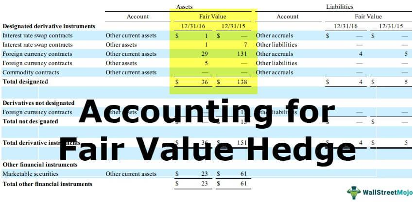

A profound understanding of balance sheet accounting, hedge funds, and algorithmic trading constitutes the bedrock of contemporary finance. This article examines how these elements intersect, focusing on their contributions to financial assessment and decision-making. Specifically, hedge fund balance sheets and the role of algorithmic trading in financial analysis will be explored, providing insights into how these components work together to optimize trading strategies and manage financial risk.

Hedge fund balance sheets form the backbone of financial operations, reflecting the fund's assets, liabilities, and equity. This accounting framework provides a crucial snapshot of financial standing, essential for evaluating the fund's fiscal health and operational strategies. On the other hand, algorithmic trading has revolutionized the execution of financial strategies, using predefined rules and computer programs to enable rapid, data-driven trading decisions. This approach helps identify patterns and trends that may be overlooked by human traders, thus enhancing accuracy and efficiency.



Blending traditional financial insights with modern trading technologies offers a comprehensive view of financial markets. The integration of balance sheet analysis and algorithmic trading embodies this synergy, allowing for informed decision-making and strategic execution. Moreover, as financial technology continues to evolve, combining these elements has become vital for achieving future success in market operations.

## Table of Contents

## Understanding Hedge Fund Balance Sheets

Hedge funds, like other business entities, rely heavily on their balance sheets to structure and inform their operations. A balance sheet provides a concise overview of a hedge fund’s financial position at a specific point in time, detailing its assets, liabilities, and equity. This financial statement is crucial for understanding the resources available to the hedge fund as well as its obligations.

Assets listed on a hedge fund's balance sheet typically include long stock positions, cash, and other investments. These assets represent the investments made by the fund in various securities, which are expected to generate returns. Cash holdings play a significant role as they offer liquidity and the ability to quickly seize new investment opportunities.

Liabilities on the balance sheet generally consist of short stock positions and other financial obligations. Short positions involve borrowing securities to sell them with the intention of buying them back at a lower price, aiming to profit from a decline in the securities' value. These positions [carry](/wiki/carry-trading) their own risks, such as the potential for significant losses if the market moves contrary to expectations.

Hedge funds frequently utilize leverage to enhance their investment capacity and potential returns. Leverage involves borrowing funds to increase the size of an investment beyond what could be financed with available capital alone. While leverage can amplify gains, it also increases exposure to risk and can lead to significant losses, making the balance sheet more complex and sometimes opaque.

An illustrative example of a [hedge fund](/wiki/hedge-fund-trading-strategies) balance sheet setup might include $200 million in long stock positions as assets, $50 million in short stock obligations as liabilities, and $150 million in equity representing the net worth of the fund. This simplified balance sheet might further reveal nuances with additional leverage borrowed, investment in derivatives, or other financial instruments typical of sophisticated hedge fund strategies.

Understanding the dynamics of hedge fund balance sheets is crucial for stakeholders, including investors and regulators, to accurately assess a fund's financial health and risk profile. This analysis also aids in formulating strategies and managing risks inherent in hedge fund operations.

## Hedge Fund Financial Strategies

Hedge funds employ a variety of financial strategies designed to achieve specific investment goals, taking advantage of both long and short positions. This dual approach enables hedge funds to effectively manage exposure to systematic market risks and to pursue alpha, which represents returns exceeding a benchmark's performance.

One common strategy among hedge funds is market-neutral investing, which involves constructing a portfolio that has balanced long and short positions. The goal is to achieve returns regardless of overall market movements by focusing on relative performance between chosen assets. This strategy often involves examining the beta of different assets, where beta measures the sensitivity of an asset’s returns to overall market returns. By striving for a beta-neutral position, hedge funds aim to isolate alpha, thus minimizing market risk.

The financial analysis of hedge funds is crucial as it provides insights into their fiscal health and operational efficiency. For instance, the success of these strategies is often reflected in various balance sheet metrics, including leverage ratios and asset [liquidity](/wiki/liquidity-risk-premium) profiles. When both long and short positions are considered, they not only impact the gross and net exposure of the fund but also its leverage—the use of borrowed capital to amplify potential returns, which can complicate the fund's risk profile. The formula for calculating leverage is:

$$
\text{Leverage Ratio} = \frac{\text{Total Assets}}{\text{Equity}}
$$

A higher leverage ratio indicates greater use of debt relative to equity, which can magnify returns but also increase risk.

Additionally, the use of quantitative models plays a significant role in the implementation of these strategies. Hedge funds often rely on sophisticated algorithms to identify [arbitrage](/wiki/arbitrage) opportunities, detect pricing inefficiencies, and optimize portfolio allocations. These models can analyze vast datasets to predict market movements and adjust positions accordingly, supporting informed decision-making.

In summary, understanding these financial strategies is critical for analyzing how they impact hedge fund operations and financial standings. The interplay between long and short positions, market neutrality, and leveraging quantitative analysis helps hedge funds optimize their strategies and manage risks effectively, thereby contributing to their financial success.

## The Role of Algorithmic Trading

Algorithmic trading has significantly transformed the execution of trading strategies in hedge funds, leveraging the power of technology and data analysis. Through the use of predefined rules and sophisticated computer programs, algorithms facilitate rapid and data-driven trading decisions. This automation allows hedge funds to execute trades at a speed and frequency far beyond the capabilities of human traders, thus providing a substantial competitive advantage.

One of the key strengths of [algorithmic trading](/wiki/algorithmic-trading) lies in its ability to identify patterns and trends that may be imperceptible to human traders. By analyzing vast amounts of historical and real-time data, algorithms can detect statistical anomalies or correlations that indicate potential trading opportunities. For instance, [machine learning](/wiki/machine-learning) models can be trained to predict price movements based on historical data patterns, serving as predictive tools for executing trades.

Moreover, algorithmic trading reduces the influence of emotions in decision-making processes. Since trades are executed based on predetermined criteria, typically without human intervention, emotional biases such as fear and greed are minimized. This emotional neutrality enhances decision accuracy and efficiency, crucial during periods of market [volatility](/wiki/volatility-trading-strategies) where rapid, calculated actions are necessary to capitalize on or protect against sudden price swings.

Algorithms also support tactical execution, enabling hedge funds to manage large volumes of trades while maintaining acceptable levels of transaction costs and market impact. This precision is essential in implementing complex strategies such as pairs trading or [market making](/wiki/market-making), where the timing and execution of trades significantly affect outcomes. For example, during a market-making operation, the algorithm continuously updates bid and ask prices to reflect real-time market changes, optimizing liquidity provision.

Despite these advantages, reliance on algorithms introduces specific challenges that require careful management. The complexity of financial markets, coupled with the intricacy of algorithmic models, can lead to systematic risks if not properly monitored. Algorithms need to be robust and adaptive to changing market conditions to prevent potential losses from model drift or unsuitable parameter choices. Additionally, excessive reliance on algorithmic strategies can exacerbate systemic risks, as observed in events like the "flash crash" of 2010, where rapid algorithmic trading caused a sudden, significant drop in stock prices.

Overall, algorithmic trading plays a pivotal role in the optimization of hedge fund strategies. While it offers enhanced precision and efficiency, its success hinges on diligent oversight and adaptation to evolving market dynamics, ensuring that the algorithms operate within predefined risk parameters and are regularly updated for optimal performance.

## Integrating Balance Sheet Analysis in Algo Trading

Integrating balance sheet analysis in algorithmic trading involves the application of financial metrics to enhance the predictive power of trading algorithms. Financial metrics are crucial in evaluating and understanding a company’s financial health and stability, which assists traders in formulating strategies grounded in robust data-driven insights.

Liquidity ratios, such as the current ratio, measure a company’s ability to meet short-term obligations, while solvency ratios, like the debt-to-equity ratio, assess its capacity to sustain operations in the long-term. These ratios, when integrated into trading algorithms, provide a layer of financial scrutiny that can predict potential market movements by anticipating changes in a company’s operational health.

The current ratio is defined as: 

$$
\text{Current Ratio} = \frac{\text{Current Assets}}{\text{Current Liabilities}}
$$

This metric indicates whether a company has enough resources to pay off its short-term liabilities. A higher ratio implies greater liquidity, which is essential for evaluating the short-term risk profile of assets in algorithmic trading.

Similarly, the debt-to-equity ratio is given by:

$$
\text{Debt-to-Equity Ratio} = \frac{\text{Total Liabilities}}{\text{Shareholders' Equity}}
$$

This ratio assesses the proportion of equity and debt the company uses to finance its assets. A lower debt-to-equity ratio suggests a more stable financial structure, which can be a positive signal for traders looking to minimize risk in their portfolio.

By incorporating these and other financial metrics into trading algorithms, hedge funds can develop more nuanced strategies that take into account the real-time financial health of the companies involved. This involves adjusting trading strategies to better align with fundamentals, thus managing financial risks more effectively.

For instance, a Python script could be deployed to analyze balance sheets and adjust trading positions based on predefined criteria related to liquidity and solvency metrics. Here is a simple Python example demonstrating how one might calculate these ratios using pandas, a popular data analysis library:

```python
import pandas as pd

# Sample data representing a company's financial details
company_data = {
    'Current Assets': [100000, 120000, 150000],
    'Current Liabilities': [80000, 90000, 95000],
    'Total Liabilities': [200000, 210000, 230000],
    'Shareholders Equity': [300000, 340000, 360000]
}

df = pd.DataFrame(company_data)

# Calculating Current Ratio
df['Current Ratio'] = df['Current Assets'] / df['Current Liabilities']

# Calculating Debt-to-Equity Ratio
df['Debt-to-Equity Ratio'] = df['Total Liabilities'] / df['Shareholders Equity']

# Display the results
print(df)
```

This integration provides traders with real-time analytics on the financial condition of companies whose stocks are in their trading portfolio, enhancing the decision-making process. Real-world examples showcase hedge funds using financial data to mitigate risks and optimize returns, illustrating the tangible benefits of incorporating balance sheet analysis into algorithmic methodologies. By doing this, hedge funds manage better risk and are equipped to act promptly based on meaningful, timely financial insights.

## Conclusion

Balance sheet accounting, financial analysis, and algorithmic trading are integral components that, when combined, offer a comprehensive approach to navigating financial markets. Their integration facilitates a deeper understanding of market dynamics and underpins strategic financial decisions. Employing these tools allows individuals and institutions to craft informed and precise strategies, thereby enhancing both planning and execution capabilities.

Understanding each element's unique contributions is key to optimizing trading strategies and managing risks effectively. Balance sheet accounting provides a clear picture of financial health, allowing for better risk assessment and management. Financial analysis interprets this data to identify trends and insights critical for decision-making. Meanwhile, algorithmic trading translates these insights into actionable strategies, offering speed and efficiency that manual trading cannot match.

The synergy between financial analysis and algorithmic trading provides a competitive advantage, equipping traders with the ability to respond swiftly to market changes and execute trades based on comprehensive data insights. This holistic integration not only streamlines operations but also strengthens market positioning.

By embracing these elements, investors and professionals are armed with the insights necessary for sustained success in increasingly complex financial landscapes. As technology continues to evolve, the alignment of traditional financial practices with modern computational techniques becomes essential for future-proofing investment strategies. This integration, therefore, is not just advantageous but critical for maintaining relevance and achieving superior market outcomes.

## References & Further Reading

- Rosenbaum and Pearl, "Algorithmic Trading and DMA: An Introduction to Direct Access Trading Strategies" offers a comprehensive guide on the strategies and technological advancements that power algorithmic trading, emphasizing the importance of direct market access (DMA).

- Penman's "Financial Statement Analysis and Security Valuation" provides insights into the interpretation and analysis of financial statements, focusing on valuation techniques that are essential for understanding hedge fund balance sheets and informed trading decisions.

- "Investments" by Bodie, Kane, and Marcus is a seminal text that discusses various investment strategies and financial instruments, providing foundational knowledge of market operations and risk management, integral to hedge fund strategies.

- Murphy's "Technical Analysis of the Financial Markets: A Comprehensive Guide" is a pivotal resource for understanding technical analysis, a key component of algorithmic trading that aids in identifying market trends and patterns.

- Fabozzi and Drake's "Finance: Capital Markets, Financial Management, and Investment Management" explores the broader context of financial markets, management, and investment strategies, offering a detailed examination of the factors influencing financial stability and performance.

