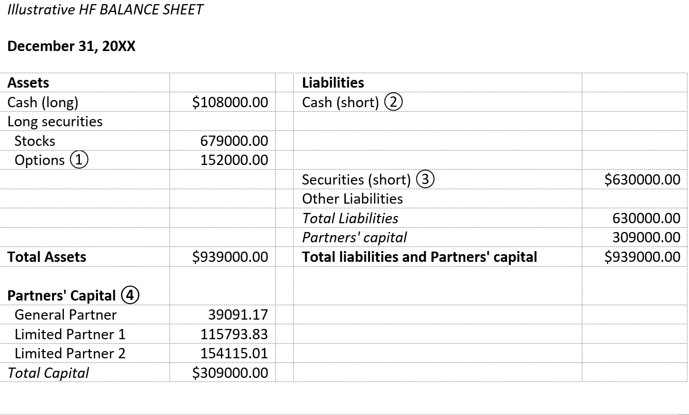

## Table of Contents

## What is a hedge fund?

A hedge fund is a type of investment fund that pools money from investors to buy different kinds of assets. The goal is to make money for the investors, often by using strategies that are riskier than those used by regular investment funds. Hedge funds are usually managed by professional investors who are very experienced and can make quick decisions about where to invest the money.

Unlike mutual funds, which are open to the public and have many rules about what they can invest in, hedge funds are often only available to wealthy people or big organizations. This is because they can be riskier, and the people who run them have more freedom to try different investment strategies. Hedge funds might use borrowing money or complex financial tools to try to make bigger profits, but this can also lead to bigger losses.

## What is a balance sheet?

A balance sheet is like a big snapshot of a company's money situation at a certain time. It shows what the company owns, what it owes, and what's left over for the owners. The things a company owns are called assets, like cash, buildings, or machines. The things a company owes are called liabilities, like loans or bills it needs to pay. The difference between what it owns and what it owes is called equity, which is the value that belongs to the owners or shareholders.

Think of a balance sheet like a scale that needs to stay balanced. On one side, you have all the assets, and on the other side, you have liabilities plus equity. They always need to be equal, which is why it's called a balance sheet. This helps people see if a company is healthy financially. If a company has a lot more assets than liabilities, it's usually in good shape. But if it owes a lot more than it owns, it might be in trouble.

## Why is a balance sheet important for a hedge fund?

A balance sheet is really important for a hedge fund because it shows how healthy the fund is financially. It tells investors if the fund has enough money and other valuable things to cover what it owes. This is crucial for hedge funds because they often use risky strategies and borrow money to try to make bigger profits. If something goes wrong, the balance sheet helps everyone see if the fund can handle the losses or if it's in trouble.

Also, the balance sheet helps investors understand where their money is being used. It shows what kinds of things the hedge fund is investing in, like stocks, bonds, or other assets. This transparency can build trust with investors because they can see if the fund is sticking to its strategy and if it's managing money wisely. Knowing the fund's financial position can help investors decide if they want to keep their money in the fund or take it out.

## What are the main components of a hedge fund balance sheet?

A hedge fund's balance sheet is made up of three main parts: assets, liabilities, and equity. Assets are all the things the hedge fund owns that have value, like cash, stocks, bonds, and other investments. These are important because they show what the fund can use to make money or pay off what it owes. Liabilities are what the hedge fund owes to others, like loans it has taken or money it needs to pay back to investors. These are crucial to watch because if the liabilities are too high compared to assets, the fund might be in trouble.

Equity is the difference between the assets and liabilities, and it represents the value that belongs to the investors. It's like the net worth of the hedge fund. If the equity is high, it means the fund is doing well and has more value for its investors. The balance sheet helps everyone see if the hedge fund is financially healthy by showing if it has enough assets to cover its liabilities and if it's making good use of the money it's managing.

## How do assets and liabilities differ on a hedge fund balance sheet?

Assets on a hedge fund balance sheet are all the things the fund owns that have value. This can include cash, stocks, bonds, and other investments. These assets are important because they show what the fund can use to make money or pay off what it owes. For example, if the fund has a lot of cash and stocks that are going up in value, it's in a good position to make profits or cover its expenses.

Liabilities, on the other hand, are what the hedge fund owes to others. This can include loans the fund has taken out or money it needs to pay back to investors. Liabilities are crucial to keep an eye on because if they are too high compared to the assets, the fund might be in trouble. For instance, if the fund has borrowed a lot of money and the investments don't perform well, it might struggle to pay back what it owes.

The difference between assets and liabilities is called equity, which represents the value that belongs to the investors. A healthy hedge fund will have more assets than liabilities, leading to positive equity. This means the fund is doing well and has more value for its investors. By comparing assets and liabilities, investors can get a clear picture of the hedge fund's financial health.

## What types of assets are typically listed on a hedge fund balance sheet?

A hedge fund balance sheet usually lists many types of assets. These can include cash, which is money the fund has on hand. Stocks are also common, which are shares in companies that the fund thinks will go up in value. Bonds are another type of asset, which are like loans the fund gives to companies or governments in exchange for interest payments. Hedge funds might also have other investments like real estate, commodities like gold or oil, and even more complex things like derivatives, which are financial tools that get their value from something else.

These assets are important because they show what the hedge fund can use to make money or pay off what it owes. For example, if the fund has a lot of cash and stocks that are increasing in value, it's in a good position to make profits or cover its expenses. The different types of assets also help the fund spread out its risk, which means it's not putting all its eggs in one basket. This can help the fund perform better and be more stable over time.

## What types of liabilities are typically listed on a hedge fund balance sheet?

A hedge fund's balance sheet usually shows different kinds of liabilities, which are the things the fund owes to others. One common type of liability is loans. Hedge funds often borrow money to invest in more assets and try to make bigger profits. These loans need to be paid back, so they're listed as liabilities. Another type of liability is money the fund owes to its investors. When investors put money into the fund, they expect to get it back at some point, along with any profits the fund makes.

Sometimes, hedge funds also have liabilities from using complex financial tools like derivatives. These can be risky and might need the fund to pay money if the investments don't go as planned. All these liabilities are important to watch because if they get too high compared to the assets, the fund might struggle to pay everything back. Keeping a good balance between assets and liabilities helps the hedge fund stay healthy and keep its investors happy.

## How does a hedge fund's balance sheet reflect its investment strategy?

A hedge fund's balance sheet shows its investment strategy by listing all the things it owns and owes. If a hedge fund has a lot of stocks and bonds, it means it's focusing on investing in companies and loans. If it has a lot of cash, it might be waiting for the right time to buy more investments or it might be keeping money ready to pay back what it owes. The types of assets on the balance sheet tell investors if the fund is spreading its money across different kinds of investments or if it's putting most of its money into one type of asset. This helps show if the fund is trying to be safe by not putting all its eggs in one basket or if it's taking bigger risks to try to make more money.

The balance sheet also shows how much the hedge fund is borrowing, which is a big part of its strategy. If the fund has a lot of loans listed as liabilities, it means it's using borrowed money to invest, hoping to make more money than it needs to pay back. This is called leverage and it's a common strategy for hedge funds, but it can be risky. If the investments don't do well, the fund might have trouble paying back what it owes. By looking at the balance sheet, investors can see if the fund is using a lot of leverage or if it's being more careful with its money. This helps them understand the fund's approach to making money and managing risk.

## What is the role of equity in a hedge fund balance sheet?

Equity on a hedge fund balance sheet is like the net worth of the fund. It's what's left over after you subtract all the things the fund owes (liabilities) from all the things it owns (assets). This number is really important because it shows how much value belongs to the investors. If the equity is high, it means the fund is doing well and has more money for its investors. If the equity is low or negative, it might mean the fund is in trouble and owes more than it owns.

The equity also helps show how well the hedge fund is following its investment strategy. If the fund is making smart investments and managing its money well, the equity should go up over time. This makes investors happy because it means their money is growing. On the other hand, if the equity is going down, it might mean the fund's strategy isn't working, and investors might start to worry. So, keeping an eye on the equity helps everyone see if the hedge fund is on the right track.

## How can one analyze the financial health of a hedge fund using its balance sheet?

To analyze the financial health of a hedge fund using its balance sheet, you should look at how the fund's assets compare to its liabilities. Assets are all the things the fund owns, like cash, stocks, and bonds. Liabilities are what the fund owes, like loans and money it needs to pay back to investors. If the fund has a lot more assets than liabilities, it's usually in good shape. This means it has enough valuable things to cover what it owes, which is a sign of financial health. On the other hand, if the liabilities are higher than the assets, the fund might be in trouble because it owes more than it owns.

Another important part of the balance sheet to look at is the equity, which is the difference between the assets and liabilities. Equity shows the value that belongs to the investors. If the equity is high and growing, it means the fund is doing well and making money for its investors. This is a good sign of financial health. But if the equity is low or shrinking, it could mean the fund's investments aren't doing well, and it might be struggling to pay back what it owes. By looking at these parts of the balance sheet, you can get a clear picture of whether the hedge fund is financially healthy or if it's facing some challenges.

## What are some common ratios used to evaluate a hedge fund's balance sheet?

One common ratio used to evaluate a hedge fund's balance sheet is the debt-to-equity ratio. This ratio shows how much the fund is borrowing compared to the money it has from investors. To find this ratio, you divide the total liabilities by the total equity. A high debt-to-equity ratio means the fund is using a lot of borrowed money to invest, which can be risky. If the investments don't do well, the fund might have trouble paying back what it owes. A lower ratio means the fund is being more careful with its money, which can be safer but might not make as much profit.

Another useful ratio is the current ratio, which helps you see if the fund can pay its short-term bills. You find this ratio by dividing the current assets (like cash and things that can be turned into cash quickly) by the current liabilities (like bills that need to be paid soon). A current ratio higher than 1 means the fund has enough money to cover its short-term debts, which is a good sign. If the ratio is less than 1, it might mean the fund is having trouble paying its bills on time, which could be a warning sign.

The return on equity (ROE) ratio is also important. It shows how well the fund is using the money from its investors to make more money. You calculate ROE by dividing the net income by the total equity. A high ROE means the fund is doing a good job of turning investor money into profits. A low ROE might mean the fund's investments aren't doing well, and it's not making as much money for its investors. By looking at these ratios, you can get a better idea of how healthy the hedge fund is financially.

## How do regulatory requirements impact the structure of a hedge fund's balance sheet?

Regulatory requirements can change how a hedge fund's balance sheet looks. Different countries have different rules that hedge funds need to follow. These rules might say how much money the fund needs to keep as a safety net, how much it can borrow, and what kinds of investments it can make. For example, some rules might say the fund needs to have a certain amount of cash or easy-to-sell assets to make sure it can pay back its investors if they want their money back. This can make the balance sheet show more cash and less risky investments.

These rules also affect how much debt a hedge fund can take on. If the rules say the fund can't borrow too much money, the balance sheet will show less debt and more equity. This makes the fund look safer because it's not relying too much on borrowed money. Also, some regulations might require the fund to report certain information on its balance sheet, like how much it's invested in different types of assets. This can make the balance sheet more detailed and help investors understand the fund's strategy better.

## What are Hedge Fund Financial Strategies?

Hedge funds employ a variety of financial strategies designed to achieve specific investment goals, taking advantage of both long and short positions. This dual approach enables hedge funds to effectively manage exposure to systematic market risks and to pursue alpha, which represents returns exceeding a benchmark's performance.

One common strategy among hedge funds is market-neutral investing, which involves constructing a portfolio that has balanced long and short positions. The goal is to achieve returns regardless of overall market movements by focusing on relative performance between chosen assets. This strategy often involves examining the beta of different assets, where beta measures the sensitivity of an asset’s returns to overall market returns. By striving for a beta-neutral position, hedge funds aim to isolate alpha, thus minimizing market risk.

The financial analysis of hedge funds is crucial as it provides insights into their fiscal health and operational efficiency. For instance, the success of these strategies is often reflected in various balance sheet metrics, including leverage ratios and asset [liquidity](/wiki/liquidity-risk-premium) profiles. When both long and short positions are considered, they not only impact the gross and net exposure of the fund but also its leverage—the use of borrowed capital to amplify potential returns, which can complicate the fund's risk profile. The formula for calculating leverage is:

$$
\text{Leverage Ratio} = \frac{\text{Total Assets}}{\text{Equity}}
$$

A higher leverage ratio indicates greater use of debt relative to equity, which can magnify returns but also increase risk.

Additionally, the use of quantitative models plays a significant role in the implementation of these strategies. Hedge funds often rely on sophisticated algorithms to identify [arbitrage](/wiki/arbitrage) opportunities, detect pricing inefficiencies, and optimize portfolio allocations. These models can analyze vast datasets to predict market movements and adjust positions accordingly, supporting informed decision-making.

In summary, understanding these financial strategies is critical for analyzing how they impact hedge fund operations and financial standings. The interplay between long and short positions, market neutrality, and leveraging quantitative analysis helps hedge funds optimize their strategies and manage risks effectively, thereby contributing to their financial success.

## How can balance sheet analysis be integrated into algo trading?

Integrating balance sheet analysis in algorithmic trading involves the application of financial metrics to enhance the predictive power of trading algorithms. Financial metrics are crucial in evaluating and understanding a company’s financial health and stability, which assists traders in formulating strategies grounded in robust data-driven insights.

Liquidity ratios, such as the current ratio, measure a company’s ability to meet short-term obligations, while solvency ratios, like the debt-to-equity ratio, assess its capacity to sustain operations in the long-term. These ratios, when integrated into trading algorithms, provide a layer of financial scrutiny that can predict potential market movements by anticipating changes in a company’s operational health.

The current ratio is defined as: 

$$
\text{Current Ratio} = \frac{\text{Current Assets}}{\text{Current Liabilities}}
$$

This metric indicates whether a company has enough resources to pay off its short-term liabilities. A higher ratio implies greater liquidity, which is essential for evaluating the short-term risk profile of assets in algorithmic trading.

Similarly, the debt-to-equity ratio is given by:

$$
\text{Debt-to-Equity Ratio} = \frac{\text{Total Liabilities}}{\text{Shareholders' Equity}}
$$

This ratio assesses the proportion of equity and debt the company uses to finance its assets. A lower debt-to-equity ratio suggests a more stable financial structure, which can be a positive signal for traders looking to minimize risk in their portfolio.

By incorporating these and other financial metrics into trading algorithms, hedge funds can develop more nuanced strategies that take into account the real-time financial health of the companies involved. This involves adjusting trading strategies to better align with fundamentals, thus managing financial risks more effectively.

For instance, a Python script could be deployed to analyze balance sheets and adjust trading positions based on predefined criteria related to liquidity and solvency metrics. Here is a simple Python example demonstrating how one might calculate these ratios using pandas, a popular data analysis library:

```python
import pandas as pd

# Sample data representing a company's financial details
company_data = {
    'Current Assets': [100000, 120000, 150000],
    'Current Liabilities': [80000, 90000, 95000],
    'Total Liabilities': [200000, 210000, 230000],
    'Shareholders Equity': [300000, 340000, 360000]
}

df = pd.DataFrame(company_data)

# Calculating Current Ratio
df['Current Ratio'] = df['Current Assets'] / df['Current Liabilities']

# Calculating Debt-to-Equity Ratio
df['Debt-to-Equity Ratio'] = df['Total Liabilities'] / df['Shareholders Equity']

# Display the results
print(df)
```

This integration provides traders with real-time analytics on the financial condition of companies whose stocks are in their trading portfolio, enhancing the decision-making process. Real-world examples showcase hedge funds using financial data to mitigate risks and optimize returns, illustrating the tangible benefits of incorporating balance sheet analysis into algorithmic methodologies. By doing this, hedge funds manage better risk and are equipped to act promptly based on meaningful, timely financial insights.

## References & Further Reading

- Rosenbaum and Pearl, "Algorithmic Trading and DMA: An Introduction to Direct Access Trading Strategies" offers a comprehensive guide on the strategies and technological advancements that power algorithmic trading, emphasizing the importance of direct market access (DMA).

- Penman's "Financial Statement Analysis and Security Valuation" provides insights into the interpretation and analysis of financial statements, focusing on valuation techniques that are essential for understanding hedge fund balance sheets and informed trading decisions.

- "Investments" by Bodie, Kane, and Marcus is a seminal text that discusses various investment strategies and financial instruments, providing foundational knowledge of market operations and risk management, integral to hedge fund strategies.

- Murphy's "Technical Analysis of the Financial Markets: A Comprehensive Guide" is a pivotal resource for understanding technical analysis, a key component of algorithmic trading that aids in identifying market trends and patterns.

- Fabozzi and Drake's "Finance: Capital Markets, Financial Management, and Investment Management" explores the broader context of financial markets, management, and investment strategies, offering a detailed examination of the factors influencing financial stability and performance.

