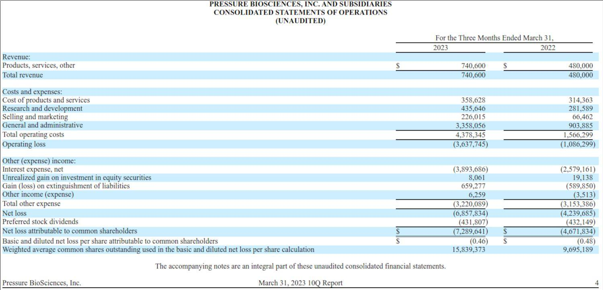

## Table of Contents

## What is a profit and loss statement?

A profit and loss statement, often called a P&L statement, is a financial report that shows how much money a business made or lost over a certain period, like a month or a year. It lists all the money coming into the business from sales or services, which is called revenue, and all the money going out, which includes costs like rent, salaries, and supplies. By comparing the total revenue to the total expenses, the statement shows if the business made a profit or had a loss.

This statement is really important for business owners and managers because it helps them see if their business is doing well financially. It can show them where they might be spending too much money or where they could make more money. Banks and investors also look at these statements to decide if they want to lend money to the business or invest in it. So, it's a key tool for making smart business decisions and planning for the future.

## Why is a profit and loss statement important for businesses?

A profit and loss statement is super important for businesses because it tells them if they are making money or losing it. It's like a report card for the business's finances. By looking at this statement, business owners can see all the money coming in from what they sell and all the money going out for things like rent, employee pay, and supplies. If the money coming in is more than the money going out, the business is making a profit. If it's the other way around, the business is losing money. Knowing this helps business owners make smart choices about how to run their business better.

This statement is also really helpful for planning the future of the business. If the profit and loss statement shows that the business is spending too much on something, the owner can look for ways to spend less. Or if they see they could make more money from certain products or services, they might decide to focus more on those. Plus, banks and people who might want to invest in the business look at these statements. They use it to decide if the business is a good place to put their money. So, a profit and loss statement is not just about looking back at what happened, but it's also a tool for making the business stronger and more successful in the future.

## What are the main components of a profit and loss statement?

A profit and loss statement has a few main parts that help show if a business is doing well or not. The first part is revenue, which is all the money coming into the business from selling things or providing services. This is the top line of the statement because it's the starting point for figuring out if the business is making money. The second part is the cost of goods sold (COGS), which is what it costs the business to make or buy the things they sell. Subtracting COGS from revenue gives you the gross profit, which is how much money the business makes before other costs are taken out.

The next part of the statement includes all the other expenses the business has, like rent, salaries, utilities, and marketing costs. These are called operating expenses. When you take these expenses away from the gross profit, you get the operating profit or loss. This shows how well the business is doing just from its main activities. Finally, the statement might also include other incomes or expenses, like interest on loans or money from investments. Adding or subtracting these from the operating profit gives you the net profit or loss, which is the bottom line of the statement. It tells you if the business made money overall or if it lost money during the period the statement covers.

## How do you calculate revenue for a profit and loss statement?

To calculate revenue for a profit and loss statement, you add up all the money that comes into the business from selling things or providing services. This includes all sales, whether they are in cash, credit, or through other payment methods. If the business sells different products or services, you add up the income from each of these to get the total revenue. For example, if a store sells shoes and also offers shoe repair services, you would add the money made from selling shoes to the money made from shoe repairs to find the total revenue.

It's important to include all sources of income that come from the main activities of the business. Sometimes, businesses also have other income, like interest from bank accounts or rent from properties they own, but this is not part of the revenue for the profit and loss statement. Revenue focuses only on the money made from what the business primarily does. So, when preparing a profit and loss statement, you need to make sure you're only counting the money from the business's main sales and services.

## What expenses should be included in a profit and loss statement?

When you make a profit and loss statement, you need to include all the money the business spends to run. This includes the cost of goods sold, which is what it costs to make or buy the things you sell. For example, if you run a bakery, the cost of flour, sugar, and other ingredients goes here. You also need to add in operating expenses. These are the costs of keeping the business running day to day, like rent for your store, salaries for your employees, utilities like electricity and water, and money spent on marketing to get more customers.

But there's more to it than just the daily running costs. You should also include other expenses that might not happen every day but still affect the business. This can be things like interest on loans the business has, taxes you have to pay, and any money spent on big projects or new equipment. These are called other expenses or non-operating expenses. By adding up all these costs, you get a clear picture of how much money is going out of the business, which you can then compare to the money coming in to see if you're making a profit or a loss.

## Can you explain the difference between gross profit and net profit?

Gross profit and net profit are two important numbers on a profit and loss statement, but they tell you different things about your business. Gross profit is what you get when you take away the cost of goods sold from your total revenue. The cost of goods sold is how much it costs you to make or buy the things you sell. So, gross profit shows you how much money you have left after paying for the stuff you sell, but before you pay for anything else.

Net profit, on the other hand, is what's left after you subtract all your expenses from your total revenue. This includes the cost of goods sold, but also all the other costs like rent, salaries, utilities, and even taxes or interest on loans. Net profit tells you the real bottom line of your business - if you made money overall or if you lost money. It's the final number that shows if your business is profitable after all costs are considered.

## How often should a profit and loss statement be prepared?

A profit and loss statement should be prepared regularly to keep track of how a business is doing. Many businesses choose to make one every month because it helps them see their financial health quickly and make changes if needed. Monthly statements are good for spotting trends and managing cash flow, which is important for day-to-day operations.

Some businesses might also prepare a profit and loss statement every quarter or once a year. Quarterly statements are useful for looking at longer trends and planning for the future. Yearly statements are often needed for tax purposes and to give a big picture of the business's performance over the whole year. The key is to find a schedule that works best for the business's needs and helps the owners make smart decisions.

## What are common formats used for presenting a profit and loss statement?

There are two main formats for presenting a profit and loss statement: the single-step format and the multi-step format. The single-step format is simple and straightforward. It lists all the revenues together and then all the expenses together. You subtract the total expenses from the total revenues to get the net profit or loss. This format is easy to understand and is often used by smaller businesses or for quick overviews.

The multi-step format breaks down the profit and loss statement into more steps. It starts with the total revenue, then subtracts the cost of goods sold to find the gross profit. After that, it lists operating expenses separately and subtracts them from the gross profit to find the operating profit. Finally, it includes other incomes and expenses to arrive at the net profit or loss. This format gives more detail and is useful for bigger businesses or when you need to see how different parts of the business are doing.

## How can a profit and loss statement help in making business decisions?

A profit and loss statement helps business owners make smart choices by showing them exactly where their money is coming from and going to. By looking at the statement, owners can see if they are making more money than they are spending, which tells them if the business is doing well. If the statement shows that the business is losing money, the owner can figure out which costs are too high and find ways to cut them. For example, if the rent is too expensive, they might look for a cheaper place. Or if they see they are not making enough money from certain products, they might decide to stop selling those and focus on others that do better.

It also helps in planning for the future. If the profit and loss statement shows a trend, like more people buying a certain product, the owner might decide to make more of that product or spend more on advertising it. The statement can also help when thinking about growing the business. If it shows steady profits, the owner might feel confident about opening a new store or hiring more staff. Banks and investors also look at these statements to decide if they want to lend money or invest in the business, so having a good profit and loss statement can help the business grow even more.

## What are some common mistakes to avoid when preparing a profit and loss statement?

One common mistake when making a profit and loss statement is mixing up personal and business expenses. It's important to keep these separate so the statement shows the true financial health of the business. If personal expenses like a family vacation or personal car payments get mixed in, it can make the business look like it's losing money when it's not. Another mistake is forgetting to include all the income or expenses. Sometimes, small amounts of money coming in or going out can be overlooked, but every bit counts. Missing out on these can make the statement inaccurate and lead to wrong decisions about the business.

Another big mistake is not updating the statement regularly. If the profit and loss statement is only looked at once a year, it might be too late to fix problems that come up during the year. Doing it monthly or at least quarterly helps catch issues early and make changes quickly. Also, some people might not understand how to categorize things correctly. For example, putting an expense in the wrong category, like listing a new computer as a regular expense instead of a capital expense, can mess up the numbers and make it hard to see where the money is really going. Keeping everything clear and up-to-date helps make the best decisions for the business.

## How can discrepancies in a profit and loss statement be identified and corrected?

To spot mistakes in a profit and loss statement, you need to look at it carefully and compare it with other records. Start by checking if all the numbers add up correctly. For example, make sure the total revenue matches what's in your sales records, and that all expenses are listed. If you find numbers that don't match or seem off, those could be signs of errors. Also, compare the current statement with past statements to see if there are big changes that don't make sense. If you see something unusual, like a sudden big jump in costs or a drop in income, it's a good idea to look into it more to find out why.

Once you find a mistake, fixing it is important. Go back to your records and double-check everything. If you missed some income or expenses, add them in. If you put something in the wrong category, move it to the right one. Sometimes, talking to your accountant or someone who knows about finances can help you figure out what went wrong and how to fix it. Keeping good records and checking them often can help stop mistakes from happening in the first place. By fixing these errors, your profit and loss statement will show the true picture of how your business is doing.

## What advanced analysis techniques can be applied to a profit and loss statement for deeper insights?

To get deeper insights from a profit and loss statement, you can use something called trend analysis. This means looking at the statements from different months or years to see how things are changing over time. For example, if you see that your sales are going up every month, that's a good sign. But if your costs are going up faster than your sales, that could be a problem. By looking at these trends, you can spot patterns and make better guesses about what might happen next. You can also use this to see if changes you made, like starting a new ad campaign or cutting costs, are working.

Another useful technique is ratio analysis. This involves comparing different numbers from the profit and loss statement to see how they relate to each other. For example, you can look at the gross profit margin, which is how much money you make from sales after paying for the stuff you sell. If this number is going up, it means you're doing a good job of making money from what you sell. Another important ratio is the net profit margin, which shows how much money you keep after all your costs. By looking at these ratios, you can see how efficient your business is and where you might need to make changes to do better.

## What is the importance of understanding financial statements in trading?

Financial statements are crucial for traders, particularly those engaged in [fundamental analysis](/wiki/fundamental-analysis), as they provide a detailed overview of a company’s financial situation. Among these, the Profit and Loss (P&L) statement plays a central role. It presents a summary of a company’s revenues, expenses, and net income over a specific period, enabling traders to gain insights into the company’s operational efficiency and profitability.

The P&L statement starts with the total revenue, which is the income generated from sales or services before any costs are subtracted. Revenue is the top line of the P&L statement and serves as a starting point for determining profitability. The calculation of revenue can be expressed as the sum of all income streams from operations:

$$
\text{Total Revenue} = \sum \text{Sales of Goods/Services}
$$

Following revenue, the statement lists various expenses incurred in generating those revenues, such as cost of goods sold (COGS), administrative expenses, and other operational costs. The difference between revenue and COGS gives the gross profit, which is a key indicator of the efficiency of the core operations:

$$
\text{Gross Profit} = \text{Total Revenue} - \text{COGS}
$$

Operating expenses, including salaries, rent, and utilities, are then subtracted to determine the operating income (or operating profit), reflecting the profit from regular business operations:

$$
\text{Operating Income} = \text{Gross Profit} - \text{Operating Expenses}
$$

Additional gains and losses, such as interest income, financing costs, and tax obligations, are also considered in the P&L statement. The final result, after all these factors are accounted for, is the net income, also known as the bottom line. This figure represents the company’s profitability after all expenses and incomes have been tallied:

$$
\text{Net Income} = \text{Operating Income} + \text{Other Income} - \text{Other Expenses} - \text{Taxes}
$$

For traders, the P&L statement is an essential tool in assessing a company’s financial health. By analyzing historical data from these statements, traders can identify trends in profitability, cost management, and revenue generation, which are critical for predicting future financial performance. This analysis aids in making informed decisions about whether to buy, hold, or sell a company’s stock.

Moreover, traders use the data from P&L statements to compare companies within the same industry, offering a benchmark for evaluating competitive positioning. High net income margins indicate strong financial health and potential for investment, while lower margins may suggest potential weaknesses or areas needing improvement.

In summary, understanding financial statements, particularly P&L statements, is fundamental for traders assessing the financial health and future prospects of companies. Through careful analysis of revenue, expenses, and net income, traders can gain valuable insights that inform their trading strategies and investment decisions.

## References & Further Reading

Bergstra, J., et al. provide a comprehensive exploration of "Algorithms for Hyper-Parameter Optimization," which is crucial for refining [machine learning](/wiki/machine-learning) models in trading. The study presents methods such as random search and Bayesian optimization, enabling efficient tuning of model parameters to improve predictive performance.

Lopez de Prado, M. in "Advances in Financial Machine Learning," addresses cutting-edge techniques tailored for financial data analysis. This includes methods like the Triple-Barrier Method for labeling financial data and the use of Meta-labeling strategies to enhance model accuracy. These techniques are vital for traders seeking to leverage machine learning for strategic advantage.

Aronson, D.'s work, "Evidence-Based Technical Analysis," emphasizes the importance of robust statistical methods to differentiate between genuine patterns and random noise in financial data. Aronson advocates for the use of scientific principles to validate trading signals, an essential practice for algorithmic traders to ensure effective decision-making.

Jansen, S. presents "Machine Learning for Algorithmic Trading," offering a practical guide for implementing machine learning techniques in trading algorithms. The book covers various strategies, including the development of machine learning models for predicting asset returns, making it a valuable resource for enhancing trading systems.

Chan, E. in "Quantitative Trading: How to Build Your Own Algorithmic Trading Business," provides insights into building [algorithmic trading](/wiki/algorithmic-trading) strategies and developing a trading infrastructure. Chan discusses vital elements, such as back-testing and risk management, which are critical for creating a robust and profitable trading business.

