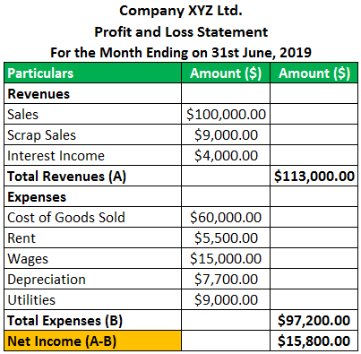

In the contemporary finance landscape, financial statements and algorithmic trading have become essential tools for investors and traders. The Profit and Loss (P&L) statement holds significant importance as it encapsulates a company’s overall financial performance over a specific period. By detailing revenues, expenses, and net income, these statements offer a snapshot of operational efficiency and financial health, essential metrics for informed investment decisions.

Algorithmic trading, which utilizes computer algorithms to execute trades at optimal conditions, can greatly benefit from P&L statements. These documents provide essential data points that can be integrated into algorithms to forecast future performance and identify profitable trading strategies. The P&L statement’s insights can be leveraged to tailor trading algorithms to market conditions, maximizing financial returns while minimizing risks.



As markets become increasingly competitive and complex, understanding the nuances of P&L statements can lead to the development of more sophisticated trading strategies. This article will explore the role of P&L statements in optimizing algorithmic trading, examining techniques that align with profitable trends and risk identification. Furthermore, real-world case studies will illustrate successful strategies, demonstrating the practical application of these financial insights in algorithmic trading.

## Table of Contents

## Understanding Financial Statements in Trading

Financial statements are crucial for traders, particularly those engaged in fundamental analysis, as they provide a detailed overview of a company’s financial situation. Among these, the Profit and Loss (P&L) statement plays a central role. It presents a summary of a company’s revenues, expenses, and net income over a specific period, enabling traders to gain insights into the company’s operational efficiency and profitability.

The P&L statement starts with the total revenue, which is the income generated from sales or services before any costs are subtracted. Revenue is the top line of the P&L statement and serves as a starting point for determining profitability. The calculation of revenue can be expressed as the sum of all income streams from operations:

$$
\text{Total Revenue} = \sum \text{Sales of Goods/Services}
$$

Following revenue, the statement lists various expenses incurred in generating those revenues, such as cost of goods sold (COGS), administrative expenses, and other operational costs. The difference between revenue and COGS gives the gross profit, which is a key indicator of the efficiency of the core operations:

$$
\text{Gross Profit} = \text{Total Revenue} - \text{COGS}
$$

Operating expenses, including salaries, rent, and utilities, are then subtracted to determine the operating income (or operating profit), reflecting the profit from regular business operations:

$$
\text{Operating Income} = \text{Gross Profit} - \text{Operating Expenses}
$$

Additional gains and losses, such as interest income, financing costs, and tax obligations, are also considered in the P&L statement. The final result, after all these factors are accounted for, is the net income, also known as the bottom line. This figure represents the company’s profitability after all expenses and incomes have been tallied:

$$
\text{Net Income} = \text{Operating Income} + \text{Other Income} - \text{Other Expenses} - \text{Taxes}
$$

For traders, the P&L statement is an essential tool in assessing a company’s financial health. By analyzing historical data from these statements, traders can identify trends in profitability, cost management, and revenue generation, which are critical for predicting future financial performance. This analysis aids in making informed decisions about whether to buy, hold, or sell a company’s stock.

Moreover, traders use the data from P&L statements to compare companies within the same industry, offering a benchmark for evaluating competitive positioning. High net income margins indicate strong financial health and potential for investment, while lower margins may suggest potential weaknesses or areas needing improvement.

In summary, understanding financial statements, particularly P&L statements, is fundamental for traders assessing the financial health and future prospects of companies. Through careful analysis of revenue, expenses, and net income, traders can gain valuable insights that inform their trading strategies and investment decisions.

## The Role of Profit and Loss Statements in Algorithmic Trading

Profit and Loss (P&L) statements are crucial in [algorithmic trading](/wiki/algorithmic-trading) as they provide comprehensive data necessary for refining and optimizing trading algorithms and strategies. This financial document encapsulates the revenues, expenses, and profitability of a company over a specified period, offering insights that are invaluable for data-driven trading decisions.

One of the primary roles of P&L statements in algorithmic trading is the identification of historical profitability patterns under varying market conditions. Traders can extract performance metrics from P&L statements to analyze how specific trading strategies have fared across different timeframes and market environments. By scrutinizing these patterns, traders can adjust algorithmic parameters to align better with historical trends that indicate potential profitability.

Furthermore, the systematic analysis of P&L data contributes to the development of robust trading algorithms. This process involves using historical financial data, such as revenue fluctuations and cost patterns, to simulate trading strategies through back-testing. Back-testing is a technique where a trading strategy is tested on historical data to gauge its effectiveness. By refining algorithms based on back-tested results, traders can enhance both the profit potential and the risk management profiles of their trading systems.

Algorithmic trading systems often utilize [machine learning](/wiki/machine-learning) and statistical models to interpret P&L data and improve trading decisions. Python, a popular programming language in finance, is frequently employed to write algorithms that automatically adjust based on real-time market data and historical P&L inputs. For example, a Python-based algorithm might look like this:

```python
import pandas as pd
from sklearn.linear_model import LinearRegression

# Sample function to adjust algorithm parameters based on P&L insights
def adjust_strategy(pnl_data):
    # Load P&L data into a DataFrame
    df = pd.DataFrame(pnl_data)

    # Feature Engineering: Derive meaningful features like profit margins
    df['profit_margin'] = df['net_income'] / df['revenue']

    # Use a simple model to determine the conditions affecting profitability
    model = LinearRegression()
    features = df[['revenue', 'expenses', 'profit_margin']]
    target = df['future_profitability']
    model.fit(features, target)

    # Use model insights to adjust strategy parameters
    coef = model.coef_
    new_strategy_param = optimize_strategy(coef)

    return new_strategy_param

def optimize_strategy(coefficients):
    # Implement logic to dynamically adjust strategy based on model coefficients
    # This is a placeholder for complex logic that would factor in risk and profit projections
    return coefficients.sum()  # Simplified example
```

This code illustrates a simplified approach where a machine learning model uses P&L data to adjust trading strategies by understanding which financial metrics significantly influence future profitability.

Thus, by leveraging the detailed insights from P&L statements, algorithmic traders can make informed adjustments to their strategies. This maximizes returns and minimizes risks, ensuring the trading systems remain competitive and profitable amidst continuously shifting market dynamics.

## Common Factors Affecting Profitability in Algorithmic Trading

Market [volatility](/wiki/volatility-trading-strategies) and [liquidity](/wiki/liquidity-risk-premium) are two critical factors that significantly affect profitability in algorithmic trading. Volatility refers to the degree of variation in the price of a financial instrument over time. High volatility can lead to substantial gains or losses, depending on the timing of trades. Consequently, traders need strategies to manage risk in volatile markets effectively. Liquidity pertains to the ease with which assets can be bought or sold without causing a drastic change in their price. High liquidity enables smoother trading operations and minimizes slippage, which is the difference between the expected price of a trade and the actual price at which it is executed.

Algorithmic trading systems must incorporate mechanisms to address these elements effectively. This includes setting optimal risk management parameters like risk tolerance and leverage, which can mitigate potential financial losses. Risk tolerance defines the amount of risk an algorithm, or trader, is willing to take. Setting appropriate risk tolerance levels is critical as it aligns the trading strategy with the investor's financial goals and capacities.

Leverage is another important consideration; it magnifies both potential returns and potential losses. An algorithmic system equipped with well-defined leverage parameters can optimize capital use while controlling the risk of significant loss. A potential method to adjust leverage based on certain market conditions is:

```python
def adjust_leverage(market_volatility, base_leverage):
    if market_volatility < 0.2:
        return base_leverage * 1.5    # Increase leverage in low volatility
    elif market_volatility > 0.5:
        return base_leverage * 0.5    # Decrease leverage in high volatility
    else:
        return base_leverage          # Maintain base leverage

market_volatility = 0.3
base_leverage = 2.0
new_leverage = adjust_leverage(market_volatility, base_leverage)
```

Accurate and high-quality financial data is essential for making informed algorithmic trading decisions. The quality of data affects everything from the back-testing process to live trading execution. Reliable data ensures that the strategies and algorithms are based on accurate historical patterns and can predict future price movements with better accuracy.

Traders must employ rigorous data validation and preprocessing methods to ensure data integrity. In Python, libraries like `pandas` can be used for data manipulation and cleaning:

```python
import pandas as pd

# Load financial data
df = pd.read_csv('financial_data.csv')

# Handle missing values
df.dropna(inplace=True)

# Ensure datetime indexing
df['date'] = pd.to_datetime(df['date'])
df.set_index('date', inplace=True)

# Filter outliers for accurate backtesting
df = df[(df > df.quantile(0.01)) & (df < df.quantile(0.99))]
```

By focusing on these elements—monitoring volatility and liquidity, robust risk management, and ensuring data quality—traders can enhance their algorithmic trading strategies. This approach allows for a more disciplined trading process that maximizes profitability while minimizing exposure to adverse market conditions.

## Strategies to Mitigate Losses

Implementing effective risk management techniques is crucial in algorithmic trading to prevent substantial financial losses. One fundamental approach is the use of stop loss and take profit orders. These mechanisms allow traders to set predetermined price points at which an asset will be automatically sold or bought. A stop loss order minimizes losses by selling an asset once it reaches a certain price threshold, thereby cutting potential losses short. Conversely, a take profit order locks in profits by selling the asset when it hits the desired profit level. This strategy not only helps manage risks but also ensures that trading decisions are adhered to without emotional interference.

Diversification is another pivotal strategy. By broadening investments across a variety of assets or asset classes, traders can reduce the risk associated with adverse price movements in a single investment. Diversification minimizes the impact of any single asset's poor performance on the overall portfolio. The principle is based on the concept that different asset classes respond uniquely to the same market events. While one asset might decline in value due to a market shift, others might remain stable or even increase, thereby balancing the portfolio’s performance.

Regular analysis and updating of trading algorithms based on P&L analysis is essential to adapt to current market conditions. Algorithmic traders should frequently evaluate the performance of their strategies through a detailed profitability assessment. This involves reviewing historical P&L data to identify patterns or anomalies that might signal a need for adjustments. By employing a feedback loop where past performance informs future strategy development, traders can enhance their algorithms for better resilience and performance.

An example of a simple Python implementation for [backtesting](/wiki/backtesting) a strategy using historical P&L data might look like this:

```python
import pandas as pd

# Load historical P&L data
data = pd.read_csv('historical_pnl.csv')

# Calculate returns and evaluate strategy performance
data['Return'] = data['NetIncome'] / data['Investment']
cumulative_returns = (1 + data['Return']).cumprod()

# Adjust algorithm parameters based on backtest results
optimized_threshold = data[data['Return'] > 0.05]['Threshold'].mean()

print("Optimized Threshold for Stop Loss:", optimized_threshold)

```

This script serves as a basic illustration of how historical P&L data can inform algorithmic trading strategies. By using calculated returns, traders can assess the efficacy of current strategies and adjust parameters such as stop loss thresholds to enhance overall profitability. The continuous cycle of analysis, adjustment, and optimization is key to mitigating risks and ensuring that trading strategies remain effective under changing market circumstances.

## Case Study: Utilizing P&L Statements for Enhanced Trading

XYZ Trading Firm demonstrated how the astute use of Profit and Loss (P&L) statements can bolster algorithmic trading success. By analyzing historical P&L figures, XYZ identified sectors with consistent profitability and allocated resources accordingly. This strategic approach involved adjusting algorithm parameters based on robust data analysis, thereby fine-tuning their trading strategies.

Initially, XYZ conducted a thorough examination of their P&L statements to discern patterns in sector performance. They focused on sectors that consistently outperformed others, as evidenced by favorable revenue and net income metrics. This data-driven insight enabled XYZ to channel investments into sectors with a proven track record of strong P&L figures.

XYZ also leveraged technological tools for more detailed P&L analysis. Using advanced statistical models and machine learning algorithms, they examined vast datasets to predict future profitability trends. For instance, a Python-based machine learning model could look as follows:

```python
from sklearn.model_selection import train_test_split
from sklearn.ensemble import RandomForestRegressor
import pandas as pd

# Load data
data = pd.read_csv('historical_pnl_data.csv')
X = data.drop('profit', axis=1)
y = data['profit']

# Split the data
X_train, X_test, y_train, y_test = train_test_split(X, y, test_size=0.2, random_state=42)

# Initialize and train the model
model = RandomForestRegressor(n_estimators=100, random_state=42)
model.fit(X_train, y_train)

# Evaluate the model
score = model.score(X_test, y_test)
print(f'Model accuracy: {score}')
```

This algorithm predicted sectors with high profitability potential, enabling XYZ to adjust trade execution strategies proactively. The firm also revised algorithmic risk management settings to align with newly derived risk-return profiles, ensuring optimal leverage and risk exposure.

Overall, XYZ's integration of P&L analysis into their trading operations resulted in a notable enhancement in profitability. This case exemplifies the transformative impact of leveraging P&L data to refine algorithmic strategies in the ever-evolving financial markets. By continually adapting algorithms based on these insights, firms like XYZ maintain a competitive edge and maximize financial performance.

## Conclusion

Profit and Loss (P&L) statements serve as essential instruments for algorithmic traders aiming to enhance trading efficacy and manage risks proficiently. Detailed analysis of these financial documents enables traders to develop strategies that are both resilient and profitable. This is achieved by evaluating key performance indicators, such as revenue growth, cost management, net income, and profit margins, which are fundamental to understanding a company's financial condition and performance over time.

By interpreting these indicators, traders can gauge the effectiveness of their algorithmic strategies, adjust parameters, and ensure that their systems are aligned with prevailing market conditions. For instance, using historical P&L data, traders can identify trends and patterns that might indicate future opportunities or risks, allowing for more informed decision-making. This analytical approach aids in refining strategy implementation, particularly by identifying the best sectors or financial instruments to target based on past profitability.

As financial markets continue to evolve rapidly, continuous adaptation of trading algorithms becomes imperative. By leveraging insights from P&L statements, algorithmic traders can maintain a competitive edge, optimizing their systems to anticipate and react to changing market dynamics. This proactive approach not only bolsters profitability but also ensures that traders can manage risks effectively, adapting to unforeseen market conditions or volatility.

Incorporating P&L insights into trading strategies enables traders to preemptively address potential losses. For example, by understanding fixed and variable costs, traders can devise stop-loss limits and profit-taking strategies that are in tune with the company’s financial realities. Consequently, this integration fosters sustained profitability, as traders remain agile and responsive to the financial pulse of the companies and markets they invest in. 

Consistent and systematic evaluation of P&L statements is thus an indispensable practice for algorithmic traders committed to achieving long-term success and financial growth. Through strategic adaptability and informed risk management, traders can secure and sustain their competitive advantage in the evolving landscape of financial markets.

## Additional Resources

For traders looking to enhance their knowledge and skills in algorithmic trading, several resources can be invaluable. IG Academy is a prominent platform offering comprehensive courses that cover a wide range of trading strategies and risk management techniques. These courses are designed to cater to both beginners and experienced traders, providing valuable insights into market dynamics and trading methodologies.

Consulting with financial advisors is another practical approach. Advisors offer tailored advice based on a trader's specific financial goals and current market conditions. Moreover, utilizing platforms that provide real-time market data can significantly enhance decision-making by ensuring access to the latest financial information. Such platforms often feature tools for analyzing market trends and executing trades efficiently.

For those interested in a deeper exploration of financial machine learning and algorithmic trading, a variety of [books](/wiki/algo-trading-books) and research articles are available. Titles such as "Advances in Financial Machine Learning" by Marcos Lopez de Prado and "Quantitative Trading: How to Build Your Own Algorithmic Trading Business" by Ernest Chan offer comprehensive insights into the theoretical and practical aspects of algorithmic trading. These works provide readers with an understanding of the statistical and machine learning techniques applicable to trading and how to implement them effectively.

Additionally, engaging with open-source communities and forums dedicated to algorithmic trading can provide support and collaborative opportunities. Online platforms like GitHub host various algorithmic trading projects, where traders can explore code, share experiences, and contribute to developments in trading algorithms.

## References & Further Reading

Bergstra, J., et al. provide a comprehensive exploration of "Algorithms for Hyper-Parameter Optimization," which is crucial for refining machine learning models in trading. The study presents methods such as random search and Bayesian optimization, enabling efficient tuning of model parameters to improve predictive performance.

Lopez de Prado, M. in "Advances in Financial Machine Learning," addresses cutting-edge techniques tailored for financial data analysis. This includes methods like the Triple-Barrier Method for labeling financial data and the use of Meta-labeling strategies to enhance model accuracy. These techniques are vital for traders seeking to leverage machine learning for strategic advantage.

Aronson, D.'s work, "Evidence-Based Technical Analysis," emphasizes the importance of robust statistical methods to differentiate between genuine patterns and random noise in financial data. Aronson advocates for the use of scientific principles to validate trading signals, an essential practice for algorithmic traders to ensure effective decision-making.

Jansen, S. presents "Machine Learning for Algorithmic Trading," offering a practical guide for implementing machine learning techniques in trading algorithms. The book covers various strategies, including the development of machine learning models for predicting asset returns, making it a valuable resource for enhancing trading systems.

Chan, E. in "Quantitative Trading: How to Build Your Own Algorithmic Trading Business," provides insights into building algorithmic trading strategies and developing a trading infrastructure. Chan discusses vital elements, such as back-testing and risk management, which are critical for creating a robust and profitable trading business.

