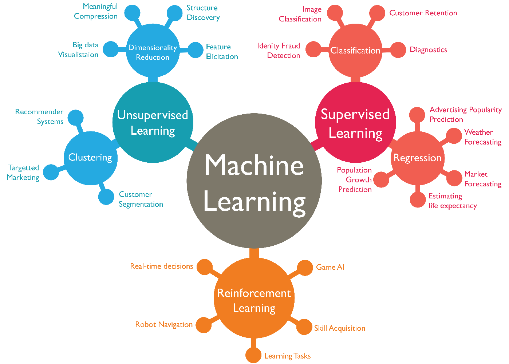

## Table of Contents

## What is machine learning and how does it relate to Example?

Machine learning is a type of artificial intelligence where computers learn from data without being explicitly programmed. It's like teaching a computer to recognize patterns or make decisions based on examples it has seen before. Imagine you're showing a child pictures of cats and dogs, and after a while, the child can tell the difference between them. Machine learning works in a similar way, but with data instead of pictures.

In relation to Example, let's say Example is a company that wants to predict customer behavior. They can use machine learning to analyze past customer data, like what products they bought or how often they visited the website. By doing this, Example can find patterns and make predictions about what customers might do next. For instance, if Example sees that customers who buy product A often buy product B, they can use this information to suggest product B to new customers who buy product A. This helps Example improve their business by understanding and anticipating customer needs better.

## What are the basic concepts of machine learning that beginners should know?

Machine learning is all about teaching computers to learn from data. There are three main types of learning: supervised, unsupervised, and reinforcement learning. Supervised learning is like having a teacher show you examples and then testing you. The computer sees lots of examples with correct answers, like pictures labeled as cats or dogs, and then it tries to guess the right label for new pictures. Unsupervised learning is more like exploring without a guide. The computer looks for patterns in the data all by itself, like grouping similar customers together without knowing anything about them beforehand. Reinforcement learning is like learning by trial and error. The computer tries different actions and gets rewards or penalties, helping it figure out the best way to do things over time.

Another important concept is the model, which is like the brain of the machine learning system. A model is a set of rules or a mathematical formula that the computer uses to make predictions or decisions. For example, a simple model might be a line that tries to fit through a set of data points, like $$y = mx + b$$. To create and improve these models, we use algorithms, which are like recipes that tell the computer how to learn from the data. There are many different algorithms, each good for different kinds of problems. Once we have a model, we need to train it, which means showing it lots of data so it can learn. After training, we test the model to see how well it works on new data it hasn't seen before. If it doesn't work well, we might need to adjust the model or use more data to train it better.

Lastly, it's important to understand the data itself. Data is the fuel for [machine learning](/wiki/machine-learning), and the quality and quantity of data can make a big difference. Good data is clean, meaning it doesn't have errors or missing information, and it's relevant to the problem you're trying to solve. Sometimes, we need to preprocess the data, which means cleaning it up and getting it ready for the machine learning algorithms. This can involve things like removing outliers, filling in missing values, or transforming the data into a format that's easier for the computer to understand. Understanding these basic concepts will help beginners get started with machine learning and appreciate how it can be applied to solve real-world problems.

## How does Example use machine learning in its operations?

Example uses machine learning to better understand and serve its customers. They collect data on what customers buy, how often they visit the website, and other behaviors. With this data, Example uses supervised learning to predict what customers might want next. For instance, if they see that people who buy product A often buy product B, they can suggest product B to new customers who buy product A. This helps Example improve their sales and customer satisfaction by making personalized recommendations.

In addition to predicting customer behavior, Example also uses unsupervised learning to group similar customers together. This helps them understand different types of customers without knowing anything specific about them beforehand. By finding these groups, Example can tailor their marketing and services to different customer segments. For example, they might find that one group of customers prefers eco-friendly products, so they can target that group with special promotions on green items. This way, Example can better meet the needs of different kinds of customers and improve their overall business strategy.

## What types of machine learning algorithms are commonly used in Example?

Example uses a few common types of machine learning algorithms to help with their business. One of them is the decision tree algorithm, which is like a flowchart that helps the computer make decisions. For instance, if a customer buys product A, the decision tree might lead to suggesting product B. Another algorithm Example uses is k-means clustering, which helps group similar customers together. This way, Example can see patterns in customer behavior without knowing anything specific about them beforehand.

Another algorithm used by Example is linear regression, which is good for predicting numbers. For example, if Example wants to predict how much a customer might spend in the next month, they can use linear regression to find a line that fits the past spending data, like $$y = mx + b$$. This helps them make better guesses about future spending. Lastly, Example uses collaborative filtering for their recommendation system. This algorithm looks at what similar customers have bought and suggests those items to new customers. By using these algorithms, Example can understand their customers better and make smarter business decisions.

## Can you explain the data preprocessing steps used in Example's machine learning models?

Example starts by collecting a lot of data about their customers, like what they buy and how often they visit the website. Before they can use this data in their machine learning models, they need to clean it up. This means they look for and fix any errors in the data, like missing information or strange values that don't make sense. They might use a simple method to fill in missing data, like using the average value of a column to replace any missing numbers. For example, if they have a column for how much customers spend and some values are missing, they might fill those in with the average spending amount, like $$ \text{Average Spending} = \frac{\text{Total Spending}}{\text{Number of Customers}} $$.

After cleaning the data, Example normalizes it to make sure all the numbers are on the same scale. This is important because some machine learning algorithms work better when all the data is in the same range. They might use a technique called min-max normalization, which scales the data so it fits between 0 and 1. This can be done with a simple formula, like $$ \text{Normalized Value} = \frac{\text{Value} - \text{Minimum Value}}{\text{Maximum Value} - \text{Minimum Value}} $$. Once the data is clean and normalized, Example can then use it to train their machine learning models to make predictions and find patterns in customer behavior.

## What are the key performance metrics used to evaluate machine learning models in Example?

Example uses several key performance metrics to evaluate their machine learning models. One important metric is accuracy, which tells them how often their model's predictions are correct. For example, if their model is trying to predict whether a customer will buy a certain product, accuracy measures the percentage of correct predictions. Another useful metric is precision, which shows how many of the positive predictions made by the model are actually correct. This is important for Example when they want to make sure their recommendations are relevant to customers. They also use recall, which measures how many of the actual positive cases the model correctly identifies. For instance, if they want to catch all customers who might be interested in a new product, recall helps them see how well their model is doing.

Another metric Example looks at is the F1 score, which combines precision and recall into one number. The F1 score is calculated using the formula $$ F1 = 2 \times \frac{\text{precision} \times \text{recall}}{\text{precision} + \text{recall}} $$. This helps Example balance the need for accurate predictions with the need to catch as many interested customers as possible. Additionally, they use the area under the ROC curve (AUC-ROC) to see how well their model can distinguish between positive and negative cases. A higher AUC-ROC means the model is better at telling the difference. By looking at these metrics, Example can understand how well their machine learning models are working and make improvements where needed.

## How does Example handle issues like overfitting and underfitting in its machine learning models?

Example tackles overfitting by using a technique called cross-validation. Overfitting happens when a model learns the training data too well, including its noise and errors, and then performs poorly on new data. To avoid this, Example splits their data into different parts and uses some of it to train the model and the rest to test it. This way, they can see how well the model works on data it hasn't seen before. If the model's performance is much worse on the test data, it's a sign of overfitting. To fix it, Example might use a simpler model or add more data to train on, helping the model generalize better to new situations.

Underfitting, on the other hand, occurs when a model is too simple to capture the patterns in the data, leading to poor performance on both training and test data. Example addresses this by trying different models that are more complex or by adding more relevant features to the data. For instance, if they're predicting customer spending and the model is underfitting, they might include additional information like customer income or past purchases. By doing this, Example can help the model learn the underlying patterns better and improve its predictions. Both overfitting and underfitting are important to watch out for, and Example uses these techniques to make sure their machine learning models work well in real-world situations.

## What advanced techniques does Example employ to enhance its machine learning models?

Example uses a technique called ensemble learning to make their machine learning models even better. Ensemble learning is like getting a group of people to work together to solve a problem. Instead of relying on just one model, Example combines several models to make predictions. For example, they might use a method called random forests, which is a bunch of decision trees working together. Each tree makes its own prediction, and then they all vote on the final answer. This helps make the predictions more accurate and reliable because it reduces the chance of making a mistake that one model might make on its own.

Another advanced technique Example uses is [deep learning](/wiki/deep-learning), which is a type of machine learning that uses neural networks. Neural networks are like the brain of the computer, with lots of connected nodes that can learn complex patterns from data. Example uses deep learning for things like image recognition or understanding customer text reviews. They might use a [convolutional [neural network](/wiki/neural-network)](/wiki/convolutional-neural-network) (CNN) for images, which can recognize different parts of an image and put them together to understand the whole picture. For text, they might use a recurrent neural network (RNN) or a transformer model, which can understand the order of words and the context they're used in. By using these advanced techniques, Example can make their models smarter and more useful for their business.

## How does Example integrate machine learning with other technologies like AI and big data?

Example integrates machine learning with other technologies like AI and big data to improve their business operations. They use AI to make their machine learning models smarter. For instance, AI helps them understand customer text reviews better by using natural language processing (NLP), which is a part of AI. This means they can read what customers say about their products and use that information to make better predictions about what customers might want next. By combining AI with machine learning, Example can do things like recommend products more accurately and respond to customer feedback in a more personalized way.

Example also uses big data to feed their machine learning models. Big data means they have a lot of information about their customers, like what they buy and how they behave on the website. They use this data to train their models, which helps the models learn from real customer behavior. For example, if they see that customers who buy product A often buy product B, they can use this information to suggest product B to new customers who buy product A. By integrating big data with machine learning, Example can make better predictions and decisions, which helps them serve their customers better and grow their business.

## What are some real-world applications of machine learning within Example?

Example uses machine learning to make shopping better for their customers. They look at what people buy and how they act on the website. With this information, they can guess what customers might want next. For example, if someone buys a shirt, Example's machine learning model might suggest a matching pair of pants. They do this by using a special kind of math called algorithms, like decision trees or k-means clustering, to find patterns in the data. This helps them show customers products they might like, which makes shopping more fun and personal.

Another way Example uses machine learning is to understand what customers say about their products. They use something called natural language processing (NLP), which is a part of AI, to read and understand customer reviews. This helps them know if people like their products or if there are problems they need to fix. By using machine learning with big data, Example can see what lots of customers think and use that to make their products better. This also helps them talk to customers in a way that feels more personal and helpful.

## How does Example ensure the ethical use of machine learning and address bias in its models?

Example works hard to make sure their machine learning models are fair and ethical. They know that if their models are biased, it can hurt customers and their business. To stop this from happening, Example looks closely at the data they use to train their models. They check for any patterns that might cause unfair treatment, like if the model suggests different products to people based on things like their age or where they live. If they find any bias, they fix the data or change the model to make it fair. They also have a team of people who keep an eye on the models all the time to make sure they are treating everyone the same way.

Another way Example makes sure their machine learning is ethical is by being open about how they use data and models. They tell customers what information they collect and how they use it to make suggestions. This helps build trust because customers know what's going on. Example also follows rules and laws about data privacy and fairness. They work with experts to make sure their models are not just good at predicting things, but also good for everyone. By doing all these things, Example can use machine learning to help their customers without causing harm or being unfair.

## What future trends in machine learning should Example be prepared to adopt?

Example should keep an eye on a few big trends in machine learning that are coming up. One of these is called "explainable AI," which means making sure that people can understand how machine learning models make their decisions. This is important because it helps build trust with customers. If someone knows why a certain product is recommended to them, they're more likely to trust the suggestion. Example can start preparing for this by using models that can explain their choices in simple terms, like showing why a shirt and pants were suggested together based on what other customers bought.

Another trend Example should be ready for is the use of more advanced deep learning techniques. Deep learning is a kind of machine learning that uses neural networks, which are like the brain of the computer. These networks can learn very complex patterns from data. For example, Example might use a type of deep learning called "transformers" to better understand customer reviews or predict what products people might like next. By adopting these advanced techniques, Example can make their recommendations even smarter and more personalized, helping them stay ahead in the market.

Lastly, Example should prepare for the growing importance of federated learning. This is a way of training machine learning models without sharing all the data in one place, which is great for privacy. Instead of sending all customer data to a central server, federated learning lets the data stay on the customers' devices, and only the model updates are shared. This can help Example keep customer information safe while still improving their models. By getting ready for these trends, Example can keep using machine learning in a way that's both effective and ethical.