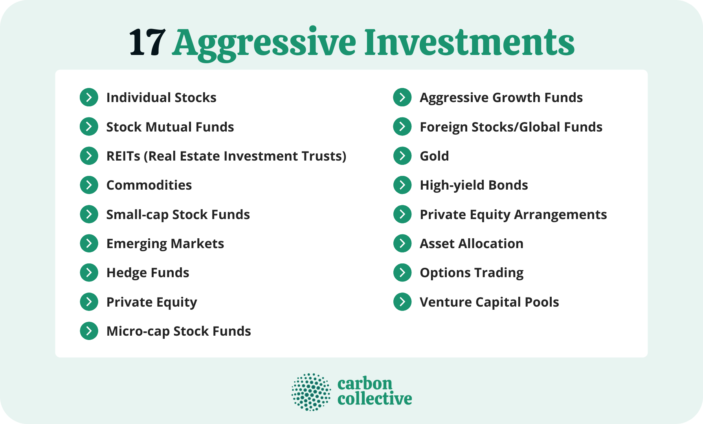

## Table of Contents

## What is an aggressive growth mutual fund?

An aggressive growth mutual fund is a type of investment fund that aims to grow your money quickly. It does this by investing in stocks of companies that are expected to grow a lot in the future. These companies are often smaller or newer and can be riskier than well-known, established companies. Because of this, aggressive growth funds can go up and down a lot in value, but they also have the potential for higher returns.

These funds are best for investors who are willing to take on more risk for the chance of earning more money. They are not usually recommended for people who need their money soon or who cannot handle big ups and downs in their investments. Instead, they are better for people who can leave their money invested for a long time, like many years, and who are okay with the possibility of losing some of their investment.

## How do aggressive growth mutual funds differ from other types of mutual funds?

Aggressive growth mutual funds are different from other mutual funds because they focus on making money quickly by investing in companies that are expected to grow a lot. These companies are usually smaller or newer and can be riskier. Other types of mutual funds, like balanced funds or income funds, might invest in a mix of stocks, bonds, and other investments to grow money more slowly but with less risk. Aggressive growth funds are all about taking big risks to get big rewards, while other funds try to balance risk and reward more carefully.

For example, a growth and income fund might invest in big, well-known companies that pay dividends to their shareholders. These funds aim to grow your money over time while also giving you regular income. On the other hand, an aggressive growth fund might not care about dividends and would instead focus on companies that are growing fast but might not be paying dividends yet. This means that aggressive growth funds can go up and down a lot more than other funds, making them more suitable for investors who can handle that kind of risk and are willing to wait a long time for their investment to pay off.

## What are the main characteristics of aggressive growth mutual funds?

Aggressive growth mutual funds are all about taking big risks to make big gains. They invest in companies that are expected to grow a lot, but these companies are often smaller or newer and can be risky. Because of this, the value of these funds can go up and down a lot. They are not for people who need their money soon or who can't handle big changes in their investments. Instead, they are better for people who can leave their money in the fund for a long time and who are okay with the chance of losing some of their investment.

These funds don't usually care about getting regular income from dividends. They focus on the growth of the companies they invest in. This means they might not pay out dividends to investors, but the value of the fund could go up a lot if the companies do well. Aggressive growth mutual funds are different from other funds that might invest in a mix of stocks, bonds, and other things to grow money more slowly and safely. They are for investors who want to take on more risk for the chance of [earning](/wiki/earning-announcement) more money over time.

## Can you list some examples of aggressive growth mutual funds?

Some examples of aggressive growth mutual funds are the T. Rowe Price New Horizons Fund and the Fidelity Advisor Growth Opportunities Fund. The T. Rowe Price New Horizons Fund focuses on small and medium-sized companies that are expected to grow quickly. It's been around for a long time and has done well for investors who are okay with taking risks. The Fidelity Advisor Growth Opportunities Fund, on the other hand, invests in companies of all sizes that are growing fast. It's managed by people who look for the best growth opportunities, no matter the size of the company.

Another example is the Vanguard U.S. Growth Fund. This fund looks for big and small companies that are growing fast. It's a good choice for people who want to invest in a fund that's managed by experts who are always looking for the best growth opportunities. All these funds are meant for investors who are willing to take on more risk for the chance of earning more money over time. They are not for people who need their money soon or who can't handle big ups and downs in their investments.

## What are the risks associated with investing in aggressive growth mutual funds?

Investing in aggressive growth mutual funds comes with a lot of risks. These funds put money into smaller or newer companies that are expected to grow fast. But because these companies are not as well-known or established, they can be riskier. If these companies don't do well, the value of the fund can go down a lot. This means you could lose some or even all of your investment. The ups and downs can be big, and if you need your money soon, you might have to sell your investment when it's worth less than what you paid for it.

Another risk is that aggressive growth funds usually don't pay out dividends. They focus on the growth of the companies they invest in, so you won't get regular income from them. This can be a problem if you need money coming in regularly. Also, these funds can be affected by changes in the economy or the stock market more than other types of funds. If the market goes down, aggressive growth funds can lose value faster than funds that invest in bigger, more stable companies. So, it's important to be okay with these risks and to be able to leave your money in the fund for a long time if you want to invest in aggressive growth mutual funds.

## How can an investor determine if an aggressive growth mutual fund is suitable for their portfolio?

To figure out if an aggressive growth mutual fund is right for your investment plan, you need to think about your comfort with risk and how long you can keep your money invested. These funds can go up and down a lot in value because they invest in smaller or newer companies that are expected to grow fast. If you can handle big changes in your investment and you don't need your money for a long time, like many years, then an aggressive growth fund might be a good fit. But if you need your money soon or if big ups and downs make you nervous, these funds might not be right for you.

You should also look at your overall investment goals and how much risk you want to take. Aggressive growth funds are for people who want to take on more risk for the chance of earning more money over time. If you already have a lot of risky investments in your portfolio, adding an aggressive growth fund might make your overall investments too risky. On the other hand, if most of your investments are in safer things like bonds, adding an aggressive growth fund could help balance out your portfolio by giving you a chance for bigger gains. Talking to a financial advisor can help you make the best choice for your situation.

## What historical performance data should be considered when evaluating aggressive growth mutual funds?

When looking at aggressive growth mutual funds, it's important to check how they've done over time. You want to see how much money the fund has made or lost over different periods like the last year, three years, five years, and even ten years. This helps you see if the fund has been good at growing money over the long run. Also, look at how much the fund's value has gone up and down during these times. If the ups and downs are too big, it might be too risky for you.

Another thing to consider is how the fund has done compared to other funds that are similar. This is called the fund's benchmark. If the aggressive growth fund has done better than its benchmark over time, that's a good sign. But remember, past performance doesn't tell you what will happen in the future. It's just one piece of the puzzle to help you decide if the fund is right for you.

## What are the tax implications of investing in aggressive growth mutual funds?

Investing in aggressive growth mutual funds can have different tax effects depending on how long you keep your investment and the type of gains you get. If you sell your shares in the fund after holding them for a year or less, any profit you make is considered a short-term capital gain. These gains are taxed at your regular income tax rate, which can be high. But if you hold onto your shares for more than a year before selling, the profit is a long-term capital gain, which usually has a lower tax rate. This makes it a good idea to keep your investment in aggressive growth funds for a long time to get the tax benefit.

Another thing to think about is that aggressive growth mutual funds often don't pay out dividends. But if they do, these dividends are usually taxed as regular income, which can also be at a high rate. Sometimes, the fund might also make capital gains distributions if it sells some of its investments at a profit. These distributions are also taxed, and you have to pay taxes on them even if you reinvest the money back into the fund. So, it's important to understand these tax rules and maybe talk to a tax advisor to make smart choices about your investments.

## How do fees and expenses impact the returns of aggressive growth mutual funds?

Fees and expenses can really affect how much money you make from aggressive growth mutual funds. These funds charge different kinds of fees, like management fees for the people who run the fund and other costs for things like trading. All these fees add up and come out of the fund's returns. So, if the fund makes money, you get less of it because of the fees. Over time, even small fees can make a big difference in how much money you end up with.

For example, if a fund has a 1% management fee, that means you're paying 1% of your investment every year just to keep it in the fund. If the fund grows by 10% in a year, after the fee, you only get 9%. Over many years, this can add up to a lot less money for you. That's why it's important to look at the fees and expenses of any aggressive growth mutual fund before you invest. Lower fees mean more money stays in your pocket.

## What strategies do fund managers of aggressive growth mutual funds typically employ?

Fund managers of aggressive growth mutual funds usually look for companies that they think will grow a lot in the future. They often pick smaller or newer companies that might not be well-known yet. These managers believe that if these companies do well, their stock prices will go up a lot, making the fund's value grow quickly. They might also invest in bigger companies if they see a lot of growth potential. The key is to find companies that can grow faster than the market as a whole, even if they are riskier.

To find these fast-growing companies, fund managers do a lot of research. They look at things like how much money a company is making, how fast it's growing, and what new products or services it might be working on. They also keep an eye on what's happening in the economy and the stock market to make smart choices about when to buy or sell stocks. Because aggressive growth funds take big risks, the managers need to be good at [picking](/wiki/asset-class-picking) the right companies and knowing when to make changes to the fund's investments.

## How does market volatility affect aggressive growth mutual funds?

Market [volatility](/wiki/volatility-trading-strategies) can really shake up aggressive growth mutual funds. These funds invest in companies that are expected to grow a lot, but these companies can be risky. When the stock market goes up and down a lot, the value of these funds can change even more. If the market goes down, aggressive growth funds might lose value faster than other funds because they invest in smaller or newer companies that are not as stable. This means that if you need to take your money out during a time when the market is down, you could lose a lot.

But market volatility can also be a good thing for aggressive growth funds. If the market goes up a lot, these funds can make more money than other funds because they are invested in companies that can grow quickly. The managers of these funds are always looking for the best opportunities, and they might buy more stocks when prices are low and sell when prices are high. So, while aggressive growth funds can be riskier during volatile times, they also have the chance to make big gains if the market turns around and goes up.

## What advanced metrics or ratios should an expert use to analyze the performance of aggressive growth mutual funds?

When looking at aggressive growth mutual funds, experts often use a few key metrics and ratios to understand how well the fund is doing. One important metric is the Sharpe Ratio, which helps you see if the fund's returns are worth the risk you're taking. A higher Sharpe Ratio means the fund is doing a good job of making money without taking too much risk. Another useful ratio is the Alpha, which shows how much better or worse the fund is doing compared to what you would expect based on the market. A positive Alpha means the fund is beating the market, which is what you want from an aggressive growth fund.

Another important metric is the Standard Deviation, which tells you how much the fund's returns go up and down. A high Standard Deviation means the fund's value can change a lot, which is common for aggressive growth funds because they invest in riskier companies. Experts also look at the Beta, which measures how much the fund moves with the market. A Beta higher than 1 means the fund goes up and down more than the market, which can be good or bad depending on whether the market is going up or down. These metrics help experts see if the fund is doing what it's supposed to do and if it's worth the risk.

## References & Further Reading

[1]: ["Aggressive Growth Funds"](https://www.morningstar.com/funds/3-great-aggressive-growth-funds) on Investopedia.

[2]: Malkiel, B. G. (2019). ["A Random Walk Down Wall Street: The Time-Tested Strategy for Successful Investing"](https://yourknowledgedigest.org/wp-content/uploads/2020/04/a-random-walk-down-wall-street.pdf). W. W. Norton & Company.

[3]: ["Introduction to Algorithmic Trading Strategies"](https://onlinelibrary.wiley.com/doi/epdf/10.1002/9781119206033.fmatter) by QuantInsti.

[4]: Alexander, C. (2001). ["Market Models: A Guide to Financial Data Analysis"](https://archive.org/details/marketmodelsguid0000alex). Wiley.

[5]: ["Mutual Funds: An Overview"](https://www.morningstar.com/funds) by the U.S. Securities and Exchange Commission (SEC).