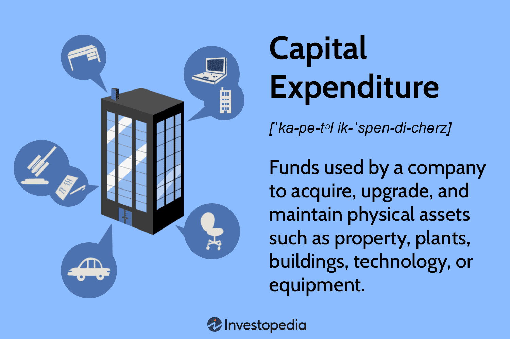

## Table of Contents

## What are capital expenditures?

Capital expenditures, often called CapEx, are the money a business spends on buying or improving long-term assets. These assets can be things like buildings, machinery, or equipment that the business will use for a long time. The main goal of capital expenditures is to help the business grow and become more efficient. For example, a company might buy a new factory to increase its production capacity.

Unlike regular expenses that a business has every day or every month, capital expenditures are big investments that are expected to benefit the company for many years. When a company spends money on these assets, it doesn't count as an immediate expense on the income statement. Instead, the cost is spread out over the useful life of the asset through a process called depreciation. This helps the company manage its finances better and plan for the future.

## Why do companies invest in capital expenditures?

Companies invest in capital expenditures to help their business grow and work better. When a company buys new machines or builds a new factory, it can make more products or offer new services. This can help the company earn more money in the future. For example, if a bakery buys a bigger oven, it can bake more bread each day and sell more to customers.

Capital expenditures also help companies stay up to date with new technology and keep their equipment in good shape. If a company uses old machines, they might break down a lot and slow down work. By spending money on new or improved assets, the company can avoid these problems and keep running smoothly. This is important because it helps the company stay competitive and meet the needs of its customers.

## Can you name a few companies known for high capital expenditures?

Some big companies that spend a lot on capital expenditures are oil and gas companies like ExxonMobil and Chevron. These companies need to spend a lot of money to find new oil and gas, build drilling rigs, and set up pipelines. Without these big investments, they wouldn't be able to keep producing the energy that people need.

Another type of company that spends a lot on capital expenditures is tech companies like Amazon and Apple. Amazon builds huge warehouses and buys lots of trucks and planes to deliver things quickly to customers. Apple spends money on making new factories and buying machines to build their iPhones and other products. These investments help them grow and stay ahead of other companies.

Also, big car makers like Toyota and Ford spend a lot on capital expenditures. They need to build new factories and buy new machines to make cars. This helps them make more cars and keep up with new technology, like electric cars. Without these big investments, they wouldn't be able to stay competitive in the car market.

## How do capital expenditures impact a company's financial statements?

When a company spends money on capital expenditures, it shows up on their financial statements in a few ways. First, the money spent on buying new assets like buildings or machines is recorded as an increase in the company's assets on the balance sheet. This means the total value of what the company owns goes up. But, the cash used to buy these assets goes down, so the company's cash balance on the balance sheet will decrease.

Second, capital expenditures don't show up as an expense right away on the income statement. Instead of counting the whole cost as an expense in the year it was bought, the cost is spread out over the years the asset will be used. This is called depreciation. Each year, a part of the cost is listed as a depreciation expense on the income statement. This makes the company's profits look smaller each year, but it helps match the cost of the asset with the income it helps to generate over time.

Lastly, capital expenditures can affect the cash flow statement. When a company buys new assets, it shows up as a use of cash in the investing activities section. This shows how much money the company is spending to grow and improve its business. Even though it uses up cash now, the hope is that these investments will help the company earn more money in the future.

## What industries typically have high capital expenditures?

Some industries that usually spend a lot on capital expenditures are oil and gas, technology, and car making. Oil and gas companies like ExxonMobil and Chevron need to spend a lot of money to find new oil and gas, build drilling rigs, and set up pipelines. Without these big investments, they wouldn't be able to keep producing the energy that people need.

Tech companies like Amazon and Apple also spend a lot on capital expenditures. Amazon builds huge warehouses and buys lots of trucks and planes to deliver things quickly to customers. Apple spends money on making new factories and buying machines to build their iPhones and other products. These investments help them grow and stay ahead of other companies.

Big car makers like Toyota and Ford also have high capital expenditures. They need to build new factories and buy new machines to make cars. This helps them make more cars and keep up with new technology, like electric cars. Without these big investments, they wouldn't be able to stay competitive in the car market.

## How does a company like Amazon manage its capital expenditures?

Amazon manages its capital expenditures by carefully planning and investing in things that will help it grow and serve its customers better. They spend a lot of money building big warehouses all over the world. These warehouses help Amazon store a lot of products and get them to customers quickly. They also buy a lot of trucks and planes to deliver things faster. This is important because customers want their orders to arrive quickly, and Amazon's big investments help make that happen.

Amazon also spends money on technology to keep improving its services. They build data centers and buy computers to run their website and keep track of orders. This helps them handle a lot of customers at the same time and make shopping easier. By spending money on these things, Amazon can keep growing and stay ahead of other companies. Even though these investments cost a lot of money now, they help Amazon earn more money in the future.

## What are the risks associated with high capital expenditures?

High capital expenditures can be risky for a company. One big risk is that the company might not have enough money to pay for these big investments. If they spend too much on new buildings or machines, they might run out of cash. This can make it hard to pay bills or keep the business running smoothly. If the company has to borrow a lot of money to pay for these investments, they might end up with a lot of debt. This debt can be hard to pay back, especially if the new investments don't make as much money as expected.

Another risk is that the investments might not work out as planned. Sometimes, new machines or buildings don't help the company grow as much as they hoped. For example, if a company builds a new factory but doesn't sell enough products to fill it, the factory won't make money. This can be a big problem because the company spent a lot of money on something that isn't helping. If the market changes or new technology comes along, the company's big investments might become outdated quickly. This means they might have to spend even more money to keep up, which can be tough on the company's finances.

## How do companies like Tesla finance their capital expenditures?

Companies like Tesla finance their capital expenditures in a few different ways. One way is by using the money they earn from selling their cars and other products. This is called using their own cash flow. When Tesla makes a lot of money, they can use some of it to build new factories or buy new machines. This helps them grow without having to borrow money from others.

Another way Tesla finances its capital expenditures is by borrowing money. They can take out loans from banks or issue bonds to investors. This means they promise to pay back the money over time, usually with interest. Tesla might also raise money by selling new shares of their company to investors. This is called issuing new stock. By getting money from investors, Tesla can spend on big projects like building new factories or developing new technology without using all of their own cash.

## What is the difference between capital expenditures and operational expenditures?

Capital expenditures, or CapEx, are the big investments a company makes in things that will last a long time, like buildings, machines, or equipment. These are things the company will use for many years to help it grow and make more money. When a company spends money on these things, it doesn't count as an expense right away. Instead, the cost is spread out over the years the asset will be used, which is called depreciation. This helps the company match the cost with the income the asset helps to generate.

Operational expenditures, or OpEx, are the regular costs a company has to pay to keep running every day. These include things like rent, salaries, utilities, and the cost of supplies. Unlike capital expenditures, these costs are counted as expenses right away on the income statement. They are needed to keep the business going but don't usually help the company grow in the same way that capital expenditures do. Operational expenditures are important for the day-to-day running of the business, while capital expenditures are about investing in the future.

## How do high capital expenditures affect a company's growth strategy?

High capital expenditures can really help a company grow. When a company spends a lot of money on new buildings, machines, or technology, it can make more products, reach more customers, and stay ahead of other companies. For example, if a car company builds a new factory, it can make more cars and sell them to more people. This can help the company earn more money and get bigger. But, the company needs to plan carefully because these big investments take a lot of money and time to pay off.

However, high capital expenditures can also be risky. If the company spends too much money on these big investments, it might not have enough cash to pay its bills or keep running smoothly. Sometimes, the new buildings or machines don't help the company grow as much as they hoped. If that happens, the company might lose money instead of making more. So, it's important for the company to think carefully about how these investments will help them grow and make sure they can afford them.

## Can you explain how depreciation relates to capital expenditures?

Depreciation is how a company spreads out the cost of a big investment, like a building or a machine, over the time it will be used. When a company buys something that will last a long time, they don't count the whole cost as an expense right away. Instead, they break it down into smaller amounts and count a little bit of the cost as an expense each year. This helps the company match the cost of the investment with the money it makes from using it.

For example, if a company buys a machine for $100,000 and it will last for 10 years, they might count $10,000 as an expense each year. This way, the cost of the machine is spread out over the time it helps the company make money. Depreciation is important because it helps the company show a more accurate picture of its profits and plan for the future.

## What metrics should investors look at to evaluate a company's capital expenditure efficiency?

Investors should look at a few key metrics to understand how well a company is using its money for big investments. One important metric is the Return on Invested Capital (ROIC). This shows how much profit the company makes from the money it spends on things like buildings and machines. A higher ROIC means the company is using its money well to grow and make more money. Another good metric to look at is the Capital Expenditure to Revenue Ratio. This tells investors how much of the company's money from sales is being spent on big investments. If this ratio is too high, it might mean the company is spending too much and not making enough money back.

Another useful metric is the Payback Period, which shows how long it takes for the company to earn back the money it spent on an investment. A shorter payback period is better because it means the company gets its money back faster. Investors can also look at the Free Cash Flow to see how much money the company has left after paying for its big investments. If the free cash flow is high, it means the company is spending its money wisely and has money left over for other things like paying dividends or making more investments.

## What is Strategic Financial Planning for CapEx?

Strategic financial planning plays a crucial role in managing capital expenditures (CapEx) efficiently within an organization. Effective management of CapEx ensures that companies allocate resources toward investments that not only support current operational demands but also foster long-term growth and innovation.

One of the key aspects of strategic financial planning for CapEx is the use of financial metrics and tools that assess the viability and profitability of investment projects. Net Present Value (NPV) and Internal Rate of Return (IRR) are two fundamental metrics used in this evaluative process.

**Net Present Value (NPV)** is the calculation of the present value of cash flows generated by a project, minus the initial investment cost. The formula for NPV is:

$$
NPV = \sum \frac{C_t}{(1 + r)^t} - C_0
$$

Here, $C_t$ is the net cash inflow during the period $t$, $r$ is the discount rate, and $C_0$ is the initial investment cost. A positive NPV indicates that the projected earnings (in present dollars) exceed the anticipated costs, suggesting a profitable investment.

**Internal Rate of Return (IRR)** is the discount rate at which the NPV of all cash flows from a particular project equals zero. It is found by solving the equation:

$$
0 = \sum \frac{C_t}{(1 + IRR)^t} - C_0
$$

IRR provides an intuitive indication of the expected profitability of a potential investment, where a higher IRR value signifies greater projected profitability.

Balancing CapEx with Operational Expenditure (OpEx) is vital for sustaining growth. CapEx typically covers longer-term investments, such as facilities, machinery, and technology, whereas OpEx refers to the day-to-day expenses necessary for maintaining a company's operations. Companies need to judiciously allocate resources between CapEx and OpEx to ensure operational efficiency while positioning themselves for future expansion.

Several companies demonstrate successful strategic financial planning regarding CapEx. For example, Alphabet Inc. has consistently invested in infrastructure, such as data centers and network equipment, supporting its cloud services growth*. By using financial planning and evaluation tools like NPV and IRR, Alphabet manages to align its CapEx with long-term strategic objectives, ensuring robust growth paths in technology-driven sectors.

Another example is Amazon, which prioritizes logistics and technology infrastructure, helping it maintain its market leader status in e-commerce. Amazon's careful balancing of CapEx investments to enhance its fulfillment network and operational systems is complemented by a stringent analysis of investment returns, helping it maintain cost efficiency**.

These case studies highlight the importance of integrating strategic financial planning frameworks within CapEx management. Companies must diligently apply these principles to align their CapEx investments with broader business goals, ensuring they are well-leveraged to drive continued innovation and competitive advantages.

**References:**

* Alphabet's consistent data center investments highlight its commitment to technological infrastructure. [Link to external source]

** Amazon's strategic investments in logistics underscore its operational priorities and market adaptation strategies. [Link to external source]

## References & Further Reading

[1]: ["Investing in Alphabet: CapEx Highlights from Recent Annual Reports"](http://abc.xyz/investor/) by Investopedia

[2]: Luttmer, E. G. J. (2007). ["Selection, Growth, and the Size Distribution of Firms."](https://www.jstor.org/stable/25098869) *American Economic Review*, 97(4), 1075-1090.

[3]: Lopez de Prado, M. (2018). ["Advances in Financial Machine Learning."](https://www.amazon.com/Advances-Financial-Machine-Learning-Marcos/dp/1119482089) John Wiley & Sons.

[4]: Brynjolfsson, E., & McAfee, A. (2014). ["The Second Machine Age: Work, Progress, and Prosperity in a Time of Brilliant Technologies."](https://psycnet.apa.org/record/2014-07087-000) W. W. Norton & Company.

[5]: Chan, E. P. (2009). ["Quantitative Trading: How to Build Your Own Algorithmic Trading Business."](https://github.com/ftvision/quant_trading_echan_book) John Wiley & Sons.

[6]: Jansen, S. (2020). ["Machine Learning for Algorithmic Trading: Predictive models to extract signals from market and alternative data for systematic trading strategies with Python, 2nd Edition."](https://www.amazon.com/Machine-Learning-Algorithmic-Trading-alternative/dp/1839217715) Packt Publishing.

[7]: ["AT&T’s Strategy for Aggressive Investment in 5G Infrastructure."](https://www.businessinsider.com/atts-strategy-for-aggressive-investment-in-5g-infrastructure-2020-1) by Business Insider

[8]: ["Inside Amazon's Plan to Double Its Grocery Store Retail Footprint"](https://insideretail.co.nz/2024/10/14/how-amazon-plans-to-disrupt-the-grocery-sector-by-merging-choice-and-convenience/) by Forbes