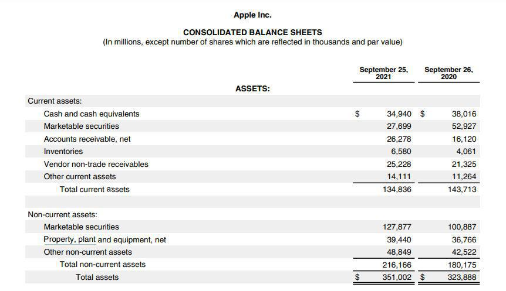

Capital expenditure (CapEx) is a fundamental concept in corporate finance, referring to the funds used by a company to acquire, upgrade, and maintain physical assets such as property, industrial buildings, or equipment. This type of expenditure is crucial for a company's growth and maintaining competitiveness, serving as a driving force for innovation and expansion across various industries.

High CapEx companies, such as Alphabet, AT&T, Amazon, and Verizon, are often leaders in their sectors because they invest significantly in their infrastructure and technological capabilities. This high level of investment enables them to maintain and enhance their market positions by developing new products and services, expanding their operational capacity, and increasing their market reach. For instance, in the technology and telecommunications sectors, where infrastructure and advanced technological tools are paramount, CapEx plays a critical role in sustaining and fostering innovation.

The integration of algorithmic trading within CapEx strategies represents a sophisticated approach to optimizing these investments. Algorithmic trading, which involves using complex algorithms to execute trades at high speeds and with high accuracy, relies heavily on advanced technology and infrastructure. High CapEx investments in state-of-the-art technology enable companies to leverage algorithmic trading to streamline operations, enhance efficiency, and improve financial resource allocation. As a result, companies can potentially achieve better market outcomes and maintain a competitive edge in fast-paced financial environments.

Understanding the dynamics of CapEx is crucial for strategic financial planning. Effective CapEx planning ensures that a company can judiciously allocate its resources to support both immediate operational needs and long-term strategic objectives. By managing CapEx judiciously, companies can balance the benefits of enhanced capabilities and growth opportunities against the financial risks associated with large capital investments. Thus, grasping the intricacies of CapEx is essential for developing robust financial strategies that support sustainable development and competitive positioning.

## Table of Contents

## Understanding Capital Expenditure (CapEx)

Capital expenditure (CapEx) refers to the funds used by a company to acquire, upgrade, and maintain physical assets such as property, industrial buildings, or equipment. Often substantial, these investments are essential for ensuring long-term operational efficiency and competitiveness. In corporate finance, CapEx is a critical consideration as it directly impacts a company's financial health and strategic future.

CapEx differs from operational expenditure (OpEx), which covers the costs associated with a company's day-to-day functioning. While OpEx involves regular, often recurring expenses necessary to support business operations, such as wages, rent, and utilities, CapEx is typically one-time, large-scale purchases that provide benefits over multiple years. This distinction is crucial for accounting and tax purposes, as CapEx typically results in an asset on the balance sheet, depreciated over time, whereas OpEx is fully expensed in the year it is incurred.

Examples of CapEx vary widely across industries. In the technology sector, companies often invest significantly in research and development facilities, data centers, and software infrastructure to support innovation and efficiency. Telecommunications companies, on the other hand, might focus their CapEx on expanding network capabilities, acquiring spectrum licenses, and upgrading transmission towers to enhance service quality. Each expenditure aims to strengthen the company's position in a competitive market, either by fostering growth or by maintaining infrastructure that supports existing operations.

From a financial perspective, CapEx has a substantial impact on a company's balance sheet and long-term investment strategies. Since these expenditures are capitalized, they increase the value of the company's total assets, depreciating over their useful lives. This affects key metrics such as return on assets (ROA) and return on equity (ROE), which investors and stakeholders closely monitor. Effective management of CapEx is crucial for maintaining a company’s [liquidity](/wiki/liquidity-risk-premium) and capital structure, ensuring that investments align strategically with long-term goals. Properly targeted CapEx supports sustainable growth and innovation, fundamental aspects of modern corporate strategy.

## High CapEx Companies and Their Strategies

High Capital Expenditure (CapEx) companies are characterized by significant investments in infrastructure, technology, and other long-term assets to sustain growth, maintain competitive advantage, and foster innovation. Some of the most notable high CapEx companies include Alphabet, AT&T, Amazon, and Verizon. Each of these organizations demonstrates distinct strategic goals behind their capital investments, which in turn influence their market dominance and growth trajectories.

**Alphabet Inc.** (parent company of Google) allocates a substantial portion of its CapEx towards technology infrastructure, including data centers and network capacity, to support its various services such as Search, YouTube, and Cloud. Alphabet's strategic focus on artificial intelligence and machine learning further enhances its technological capabilities. This commitment to high CapEx facilitates market dominance by enabling faster processing and improved service delivery, which contributes to user satisfaction and retention.

**AT&T** invests heavily in improving and expanding its telecommunications network, particularly in advancing 5G technology and fiber-optic infrastructure. These capital investments aim to strengthen AT&T's position in the telecommunications market by offering enhanced connectivity and services. The pursuit of cutting-edge telecommunications technology not only bolsters AT&T's competitive edge but also positions it as a leader in the transition to 5G, an essential factor for long-term growth.

**Amazon** is renowned for its extensive investments in logistics, fulfillment centers, and technology infrastructure, including its cloud computing arm, Amazon Web Services (AWS). Amazon's CapEx strategy is driven by the goal of enhancing operational efficiency and expanding its e-commerce and cloud services offerings. These investments support Amazon's rapid delivery capabilities and enable the scaling of AWS, which together contribute significantly to the company's market dominance and continued growth.

**Verizon** focuses its CapEx on network enhancement and the deployment of 5G technology to improve service offerings and customer experience. By prioritizing investment in advanced telecommunications infrastructure, Verizon aims to solidify its position within the industry and provide high-speed internet services. Verizon's heavy investment in CapEx ensures it remains competitive in the evolving telecommunications landscape and maintains its relevance alongside emerging technologies.

While high CapEx can drive growth and innovation, these companies face several challenges, including managing the financial risks associated with large-scale investments and adapting to technological advancements. They must also navigate regulatory landscapes and competition, which can impact their strategic direction. In particular, fluctuations in market conditions and consumer demand require high CapEx companies to remain agile and be prepared for potential adjustments in their strategic initiatives.

Overall, high CapEx companies like Alphabet, AT&T, Amazon, and Verizon leverage their capital investments to drive innovation, enhance competitive positioning, and secure long-term growth. By aligning their CapEx strategies with their overarching business goals, these companies can capitalize on new opportunities while managing the inherent challenges and risks associated with significant capital expenditures.

## Algorithmic Trading and Capital Expenditure

Algorithmic trading refers to the use of computer algorithms to automate the trading process in financial markets. These algorithms, leveraging complex mathematical models and broad datasets, make trading decisions at speeds and frequencies unattainable by human traders. Algorithmic trading plays a crucial role in enhancing trade efficiency, minimizing human error, and maximizing profits by executing orders in split seconds and adapting to market conditions rapidly. 

High Capital Expenditure (CapEx) investments are pivotal to supporting such [algorithmic trading](/wiki/algorithmic-trading) activities. Companies allocate substantial resources toward acquiring advanced technology infrastructures such as high-speed data processing units, sophisticated analytical software, and enhanced telecommunications systems. High CapEx investments thereby ensure robust trading platforms capable of handling massive volumes of trades accurately and efficiently. For instance, investments in cutting-edge servers and networking equipment significantly reduce latency, which is critical in environments where trading occurs in microseconds.

The benefits of algorithmic trading for high CapEx companies are manifold. One key advantage is resource optimization. Algorithmic systems can analyze numerous variables across various markets simultaneously, predicting trends and executing trades with precision. This leads to better allocation of financial resources based on anticipated market movements. Moreover, these systems help in minimizing the operational costs associated with manual trading while also maximizing returns by finding the optimal entry and [exit](/wiki/exit-strategy) points in market transactions.

A few companies exemplify successful integration of algorithmic trading into their CapEx strategies. Consider financial giants like Goldman Sachs and JPMorgan Chase, which have extensively incorporated algorithmic trading systems to enhance the effectiveness of their trading desks. These firms invest heavily in technological advancements to maintain competitive edges in trading activities. Similarly, tech-driven firms, such as Amazon through its Amazon Web Services (AWS) platform, provide cloud-based computational resources that can be leveraged for algorithmic trading operations, further enhancing their clients' capabilities in the financial markets.

Algorithmic trading, underscored by substantial CapEx, persists as a transformative element in modern financial markets, facilitating rapid and efficient trading operations while optimizing resource allocation for companies committed to maintaining technological superiority.

## Strategic Financial Planning for CapEx

Strategic financial planning plays a crucial role in managing capital expenditures (CapEx) efficiently within an organization. Effective management of CapEx ensures that companies allocate resources toward investments that not only support current operational demands but also foster long-term growth and innovation.

One of the key aspects of strategic financial planning for CapEx is the use of financial metrics and tools that assess the viability and profitability of investment projects. Net Present Value (NPV) and Internal Rate of Return (IRR) are two fundamental metrics used in this evaluative process.

**Net Present Value (NPV)** is the calculation of the present value of cash flows generated by a project, minus the initial investment cost. The formula for NPV is:

$$
NPV = \sum \frac{C_t}{(1 + r)^t} - C_0
$$

Here, $C_t$ is the net cash inflow during the period $t$, $r$ is the discount rate, and $C_0$ is the initial investment cost. A positive NPV indicates that the projected earnings (in present dollars) exceed the anticipated costs, suggesting a profitable investment.

**Internal Rate of Return (IRR)** is the discount rate at which the NPV of all cash flows from a particular project equals zero. It is found by solving the equation:

$$
0 = \sum \frac{C_t}{(1 + IRR)^t} - C_0
$$

IRR provides an intuitive indication of the expected profitability of a potential investment, where a higher IRR value signifies greater projected profitability.

Balancing CapEx with Operational Expenditure (OpEx) is vital for sustaining growth. CapEx typically covers longer-term investments, such as facilities, machinery, and technology, whereas OpEx refers to the day-to-day expenses necessary for maintaining a company's operations. Companies need to judiciously allocate resources between CapEx and OpEx to ensure operational efficiency while positioning themselves for future expansion.

Several companies demonstrate successful strategic financial planning regarding CapEx. For example, Alphabet Inc. has consistently invested in infrastructure, such as data centers and network equipment, supporting its cloud services growth*. By using financial planning and evaluation tools like NPV and IRR, Alphabet manages to align its CapEx with long-term strategic objectives, ensuring robust growth paths in technology-driven sectors.

Another example is Amazon, which prioritizes logistics and technology infrastructure, helping it maintain its market leader status in e-commerce. Amazon's careful balancing of CapEx investments to enhance its fulfillment network and operational systems is complemented by a stringent analysis of investment returns, helping it maintain cost efficiency**.

These case studies highlight the importance of integrating strategic financial planning frameworks within CapEx management. Companies must diligently apply these principles to align their CapEx investments with broader business goals, ensuring they are well-leveraged to drive continued innovation and competitive advantages.

**References:**

* Alphabet's consistent data center investments highlight its commitment to technological infrastructure. [Link to external source]

** Amazon's strategic investments in logistics underscore its operational priorities and market adaptation strategies. [Link to external source]

## Challenges and Risks of High CapEx and Algo Trading

High capital expenditure (CapEx) companies face numerous challenges and risks that necessitate a robust financial strategy to mitigate potential issues. One notable challenge is potential liquidity constraints. High CapEx projects often require significant upfront investment, which can strain a company’s cash flow. This situation demands precise cash flow forecasting and the maintenance of sufficient liquidity reserves to avoid financial distress. Forecasting errors can further exacerbate these liquidity issues. Inaccurate predictions regarding project costs, timelines, or revenue projections can lead to budget overruns and financial shortfalls. Utilization of advanced predictive analytics and scenario planning can help companies improve the accuracy of their forecasts.

In the domain of algorithmic trading, risk management is crucial for mitigating errors. Algorithmic trading platforms use complex algorithms and vast datasets to execute trades at high speed and frequency, which can introduce significant risks, such as erroneous trades due to software bugs or incorrect data inputs. Effective risk management strategies include implementing rigorous testing protocols, maintaining oversight mechanisms for algorithmic activity, and utilizing kill switches to halt erroneous trading activity swiftly. Regular audits and updates of trading algorithms are essential to ensure their alignment with current market conditions and regulatory requirements.

Market [volatility](/wiki/volatility-trading-strategies) poses another major risk to high CapEx and algorithmic trading activities. Volatility can result in substantial fluctuations in asset prices, leading to potential capital losses. For high CapEx firms, market volatility can also affect the valuation of long-term investments and increase the cost of capital. Strategies to manage these risks include diversifying investment portfolios and employing hedging techniques to protect against adverse price movements. Algorithmic trading systems must be calibrated to operate effectively under volatile conditions, which includes stress testing algorithms to evaluate their performance in diverse market scenarios.

Continuous innovation and adaptation are necessary for high CapEx sectors to remain competitive and mitigate risks. Technological advances and shifts in consumer preferences require companies to adapt their strategies and investments continuously. This might involve investing in new technologies, enhancing operational efficiencies, or pivoting business models to align with market trends. A proactive approach to innovation can provide a competitive edge and open new growth opportunities.

In summary, high CapEx companies and activities like algorithmic trading come with inherent challenges and risks that require strategic management. Addressing liquidity constraints, ensuring accurate forecasting, managing algorithmic trading risks, countering market volatility, and fostering continuous innovation are crucial to sustaining long-term success in these sectors.

## Conclusion

Capital expenditure (CapEx) serves as a pivotal component in corporate strategy, emphasizing the allocation of resources for long-term asset acquisition and infrastructure development. Companies that successfully harness the power of CapEx in their strategic planning often find themselves at the forefront of growth and innovation, seizing opportunities to enhance their competitive edge. High CapEx is particularly beneficial for organizations aiming to invest in critical areas such as technology, telecommunications, and large-scale product development.

High CapEx investments bring significant advantages, including the fostering of expansion capabilities and supporting cutting-edge algorithmic trading technologies. This enables companies to streamline operations and gain insights that drive effective decision-making. However, these benefits do not come without challenges. Companies must manage potential liquidity constraints, address forecasting inaccuracies, and navigate the risks associated with algorithmic trading errors and market volatility.

Looking ahead, the evolution of CapEx strategies is likely to be influenced heavily by advancements in technology and the digitalization of industries. Algorithmic trading is poised to further integrate into CapEx frameworks, enhancing resource allocation and operational efficiency. Companies are expected to continue innovating to maintain their competitive positions while efficiently managing their CapEx pursuits.

Ultimately, the successful incorporation of CapEx into corporate strategy requires a delicate balance between high capital investments and operational efficiency. This ensures not only the sustainability of growth initiatives but also the operational effectiveness necessary for long-term success. Maintaining this equilibrium allows companies to not only survive but thrive in rapidly evolving markets, setting the stage for a robust and resilient future.

## References & Further Reading

[1]: ["Investing in Alphabet: CapEx Highlights from Recent Annual Reports"](http://abc.xyz/investor/) by Investopedia

[2]: Luttmer, E. G. J. (2007). ["Selection, Growth, and the Size Distribution of Firms."](https://www.jstor.org/stable/25098869) *American Economic Review*, 97(4), 1075-1090.

[3]: Lopez de Prado, M. (2018). ["Advances in Financial Machine Learning."](https://www.amazon.com/Advances-Financial-Machine-Learning-Marcos/dp/1119482089) John Wiley & Sons.

[4]: Brynjolfsson, E., & McAfee, A. (2014). ["The Second Machine Age: Work, Progress, and Prosperity in a Time of Brilliant Technologies."](https://psycnet.apa.org/record/2014-07087-000) W. W. Norton & Company.

[5]: Chan, E. P. (2009). ["Quantitative Trading: How to Build Your Own Algorithmic Trading Business."](https://github.com/ftvision/quant_trading_echan_book) John Wiley & Sons.

[6]: Jansen, S. (2020). ["Machine Learning for Algorithmic Trading: Predictive models to extract signals from market and alternative data for systematic trading strategies with Python, 2nd Edition."](https://www.amazon.com/Machine-Learning-Algorithmic-Trading-alternative/dp/1839217715) Packt Publishing.

[7]: ["AT&T’s Strategy for Aggressive Investment in 5G Infrastructure."](https://www.businessinsider.com/atts-strategy-for-aggressive-investment-in-5g-infrastructure-2020-1) by Business Insider

[8]: ["Inside Amazon's Plan to Double Its Grocery Store Retail Footprint"](https://insideretail.co.nz/2024/10/14/how-amazon-plans-to-disrupt-the-grocery-sector-by-merging-choice-and-convenience/) by Forbes