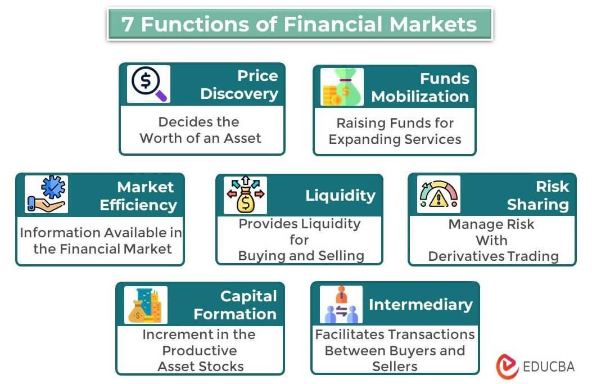

## Table of Contents

## What is a financial market?

A financial market is a place where people buy and sell things like stocks, bonds, and currencies. It's like a big marketplace, but instead of buying fruits and vegetables, people trade financial products. These markets help companies raise money by selling parts of their business to investors, and they also help people save and invest their money.

There are different types of financial markets. The stock market is where people buy and sell shares of companies. The bond market is where governments and companies borrow money by selling bonds. There's also the foreign exchange market, where people trade different currencies. All these markets help the economy by making it easier for money to move around and be used efficiently.

Financial markets are important because they help set prices for financial products. When lots of people are buying and selling, the prices of stocks, bonds, and currencies change based on what people think they are worth. This helps everyone know how much things are worth and make better decisions about saving, investing, and spending money.

## What are the main types of financial markets?

Financial markets come in different types, each with its own purpose. The stock market is where people buy and sell shares of companies. When you buy a share, you own a small piece of that company. This market helps companies raise money to grow their business, and it lets people invest their money in hopes of making a profit. The bond market is another type, where governments and companies borrow money by selling bonds. When you buy a bond, you're lending money to the issuer, and they promise to pay you back with interest over time.

Another important type is the foreign exchange market, where people trade different currencies. This market is crucial for international trade and travel because it helps convert one country's money into another's. There's also the commodity market, where people buy and sell things like gold, oil, and agricultural products. These markets help set prices for these goods and make it easier for producers and consumers to do business.

Lastly, there's the derivatives market, where people trade contracts that get their value from something else, like stocks or commodities. These contracts, called derivatives, can be used to manage risk or to speculate on future price changes. Each of these markets plays a role in helping the economy run smoothly by allowing money and goods to flow where they're needed.

## What is the role of the stock market in the economy?

The stock market plays a big role in the economy. It's like a big meeting place where people can buy and sell parts of companies. When a company wants to grow, it can sell these parts, called stocks, to raise money. This money helps the company build new things, hire more people, and make more products. So, the stock market helps companies get the money they need to grow, which is good for the economy because it creates jobs and makes things better for everyone.

The stock market also helps people save and invest their money. When people buy stocks, they hope the value of the stocks will go up so they can sell them later for more money. This gives people a way to save for the future, like for retirement or buying a house. The stock market also helps set prices for companies. When lots of people are buying and selling, the prices of stocks change based on what people think the companies are worth. This helps everyone know how much things are worth and make better choices about where to put their money.

## How do bond markets function and what is their importance?

Bond markets are places where people can buy and sell bonds. A bond is like a loan that you give to a government or a company. When you buy a bond, you're lending them money, and they promise to pay you back with interest over time. The bond market helps governments and companies borrow money to do big projects, like building roads or factories. They sell bonds to get the money they need, and people who buy the bonds get a steady income from the interest payments.

The bond market is really important for the economy. It helps governments and companies get the money they need to do important things. If a government wants to build a new school, it can sell bonds to raise the money. Companies can do the same to build new factories or buy new equipment. This helps the economy grow because it creates jobs and makes things better for everyone. The bond market also helps people save and invest their money. When people buy bonds, they get a steady income from the interest, which can help them save for the future or live off their savings when they retire.

## What are commodity markets and what do they trade?

Commodity markets are places where people buy and sell things like gold, oil, and food. These things are called commodities. People trade them because they need them for everyday life or because they want to make money by buying them at a low price and selling them at a higher price later. The commodity market helps set prices for these goods, so everyone knows how much they cost. This makes it easier for farmers, miners, and other producers to sell what they make, and for people who need these things to buy them.

The commodity market is important because it helps the economy run smoothly. When people trade commodities, it makes sure that goods can move from where they are made to where they are needed. For example, if there's a lot of wheat grown in one place, the commodity market helps get that wheat to places where people need bread. This helps keep food and other important things available and at fair prices. The commodity market also lets people plan for the future. They can buy and sell contracts that promise to deliver commodities at a certain time, which helps them manage risks and make better plans.

## How do foreign exchange markets work and why are they important?

Foreign exchange markets are where people trade different countries' money, like dollars, euros, and yen. When you want to buy something from another country, you need to change your money into their money. That's what happens in the foreign exchange market. People buy and sell currencies all the time, and the prices of these currencies change based on what people think they are worth. For example, if a lot of people want to buy dollars, the price of the dollar goes up. The foreign exchange market is open all the time because there are people trading money around the world, even when it's nighttime in one place.

These markets are really important for the world economy. They help countries trade with each other by making it easy to change one country's money into another's. This is crucial for businesses that sell things in different countries and for people who travel. The foreign exchange market also helps set prices for different currencies, which gives everyone a good idea of how strong or weak a country's money is. This helps governments and businesses make better plans for the future. Without the foreign exchange market, it would be much harder for money to move around the world and for the global economy to work well.

## What is the difference between primary and secondary markets?

Primary markets are where new stocks and bonds are sold for the first time. When a company wants to raise money, it can sell its stocks or bonds to people who want to buy them. This is called an initial public offering (IPO) for stocks. The money from these sales goes straight to the company, which can use it to grow and do new things. Primary markets are important because they help companies get the money they need to start or expand their business.

Secondary markets are where people buy and sell stocks and bonds that have already been sold in the primary market. When you buy a stock on the stock market, you're usually buying it from someone else, not from the company itself. The money from these trades goes to the person selling the stock, not to the company. Secondary markets are important because they let people trade their investments and help set prices for stocks and bonds based on what people think they're worth.

## How do derivatives markets help in risk management?

Derivatives markets help people manage risk by letting them buy and sell contracts that get their value from something else, like stocks, bonds, or commodities. These contracts, called derivatives, can be used to protect against price changes. For example, if you're a farmer and you want to make sure you get a good price for your crops, you can buy a derivative that promises to pay you a certain amount for your crops, no matter what the market price is when you sell them. This way, you're protected if the price goes down.

Derivatives also help businesses and investors plan for the future. If a company knows it will need to buy a lot of oil in six months, it can buy a derivative now that locks in today's price. This way, the company won't have to worry if the price of oil goes up later. By using derivatives, people can manage their risks better and feel more secure about their future plans.

## What role do money markets play in short-term financing?

Money markets are places where people and businesses can borrow and lend money for short periods of time, like a few days or a few months. They're important because they help keep the economy running smoothly by making sure there's enough money available for everyone who needs it. For example, if a company needs to pay its workers but is waiting for customers to pay their bills, it can borrow money from the money market to cover the costs until the money comes in.

The money market also helps banks manage their cash. Banks need to have enough money on hand to give to people who want to withdraw their savings, but they also want to lend out as much money as possible to make a profit. The money market lets banks borrow and lend money to each other quickly and easily, so they can keep the right balance. This helps the whole financial system work better and makes sure that money keeps flowing where it's needed.

## How do over-the-counter (OTC) markets differ from exchange-traded markets?

Over-the-counter (OTC) markets are different from exchange-traded markets because they don't have a central place where all the trading happens. In OTC markets, people trade directly with each other, often through dealers or brokers. This means that the prices of things like stocks or bonds can be different depending on who you're trading with. OTC markets are good for trading things that aren't very common or that don't fit well in big, organized markets. For example, small companies or special kinds of bonds might be traded on OTC markets.

Exchange-traded markets, on the other hand, have a central place where all the trading happens, like the New York Stock Exchange. These markets have strict rules about how trading works, and all the prices are the same for everyone at any given time. This makes exchange-traded markets more transparent and easier to understand. They are usually used for trading common things like big company stocks or popular commodities. Because of the rules and the central place, exchange-traded markets can be safer and more reliable for people who want to buy and sell.

## What are the regulatory bodies overseeing financial markets and their functions?

Regulatory bodies are important groups that make sure financial markets work fairly and safely. In the United States, one big regulator is the Securities and Exchange Commission (SEC). The SEC's job is to protect people who invest money by making rules that companies and traders have to follow. They check that companies tell the truth about their business and that traders don't cheat. This helps keep the stock and bond markets honest and trustworthy. Another important regulator is the Commodity Futures Trading Commission (CFTC), which watches over markets where people trade things like oil and wheat. The CFTC makes sure these markets are fair and that people don't use tricks to make money.

In other countries, there are similar groups that do the same kind of work. For example, in the United Kingdom, the Financial Conduct Authority (FCA) oversees financial markets to make sure they are working well and treating people fairly. The FCA makes rules to protect people who save and invest money and checks that banks and other financial companies are following these rules. In Europe, the European Securities and Markets Authority (ESMA) helps coordinate rules across different countries to make sure the whole European market is safe and fair. These regulatory bodies are really important because they help keep the financial system stable and make sure everyone can trust it.

## How do technological advancements impact the efficiency and accessibility of financial markets?

Technological advancements have made financial markets a lot more efficient and easier to use. Computers and the internet have made it possible for people to trade stocks, bonds, and other things from anywhere in the world. This means you don't have to go to a big stock exchange building to buy and sell; you can do it from your home or even on your phone. Trading is also faster now. Computers can match buyers and sellers in a split second, which makes the markets work more smoothly. Plus, new technology helps keep track of all the trades and makes sure everything is done correctly and fairly.

These changes have also made financial markets more accessible to more people. Before, only big investors and banks could really use the markets because they had the tools and knowledge. Now, thanks to technology, regular people can invest their money too. There are apps and websites that make it easy to learn about investing and start trading. This means more people can save and invest, which is good for the economy. But it's also important for people to be careful and learn about the risks, because the easier access to markets can sometimes lead to big losses if people don't know what they're doing.

## References & Further Reading

[1]: Hendershott, T., Jones, C. M., & Menkveld, A. J. (2011). ["Does Algorithmic Trading Improve Liquidity?"](https://onlinelibrary.wiley.com/doi/full/10.1111/j.1540-6261.2010.01624.x) The Review of Financial Studies, 24(3), 774-799.

[2]: Gomber, P., Arndt, B., Lutat, M., & Uhle, T. (2011). ["High-Frequency Trading."](https://papers.ssrn.com/sol3/papers.cfm?abstract_id=1858626) Goethe University Frankfurt, Chair of e-Finance.

[3]: Black, F. (1986). ["Noise."](https://onlinelibrary.wiley.com/doi/abs/10.1111/j.1540-6261.1986.tb04513.x) The Journal of Finance, 41(3), 528-543.

[4]: Harris, L. (2003). ["Trading and Exchanges: Market Microstructure for Practitioners."](https://academic.oup.com/book/52292) Oxford University Press.

[5]: O'Hara, M. (2015). ["High-Frequency Market Microstructure."](https://www.sciencedirect.com/science/article/pii/S0304405X15000045) Journal of Financial Econometrics, 13(1), 1-40.