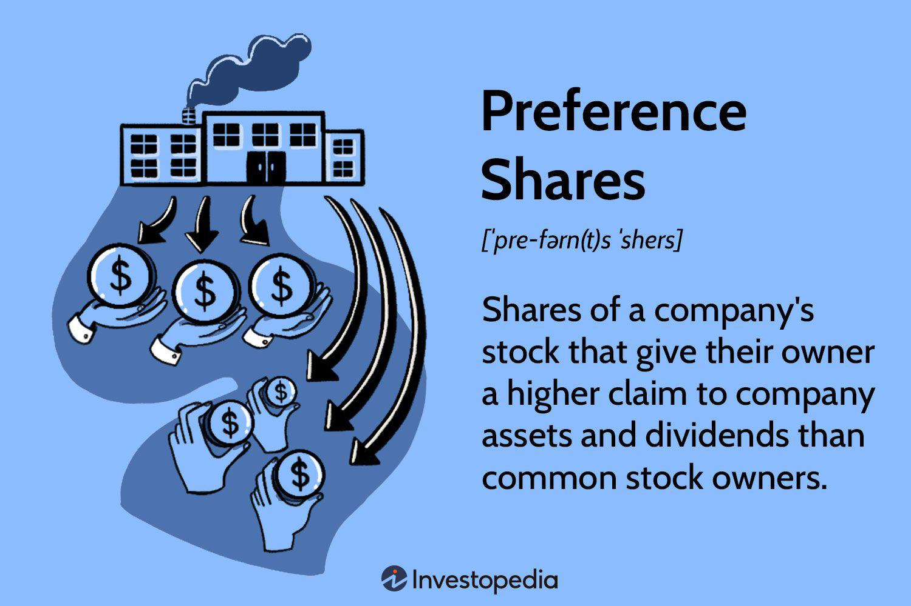

## Table of Contents

## What is preferred stock?

Preferred stock is a type of stock that companies issue to investors. It is different from common stock because it usually gives the investor some special benefits. One big benefit is that preferred stockholders get paid dividends before common stockholders. Dividends are like a share of the company's profits that it pays out to its investors.

Another feature of preferred stock is that it often has a fixed dividend rate. This means that the amount of money the investor gets from dividends stays the same, no matter how well the company is doing. This can make preferred stock more predictable than common stock, which can be good for investors who want a steady income. However, preferred stockholders usually don't get to vote on company decisions like common stockholders do.

## How does preferred stock differ from common stock?

Preferred stock and common stock are two types of stocks that companies can issue, but they have some important differences. Preferred stock usually gives investors special benefits, like getting paid dividends before common stockholders. Dividends are like a share of the company's profits that it pays out to its investors. Preferred stock often has a fixed dividend rate, which means the amount of money the investor gets from dividends stays the same, no matter how well the company is doing. This can make preferred stock more predictable than common stock.

On the other hand, common stock does not have a fixed dividend rate. The dividends for common stock can change based on how well the company is doing. Common stockholders also have the right to vote on important company decisions, like who should be on the board of directors. Preferred stockholders usually don't get to vote on these decisions. So, while preferred stock can offer more stability and priority in receiving dividends, common stock gives investors more say in the company's direction and potentially higher rewards if the company does well.

## What are the typical features of preferred stock?

Preferred stock has some special features that make it different from common stock. One big feature is that preferred stockholders get paid dividends before common stockholders. Dividends are like a share of the company's profits that it pays out to its investors. Preferred stock often has a fixed dividend rate, which means the amount of money the investor gets from dividends stays the same, no matter how well the company is doing. This can make preferred stock more predictable than common stock, which can be good for investors who want a steady income.

Another feature of preferred stock is that it usually doesn't give the investor the right to vote on company decisions. This is different from common stock, where investors can vote on things like who should be on the board of directors. Preferred stock can also have other special rights, like the ability to convert into common stock or to get their money back before common stockholders if the company goes bankrupt. These features make preferred stock a bit safer than common stock, but it might also mean less chance for big profits if the company does really well.

## What are the main types of preferred stock?

There are a few main types of preferred stock, and each has its own special features. One type is called cumulative preferred stock. If a company can't pay dividends one year, it has to pay them later before it can pay any dividends to common stockholders. This makes cumulative preferred stock a bit safer for investors because they know they'll get their dividends eventually. Another type is non-cumulative preferred stock. With this kind, if the company skips a dividend payment, the investor doesn't get it later. This type can be riskier because the investor might miss out on dividends.

Another type of preferred stock is convertible preferred stock. This kind lets investors turn their preferred shares into common shares at a set price. This can be good if the company does well because the investor can then benefit from the company's growth. Participating preferred stock is another type. This kind not only gives a fixed dividend but also lets the investor get extra dividends if the company does really well. This can be a way for investors to get more money if the company is successful.

The last type is callable preferred stock. This means the company can buy back the preferred shares at a set price after a certain time. This can be good for the company if interest rates go down, but it can be bad for the investor because they might have to give up their shares. Each type of preferred stock has its own benefits and risks, so investors need to think carefully about which type fits their goals and how much risk they're willing to take.

## Can you provide examples of companies that issue preferred stock?

Some big companies that issue preferred stock are banks and insurance companies. For example, Bank of America and Wells Fargo have issued preferred stock. These companies use preferred stock to raise money without taking on more debt. Preferred stock can be a good way for these companies to get money because it usually has a fixed dividend, which makes it less risky for the company than other ways of getting money.

Another example is General Motors. They issued preferred stock to help them through tough financial times. By issuing preferred stock, General Motors was able to get money from investors without having to pay it back right away, like they would with a loan. This helped them keep running and working on new projects. So, preferred stock can be a helpful tool for companies in different industries when they need to raise money.

## What are the common reasons companies issue preferred stock?

Companies issue preferred stock for a few main reasons. One big reason is to raise money without taking on more debt. When a company issues preferred stock, it gets money from investors in exchange for giving them special shares. These shares usually have a fixed dividend, which means the company knows exactly how much it has to pay out each time. This can be less risky for the company than borrowing money, which they have to pay back with interest.

Another reason companies issue preferred stock is to attract investors who want a steady income. Preferred stock often has a fixed dividend rate, which makes it more predictable than common stock. This can be good for investors who want to know exactly how much money they'll get from their investment. By offering preferred stock, companies can bring in these kinds of investors and use their money to grow or stay stable during tough times.

## How does the issuance of preferred stock affect a company's financial structure?

When a company issues preferred stock, it changes its financial structure by adding a new type of equity. This means the company is getting money from investors without having to pay it back right away, like with a loan. Preferred stock is different from common stock because it usually has a fixed dividend, which the company has to pay before any dividends to common stockholders. This can make the company's financial situation more stable because the payments are predictable. However, it also means the company has to make sure it has enough money to cover these fixed payments, which can be a challenge if the company is not doing well.

Issuing preferred stock can also affect the company's balance between debt and equity. If the company was relying a lot on debt before, issuing preferred stock can help balance things out by increasing the equity part. This can make the company look less risky to investors and lenders because it shows the company is not just borrowing money. On the other hand, if the company issues a lot of preferred stock, it might have to pay out a lot in dividends, which can limit the money available for other things like growing the business or paying off debt. So, it's important for the company to think carefully about how much preferred stock to issue and how it will affect their overall financial health.

## What are the tax implications for both the issuing company and the investors in preferred stock?

For the company issuing preferred stock, the dividends they pay to preferred stockholders are not tax-deductible. This is different from interest payments on debt, which the company can usually deduct from their taxes. So, issuing preferred stock can be more expensive for the company in terms of taxes because they have to pay the dividends out of their after-tax profits. However, issuing preferred stock can help the company's financial health by not adding to their debt load, which can be good for their credit rating and overall financial stability.

For investors, the tax treatment of dividends from preferred stock depends on whether the dividends are qualified or not. If the dividends are qualified, they are taxed at a lower rate, similar to long-term capital gains. This can be a big advantage for investors because it means they keep more of their dividend income. If the dividends are not qualified, they are taxed as regular income, which can be at a higher rate. So, investors need to check if the preferred stock they are buying will give them qualified dividends to understand how much tax they will have to pay.

## How do dividends work with preferred stock, and what types of dividend structures exist?

Dividends for preferred stock work differently than for common stock. When a company makes money, it can choose to pay some of that money to its investors as dividends. With preferred stock, the investors get their dividends before the common stockholders do. This is one of the big perks of owning preferred stock. Also, preferred stock often has a fixed dividend rate. This means the company agrees to pay a certain amount of money for each share of preferred stock, no matter how well the company is doing. This can make preferred stock a safer choice for investors who want a steady income.

There are different types of dividend structures for preferred stock. One type is cumulative dividends. If the company can't pay dividends one year, it has to pay them later before it can pay any dividends to common stockholders. This makes the investment safer because the investor knows they'll get their dividends eventually. Another type is non-cumulative dividends. With this kind, if the company skips a dividend payment, the investor doesn't get it later. This can be riskier because the investor might miss out on dividends. There's also participating dividends, where the investor can get extra dividends if the company does really well. This can be a way for investors to get more money if the company is successful.

## What are the risks associated with investing in preferred stock?

Investing in preferred stock comes with some risks. One big risk is that the dividends might not be paid. Even though preferred stockholders get their dividends before common stockholders, the company doesn't have to pay them if it's not doing well. If the dividends are non-cumulative, the investor won't get them later either. This can be a problem for investors who are counting on that steady income. Another risk is that preferred stock often doesn't give the investor the right to vote on company decisions. This means the investor has less say in how the company is run, which can be a downside if the company starts making choices the investor doesn't like.

Another risk is that preferred stock can be callable. This means the company can buy back the shares at a set price after a certain time. If interest rates go down, the company might want to do this to save money, but it can be bad for the investor because they might have to give up their shares. Also, while preferred stock can be safer than common stock because of the fixed dividends, it might not grow in value as much. If the company does really well, the investor might miss out on big profits that common stockholders could get. So, while preferred stock can offer some safety and a steady income, it also comes with its own set of risks that investors need to think about.

## How can preferred stock be used in corporate strategies like mergers and acquisitions?

Companies can use preferred stock in mergers and acquisitions to make deals easier. When one company wants to buy another, they might use preferred stock as part of the payment. This can be good because it lets the company buying the other one use its own stock instead of cash. This can help the company keep its cash for other things like growing the business. Also, preferred stock can be attractive to the company being bought because it gives them a steady income from dividends and might be seen as less risky than common stock.

Another way preferred stock can be used in mergers and acquisitions is to keep control in the hands of the original owners. If the company being bought gets preferred stock, they usually don't get voting rights. This means the company buying them can keep making decisions without interference. This can be a big advantage in keeping the company running smoothly after the merger or acquisition. So, using preferred stock can help make deals happen and keep things stable afterwards.

## What are the regulatory and compliance considerations when issuing preferred stock?

When a company wants to issue preferred stock, it has to follow certain rules set by the government and other groups that watch over the stock market. These rules are there to make sure that everyone knows what's going on and that the company is being fair. For example, the company has to tell the public about the new preferred stock and what it means for the company's financial health. This includes filing documents with the Securities and Exchange Commission (SEC) in the United States, which checks to make sure the information is correct and complete. The company also has to follow rules from stock exchanges where the stock will be traded, like the New York Stock Exchange or NASDAQ.

Another thing to think about is that the company has to make sure it's treating all its investors fairly. This means being clear about the terms of the preferred stock, like the dividend rate and any special rights the investors have. The company also has to make sure it's following any laws about how it can use the money it gets from issuing preferred stock. For example, if the money is supposed to be used for a certain project, the company has to do that. If the company doesn't follow these rules, it could get in trouble with the government or the stock exchange, which could hurt its reputation and make it harder to raise money in the future.

## What is the understanding of financial instruments in corporate finance?

Financial instruments are essential tools in corporate finance, representing contracts that possess monetary value and can be exchanged between parties. These instruments are primarily categorized into equity, debt, and hybrid instruments, each serving distinct functions and catering to diverse financial strategies.

**Equity Instruments**: Equity instruments, notably stocks, denote ownership in a company. They provide investors with a stake in the firm's assets and earnings, presenting the potential for capital gains and dividends. Common stockholders gain voting rights in corporate decisions, thus participating directly in the company's governance. Investors benefit from value appreciation as the firm's market performance improves. The formula for calculating the expected return on a stock is given by:

$$

E(R_e) = \frac{D_1}{P_0} + g 
$$

where $E(R_e)$ is the expected return on the equity, $D_1$ represents the dividend in the next period, $P_0$ is the current price of the stock, and $g$ is the growth rate of dividends.

**Debt Instruments**: Debt instruments, exemplified by bonds, provide fixed income through predetermined interest payments. Bondholders, unlike stockholders, do not possess ownership; instead, they are creditors to whom the company owes a debt. Bonds are appealing due to their predictable cash flows and priority claim over equity holders in the event of liquidation. The yield to maturity (YTM) can be calculated using the formula:

$$

YTM = \frac{C + \frac{F - P}{n}}{\frac{F + P}{2}} 
$$

where $C$ is the annual coupon payment, $F$ is the face value of the bond, $P$ is the price paid for the bond, and $n$ is the number of years to maturity.

**Hybrid Instruments**: Hybrid instruments, such as preferred stock, blend elements of both equity and debt. Preferred shareholders often receive higher dividend claims than common stockholders and have a higher priority on assets during liquidation. However, they typically forfeit voting rights. Unlike bonds, preferred dividends may be deferred under specific circumstances, providing the issuer with financial flexibility. The valuation of preferred stock is often derived using:

$$

P_s = \frac{D_p}{r_p} 
$$

where $P_s$ represents the price of the preferred stock, $D_p$ denotes the dividend of the preferred stock, and $r_p$ is the required rate of return.

Each category of financial instruments has its respective advantages and roles within corporate finance, allowing companies to tailor their capital structures to align more closely with strategic objectives, risk tolerance, and market conditions.

## References & Further Reading

1. **"Corporate Finance: Theory and Practice" by Pierre Vernimmen, Pascal Quiry, Maurizio Dallochio, Yann Le Fur, and Antonio Salvi**  
   This book provides comprehensive insights into key corporate finance concepts, including the use of preferred stock as a capital-raising tool, essential for maintaining a balanced capital structure.

2. **"Algorithmic Trading: Winning Strategies and Their Rationale" by Ernie Chan**  
   Ernie Chan offers practical insights into [algorithmic trading](/wiki/algorithmic-trading), exploring the technical and strategic aspects necessary for developing effective trading algorithms.

3. **Academic Journal: "The Changing Landscape of Preferred Stock: Perception and Performance"**  
   This journal article examines the evolving role of preferred stock in corporate finance, analyzing market performance and investor perception. It highlights trends that influence issuance and investor demand.

4. **Industry Report: "Algorithmic Trading: State of the Art and Strategies" by Deloitte**  
   This report provides an in-depth analysis of current trends in algorithmic trading, focusing on technological advancements and strategic approaches that enhance trading efficiency and market impact.

5. **"Financial Markets and Corporate Strategy" by David Hillier, Mark Grinblatt, and Sheridan Titman**  
   This textbook covers the integration of various financial instruments, including preferred stock, within corporate strategies. It investigates into how these instruments influence corporate decision-making and market behavior.

6. **"Quantitative Finance: A Python-Based Introduction" by Robert Sedgewick, Kevin Wayne, and Robert Dondero**  
   This work introduces algorithmic trading and financial modeling using Python, providing practical code examples and strategies for implementing quantitative finance models.

7. **Research Paper: "The Effect of Algorithmic Trading on Market Quality: Evidence from the NYSE"**  
   This research paper studies the impact of algorithmic trading on market quality, providing empirical data and analysis on [liquidity](/wiki/liquidity-risk-premium), price discovery, and [volatility](/wiki/volatility-trading-strategies) in markets where preferred stocks are actively traded.

8. **Blog: "The Evolution of Preferred Stock in Modern Corporate Finance" on Harvard Business Review**  
   This article explores the strategic use of preferred stock in contemporary corporate finance, discussing its benefits and challenges in aligning with corporate goals.

9. **Journal of Finance: "Algorithmic Trading and the Cost of Capital"**  
   This paper investigates how algorithmic trading affects the cost of capital for companies issuing preferred stock, assessing the implications for fundraising and investment activities.

By exploring these resources, readers can gain a thorough understanding of how preferred stock and algorithmic trading are shaping the future of corporate finance and market operations.

