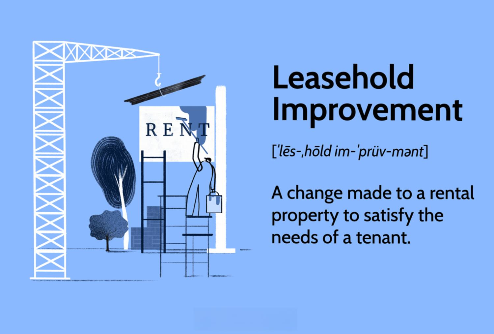

In today's dynamic economic environment, residential and commercial properties are constantly evolving to match the ever-changing needs of their occupants. This evolution is driven by the growing necessity for spaces that are not only functional but also tailored to enhance the lifestyle and operational requirements of individuals and businesses. Key activities such as tenant upgrades, leasehold improvements, and property renovations play a crucial role in this transformative process, aimed at improving both the functionality and value of spaces.

Tenant upgrades are modifications initiated by tenants to better suit their immediate needs, often with an emphasis on efficiency and aesthetics. Leasehold improvements, on the other hand, involve more structural changes, usually carried out either by tenants or landlords, to align a space with a tenant's operational requirements. Property renovations cover a broader spectrum, encompassing a wider range of alterations aimed at both increasing the property's appeal and value. Understanding these activities is essential for landlords, tenants, and investors as they navigate the complexities of property management and investment.



In addition to traditional real estate strategies, modern technological approaches are reshaping how we perceive property markets. Algorithmic trading is emerging as a significant influence, offering data-driven insights that enhance investment strategies. By leveraging advanced algorithms, investors can better predict market trends and make timely decisions, integrating technology with property investment to optimize financial returns.

This article seeks to provide a comprehensive examination of these concepts and their implications. It is essential for stakeholders to understand the diverse strategies available to maximize their investments and align property developments with current market demands. Through integrating both established practices and innovative technology, landlords, tenants, and investors can effectively enhance property value and maintain a competitive edge.

## Table of Contents

## Understanding Tenant Upgrades

Tenant upgrades refer to modifications that tenants make to enhance the usability and comfort of their rented spaces. These enhancements are typically carried out with the consent of the landlord and are designed to improve functionality, efficiency, or aesthetics according to the tenant's specific needs.

### Purpose and Scope

The primary purpose of tenant upgrades is to tailor a space to better accommodate the daily activities and operational requirements of the tenant. This can range from small aesthetic changes to more significant structural modifications, depending on the lease terms and the tenant's objectives. Common examples include the installation of modern lighting fixtures, upgrading essential equipment, or reconfiguring workspace layouts to foster a better work environment.

### Planning and Coordination

Planning and executing tenant upgrades requires a strategic approach to ensure alignment with the lease agreement and future business objectives. It is crucial to negotiate and obtain written approval from the property owner, detailing the scope of work, responsibilities, and cost-sharing arrangements. Clear documentation helps prevent potential disputes and ensures that both parties understand their roles and obligations.

### Considerations

When planning tenant upgrades, tenants must consider factors such as budget constraints, timeframes, and the potential impact of changes on their operations. Additionally, it is important to evaluate how upgrades might influence future leasing conditions or property value. Careful planning ensures that enhancements not only meet immediate needs but also support long-term goals.

Overall, tenant upgrades play a significant role in providing functional and appealing spaces that cater to the evolving requirements of tenants while maintaining harmony with the property owner's interests. By thoughtfully approaching these modifications, tenants can enhance their environments, leading to improved productivity and satisfaction.

## Leasehold Improvements Explained

Leasehold improvements, also known as tenant improvements, refer to the modifications made to a rental space to accommodate the tenant's operational needs. These improvements are typically confined to the interior of the property, aiming to transform a generic space into one tailored specifically for the tenant's business activities.

Ownership and responsibility for leasehold improvements can vary, affecting how these modifications are approached financially and legally. Generally, leasehold improvements can be funded by either the landlord or the tenant, depending on the leasing agreement. In situations where the landlord funds the improvements, the costs are often recuperated through increased rent or specific lease terms. Conversely, if the tenant bears the expenses, it might be negotiated as part of a lower lease rate or additional incentives.

Depreciation of leasehold improvements is a significant [factor](/wiki/factor-investing) distinguishing them from other types of property renovations. According to tax laws, leasehold improvements are typically allowed to be depreciated over the remaining term of the lease or a statutory period, whichever is shorter. This provides a mechanism for recouping the investment over time, possibly offering tax benefits to the entity that funded the improvements—a provision that can influence whether the landlord or tenant decides to initiate the enhancements.

Identifying who should bear the cost of leasehold improvements is crucial and often negotiated at the onset of lease agreements. Tenants might prefer landlords to finance these improvements to preserve their capital, especially if improvements significantly enhance the tenant's ability to conduct business effectively. On the other hand, landlords might agree to such improvements to secure high-quality tenants and ensure long-term occupancy of the space.

The potential tax benefits associated with leasehold improvements can be substantial. For landlords, improvements may increase the property's overall value, potentially reducing tax burdens through accelerated depreciation. Tenants may negotiate tax advantages through expense deductions or improved lease terms, effectively reducing their operational costs.

In summary, leasehold improvements are a pivotal consideration in the leasing process, impacting financial strategies for both landlords and tenants. Understanding the nuances of ownership, cost responsibility, and tax implications can lead to informed decision-making that enhances the utility and value of the property.

## Property Renovations: A Broader Scope

Property renovations encompass a wide scope of alterations that extend beyond the limitations of leasehold improvements. These renovations can include both internal and external changes designed to enhance the overall value or visual appeal of a property. Unlike tenant or leasehold improvements, which mainly cater to the specific needs of current occupants, property renovations are often driven by broader objectives such as making the property more attractive for prospective buyers or renters, responding to new tenant requirements, or updating the building to improve energy efficiency.

Internal upgrades may include remodeling kitchens or bathrooms, updating heating, ventilation, and air conditioning (HVAC) systems, or installing new flooring and windows. External renovations might involve landscaping, upgrading the façade, or adding features such as a deck or pool. Each of these changes has the potential to increase the property's market value and attractiveness.

To ensure renovations add maximum value, property owners should consider several strategic approaches:

### 1. Market Research
Conduct comprehensive research to understand the prevailing market trends and the preferences of potential buyers or tenants. This information can guide renovation decisions to ensure they meet current demands and result in a higher return on investment (ROI).

### 2. Cost-Benefit Analysis
Before undertaking extensive renovation projects, it's crucial to perform a cost-benefit analysis. This calculation will help determine if the anticipated increase in property value outweighs the renovation costs. Calculating the expected ROI can aid in making informed decisions.

### 3. Energy Efficiency Upgrades
Given the increasing focus on sustainability, energy-efficient renovations can significantly enhance property value. Upgrades such as solar panels, better insulation, or energy-efficient windows and appliances not only reduce utility costs but also increase appeal to environmentally conscious buyers.

### 4. Quality Workmanship
Ensure that all renovations are completed to a high standard, as poor workmanship can negate the value of the improvements. Hiring reputable contractors and using quality materials can prevent costly repairs and preserve the property’s value over time.

### 5. Strategic Aesthetic Enhancements
While structural upgrades are essential, aesthetic improvements also play a crucial role in the property's market appeal. Simple changes like painting, updating fixtures, or enhancing curb appeal can create a significant impact.

### 6. Legal Compliance
Ensure all renovations comply with local building codes and regulations. Non-compliance can lead to fines and potentially diminish property value.

By considering these strategies, property owners can undertake renovations that not only improve the functionality and aesthetics of their properties but also enhance their market value and ROI. Renovations, when aligned with market demands and executed with precision, can be a powerful tool for property owners looking to maximize their investments.

## Algorithmic Trading and Property Markets

Algorithmic trading is increasingly becoming integral to real estate investment, as sophisticated algorithms and data analytics tools are employed to forecast market trends and make informed decisions on property investments. This application of technology leverages historical data, [machine learning](/wiki/machine-learning) models, and statistical analysis to identify profitable opportunities in the property markets with enhanced accuracy and speed.

One primary advantage of [algorithmic trading](/wiki/algorithmic-trading) in real estate is its ability to process large volumes of data that would be challenging for human investors to analyze manually. This includes not only pricing trends and transaction records but also broader economic indicators, demographic shifts, and even localized events that might affect property values. By synthesizing these data points, algorithms can detect patterns and correlations that inform strategic investment moves. For instance, by applying regression analysis, investors can predict property price movements by correlating them with economic indicators like employment rates or interest rates.

An essential aspect of algorithmic trading is the use of predictive models, which can be implemented using machine learning techniques such as supervised learning for classification tasks (e.g., whether a property is likely to appreciate or depreciate) or unsupervised learning to cluster similar investment opportunities. Algorithms can be trained on historical data to refine their predictive accuracy over time. Python, with its robust libraries like Pandas, Scikit-learn, and TensorFlow, offers powerful tools for developing and deploying these models. A simple example can be seen in a regression model predicting property price changes:

```python
import pandas as pd
from sklearn.model_selection import train_test_split
from sklearn.linear_model import LinearRegression
from sklearn.metrics import mean_squared_error

# Load dataset
data = pd.read_csv('real_estate_data.csv')
X = data[['interest_rate', 'employment_rate', 'housing_supply']]
y = data['property_price_change']

# Split the data
X_train, X_test, y_train, y_test = train_test_split(X, y, test_size=0.2, random_state=42)

# Train the model
model = LinearRegression()
model.fit(X_train, y_train)

# Predict and evaluate
predictions = model.predict(X_test)
mse = mean_squared_error(y_test, predictions)

print(f'Mean Squared Error: {mse}')
```

The influence of technology on real estate extends beyond mere data analysis. Technological advancements facilitate not only the buying and selling process but also the management of property portfolios. For instance, blockchain technology enhances transparency and security in property transactions, while the Internet of Things (IoT) provides real-time data on property conditions, which can impact investment decisions.

Algorithmic trading also affects investor strategies by enabling greater market responsiveness and risk management. By automating decision-making processes, investors can execute trades faster and more efficiently, reducing the impact of emotional biases and ensuring they capitalize on fleeting opportunities. Moreover, algorithms can be programmed to diversify portfolios by selecting investments across various markets or asset types based on predefined risk criteria.

In summary, the intersection of algorithmic trading and real estate signals a paradigm shift in how property markets are navigated. Investors equipped with the right technological tools can enhance their decision-making processes, optimize portfolio performance, and ultimately achieve higher returns in an increasingly data-driven market environment. The ongoing advancements in this field promise to further streamline investment strategies and open new avenues for growth in real estate markets.

## Navigating Tax Implications

Understanding the tax implications of tenant upgrades and leasehold improvements is essential for maximizing returns in property investments. The tax treatment of these modifications can significantly impact the profitability of a real estate investment, depending largely on the ownership of the improvements and their classification under tax laws. 

### Ownership and Classification

When tenant upgrades or leasehold improvements are made, determining who owns these alterations is foundational for tax purposes. Ownership typically hinges on the lease agreement terms and the nature of the improvements. Generally, if an improvement is considered a fixture, it becomes part of the property and may be owned by the landlord. Conversely, if the improvement can be classified as a removable asset, it may remain in the tenant's ownership.

The classification also affects the tax treatment. Leasehold improvements are treated as capital expenditures and can be depreciated over time. Current U.S. tax laws allow for Qualified Improvement Property (QIP) to be depreciated over 15 years.[^1] However, if these improvements fall outside the QIP definition, their depreciation period might extend to 39 years. 

### Tax Strategies and Deductions

The key to effective tax strategy is leveraging available tax deductions and credits. Landlords can capitalize on depreciation deductions for improvements classified as QIP which provides significant tax relief. Meanwhile, tenants making upgrades should negotiate with landlords regarding who claims the depreciation, especially if the lease stipulates tenant ownership of improvements.

Moreover, understanding recapture rules is vital. Upon sale or termination of a lease, the depreciation taken on leasehold improvements can trigger depreciation recapture, requiring careful planning to mitigate unexpected tax liabilities.

To optimize tax benefits, tenants and landlords can explore options like cost segregation studies. Such studies can reallocate building costs between real property and tangible personal property, potentially accelerating depreciation and tax benefits.

### Recent Legislative Changes

Recent changes in tax legislation, such as those implemented under the Tax Cuts and Jobs Act (TCJA) of 2017, have altered the landscape for property investors. One notable adjustment includes the enhancement of bonus depreciation. As of the TCJA, 100% bonus depreciation is available for qualifying property acquired and placed into service before 2023.[^2] However, this benefit is scheduled to phase out incrementally through 2026 unless legislative actions alter this timeline.

Additionally, continual updates in policy, like potential shifts in the treatment of capital gains and depreciation schedules, require stakeholders to remain informed about ongoing legislative developments.

Real estate investors and landlords must remain agile in navigating the tax implications of tenant upgrades and leasehold improvements. Incorporating robust tax planning strategies not only ensures compliance but also enhances the overall financial outcome of property investments. Engaging with qualified tax professionals can provide valuable insights and prevent costly oversights in this complex area of real estate investment.

---

[^1]: Internal Revenue Service. "Publication 946: How to Depreciate Property." IRS.gov, 2021.
[^2]: Internal Revenue Service. "Tax Cuts and Jobs Act, Provision 13201: Temporary 100-Percent Expensing for Certain Business Assets." IRS.gov, 2018.

## Maximizing Investment Returns

Successfully navigating tenant upgrades, leasehold improvements, and property renovations necessitates strategic planning and execution to maximize investment returns. Key practices can significantly contribute to enhancing property value and attractiveness, facilitating effective decision-making for both landlords and tenants.

### Best Practices for Negotiating Lease Agreements

Negotiating lease agreements involves careful consideration of terms that favor both parties. It is crucial for landlords to include clauses that allow flexibility for tenant upgrades or leasehold improvements. Such clauses not only improve tenant satisfaction but also add intrinsic value to the property. Tenants, on the other hand, should negotiate for favorable terms that might include contribution from the landlord towards these improvements. Incentives such as rent reductions or extended leases in return for property enhancements create win-win scenarios.

### Financing Improvements

Securing appropriate financing for property improvements is vital. Various options are available, from traditional bank loans to more creative financing methods such as leasehold improvement allowances or commercial mortgage-backed securities (CMBS). It is essential for both landlords and tenants to evaluate financing costs, payback periods, and potential returns. Understanding options such as energy-efficient loans or government grants for sustainable improvements can play a crucial role in reducing costs and improving ROI.

### Selecting Upgrades for Optimal ROI

When selecting upgrades, both functionality and market demand should guide decisions. Focus should be on improvements that yield the highest return on investment, such as energy-efficient lighting, modern HVAC systems, or smart technology installations. The formula for calculating ROI can be simplified as:

$$
\text{ROI} = \frac{\text{Net Profit After Improvements}}{\text{Cost of Improvements}} \times 100
$$

It is prudent to undertake a cost-benefit analysis to ensure that the selected upgrades will substantially increase property value or rental income.

### Leveraging Market Trends and Technology

Staying abreast of market trends allows landlords and tenants to make informed decisions on property improvements. For instance, the growing demand for sustainable and green buildings suggests that energy-efficient upgrades could be highly beneficial. Additionally, the adoption of technology, such as data analytics and property management software, can enhance decision-making by providing insights into tenant preferences, property performance, and future market trends.

Python tools and libraries, such as Pandas and Matplotlib, can be utilized for data analysis:

```python
import pandas as pd
import matplotlib.pyplot as plt

# Sample data
data = {'Feature': ['Energy Efficiency', 'Smart Tech', 'Open Space'],
        'Demand Index': [85, 75, 90]}

df = pd.DataFrame(data)

# Plotting
df.plot(kind='bar', x='Feature', y='Demand Index', legend=False)
plt.title('Feature Demand Index')
plt.ylabel('Demand Index')
plt.xlabel('Property Features')
plt.show()
```

This kind of analysis allows investors to identify which property improvements can meet future tenant demand and enhance investment potential.

By strategically planning and executing property enhancements, landlords and tenants can significantly boost property value. Understanding the interplay of market demands, cost-effective financing, and strategic upgrades are fundamental to maximizing returns. This approach, complemented by utilizing modern technological tools, offers a clear route to optimized property investment outcomes.

## Conclusion

Tenant upgrades, leasehold improvements, and property renovations are essential strategies to maintain property competitiveness and meet the dynamic demands of the market. Whether enhancing the aesthetic appeal or functional utility of a property, these modifications ensure that spaces are not only current but also aligned with tenant requirements and market trends.

Investors and property owners must navigate these changes meticulously, considering both financial and legal aspects. Financial planning should take into account initial costs, potential tax implications, and long-term return on investment (ROI). Legal considerations involve understanding lease agreements, ownership rights, and compliance with local regulations. A well-structured approach can prevent potential disputes and safeguard investments.

Combining traditional real estate strategies with technological innovations is key to optimizing investments. For instance, leveraging advanced data analytics can provide insights into market trends, tenant preferences, and the performance of past investments. Technologies such as drone inspections and 3D modeling offer precise assessments and visualizations, aiding in informed decision-making.

Strategic planning and continued adaptation are crucial for navigating the evolving real estate landscape. This involves not only periodic evaluations of current assets but also foresight into future trends, such as sustainability and smart technology integration. By staying proactive, investors and property owners can enhance property value, secure tenant satisfaction, and ultimately achieve long-term financial gains.

## References & Further Reading

[1]: IRS. (2021). ["Publication 946: How to Depreciate Property."](https://www.irs.gov/publications/p946) 

[2]: IRS. (2018). ["Tax Cuts and Jobs Act, Provision 13201: Temporary 100-Percent Expensing for Certain Business Assets."](https://www.irs.gov/newsroom/tax-cuts-and-jobs-act-a-comparison-for-businesses)

[3]: Lopez de Prado, M. (2018). ["Advances in Financial Machine Learning."](https://www.amazon.com/Advances-Financial-Machine-Learning-Marcos/dp/1119482089) Wiley.

[4]: Aronson, D. (2006). ["Evidence-Based Technical Analysis: Applying the Scientific Method and Statistical Inference to Trading Signals."](https://www.amazon.com/Evidence-Based-Technical-Analysis-Scientific-Statistical/dp/0470008741) Wiley.

[5]: Jansen, S. (2020). ["Machine Learning for Algorithmic Trading."](https://github.com/stefan-jansen/machine-learning-for-trading) Packt Publishing.

[6]: Chan, E. P. (2009). ["Quantitative Trading: How to Build Your Own Algorithmic Trading Business."](https://github.com/ftvision/quant_trading_echan_book) Wiley.