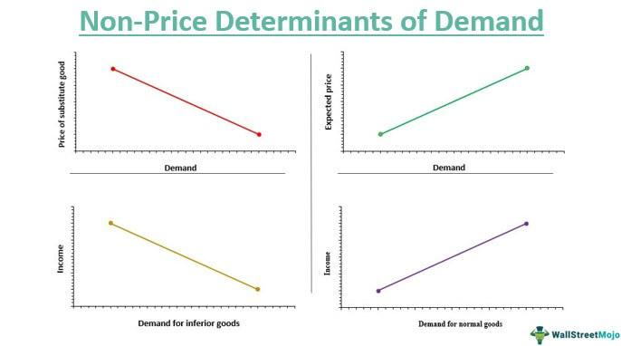

Demand elasticity is a fundamental concept in economics that quantifies the sensitivity of demand to changes in various factors. It serves as a measure of how much the quantity demanded of a good responds to changes in market conditions. While price is the most commonly analyzed factor affecting demand elasticity, other non-price determinants, such as income levels, consumer preferences, and expectations about future prices, also significantly influence consumer behavior and economic outcomes.

Understanding demand elasticity is crucial for businesses, policymakers, and traders. It aids in predicting consumer reaction to price changes and informs strategic decisions regarding pricing, production, and marketing. For example, products with high price elasticity tend to experience significant changes in demand when their prices vary, whereas products with low price elasticity or inelastic demand exhibit relatively stable demand despite price fluctuations.



In recent years, the rise of algorithmic trading has highlighted the importance of incorporating demand elasticity insights into trading strategies. Algorithmic trading involves using automated systems and advanced computational algorithms to make trading decisions based on extensive data analysis. By understanding demand elasticity, traders can optimize strategies to anticipate market movements, set dynamic stop-loss limits, adjust profit targets, and determine optimal trade execution timing. Such data-driven insights can significantly enhance the efficiency and profitability of trading operations.

This article provides an exploration of different types of demand elasticity and elucidates the role of non-price factors in shaping market dynamics. It also examines the application of elasticity concepts in the context of algorithmic trading and highlights the potential for improving trading strategies through a refined understanding of market sensitivity.

## Table of Contents

## Understanding Demand Elasticity

Demand elasticity quantifies how the quantity demanded of a good or service reacts to changes in various economic variables, providing essential insights into consumer behavior and market dynamics. This concept is pivotal in understanding the relationship between price changes, income variations, and the demand for related goods.

The primary types of demand elasticity are price elasticity of demand, income elasticity of demand, and cross-price elasticity of demand. These metrics allow economists and businesses to analyze and predict shifts in consumer demand in response to external changes.

**Price Elasticity of Demand (PED)** measures how much the quantity demanded of a good responds to changes in its price. It is calculated using the formula:

$$

\text{Price Elasticity of Demand} (E_d) = \frac{\%\ \text{Change in Quantity Demanded}}{\%\ \text{Change in Price}} 
$$

If $E_d > 1$, demand is elastic, indicating consumers are sensitive to price changes. If $E_d < 1$, demand is inelastic, suggesting that quantity demanded is less responsive to price changes. When $E_d = 1$, demand is said to be unitary elastic, meaning total revenue remains constant when price changes.

**Income Elasticity of Demand (YED)** assesses how the quantity demanded changes with consumer income fluctuations. Its formula is:

$$

\text{Income Elasticity of Demand} (E_y) = \frac{\%\ \text{Change in Quantity Demanded}}{\%\ \text{Change in Income}}
$$

Goods can be classified based on income elasticity. Normal goods have a positive YED, meaning demand increases as income rises. Inferior goods have a negative YED, where demand decreases when income increases. Additionally, luxury goods often exhibit higher YED, as demand grows significantly with rising income.

**Cross-Price Elasticity of Demand (XED)** evaluates how the quantity demanded for one good changes in response to the price change of another good. The formula is:

$$

\text{Cross-Price Elasticity of Demand} (E_{xy}) = \frac{\%\ \text{Change in Quantity Demanded of Good X}}{\%\ \text{Change in Price of Good Y}}
$$

Substitute goods exhibit positive XED, showing that an increase in the price of one good leads to an increase in the demand for another. Complementary goods exhibit negative XED, where a price increase of one good leads to a drop in demand for the complement.

Understanding these elasticities is critical for economic stakeholders as they interpret consumer behavior and predict market reactions to changes in economic variables like prices, income levels, and the cost of related goods. This analysis informs pricing strategies, tax policies, and marketing initiatives, aiming to optimize business performance and enhance consumer satisfaction in the marketplace.

## Non-Price Factors Influencing Demand Elasticity

Non-price factors play a crucial role in influencing demand elasticity, altering consumer behavior beyond the traditional scope of price adjustments. One significant [factor](/wiki/factor-investing) is the consumer's income level. As income increases, demand for certain goods and services may become more elastic, reflecting greater sensitivity to income changes. Conversely, for necessary goods, demand often remains inelastic, with minimal change in consumption despite income variations.

Tastes and preferences also contribute substantially. Shifts in consumer preferences, driven by changes in fashion, technology, or cultural influences, can alter demand elasticity for products, as consumers may become more or less responsive to price changes based on their current preferences.

The number of consumers in the market is another critical factor. As the consumer base expands or contracts, the overall demand elasticity may shift, impacting how sensitive the market is to economic variables such as price and supply changes.

Future price expectations influence how consumers react to current prices. If a price increase is anticipated, consumers may increase their current demand, thus reducing elasticity in the short term. Conversely, if price drops are expected, demand might decrease as consumers wait for future price reductions, increasing elasticity.

The prices of substitute and complementary goods significantly affect demand elasticity. The availability of substitutes can make demand more elastic, as consumers can easily switch to alternative products if the price of the current product rises. For example, if the price of coffee increases, consumers might opt for tea, increasing the elasticity of demand for coffee. On the other hand, the availability of complementary goods can make demand more inelastic. A rise in the price of smartphones might not drastically reduce their demand if consumers consider the cost of complementary goods, like apps and accessories, affordable.

These non-price factors result in shifts in the demand curve, fundamentally affecting market dynamics. Understanding these shifts is crucial for businesses and policymakers as they navigate changing market environments and strategize to accommodate consumer responsiveness effectively.

## Examples of Demand Elasticity in Different Contexts

Demand elasticity varies across different types of goods, significantly influencing market dynamics and consumer purchasing decisions. In the context of luxury goods, demand tends to exhibit high income elasticity. This means that as consumer incomes rise, the demand for luxury items such as high-end cars, designer clothing, and upscale vacations can increase disproportionately. This is mathematically represented by income elasticity of demand, where a value greater than one indicates that the percentage change in demand for a good is greater than the percentage change in income, signaling that consumers are willing to spend a larger share of their increased income on such goods.

Conversely, essential goods typically display inelastic demand. Items such as basic foodstuffs, gasoline, and utilities are necessities, and their demand remains relatively stable even when prices change. This inelastic demand is characterized by a price elasticity of demand value less than one, implying that consumers continue to purchase these goods regardless of price fluctuations. The necessity of these items in daily life results in minimal change in consumption patterns even with varying prices.

These variations have practical implications. Businesses supplying luxury products may strategically target markets with higher income levels or anticipate increased demand in economic upturns. Meanwhile, suppliers of essential goods benefit from stable demand, enabling more reliable revenue forecasting and minimal sensitivity to economic cycles. Policymakers can also use this understanding to implement tax policies or subsidies effectively. For instance, imposing higher taxes on luxury goods can generate government revenue without significantly affecting overall demand, while subsidies on essential items can ensure affordability despite inflationary pressures.

Overall, recognizing these elasticity differences assists businesses in aligning their marketing strategies with economic conditions and helps policymakers design interventions that address consumer needs without unintended market distortions.

## Algorithmic Trading and Elasticity

Incorporating elasticity into [algorithmic trading](/wiki/algorithmic-trading) can lead to the optimization of trading strategies through enhanced market response predictions. Demand elasticity measures how sensitive the quantity demanded of a financial instrument is to changes in economic variables such as price, income, or the prices of related goods. By understanding these relationships, algorithmic trading systems can be designed to react more swiftly and accurately to market fluctuations.

One key application of elasticity in trading is the formulation of dynamic stop-loss limits and profit targets. Stop-loss limits are essential in managing risk; they define the maximum loss a trader is willing to bear. By leveraging elasticity, these limits can be adjusted dynamically in response to market conditions. For example, if the price elasticity of a certain asset is high, indicating significant sensitivity to price changes, a more conservative stop-loss might be set to protect against large losses. Conversely, profit targets, which establish the threshold for exiting a profitable position, can be adjusted based on elasticity insights to maximize returns when market conditions are favorable.

Additionally, elasticity informs the optimal timing for executing trades. By analyzing the sensitivity of financial instruments to changes in various economic factors, algorithmic systems can forecast potential price movements and determine the most opportune moments to enter or [exit](/wiki/exit-strategy) the market. This predictive capability is crucial in fast-paced trading environments where milliseconds can make a significant difference in returns.

For practical application, algorithms can be developed to automatically calculate elasticity metrics and adjust trading parameters in real time. For example, a Python script could be used to monitor price changes and compute price elasticity, feeding this data into a trading algorithm to adjust stop-losses and profit targets dynamically. 

```python
def calculate_price_elasticity(initial_price, new_price, initial_quantity, new_quantity):
    percentage_change_quantity = (new_quantity - initial_quantity) / initial_quantity
    percentage_change_price = (new_price - initial_price) / initial_price
    elasticity = percentage_change_quantity / percentage_change_price
    return elasticity

current_elasticity = calculate_price_elasticity(initial_price, new_price, initial_quantity, new_quantity)

# Adjust trading parameters based on elasticity
if current_elasticity > threshold:
    set_stop_loss('conservative')
    set_profit_target('aggressive')
else:
    set_stop_loss('standard')
    set_profit_target('standard')
```

Understanding the sensitivity of financial instruments to price and market changes enhances both predictive accuracy and strategic decision-making. By integrating elasticity into the core of algorithmic trading systems, traders can achieve a more nuanced approach to market engagement, potentially increasing profitability and reducing risks. As algorithmic trading continues to evolve, the incorporation of elasticity will likely become an even more vital component in the development of sophisticated trading strategies.

## Mathematical Formulations and Practical Applications

Elasticity is a core concept in economics that quantifies how sensitive the demand or supply of a product is to changes in price, income, or other economic variables. The mathematical formulation of elasticity involves key calculations such as price elasticity of demand (PED), income elasticity of demand (IED), and cross-price elasticity of demand (CPED). These calculations serve as foundational metrics for understanding consumer behavior and for informing algorithmic trading models that predict market dynamics and set trading parameters.

### Price Elasticity of Demand

Price Elasticity of Demand (PED) is calculated as the percentage change in quantity demanded of a good divided by the percentage change in its price. The formula for PED is expressed as:

$$

\text{PED} = \frac{\%\Delta Q_d}{\%\Delta P} = \frac{\frac{\Delta Q_d}{Q_d}}{\frac{\Delta P}{P}} 
$$

where:
- $\%\Delta Q_d$ is the percentage change in quantity demanded,
- $\%\Delta P$ is the percentage change in price,
- $Q_d$ is the initial quantity demanded, 
- $\Delta Q_d$ is the change in quantity demanded, 
- $P$ is the initial price, 
- $\Delta P$ is the change in price.

### Income Elasticity of Demand

Income Elasticity of Demand (IED) measures how the quantity demanded of a good responds to a change in consumer income. It is calculated using the formula:

$$

\text{IED} = \frac{\%\Delta Q_d}{\%\Delta I} = \frac{\frac{\Delta Q_d}{Q_d}}{\frac{\Delta I}{I}} 
$$

where:
- $\%\Delta I$ is the percentage change in income,
- $I$ is the initial income,
- $\Delta I$ is the change in income.

### Cross-Price Elasticity of Demand

Cross-Price Elasticity of Demand (CPED) assesses the responsiveness of the demand for one good when the price of another good changes. This is particularly useful for identifying relationships between substitute or complementary goods. The formula is:

$$

\text{CPED} = \frac{\%\Delta Q_{d1}}{\%\Delta P_2} = \frac{\frac{\Delta Q_{d1}}{Q_{d1}}}{\frac{\Delta P_2}{P_2}} 
$$

where:
- $Q_{d1}$ is the quantity demanded of good 1,
- $P_2$ is the price of good 2.

### Practical Applications in Algorithmic Trading

These elasticity measures can be integrated into algorithmic trading strategies, optimizing the timing and size of trades based on anticipated market movements. By incorporating elasticity into trading algorithms, traders can set dynamic parameters such as stop-loss limits and profit targets. Below is a simple Python script illustrating how price elasticity could be calculated:

```python
def calculate_price_elasticity(initial_quantity, new_quantity, initial_price, new_price):
    quantity_change = (new_quantity - initial_quantity) / initial_quantity
    price_change = (new_price - initial_price) / initial_price
    return quantity_change / price_change

# Example usage
initial_quantity = 100
new_quantity = 120
initial_price = 10
new_price = 12

elasticity = calculate_price_elasticity(initial_quantity, new_quantity, initial_price, new_price)
print(f"Price Elasticity of Demand: {elasticity}")
```

In real-time trading, these calculations could be programmatically executed within trading platforms, allowing traders to promptly respond to market fluctuations. Algorithmic trading models use such elasticity metrics to improve their prediction accuracy and ensure optimal trading outcomes, evidenced by the dynamic adjustments these models make given the continuously changing market data.

## Challenges and Considerations in Implementing Elasticity in Trading

Accurate elasticity calculation is paramount in effectively integrating elasticity measures into trading systems. The complexity arises from the necessity to obtain robust and comprehensive data, as elasticity is inherently tied to understanding market dynamics. Real-time data acquisition and analysis are critical, given that market conditions fluctuate continuously. 

Models designed to incorporate elasticity must possess the capability to adapt dynamically to evolving market forces. This requires them to be not only static but also predictive, able to adjust strategies as new information becomes available. For example, the elasticity of demand for a financial instrument may change as a result of economic news or geopolitical events. An effective algorithm would need to recalibrate automatically to maintain its predictive accuracy and relevance.

Moreover, integrating elasticity measures into trading systems involves developing complex computational frameworks. This often requires advanced algorithmic tools that blend economic theory and quantitative finance. One common approach is to use econometric models that can process large datasets to estimate and update elasticity measures in real-time.

For practical implementation, computational power and programming expertise are crucial. Consider a Python script that uses historical market data to compute price elasticity:

```python
import numpy as np
import pandas as pd

# Sample data setup
data = pd.DataFrame({
    'price': [100, 102, 101, 105, 110],
    'quantity': [500, 470, 480, 450, 420]
})

# Calculate percentage change in price and quantity
data['delta_price'] = data['price'].pct_change()
data['delta_quantity'] = data['quantity'].pct_change()

# Calculate elasticity
data['elasticity'] = data['delta_quantity'] / data['delta_price']

print(data['elasticity'])
```

This script calculates the price elasticity of demand based on percentage changes in price and quantity. However, for a fully functional trading system, such computations must be scaled and seamlessly integrated into the trading infrastructure, possibly utilizing [machine learning](/wiki/machine-learning) to enhance adaptive learning capabilities.

Challenges also include the continuous maintenance of these systems to ensure they adapt to new data and conditions, a task requiring sophisticated algorithmic models and substantial computational resources. The integration of machine learning and data science advancements is likely to play a pivotal role in overcoming these challenges, offering more adaptive and intelligent systems that can yield optimized market engagement and strategic precision.

## Conclusion

Elasticity provides crucial insights into market behavior, particularly in understanding how demand responds to various economic variables. This ability to predict changes in demand is invaluable for traders and economists who seek to optimize decision-making processes. By quantifying the sensitivity of demand to shifts in price, income, and other factors, elasticity helps forecast market reactions, thus aiding in the assessment of potential investment opportunities and risks.

With advancing technology, particularly in data processing and analytics, integrating real-time elasticity measurements into trading strategies is becoming increasingly feasible. This integration allows for a more dynamic approach to market engagement, where trading algorithms can adjust to live-market data to optimize outcomes. For instance, incorporating real-time elasticity calculations can enable traders to better assess when to enter or exit a market, set dynamic pricing models, or adjust inventory levels in response to anticipated demand shifts.

Future developments in data science and machine learning present significant opportunities to further enhance the role of elasticity in trading. Machine learning algorithms can process vast amounts of data to identify patterns and correlations that may not be immediately apparent through traditional analytical methods. By leveraging these technological advances, trading systems can gain a more nuanced understanding of elasticity, improving their predictive capabilities and strategic decisions.

However, these opportunities come with challenges, such as the need for robust data infrastructure and sophisticated algorithmic frameworks. As technology continues to evolve, addressing these challenges will be crucial for fully integrating elasticity measures into trading systems. The potential for improved market engagement and optimized trading outcomes makes this an exciting area of development, with the promise of more agile and informed trading strategies in the future.

## References & Further Reading

[1]: ["Advances in Financial Machine Learning"](https://www.amazon.com/Advances-Financial-Machine-Learning-Marcos/dp/1119482089) by Marcos Lopez de Prado

[2]: ["Algorithms for Hyper-Parameter Optimization."](https://dl.acm.org/doi/10.5555/2986459.2986743) Bergstra, J., Bardenet, R., Bengio, Y., & Kégl, B. (2011). Advances in Neural Information Processing Systems 24.

[3]: ["Evidence-Based Technical Analysis: Applying the Scientific Method and Statistical Inference to Trading Signals"](https://www.amazon.com/Evidence-Based-Technical-Analysis-Scientific-Statistical/dp/0470008741) by David Aronson

[4]: ["Machine Learning for Algorithmic Trading"](https://github.com/stefan-jansen/machine-learning-for-trading) by Stefan Jansen

[5]: ["Quantitative Trading: How to Build Your Own Algorithmic Trading Business"](https://github.com/LucindaYa/quant-resources/blob/master/Quantitative%20Trading%20How%20to%20Build%20Your%20Own%20Algorithmic%20Trading%20Business.pdf) by Ernest P. Chan