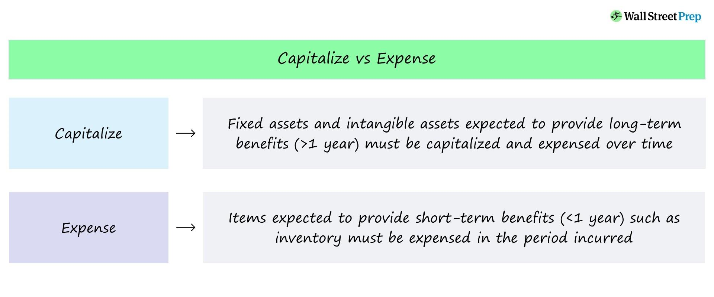

In the intricate landscape of business accounting, financial reporting, and algorithmic trading, understanding financial terminology is paramount. Among these terms, the concept of capitalized costs stands out due to its significant impact on how companies report and manage their financial operations. Capitalized costs refer to expenditures that are not immediately expensed but instead recorded as assets on the balance sheet. This classification allows companies to spread these costs over time, aligning them with the benefits they are expected to generate.

In financial reporting, the distinction between capitalized and expensed costs influences a company's financial statements by affecting asset values and profitability metrics. For example, while immediate expensing of a cost can reduce net income in the short term, capitalizing the same expenditure allows costs to be amortized or depreciated over the useful life of the related asset, resulting in a more stable and potentially higher net income over time.



From the perspective of business accounting, capitalized costs play a crucial role in matching expenses with associated revenues, enhancing the accuracy of profit reporting. This alignment is essential for businesses to improve their return on assets, a key performance indicator for stakeholders and investors. Accurate classification is vital because any missteps can lead to misleading financial information, thereby impacting business strategy and investor confidence.

In the fast-paced world of algorithmic trading, the role of capitalized costs takes a unique dimension. Here, investments in technology infrastructure, such as advanced software and high-speed data processing systems, are often capitalized. Proper expense management in this context is crucial as technological competitiveness can make a substantial difference in trading performance. Comprehending and accurately managing capitalized costs in such environments facilitates better financial planning and strategic allocation of resources.

This article aims to provide deeper insights into capitalized costs, examining their implications for financial reporting, revealing their importance in business accounting, and exploring their practical applications within algorithmic trading. The efficient handling of capitalized costs not only ensures regulatory compliance but also enhances financial transparency and organizational resilience.

## Table of Contents

## What Are Capitalized Costs?

Capitalized costs represent expenditures recorded as assets, rather than expenses, on a company’s financial statements. This accounting approach aligns with the principle that certain costs provide benefits spanning multiple periods. By capitalizing these costs, companies defer their expenses over time, effectively amortizing or depreciating them against the corresponding period revenues.

The process of capitalization begins when an expenditure is incurred with the expectation of future economic benefits. For instance, purchasing machinery, equipment, or undertaking software development exemplifies capitalized costs, as these assets are anticipated to bolster productivity or revenue streams beyond the current reporting period. This approach is particularly advantageous for businesses investing in significant assets where immediate expensing could distort profitability.

Capitalized costs are positioned on the balance sheet under assets, reflecting their ongoing utility. Over the asset’s useful life, businesses employ depreciation or amortization techniques to systematically reduce the asset’s book value on the balance sheet. Depreciation typically applies to tangible assets such as machinery, while amortization pertains to intangible assets like software. The rate of this allocation is governed by the asset's estimated useful life and the chosen method of depreciation or amortization—straight-line, declining balance, or sum-of-the-years'-digits, among others.

Mathematically, for the straight-line depreciation, the annual depreciation expense can be calculated as follows:

$$
\text{Annual Depreciation Expense} = \frac{\text{Cost of the Asset} - \text{Salvage Value}}{\text{Useful Life of the Asset}}
$$

In Python, this can be computed as:

```python
def calculate_annual_depreciation(cost, salvage_value, useful_life):
    return (cost - salvage_value) / useful_life

cost_of_asset = 10000
salvage_value = 1000
useful_life = 5

annual_depreciation = calculate_annual_depreciation(cost_of_asset, salvage_value, useful_life)
print(f"Annual Depreciation Expense: {annual_depreciation}")
```

The rationale behind capitalization lies in achieving a faithful representation of a company's financial position. By capitalizing rather than expensing these costs outright, businesses present a clearer picture of asset value and profitability over extended periods. This accounting practice ensures expenses are matched with revenues they help generate, facilitating better analysis of financial performance.

Understanding capitalized costs is essential for comprehending financial statements and discerning the long-term strategy a company adopts regarding its asset investments and expense management.

## Understanding Capitalized Costs in Financial Reporting

Financial reporting significantly depends on the proper classification of costs as either capitalized or expensed. Capitalized costs, when correctly identified, are recorded as assets on the balance sheet rather than being immediately expensed on the income statement. This accounting treatment allows companies to reflect higher asset values, as these costs are not immediately deducted from revenues but are instead allocated over the useful life of the asset. The process involves depreciating tangible assets or amortizing intangible assets over time, aligning the expense recognition with the period in which the asset contributes to generating revenue.

For instance, if a company invests in a manufacturing machine costing $100,000 with an expected life span of 10 years, under capitalized cost treatment, the company would expense a portion of the machine's cost each year through depreciation. This allocation can be calculated using straight-line depreciation as follows:

$$
\text{Annual Depreciation} = \frac{\text{Initial Cost} - \text{Salvage Value}}{\text{Useful Life}}
$$

Assuming no salvage value, the annual depreciation expense would be:

$$
\text{Annual Depreciation} = \frac{100,000}{10} = 10,000
$$

Every year, $10,000 would be recorded as depreciation expense, thereby recognizing the cost gradually over the asset's useful life.

The classification of costs and their impact on financial statements emphasizes adherence to Generally Accepted Accounting Principles (GAAP). GAAP provides a framework ensuring that financial representations are accurate, consistent, and comparable. By following GAAP, organizations maintain transparency and accountability in their financial reporting, fostering trust among investors, regulators, and other stakeholders.

A critical aspect of GAAP is the matching principle, which requires that expenses be matched with associated revenues in the same accounting period. Capitalized costs, by being allocated over multiple periods, adhere to this principle, ensuring that financial statements reflect a company's true financial performance and position.

Thus, understanding and applying the correct categorization of costs within financial reporting are crucial. It influences various financial metrics and analyses, providing insights into company performance and aiding stakeholders in making informed decisions.

## The Importance of Capitalized Costs in Business Accounting

Capitalized costs are significant in business accounting as they enable proper matching of costs with revenues over the life of an asset, thereby enhancing the accuracy of profit reporting. Instead of expensing costs in the period they are incurred, capitalized costs are spread out over the useful life of the asset through depreciation or amortization. This approach aligns the expense recognition with the revenue generated by the asset, providing a clearer picture of a company’s profitability over time.

Incorporating capitalized costs into financial metrics is crucial as they impact key indicators such as return on assets (ROA) and net income. The formula for ROA is:

$$
\text{ROA} = \frac{\text{Net Income}}{\text{Total Assets}}
$$

When costs are capitalized, they increase the asset base reflected in the denominator, which can initially lower the ROA. However, by appropriately spreading the expense over time, companies can achieve a more stable and reliable measure of asset efficiency. Similarly, net income is affected, as recognizing lower immediate expenses due to capitalization results in higher initial profits. This, in turn, can enhance the attractiveness of financial statements to investors.

Proper capitalization requires accurate classification of costs. Misclassifications can lead to misleading financial statements, which may affect investor confidence and strategic business decisions. Over-capitalization, where too many costs are allocated as assets, can inflate asset values and distort profitability metrics. Conversely, under-capitalization can lead to understated asset values and inflated expenses, skewing financial analysis and decision-making processes.

Ensuring that costs are correctly capitalized involves stringent adherence to accounting standards and principles, such as the Generally Accepted Accounting Principles (GAAP) or International Financial Reporting Standards (IFRS). Accurate application of these frameworks is vital to maintaining the integrity and comparability of financial statements, thus supporting informed decision-making by stakeholders.

## Application of Capitalized Costs in Algorithmic Trading

In [algorithmic trading](/wiki/algorithmic-trading), capitalized costs are often associated with significant technology investments, particularly in software and infrastructure that enable the development and implementation of trading strategies. These costs, once capitalized, become part of the company’s asset base and are amortized over time, reflecting their extended utility in generating economic benefits.

Efficient expense management in algorithmic trading is critical, as technological advancements can provide significant competitive advantages. The integration of high-frequency trading algorithms, [machine learning](/wiki/machine-learning) models, and complex data analysis platforms often involves substantial upfront costs. By capitalizing these expenses, trading firms can spread the impact of these investments over several years, aligning costs more closely with the revenue generated from these technological innovations.

Understanding and managing capitalized costs effectively allows trading firms to improve their financial planning and resource allocation. Firms can forecast the return on investment (ROI) for capitalized expenses by evaluating the net present value (NPV) or internal rate of return (IRR) of these long-term assets. The calculation of ROI can be conducted using:

$$
\text{ROI} = \frac{\text{Net Profit}}{\text{Cost of Investment}} \times 100
$$

By accurately projecting the future economic benefits from these capitalized expenses, firms can make informed decisions about further technological investments and strategic expansions. In doing so, they can maintain a competitive edge in the fast-paced environment of financial markets.

Furthermore, consistent application of capitalized costs ensures that firms adhere to financial reporting standards, promoting transparency and credibility with stakeholders. This not only enhances investor confidence but also ensures compliance with regulatory requirements, minimizing potential legal and financial repercussions. Understanding the implications of capitalized costs is thus vital for maintaining operational efficiency and achieving long-term success in algorithmic trading.

## Challenges and Considerations

Determining whether a cost should be capitalized or expensed requires significant professional judgment and adherence to company guidelines. This decision impacts financial statements and tax obligations, making it crucial for companies to carefully evaluate their choices.

One of the primary considerations is the expected future benefits of the expenditure. According to generally accepted accounting principles (GAAP), a cost should be capitalized if it is expected to provide economic benefits beyond the current period. These benefits could include enhanced efficiency, increased output, or prolonged asset life. Accurate capitalization requires precise measurement of these future benefits, which can be complex.

For example, capitalizing development costs for software requires estimating future revenue streams attributable to the software, considering uncertainties around technological change and market demand. Companies must ensure that their estimates are reasonably reliable to prevent overvaluation of assets.

Inconsistent application of capitalization policies can lead to financial discrepancies. If similar costs are treated differently over time or across the organization, it can lead to an unrepresentative financial picture. This inconsistency might arise from unclear internal policies or misinterpretation of accounting standards. Such discrepancies may affect key financial metrics such as net income or asset turnover ratios, leading investors to incorrect conclusions about a company’s performance.

Additionally, misclassification of costs has tax implications. Capitalized costs are depreciated or amortized over time, affecting taxable income differently than immediate expensing would. Incorrectly capitalizing costs that should have been expensed can lead to understated tax liabilities initially, and potential penalties or corrections in subsequent years.

To mitigate these challenges, companies should establish clear, consistent accounting policies and provide ongoing training to ensure that these guidelines are applied uniformly. Regular audits and reviews of capitalization decisions can also help maintain integrity in financial reporting and compliance with relevant standards.

## Conclusion

Capitalized costs are a pivotal aspect of financial reporting and business accounting, offering critical insight into an organization’s financial health. These costs reflect investment in resources that provide future economic benefits, thus extending beyond the immediate financial period. This approach not only balances an organization’s expenses over time but also strategically enhances its asset base on financial statements. 

In corporate finance, the correct capitalization of costs can substantially influence a company’s success by providing a clearer picture of its long-term profitability and asset longevity. For instance, by spreading the cost of significant investments like machinery or technology over several years, companies can avoid substantial one-time expense shocks that might distort financial analysis.

In algorithmic trading, capitalized costs, particularly in technology investments, can furnish trading firms with competitive advantages. Proper handling of these costs allows for more effective financial planning and resource allocation, essential for maintaining cutting-edge trading platforms and strategies.

Professionals involved in financial reporting and business accounting must ensure the accurate and consistent application of capitalization principles. This necessitates a thorough understanding of generally accepted accounting principles (GAAP) and an ability to evaluate future economic benefits reliably. Misclassification or inconsistent application can lead to misleading financial statements, eroding stakeholder trust and potentially resulting in regulatory challenges.

Ultimately, precise capitalization of costs is instrumental in portraying a true and fair view of a company's financial position, thereby sustaining its strategic objectives and enhancing investor confidence.

## References & Further Reading

[1]: ["Mastering Financial Modeling: A Professional’s Guide to Building Financial Model"](https://books.google.com/books/about/Mastering_Financial_Modeling_A_Professio.html?id=UasdAAAAQBAJ) by H. Kent Baker and Philip English

[2]: Kieso, D. E., Weygandt, J. J., & Warfield, T. D. (2020). ["Intermediate Accounting."](https://books.google.com/books/about/Intermediate_Accounting_IFRS.html?id=3XntDwAAQBAJ) Wiley.

[3]: ["The Basics of Capital Budgeting: Evaluating Cash Flows"](https://quizlet.com/846421307/chapter-10-the-basics-of-capital-budgeting-evaluating-cash-flows-flash-cards/) CFA Institute Research Foundation

[4]: ["Algorithmic Trading: Winning Strategies and Their Rationale"](https://www.wiley.com/en-us/Algorithmic+Trading%3A+Winning+Strategies+and+Their+Rationale-p-9781118460146) by Ernie Chan

[5]: ["Financial Accounting and Reporting"](https://corporatefinanceinstitute.com/resources/accounting/financial-accounting/) by Barry Elliott, Jamie Elliott

[6]: ["Standards for capitalizing costs in financial accounting"](https://www.investopedia.com/terms/c/capitalizedcost.asp) by Financial Accounting Standards Board (FASB)