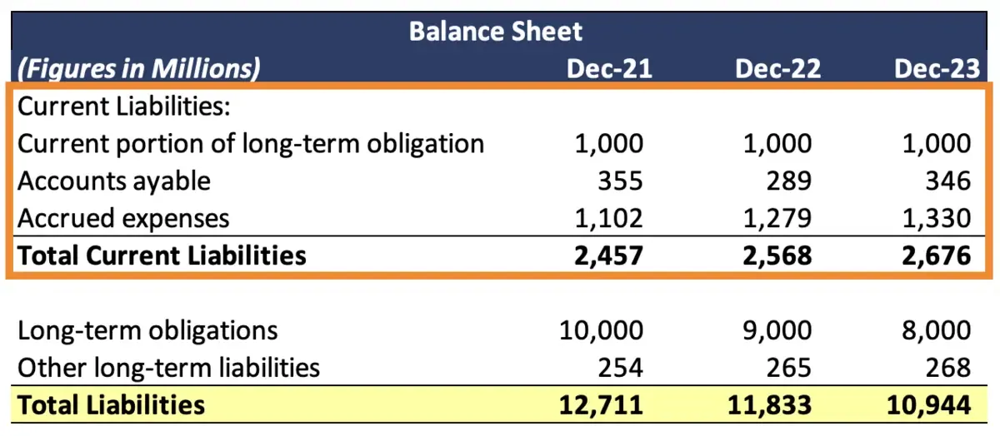

## Table of Contents

## What are current liabilities?

Current liabilities are debts or obligations that a company needs to pay within one year or within its normal operating cycle. They are listed on a company's balance sheet and include things like money owed to suppliers, short-term loans, and taxes that need to be paid soon. These liabilities are important because they show how much money a company needs to pay in the near future.

Keeping track of current liabilities helps a company manage its cash flow and make sure it has enough money to cover these short-term debts. If a company has too many current liabilities compared to its current assets, it might struggle to pay its bills on time. This can affect the company's financial health and its ability to operate smoothly. Therefore, businesses carefully monitor their current liabilities to maintain a healthy financial position.

## Why are current liabilities important for a business?

Current liabilities are important for a business because they show how much money the business needs to pay soon, usually within a year. This helps the business know if it has enough money to cover these short-term debts. If a business has too many current liabilities and not enough money coming in, it might have trouble paying its bills on time. This can lead to problems like late fees or even going out of business.

By keeping an eye on current liabilities, a business can plan better and make sure it has enough money to keep running smoothly. For example, if a business knows it has a big payment coming up, it can save money or find other ways to get the cash it needs. This helps the business stay healthy and avoid financial trouble. So, understanding and managing current liabilities is key to keeping a business stable and successful.

## Can you list some common examples of current liabilities?

Common examples of current liabilities are things like money a business owes to its suppliers, which is called accounts payable. Another example is short-term loans that need to be paid back within a year. Businesses also have to pay taxes, so any taxes that are due soon are current liabilities too. Wages that employees have earned but haven't been paid yet, called accrued wages, are another type of current liability.

Other examples include unearned revenue, which is money a business gets before it provides a product or service. For instance, if a customer pays for a service in advance, that money is a current liability until the service is provided. Lastly, there are things like interest payable, which is interest on loans that a business owes but hasn't paid yet. All these examples are important because they show what a business needs to pay in the near future.

## How do current liabilities differ from long-term liabilities?

Current liabilities are debts a business needs to pay within one year or its normal operating cycle. They include things like money owed to suppliers, short-term loans, and taxes that are due soon. These are important because they show how much money a business needs to pay in the near future. If a business has too many current liabilities and not enough money, it might struggle to pay its bills on time.

Long-term liabilities, on the other hand, are debts that a business does not need to pay within the next year. They include things like long-term loans, mortgages, and bonds that won't come due for a while. These liabilities are important for understanding a business's long-term financial health. They help a business plan for the future and make sure it can handle big payments that are coming up later on.

## What is the impact of current liabilities on a company's liquidity?

Current liabilities have a big effect on a company's [liquidity](/wiki/liquidity-risk-premium), which means how easily a company can turn its assets into cash to pay its debts. If a company has a lot of current liabilities, it needs to make sure it has enough cash or assets that can quickly be turned into cash. This is important because if the company can't pay its bills on time, it might face problems like late fees or even going out of business.

To measure liquidity, people often look at ratios like the current ratio, which compares current assets to current liabilities. If a company's current ratio is low, it might mean the company doesn't have enough liquid assets to cover its short-term debts. This can make it harder for the company to get more loans or do business with suppliers who want to be paid on time. So, managing current liabilities well is key to keeping a company's liquidity healthy and making sure it can keep running smoothly.

## How are current liabilities reported on the balance sheet?

Current liabilities are shown on a company's balance sheet under the liabilities section. They are listed right after the current assets because they need to be paid within a year or the company's operating cycle. You'll see things like money owed to suppliers, short-term loans, and taxes that are due soon. These are important because they show how much money the company needs to pay in the near future.

The balance sheet lists these current liabilities in order of when they need to be paid, starting with the ones that are due the soonest. This helps people see how much money the company needs to have ready to pay its bills on time. By looking at the current liabilities, anyone can tell if the company might have trouble paying its short-term debts or if it's managing its money well.

## What is the difference between accounts payable and other current liabilities?

Accounts payable are the money a company owes to its suppliers for goods or services that it has received but not yet paid for. This is a common type of current liability that shows up on the balance sheet under the current liabilities section. It's important because it tells us how much money the company needs to pay to its suppliers soon.

Other current liabilities include things like short-term loans, taxes that need to be paid soon, wages that employees have earned but not yet been paid, and money received from customers for services not yet provided. These are also listed on the balance sheet under current liabilities, but they are different from accounts payable because they cover a wider range of short-term debts. Understanding both accounts payable and other current liabilities helps a company manage its money better and make sure it can pay all its bills on time.

## How can a company manage its current liabilities effectively?

A company can manage its current liabilities effectively by keeping a close eye on its cash flow. This means the company needs to know how much money is coming in and going out. If the company sees that it has a big payment coming up, it can plan ahead. For example, it might save more money or find ways to get more cash quickly. This helps make sure the company can pay its bills on time without running into money problems.

Another way to manage current liabilities is to negotiate with suppliers or lenders. If a company talks to its suppliers, it might be able to get longer payment terms. This means the company can pay later, which helps with cash flow. The company can also talk to its lenders about changing the terms of short-term loans, maybe paying them back over a longer time. By doing these things, a company can handle its current liabilities better and keep its finances healthy.

## What are the implications of high current liabilities relative to current assets?

When a company has high current liabilities compared to its current assets, it might face some challenges. This situation means the company owes a lot of money that it needs to pay soon, but it doesn't have enough cash or things it can quickly turn into cash to cover those debts. If the company can't pay its bills on time, it might have to pay late fees or even go out of business. This can also make it hard for the company to get more loans because lenders might think the company is too risky.

To fix this problem, the company needs to find ways to get more cash or reduce its short-term debts. It might need to sell some assets quickly, cut back on spending, or talk to its suppliers and lenders about paying later. By managing its current liabilities better, the company can avoid financial trouble and keep running smoothly. Keeping a healthy balance between current liabilities and current assets is key to staying financially stable.

## How do current liabilities affect a company's working capital?

Current liabilities affect a company's working capital because working capital is calculated by subtracting current liabilities from current assets. If a company has a lot of current liabilities, it means it needs to pay a lot of money soon. This can make the company's working capital lower. If the working capital is too low, the company might not have enough money to run its day-to-day business smoothly. It might struggle to pay its bills on time or buy the things it needs to keep working.

To keep a healthy level of working capital, a company needs to manage its current liabilities carefully. If the company can lower its current liabilities or increase its current assets, its working capital will go up. This can help the company have enough money to cover its short-term needs and keep its business running without problems. So, understanding and managing current liabilities is very important for a company's financial health and its ability to operate well.

## What are some advanced strategies for optimizing current liabilities?

One advanced strategy for optimizing current liabilities is to use dynamic discounting. This means a company can offer to pay its suppliers earlier than the due date in exchange for a discount. By doing this, the company can save money on its purchases. It also helps the company manage its cash flow better because it can choose when to pay based on how much money it has at the time. This strategy works well if the company has extra cash and wants to use it to lower its costs.

Another strategy is to use supply chain financing. This is when a company works with a bank or a financing company to pay its suppliers. The bank pays the suppliers early, and the company pays the bank back later. This helps the company keep its cash longer, which can be used for other things. It also makes suppliers happy because they get paid sooner. This strategy can help a company manage its current liabilities better and keep good relationships with its suppliers.

A third strategy involves renegotiating terms with lenders. A company can talk to its lenders about changing the terms of its short-term loans. For example, it might ask for a longer time to pay back the loan or for a lower [interest rate](/wiki/interest-rate-trading-strategies). By doing this, the company can lower its current liabilities and make its payments more manageable. This strategy can help a company avoid cash flow problems and keep its finances stable.

## How do regulatory changes impact the management of current liabilities?

Regulatory changes can affect how a company manages its current liabilities. If the government changes the rules about how quickly a company has to pay taxes or other bills, the company might have to change its plans. For example, if new rules say that companies need to pay their taxes sooner, the company will need more cash ready to pay those taxes. This can make it harder for the company to manage its money because it has to pay more money out at once.

Also, new rules can change how companies report their current liabilities on their balance sheets. If the rules change, a company might have to show more or less money as current liabilities. This can affect how people see the company's financial health. If a company has to show more current liabilities, people might think it's riskier because it has more money to pay soon. So, companies need to keep up with regulatory changes and adjust their plans to manage their current liabilities well.

## What is the Importance of Calculating Current Liabilities?

Accurate calculation of current liabilities is critical for financial planning and management. These liabilities represent the short-term obligations a company must satisfy within a year, and their precise calculation helps maintain the organization’s liquidity and ensure uninterrupted operations.

Calculating financial ratios such as the current ratio and quick ratio relies heavily on current liabilities. The current ratio is defined as:

$$
\text{Current Ratio} = \frac{\text{Current Assets}}{\text{Current Liabilities}}
$$

This ratio indicates a company's ability to cover its short-term obligations with its short-term assets. A current ratio above 1 suggests that a company has more assets than liabilities, highlighting its ability to meet immediate obligations. Conversely, a ratio below 1 might indicate potential liquidity issues.

The quick ratio, or acid-test ratio, further refines this analysis by excluding inventory from current assets, focusing on the most liquid assets:

$$
\text{Quick Ratio} = \frac{\text{Current Assets} - \text{Inventory}}{\text{Current Liabilities}}
$$

The quick ratio provides a more conservative view by recognizing that inventory might not be quickly convertible to cash.

Investors and creditors use these financial metrics to assess a company's solvency and creditworthiness. A strong current or quick ratio indicates sound financial health, enhancing the company's appeal to creditors and investors. This capability to meet short-term liabilities reflects prudent financial management and determines the trust that external stakeholders place in the company's operations.

Furthermore, precise calculation of current liabilities aids sound financial planning. It enables management to anticipate cash flow requirements and align operational strategies accordingly. Companies can identify when cash inflows are needed to meet obligations, thus averting liquidity crunches. It also helps in determining optimal times for securing additional funding or strategic investments, minimizing financial risk.

In summary, understanding and accurately calculating current liabilities form a cornerstone of effective financial management strategy. This practice not only aids in maintaining liquidity but also plays a pivotal role in strategic decision-making, impacting the company’s creditworthiness and investment potential.

## What are the calculation techniques for current liabilities?

Understanding various components of current liabilities is essential for accurate and effective financial management. Current liabilities include accounts payable, short-term debt, and accrued liabilities, which are obligations a company must settle within a year. Proper calculation and management of these components are crucial for maintaining liquidity and ensuring financial stability.

To calculate current liabilities, companies must meticulously track their obligations. This involves maintaining accurate records of all accounts payable—amounts owed to suppliers for goods and services received. It is also necessary to monitor short-term debt, which includes any loans or financial obligations due within a year. Accrued liabilities, such as payroll expenses and taxes that have been incurred but not yet paid, must also be accounted for.

Evaluating payment terms is another important aspect of calculating current liabilities. Companies should review the terms agreed upon with creditors and suppliers to optimize cash flow and maintain favorable credit terms. This requires a careful analysis of when payments are due and aligning them with the company’s cash inflows to prevent liquidity issues.

Additionally, financial metrics such as the current ratio and quick ratio are essential tools in assessing a company’s ability to meet its short-term obligations. The current ratio is calculated as:

$$
\text{Current Ratio} = \frac{\text{Current Assets}}{\text{Current Liabilities}}
$$

This ratio indicates a company's ability to cover its short-term liabilities with its current assets. A higher ratio suggests better short-term financial health. Similarly, the quick ratio, also known as the acid-test ratio, measures a company’s ability to meet its obligations without relying on the sale of inventory:

$$
\text{Quick Ratio} = \frac{\text{Current Assets} - \text{Inventory}}{\text{Current Liabilities}}
$$

To enhance the precision and efficiency of these calculations, companies increasingly rely on software and programming tools. Python, with its robust libraries for data analysis, offers considerable utility in automating and refining these calculations. Programming scripts can be used to extract relevant financial data from databases, perform real-time calculations, and generate reports that inform strategic decision-making.

Here's a simple Python example for calculating the current and quick ratios:

```python
def calculate_current_ratio(current_assets, current_liabilities):
    return current_assets / current_liabilities

def calculate_quick_ratio(current_assets, inventory, current_liabilities):
    return (current_assets - inventory) / current_liabilities

# Example usage:
current_assets = 100000
inventory = 20000
current_liabilities = 50000

current_ratio = calculate_current_ratio(current_assets, current_liabilities)
quick_ratio = calculate_quick_ratio(current_assets, inventory, current_liabilities)

print(f"Current Ratio: {current_ratio:.2f}")
print(f"Quick Ratio: {quick_ratio:.2f}")
```

By leveraging such tools, finance professionals can gain deeper insights into their company’s financial standing and make informed decisions to manage liabilities effectively.

## References & Further Reading

1. **Books**:
   - "Financial Accounting: Tools for Business Decision Making" by Paul D. Kimmel, Jerry J. Weygandt, and Donald E. Kieso. This book provides a comprehensive understanding of financial accounting principles, including current liabilities.
   - "Algorithmic Trading: Winning Strategies and Their Rationale" by Ernie Chan. This book offers insights into the strategies behind algorithmic trading and its implications for financial management.
   - "Corporate Finance" by Jonathan Berk and Peter DeMarzo. This text covers essential financial concepts, including the management of liabilities and financial ratios.

2. **Academic Papers**:
   - "The Impact of Current Liabilities on Firm Performance: Evidence from Pakistan" by Muhammad Ahsan Ali and others. This paper explores how current liabilities affect firm performance, providing empirical evidence from a specific market.
   - "Algorithmic Trading and Liquidity: A Literature Review" by Ananth Madhavan. This paper reviews the relationship between algorithmic trading and market liquidity, highlighting how automated strategies influence financial transactions.

3. **Online Resources**:
   - Investopedia (https://www.investopedia.com/): A reliable online financial encyclopedia providing articles on various topics, including financial ratios and algorithmic trading.
   - Financial Times (https://www.ft.com/): Offers comprehensive news articles and analyses on the latest financial trends and techniques, including current liability management.

4. **Software and Programming**:
   - Python for Finance Cookbook by Eryk Lewinson is a resourceful guide on using Python for financial data analysis, offering practical insights into automating liability calculations and algorithmic trading.
   - Stack Overflow (https://stackoverflow.com/): A community-driven forum where programmers share solutions to coding challenges, including those related to financial calculations and algorithmic trading strategies. 

These resources provide foundational knowledge and practical applications for professionals and enthusiasts seeking to enhance their understanding of financial accounting, [algorithmic trading](/wiki/algorithmic-trading), and liability management.

