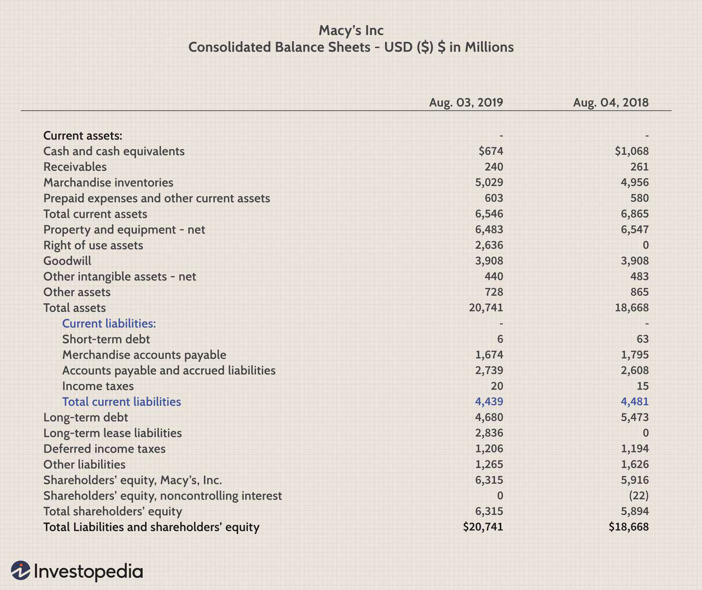

Current liabilities are pivotal elements in financial accounting, encompassing obligations that companies must settle within a one-year timeframe. These liabilities include items such as accounts payable, short-term borrowings, and accrued expenses, each demanding precise attention from financial managers to maintain operational fluidity and ensure fiscal responsibility. Their effective management is crucial, as they directly impact liquidity—an essential element for any business aiming to sustain itself in competitive markets.

Understanding current liabilities becomes even more indispensable in today's rapidly developing financial landscape, characterized by technology-driven processes such as algorithmic trading. Algorithmic trading leverages sophisticated algorithms to automate and optimize buying and selling strategies in financial markets. It is deeply interwoven with the management of financial exposures, including liabilities, offering advanced tools to predict cash flows and influence timing for financial obligations effectively. The integration of technology in managing these short-term debts sharply enhances the ability to plan, forecast, and execute financial strategies aligned with a company's cash flow cycles, reducing the risk of liquidity crises.



This article investigates the multifaceted nature of current liabilities and their interaction with algorithmic trading. It also investigates into how these elements converge to enhance financial strategies, providing insights necessary for stakeholders – from managers to investors – who navigate the complexities of financial accounting in the digital age. Through strategic liability management, assisted by algorithmic capabilities, businesses can sustain financial robustness, thereby gaining a strategic edge in the dynamically evolving economic environment.

## Table of Contents

## Understanding Current Liabilities

Current liabilities represent a company's short-term financial obligations, which must be settled within the fiscal year. These liabilities are essential indicators of a company's immediate financial health, liquidity position, and operational efficiency. They typically include obligations such as accounts payable, short-term loans, the current portion of long-term debt, accrued expenses, payroll liabilities, taxes, and unearned revenue.

Accounts payable, one of the primary components of current liabilities, consists of a company's obligations to suppliers or creditors for goods and services received but not yet paid for. Timely management of accounts payable is crucial for maintaining good supplier relationships and can influence the company's cash flow strategy.

Short-term debt encompasses loans or financial obligations due within one year. It is often used to finance a company's working capital needs and meet immediate expenses. Proper management of short-term debt ensures that a company can meet its obligations without jeopardizing its liquidity.

Accrued expenses are liabilities for expenses that have been incurred but not yet paid by the end of the accounting period. These could include utilities, rent, and interest on loans that are accrued over time. For example, if a company uses electricity during a month but pays its electric bill the following month, the amount unpaid by the end of the month is recorded as an accrued expense.

Payroll liabilities include money owed to employees and government bodies for salaries and wages, taxes, and benefits that haven't been paid yet. This component is significant not only because it affects employee satisfaction but also due to the legal and regulatory implications associated with employment payments.

Unearned revenue represents money received by a company for goods or services not yet delivered. For instance, a subscription-based business might receive annual payments upfront. This money is recorded as a liability until the revenue is recognized over the subscription period as the company fulfills its service obligation.

Managing these liabilities effectively allows companies to maintain [liquidity](/wiki/liquidity-risk-premium) and meet their short-term obligations without needing to secure emergency funding. This management typically involves tracking payment schedules and aligning them with cash inflows. By maintaining a balance within current liabilities, a business can ensure operational efficiency, indicated by favorable financial ratios such as the current ratio and the quick ratio, which provide a snapshot of a company's ability to cover short-term obligations with its available assets.

## Importance of Calculating Current Liabilities

Accurate calculation of current liabilities is critical for financial planning and management. These liabilities represent the short-term obligations a company must satisfy within a year, and their precise calculation helps maintain the organization’s liquidity and ensure uninterrupted operations.

Calculating financial ratios such as the current ratio and quick ratio relies heavily on current liabilities. The current ratio is defined as:

$$
\text{Current Ratio} = \frac{\text{Current Assets}}{\text{Current Liabilities}}
$$

This ratio indicates a company's ability to cover its short-term obligations with its short-term assets. A current ratio above 1 suggests that a company has more assets than liabilities, highlighting its ability to meet immediate obligations. Conversely, a ratio below 1 might indicate potential liquidity issues.

The quick ratio, or acid-test ratio, further refines this analysis by excluding inventory from current assets, focusing on the most liquid assets:

$$
\text{Quick Ratio} = \frac{\text{Current Assets} - \text{Inventory}}{\text{Current Liabilities}}
$$

The quick ratio provides a more conservative view by recognizing that inventory might not be quickly convertible to cash.

Investors and creditors use these financial metrics to assess a company's solvency and creditworthiness. A strong current or quick ratio indicates sound financial health, enhancing the company's appeal to creditors and investors. This capability to meet short-term liabilities reflects prudent financial management and determines the trust that external stakeholders place in the company's operations.

Furthermore, precise calculation of current liabilities aids sound financial planning. It enables management to anticipate cash flow requirements and align operational strategies accordingly. Companies can identify when cash inflows are needed to meet obligations, thus averting liquidity crunches. It also helps in determining optimal times for securing additional funding or strategic investments, minimizing financial risk.

In summary, understanding and accurately calculating current liabilities form a cornerstone of effective financial management strategy. This practice not only aids in maintaining liquidity but also plays a pivotal role in strategic decision-making, impacting the company’s creditworthiness and investment potential.

## Algorithmic Trading and Liability Management

Algorithmic trading uses automated strategies to optimize the timing and execution of financial transactions. This approach is significantly beneficial in liability management, where timing precise settlements of current liabilities can enhance financial efficiency and stability. Algorithms efficiently predict cash flows, allowing companies to align liability settlements with periods of peak cash inflow, thus optimizing liquidity management.

Automation in trading strategies involves deploying algorithms capable of processing vast datasets rapidly, facilitating timely decision-making. These algorithms assess historical cash flow patterns, market trends, and financial metrics to forecast future cash flows accurately. This predictive capability offers a strategic advantage in scheduling payments, ensuring companies meet their obligations without straining liquidity reserves.

One of the primary methods employed in [algorithmic trading](/wiki/algorithmic-trading) is the use of statistical models that forecast cash inflows and outflows based on various economic indicators and historical transaction data. These models can be implemented using programming languages, with Python being particularly effective due to its robust libraries for financial analysis, such as NumPy and pandas. Below is an example of a simple Python function using NumPy to calculate anticipated cash flows:

```python
import numpy as np

def predict_cash_flow(historical_data, weights):
    # Ensure historical_data and weights are numpy arrays
    historical_data = np.array(historical_data)
    weights = np.array(weights)

    # Calculate predicted cash flow as a weighted sum of historical data
    predicted_cash_flow = np.dot(historical_data, weights)
    return predicted_cash_flow

# Example usage
historical_transactions = [1000, 1500, 2000, 2500]  # Past months' cash flows
transaction_weights = [0.1, 0.2, 0.3, 0.4]  # Weighting each previous month

predicted_flow = predict_cash_flow(historical_transactions, transaction_weights)
print(f"Predicted Cash Flow for next month: ${predicted_flow:.2f}")
```

Such computational tools enable financial planners to project scenarios under varying market conditions, allowing for strategic adjustments in liability management. This foresight helps prevent liquidity crises by ensuring expenses do not exceed available resources at any given time.

Additionally, algorithmic trading introduces precision in executing financial strategies. By automating the settlement process, companies minimize human error, reduce transaction costs, and enhance the speed of financial operations. This accuracy is critical for businesses with extensive short-term liabilities, where even minor miscalculations can lead to significant financial repercussions. 

In essence, integrating algorithmic trading with liability management offers enterprises a sophisticated mechanism to maintain financial stability, reduce risk, and optimize their overall financial performance.

## Current Liabilities: Calculation Techniques

Understanding various components of current liabilities is essential for accurate and effective financial management. Current liabilities include accounts payable, short-term debt, and accrued liabilities, which are obligations a company must settle within a year. Proper calculation and management of these components are crucial for maintaining liquidity and ensuring financial stability.

To calculate current liabilities, companies must meticulously track their obligations. This involves maintaining accurate records of all accounts payable—amounts owed to suppliers for goods and services received. It is also necessary to monitor short-term debt, which includes any loans or financial obligations due within a year. Accrued liabilities, such as payroll expenses and taxes that have been incurred but not yet paid, must also be accounted for.

Evaluating payment terms is another important aspect of calculating current liabilities. Companies should review the terms agreed upon with creditors and suppliers to optimize cash flow and maintain favorable credit terms. This requires a careful analysis of when payments are due and aligning them with the company’s cash inflows to prevent liquidity issues.

Additionally, financial metrics such as the current ratio and quick ratio are essential tools in assessing a company’s ability to meet its short-term obligations. The current ratio is calculated as:

$$
\text{Current Ratio} = \frac{\text{Current Assets}}{\text{Current Liabilities}}
$$

This ratio indicates a company's ability to cover its short-term liabilities with its current assets. A higher ratio suggests better short-term financial health. Similarly, the quick ratio, also known as the acid-test ratio, measures a company’s ability to meet its obligations without relying on the sale of inventory:

$$
\text{Quick Ratio} = \frac{\text{Current Assets} - \text{Inventory}}{\text{Current Liabilities}}
$$

To enhance the precision and efficiency of these calculations, companies increasingly rely on software and programming tools. Python, with its robust libraries for data analysis, offers considerable utility in automating and refining these calculations. Programming scripts can be used to extract relevant financial data from databases, perform real-time calculations, and generate reports that inform strategic decision-making.

Here's a simple Python example for calculating the current and quick ratios:

```python
def calculate_current_ratio(current_assets, current_liabilities):
    return current_assets / current_liabilities

def calculate_quick_ratio(current_assets, inventory, current_liabilities):
    return (current_assets - inventory) / current_liabilities

# Example usage:
current_assets = 100000
inventory = 20000
current_liabilities = 50000

current_ratio = calculate_current_ratio(current_assets, current_liabilities)
quick_ratio = calculate_quick_ratio(current_assets, inventory, current_liabilities)

print(f"Current Ratio: {current_ratio:.2f}")
print(f"Quick Ratio: {quick_ratio:.2f}")
```

By leveraging such tools, finance professionals can gain deeper insights into their company’s financial standing and make informed decisions to manage liabilities effectively.

## Examples and Case Studies

Case studies from major corporations such as Walmart and Goldman Sachs demonstrate effective liability management strategies, offering insights into sound financial practices. Walmart, for example, utilizes its substantial market influence to negotiate favorable payment terms with suppliers. By extending accounts payable durations, Walmart maintains healthier cash flows without compromising its credit reputation. This approach allows the company to invest in growth initiatives while efficiently managing current liabilities. The strategic extension of payment terms is a common tactic for enhancing liquidity positions without incurring additional debt.

Goldman Sachs adopts a different approach, leveraging algorithmic trading to optimize liability management. By employing advanced trading algorithms, Goldman Sachs can predict cash flow patterns and synchronize liability settlements with periods of peak cash inflow. This precise timing reduces the risk of liquidity shortfalls and enhances financial flexibility. Algorithmic trading allows for real-time adjustments, ensuring the company remains agile in dynamic financial markets.

Conversely, the Enron scandal serves as a cautionary tale of mismanagement in financial liabilities. Enron's downfall was precipitated by fraudulent accounting practices, including the misuse of special purpose entities to mask debt levels. The company's failure to accurately report current liabilities and other financial obligations led to a loss of investor confidence and eventual bankruptcy. This highlights the critical importance of transparency and accountability in liability management.

Strategic payment terms, like those employed by Walmart, provide more than just immediate financial relief. They play a pivotal role in a company's broader financial strategy by enabling long-term planning and investment. Algorithmic trading, as demonstrated by Goldman Sachs, offers a technological edge, ensuring that liability management aligns seamlessly with cash flow dynamics. Together, these examples illustrate how diverse strategies can be effectively tailored to suit a company's specific operational landscape. Mismanagement cases like Enron’s underscore the consequences of neglecting sound financial practices, making it essential for companies to uphold rigorous standards in accounting and liability oversight.

## Conclusion

Effective management of current liabilities is crucial for maintaining a company's liquidity and overall financial stability. These short-term obligations, which include accounts payable, short-term debt, and other imminent financial commitments, must be meticulously managed to ensure that companies can meet their due payments without compromising their operational efficiency or financial health. 

In the rapidly evolving financial landscape, algorithmic trading provides a sophisticated tool for optimizing the timing of liability settlements. By utilizing algorithms, companies can precisely time their transactions to align with moments of strongest cash inflow, thereby minimizing the risk of liquidity shortages. Through this strategic timing, algorithmic trading enhances financial operations by ensuring that obligations are met efficiently and without unnecessary financial strain.

Adopting algorithmic trading strategies in liability management supplies companies with a distinct competitive advantage. It not only assists in preemptively identifying optimal settlement periods but also enables companies to execute financial plans with greater accuracy and reliability. This technological edge helps avert potential liquidity crises that can arise from poor timing or mismanagement of liabilities.

Companies that integrate these advanced strategies are better prepared to handle the complexities and challenges of modern financial environments. By forecasting cash flows accurately and scheduling liability settlements accordingly, firms can sustain their financial health and reinforce their position in the market. This proactive approach to financial management underlines the importance of sound liability management combined with algorithmic trading as a key [factor](/wiki/factor-investing) for success in today’s dynamic economic climate.

## References & Further Reading

1. **Books**:
   - "Financial Accounting: Tools for Business Decision Making" by Paul D. Kimmel, Jerry J. Weygandt, and Donald E. Kieso. This book provides a comprehensive understanding of financial accounting principles, including current liabilities.
   - "Algorithmic Trading: Winning Strategies and Their Rationale" by Ernie Chan. This book offers insights into the strategies behind algorithmic trading and its implications for financial management.
   - "Corporate Finance" by Jonathan Berk and Peter DeMarzo. This text covers essential financial concepts, including the management of liabilities and financial ratios.

2. **Academic Papers**:
   - "The Impact of Current Liabilities on Firm Performance: Evidence from Pakistan" by Muhammad Ahsan Ali and others. This paper explores how current liabilities affect firm performance, providing empirical evidence from a specific market.
   - "Algorithmic Trading and Liquidity: A Literature Review" by Ananth Madhavan. This paper reviews the relationship between algorithmic trading and market liquidity, highlighting how automated strategies influence financial transactions.

3. **Online Resources**:
   - Investopedia (https://www.investopedia.com/): A reliable online financial encyclopedia providing articles on various topics, including financial ratios and algorithmic trading.
   - Financial Times (https://www.ft.com/): Offers comprehensive news articles and analyses on the latest financial trends and techniques, including current liability management.

4. **Software and Programming**:
   - Python for Finance Cookbook by Eryk Lewinson is a resourceful guide on using Python for financial data analysis, offering practical insights into automating liability calculations and algorithmic trading.
   - Stack Overflow (https://stackoverflow.com/): A community-driven forum where programmers share solutions to coding challenges, including those related to financial calculations and algorithmic trading strategies. 

These resources provide foundational knowledge and practical applications for professionals and enthusiasts seeking to enhance their understanding of financial accounting, algorithmic trading, and liability management.

