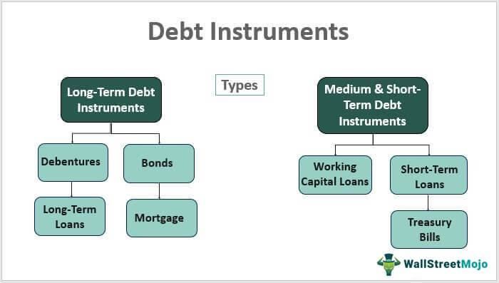

Understanding the various instruments available for investment and trading is crucial in finance. This article focuses on financial instruments, particularly debt instruments and debt securities, and explores the role of algorithmic trading in our contemporary financial landscape. These elements aim to enhance liquidity, manage risk, and create diverse investment opportunities, operating in synergy to construct a solid financial ecosystem. Through this exploration, readers will gain insight into how these concepts integrate to shape modern financial markets.

Debt instruments are financial assets that provide capital through borrowing, serving as essential tools for governments, corporations, and individuals to meet funding needs. Debt securities, a subset of these instruments, offer fixed income over a specified period, ensuring predictable revenue streams for investors. Understanding these instruments' definitions, types, advantages, and risks is vital for investors seeking stable returns and effective risk management.



Algorithmic trading, or algo trading, automates trading strategies and decisions in financial markets using sophisticated computer algorithms. This approach optimizes trading by rapidly executing trades based on predefined criteria, responding to market changes more swiftly than human traders. By increasing market liquidity and reducing transaction costs, algo trading has become an indispensable component of modern financial markets.

The article will also analyze how the integration of debt instruments with algorithmic trading technologies creates powerful financial tools that enhance investment strategies. By managing portfolios of debt securities more efficiently, algorithms play a crucial role in optimizing returns while managing risks. However, this complexity demands a thorough understanding and careful risk management.

Additionally, this article highlights the ethical and regulatory considerations surrounding these technologies, emphasizing the importance of robust frameworks to navigate related risks effectively. In conclusion, as financial markets evolve, balancing innovation with regulation is essential to maintain market stability and integrity. Through continuous research and education, stakeholders can adapt to changes and harness the full potential of these interconnected components for informed investment strategies, thus optimizing trading dynamics and influencing smart investment decisions.

## Table of Contents

## Understanding Debt Instruments and Debt Securities

Debt instruments are fundamental financial assets that facilitate the borrowing and lending of capital. These instruments serve as tools for governments, corporations, and individuals to obtain necessary funding. Debt instruments promise the repayment of borrowed capital, along with an agreement to pay interest, thereby providing borrowers with immediate capital influx and lenders with periodic interest income. 

### Types of Debt Instruments

1. **Bonds**: These are long-term debt instruments issued by governments or corporations. They provide periodic interest payments, known as coupons, to investors until maturity, when the principal amount is repaid. Bonds are typically considered lower-risk investments, particularly government bonds, also known as "treasuries."

2. **Debentures**: Unsecured debt instruments that rely on the issuer's creditworthiness and reputation. Unlike bonds, debentures do not have collateral backing them and often provide higher yields to compensate for increased risk. 

3. **Credit Facilities**: These include instruments such as mortgages and loans. A mortgage is a secured loan where real estate is used as collateral, while loans can be either secured or unsecured and vary widely in terms of conditions and usage.

### Debt Securities

Debt securities form a specific category within debt instruments, characterized primarily by their ability to provide fixed income. Bonds are the most typical example of debt securities, offering a predictable stream of income to investors via fixed interest payments over a predetermined period. 

These securities are crucial for raising capital by enabling issuers to tap into a large pool of investors, while simultaneously affording investors a measure of predictability and stability in returns. The fixed income generated by debt securities can be calculated using the formula for yield on a bond:

$$
\text{Yield} = \frac{\text{Coupon Payment}}{\text{Current Market Price}}
$$

This formula helps investors assess the rate of return on their investment in a bond relative to its current market price.

### Importance for Investors

For investors, understanding the characteristics and diversity of debt instruments and securities is critical for crafting a balanced portfolio that seeks to optimize returns while managing risks. Particularly for risk-averse investors, debt instruments offer an avenue for stable returns, acting as a buffer against the [volatility](/wiki/volatility-trading-strategies) of equity markets.

By integrating debt instruments into their portfolios, investors benefit from:

- **Predictability**: Regular interest payments provide a steady source of income.
- **Security**: Government bonds and other highly-rated debt securities are seen as safe investments.
- **Risk Management**: A diversified portfolio that includes debt instruments can mitigate overall risk, especially during economic downturns.

In conclusion, debt instruments and securities are indispensable to the financial architecture, offering diverse options for both issuers seeking capital and investors aiming for stable returns. Understanding their unique features and associated risks helps investors make informed decisions that align with their financial goals.

## The Role of Algorithmic Trading in Financial Markets

Algorithmic trading, commonly referred to as algo trading, leverages computer algorithms to facilitate the automation of trading strategies and decisions within financial markets. This innovative method enhances the efficiency and speed of trading operations, allowing for the rapid execution of trades based on predefined criteria. Unlike human traders, algorithms can analyze vast amounts of market data almost instantaneously, enabling them to respond to market changes swiftly and with precision.

The core objective of [algorithmic trading](/wiki/algorithmic-trading) is to optimize trading strategies. Algorithms can process extensive datasets, recognizing patterns and trends that may be imperceptible to individual traders. This capability is particularly beneficial in high-frequency trading, where the speed of data processing and trade execution can significantly influence profitability. For instance, algorithms can be designed to execute trades in milliseconds when certain market conditions are met, thereby capitalizing on short-lived market opportunities.

One of the primary benefits of algorithmic trading is its role in increasing market [liquidity](/wiki/liquidity-risk-premium). By executing a large number of transactions efficiently and consistently, algo trading can enhance the overall liquidity of financial markets. This increased liquidity helps in narrowing the bid-ask spreads, thereby reducing transaction costs for all market participants. As a result, algorithmic trading is considered a vital component in the functioning of modern financial markets, helping to ensure they are efficient and cost-effective.

Furthermore, the integration of [artificial intelligence](/wiki/ai-artificial-intelligence) (AI) and [machine learning](/wiki/machine-learning) into algorithmic trading systems promises to substantially advance their capabilities. Machine learning algorithms can improve trading strategies by continuously learning from new data, adapting to changing market conditions without human intervention. AI techniques allow the development of predictive models that can anticipate market movements, enabling traders to devise strategies that are both adaptable and precise.

Consider a simple Python algorithm to demonstrate a basic framework for algorithmic trading:

```python
import yfinance as yf  # For more datasets, visit: https://paperswithbacktest.com/datasets

def simple_moving_average_strategy(stock_symbol, short_window=40, long_window=100):
    # Download historical data for the stock
    data = yf.download(stock_symbol, start='2021-01-01', end='2023-01-01')

    # Calculate moving averages
    data['Short_MA'] = data['Close'].rolling(window=short_window, min_periods=1).mean()
    data['Long_MA'] = data['Close'].rolling(window=long_window, min_periods=1).mean()

    # Generate trading signals
    data['Signal'] = 0
    data['Signal'][short_window:] = np.where(data['Short_MA'][short_window:] > data['Long_MA'][short_window:], 1, 0)

    # Calculate the trading positions
    data['Position'] = data['Signal'].diff()

    return data

# Example usage
stock_data = simple_moving_average_strategy('AAPL')
print(stock_data[['Close', 'Short_MA', 'Long_MA', 'Signal', 'Position']])
```

This Python script uses historical stock data to implement a simple moving average crossover strategy, a common form of algorithmic trading. The algorithm generates buy signals when the short-term moving average crosses above the long-term moving average and sell signals when it crosses below.

In summary, algorithmic trading is a transformative force in financial markets. By harnessing computer algorithms and the power of AI, it not only optimizes trading strategies but also contributes significantly to market liquidity and cost reduction. As advancements in technology continue, algorithmic trading will likely become even more intricate and integral to financial systems worldwide.

## Combining Debt Instruments and Algo Trading

The integration of debt instruments with algorithmic trading technologies represents a significant evolution in financial strategies. By leveraging algorithms, the management and optimization of portfolios containing debt securities are substantially enhanced. Algorithms are capable of evaluating credit quality, adjusting investments in response to market conditions, and efficiently mitigating risks. This ability to process vast datasets allows for sophisticated decision-making processes that were previously unattainable through traditional methods.

Managing collateralized debt obligations (CDOs) and other structured finance products particularly benefits from this synergy. Algorithmic trading technologies facilitate more effective analysis, execution, and management of these complex products. Algorithms analyze various factors such as interest rates, credit spreads, and market volatility to dynamically adapt investment strategies. For instance, they can be programmed to alter the composition of a debt portfolio by buying or selling securities based on statistical models and forecasts.

Advancements in technology have led to more sophisticated approaches in trading debt instruments, enhancing returns while controlling risks. Financial engineers and quants develop models that align with specific investment goals and risk appetites. Machine learning and artificial intelligence further enhance these models' predictive capacities, enabling more responsive and adaptive trading strategies. A sample Python code for simulating a basic algorithmic trading strategy on a debt portfolio might look like:

```python
import numpy as np

# Simulate market data
bond_prices = np.random.normal(100, 5, 1000)  # Random bond prices
bond_yields = np.random.normal(0.05, 0.01, 1000)  # Random bond yields

# Basic algorithmic strategy: Buy if yield is above threshold, else sell
yield_threshold = 0.055
portfolio = []

for price, yield_ in zip(bond_prices, bond_yields):
    if yield_ > yield_threshold:
        portfolio.append(price)  # Buy
    else:
        if portfolio:  # Sell
            portfolio.pop()
```

However, the complexity of combining debt instruments with algorithmic trading tools demands thorough understanding and diligent risk management. The created models must be regularly updated and back-tested to ensure their robustness in various market conditions. Furthermore, transparency and comprehensibility of algorithms are crucial to prevent potential systemic risks. Ensuring alignment with regulatory frameworks and ethical standards is also paramount, as the rapid advancement of technology can sometimes outpace regulatory developments.

In sum, the integration of algorithmic trading with debt instruments empowers enhanced trading efficiencies and risk management, offering opportunities for higher returns and diversified strategies. Nonetheless, it is imperative to approach these innovations with comprehensive risk management frameworks and a commitment to ethical practices.

## Risks and Considerations

The intersection of debt instruments, structured finance, and algorithmic trading presents a multitude of risks that financial institutions and investors must manage meticulously. Market volatility remains a significant concern, particularly given the speed and [volume](/wiki/volume-trading-strategy) of trades executed through algorithmic trading systems. The rapid execution of trades can amplify market swings, potentially leading to systemic risks if not properly controlled. This is particularly true when algorithms are set to execute based on certain market conditions, which may lead to a cascade of trades that exacerbate market movements.

The complexity of financial products, especially structured finance instruments like collateralized debt obligations (CDOs), can obscure true risk levels. These complexities add layers of difficulty in risk assessment, as they often involve numerous underlying assets with varying risk profiles. As such, the opacity in understanding these instruments fully can mislead investors regarding the actual risk exposure.

Regulatory compliance is another critical area of concern. The pace at which trading technologies and financial products evolve often outstrips existing regulatory frameworks. This gap can lead to scenarios where new financial practices operate within a regulatory vacuum, increasing the risk of financial instability. Institutions must therefore actively engage with regulators to ensure that their practices are compliant and adapt swiftly to changes in the regulatory landscape.

Ethical issues in algo trading, such as market manipulation and information asymmetry, pose further challenges. There is a risk that sophisticated algorithms could be used to gain an unfair advantage, exploiting market inefficiencies or manipulating prices to the detriment of retail investors and the broader market.

To address these risks, institutions must implement robust risk management frameworks. These should include stress testing of trading algorithms and real-time monitoring of trading activities. Stress testing involves simulating adverse market conditions to understand potential vulnerabilities and ensure that trading strategies can withstand such events. Real-time monitoring enables institutions to observe and react to trading activities instantaneously, providing a layer of oversight that can prevent minor issues from escalating.

By adopting these measures, financial institutions can better navigate the complexities and risks associated with the integration of debt instruments, structured finance, and algorithmic trading. This comprehensive approach to risk management is essential to maintain market stability and protect investors while embracing technological advancements in financial markets.

## Future Prospects and Conclusion

The future landscape of debt instruments and algorithmic trading is set to be transformed by technological advancements, especially with the integration of blockchain technology. Blockchain's decentralized nature offers increased transparency and efficiency in securitization, reducing the potential for fraud and error while enhancing the speed of transactions. This holds significant promise for improving the functioning of financial markets, making processes more streamlined and reliable.

In this evolving environment, balancing innovation with regulation is crucial. As new technologies develop, regulatory frameworks must adapt to address potential risks without stifling innovation. The challenge is to maintain market stability and integrity while encouraging technological growth. Effective regulation should aim to protect investors and ensure fair market practices without hampering the beneficial aspects of these advancements.

Continuous research and education are essential for financial professionals to keep pace with rapid technological changes. Familiarity with advanced trading technologies and understanding their implications on financial markets can lead to more informed investment strategies. This ongoing learning process enables market participants to leverage new tools effectively and adapt to shifting market conditions.

Ultimately, a comprehensive understanding of how debt instruments, algorithmic trading, and emerging technologies interact allows for the development of sophisticated strategies. These strategies can optimize trading dynamics, enhance portfolio management, and influence investment decisions positively. As the financial ecosystem becomes increasingly interconnected, stakeholders who embrace technological innovation while managing risks diligently will likely lead the future of financial markets.

## References & Further Reading

[1]: ["Fixed Income Securities: Tools for Today's Markets"](https://www.amazon.com/Fixed-Income-Securities-Markets-Finance/dp/1119835550) by Bruce Tuckman and Angel Serrat

[2]: Chordia, T., Roll, R., & Subrahmanyam, A. (2000). ["Commonality in Liquidity."](https://www.sciencedirect.com/science/article/pii/S0304405X99000574) Journal of Financial Economics, 56(1), 3-28.

[3]: Gomber, P., Arndt, B., Lutat, M., & Uhle, T. (2011). ["High-Frequency Trading."](https://papers.ssrn.com/sol3/papers.cfm?abstract_id=1858626) Schlossplatz.

[4]: Narasimhan, L., Narayanamoorthy, G. S., & Prabhala, N. R. (2005). ["Bond Rating Changes and the Structure of Bond Market Liquidity."](https://onlinelibrary.wiley.com/doi/10.1016/j.jom.2005.11.011) Journal of Banking & Finance, 29(5), 945-961.

[5]: ["Principles of Financial Regulation"](https://www.ecgi.global/sites/default/files/working_papers/documents/finalarmourawreydaviesenriquesgordonmayerpayne.pdf) by John Armour, Dan Awrey, Paul Davies, et al.