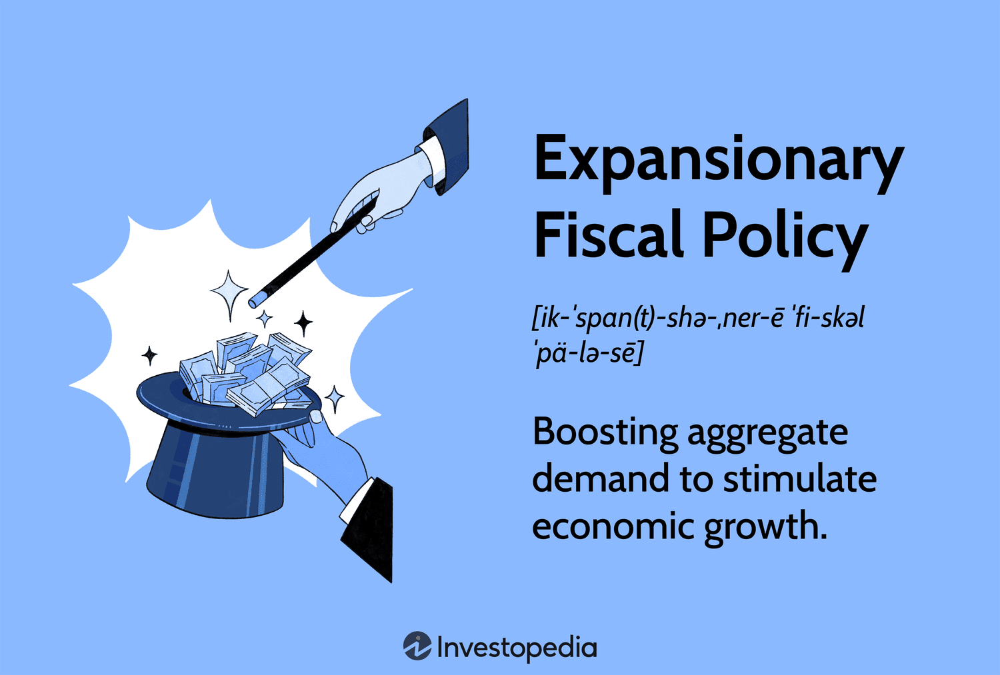

## Table of Contents

## What is fiscal policy and how does it aim to stimulate economic growth?

Fiscal policy is the way a government manages its spending and taxes to influence the economy. It's like a tool that governments use to try to make the economy better. When the government wants to help the economy grow, it can spend more money on things like building roads, schools, and hospitals. It can also lower taxes so that people and businesses have more money to spend and invest.

By spending more money, the government can create jobs and increase demand for goods and services. When people have jobs, they earn money and spend it, which helps businesses grow. Lowering taxes means that people and businesses keep more of their money. They might spend this extra money on things they need or want, or they might invest it in new businesses or projects. Both of these actions can help the economy grow by increasing overall spending and activity.

## Can you explain the difference between expansionary and contractionary fiscal policy?

Expansionary fiscal policy is when the government tries to help the economy grow. It does this by spending more money on things like building roads, schools, and hospitals, or by lowering taxes. When the government spends more, it can create jobs and get people to spend more money. If taxes are lower, people and businesses have more money to spend or invest. This can make the economy busier and help it grow.

Contractionary fiscal policy is the opposite. It's used when the economy is growing too fast and might cause inflation, which is when prices go up a lot. To slow things down, the government might spend less money or raise taxes. When the government spends less, it might mean fewer jobs and less spending. If taxes go up, people and businesses have less money to spend or invest. This can help cool down the economy and keep prices from rising too quickly.

## What are some common tools of fiscal policy used to stimulate the economy?

One common tool of fiscal policy to stimulate the economy is increasing government spending. When the government decides to spend more money, it might build new roads, schools, or hospitals. This spending creates jobs for people who work on these projects. When people have jobs, they earn money and spend it on things they need or want. This spending helps businesses grow because more people are buying their goods and services. As businesses do better, they might hire more people, which helps the economy even more.

Another tool is cutting taxes. When the government lowers taxes, people and businesses get to keep more of their money. With this extra money, people might buy more things, like clothes, food, or cars. Businesses might use their extra money to invest in new projects or expand their operations. Both of these actions increase the amount of money flowing in the economy, which can help it grow. By giving people and businesses more money to spend or invest, tax cuts can make the economy busier and stronger.

## How does government spending on infrastructure projects contribute to economic growth?

When the government spends money on infrastructure projects like roads, bridges, and schools, it helps the economy grow in a few ways. First, these projects create jobs for people who work on them, like construction workers, engineers, and planners. When people have jobs, they earn money and can spend it on things they need or want, like food, clothes, and entertainment. This spending helps businesses grow because more people are buying their products and services. As businesses do better, they might hire more people, which helps the economy even more.

Second, good infrastructure makes it easier for businesses to operate and for people to get around. Better roads and bridges mean that goods can be transported more quickly and at a lower cost. This can help businesses save money and reach more customers. Improved schools and hospitals can also make a place more attractive for people to live and work in, which can bring more businesses and jobs to the area. Overall, spending on infrastructure not only creates immediate jobs but also lays the groundwork for long-term economic growth by making it easier for the economy to function efficiently.

## What role do tax cuts play in stimulating economic activity?

When the government cuts taxes, it means people and businesses get to keep more of their money. This extra money can be really helpful for the economy. People might spend this money on things they need or want, like new clothes, food, or even a vacation. When people spend more, it helps businesses because they sell more of their products and services. Businesses might then hire more people to keep up with the demand, which creates more jobs and helps the economy grow.

Tax cuts also give businesses more money to invest. They might use this money to start new projects, buy new equipment, or expand their operations. When businesses invest, it can lead to more jobs and more economic activity. For example, if a company builds a new factory, it needs workers to run it, and those workers will spend their earnings in the local economy. So, by giving people and businesses more money through tax cuts, the government can help make the economy busier and stronger.

## Can you provide historical examples where fiscal policy successfully stimulated economic growth?

One example of successful fiscal policy is the New Deal in the United States during the 1930s. At that time, the country was going through the Great Depression, and many people were out of work. The government, led by President Franklin D. Roosevelt, decided to spend a lot of money on building projects like roads, bridges, and dams. They also created jobs programs to help people find work. These efforts helped to create jobs and get people spending money again, which slowly helped the economy start to recover.

Another example is the economic stimulus package in the United States in 2009. After the 2008 financial crisis, many people lost their jobs and the economy was struggling. The government, under President Barack Obama, passed a big spending plan that included money for infrastructure projects, tax cuts, and help for people who were out of work. This helped to create jobs and get people spending money again. Over time, the economy started to grow again, showing that the fiscal policy helped to stimulate economic activity.

## How does fiscal policy interact with monetary policy to influence economic outcomes?

Fiscal policy and monetary policy are like two important players working together to help the economy. Fiscal policy is what the government does with its spending and taxes. For example, if the government wants to help the economy grow, it might spend more money on things like building roads or cut taxes so people have more money to spend. On the other hand, monetary policy is managed by a country's central bank, like the Federal Reserve in the United States. The central bank can change interest rates or the amount of money in the economy to control inflation or help the economy grow.

These two policies can work together to make the economy better. For instance, if the government decides to spend more money on building projects, it can create jobs and get people to spend more. At the same time, if the central bank lowers interest rates, it makes borrowing money cheaper. This can encourage businesses to borrow money to invest in new projects and people to buy things like houses or cars. When both fiscal and monetary policies are used together in the right way, they can help the economy grow stronger and faster.

## What are the potential risks and limitations of using fiscal policy to stimulate the economy?

Using fiscal policy to stimulate the economy can have some risks and limitations. One big risk is that if the government spends too much money or cuts taxes too much, it can lead to a big budget deficit. This means the government has to borrow more money, and that can make the country's debt grow a lot. If the debt gets too big, it might make it harder for the government to spend money on important things like schools and hospitals in the future. Also, high debt can make investors worried, which can lead to higher interest rates and slow down the economy.

Another limitation is that it can take a long time for fiscal policy to work. For example, if the government decides to spend more money on building new roads, it might take years before the project is finished and people start to see the benefits. During that time, the economy might change, and the policy might not be as helpful as it was supposed to be. Also, if the government spends money in the wrong way or on the wrong things, it might not help the economy as much as it could. So, while fiscal policy can be a powerful tool to help the economy, it needs to be used carefully and wisely.

## How do automatic stabilizers function within fiscal policy to manage economic cycles?

Automatic stabilizers are parts of fiscal policy that help the economy without the government needing to do anything new. They work like a safety net that kicks in when the economy goes up or down. For example, when the economy is doing badly and people are losing their jobs, automatic stabilizers like unemployment benefits start giving people money. This helps them keep spending on things they need, which can stop the economy from getting worse. On the other hand, when the economy is doing well and people are [earning](/wiki/earning-announcement) more money, they might pay more in taxes. This helps to slow down the economy a bit and stop it from growing too fast, which can cause prices to go up a lot.

These stabilizers are important because they help to smooth out the ups and downs of the economy. They work without the government having to pass new laws or make new decisions, which can take a lot of time. By automatically adjusting to what's happening in the economy, they help to keep things more stable. For example, during a recession, when people's incomes go down, they pay less in taxes, which means they have more money to spend. At the same time, they might get more help from government programs. This all helps to support the economy when it's struggling, and it does it in a way that's quick and automatic.

## What are the long-term effects of sustained fiscal stimulus on national debt and economic health?

When a government uses fiscal stimulus for a long time, it can lead to a big increase in the national debt. This happens because the government might spend more money than it collects in taxes, so it has to borrow money to cover the difference. Over time, this borrowing adds up, and the country ends up owing a lot of money. If the debt gets too big, it can be hard for the government to pay it back, and it might have to spend a lot of money just on interest payments. This can make it harder for the government to spend money on important things like schools, hospitals, and roads, which can affect the country's overall economic health.

On the other hand, if the fiscal stimulus is used wisely, it can help the economy grow in the long run. For example, if the government spends money on building good infrastructure like roads and bridges, it can help businesses work better and create more jobs. This can lead to more people working and earning money, which can help the economy stay strong. However, it's important for the government to balance its spending and make sure it doesn't borrow too much money, so the benefits of the stimulus don't get outweighed by the costs of a growing national debt.

## How can fiscal policy be tailored to address specific sectors of the economy for targeted growth?

Fiscal policy can be tailored to help specific parts of the economy by focusing government spending and tax changes on those areas. For example, if the government wants to help the technology industry grow, it might give tax breaks to tech companies or spend money on building tech hubs and research centers. This can make it easier for tech businesses to start up and grow, which can lead to more jobs and more innovation in that sector. By targeting specific industries, the government can help them do better and contribute more to the overall economy.

Another way to use fiscal policy for targeted growth is by helping certain groups of people, like small business owners or low-income families. The government might offer special loans or grants to small businesses to help them grow and create jobs. For low-income families, the government could increase benefits or lower taxes, which can give them more money to spend on things they need. When these groups do better, it can help the whole economy because they spend more money and create more demand for goods and services. By focusing on specific sectors and groups, fiscal policy can be a powerful tool to help the economy grow in a targeted way.

## What advanced economic models are used to predict the impact of fiscal policy on economic growth?

Economists use different models to guess how fiscal policy might affect the economy. One common model is the Keynesian model, which says that when the government spends more money or cuts taxes, it can help the economy grow by getting people to spend more. This model looks at things like how much people save, how much they spend, and how the government's actions can change those behaviors. Another model is the Dynamic Stochastic General Equilibrium (DSGE) model, which is more complicated. It tries to predict how the economy will change over time by considering many different factors, like how businesses react to policy changes and how people make decisions about working and spending.

These models help economists make better guesses about what will happen when the government changes its spending or taxes. For example, they can use these models to see if a big infrastructure project will create enough jobs and spending to help the economy grow. They can also look at how tax cuts might affect how much people save and spend, and whether that will lead to more economic activity. By using these models, economists can give advice to the government on the best ways to use fiscal policy to help the economy.

## What is the impact of fiscal policy on economic activity and how can it be understood?

Fiscal policy is a crucial aspect of economic governance, encompassing government expenditure and taxation strategies designed to influence a country's economic conditions. These policies are integral for managing a nation's economic performance and are often implemented to stabilize the economy during fluctuations. The primary tools of fiscal policy include adjustments in government spending and taxation, which are often strategically employed to navigate economic downturns and stimulate growth.

Tax cuts and increased government spending are two key fiscal mechanisms typically utilized during recessions to invigorate economic activity. Tax cuts enhance disposable income for individuals and businesses, encouraging spending and investment. For instance, when personal or corporate tax rates are reduced, individuals have more income to spend, and businesses have additional capital for investment, leading to increased consumption and business expansion. This boost in aggregate demand helps in stimulating economic activity, as higher demand for goods and services propels production, leading to job creation and reduced unemployment rates.

Increased government spending, on the other hand, involves allocating more financial resources toward public projects, infrastructure development, and social programs. Such expenditures generate employment opportunities and inject money into the economy, further spurring consumption and demand. Government-funded projects usually have a multiplier effect; a dollar spent by the government tends to generate more than a dollar in economic activity. This effect occurs because the initial recipients of the government funds, such as construction companies or employees, spend their earnings on goods and services, supporting businesses and stimulating further economic activity.

The ultimate objective of these fiscal measures is to enhance aggregate demand - the total demand for goods and services within the economy. By increasing aggregate demand, fiscal policy can stimulate economic growth and mitigate the adverse effects of economic downturns. The relationship between fiscal policy and aggregate demand is also modeled by the Keynesian equation:

$$
AD = C + I + G + (X - M)
$$

where $AD$ is aggregate demand, $C$ represents consumer spending, $I$ stands for investment by businesses, $G$ denotes government spending, and $(X - M)$ is the net exports (exports minus imports). Fiscal policy targets $C$, $I$, and $G$ to boost $AD$.

In summary, fiscal policy plays an essential role in managing economic activity. By judiciously adjusting taxation and government expenditures, policymakers can stimulate aggregate demand, enhance economic performance, and curb unemployment, especially during economic recessions. This strategic approach ensures that economies are more resilient to shocks and can maintain stable growth trajectories.

## References & Further Reading

[1]: Blinder, A. S. (2004). ["The Case Against the Case Against Discretionary Fiscal Policy."](https://www.princeton.edu/~ceps/workingpapers/100blinder.pdf) In The Macroeconomics of Fiscal Policy. MIT Press.

[2]: Taylor, J. B. (2009). ["The Financial Crisis and the Policy Responses: An Empirical Analysis of What Went Wrong."](https://www.nber.org/system/files/working_papers/w14631/w14631.pdf) National Bureau of Economic Research.

[3]: Goolsbee, A., & Krueger, A. B. (2015). ["A Retrospective Look at Rescuing and Restructuring General Motors and Chrysler."](https://www.nber.org/system/files/working_papers/w21000/w21000.pdf) Journal of Economic Perspectives.

[4]: Aldridge, I. (2013). ["High-Frequency Trading: A Practical Guide to Algorithmic Strategies and Trading Systems."](https://www.amazon.com/High-Frequency-Trading-Practical-Algorithmic-Strategies/dp/1118343506) Wiley Finance.

[5]: Bernanke, B. S. (2020). ["The New Tools of Monetary Policy."](https://www.aeaweb.org/articles?id=10.1257/aer.110.4.943) American Economic Review.