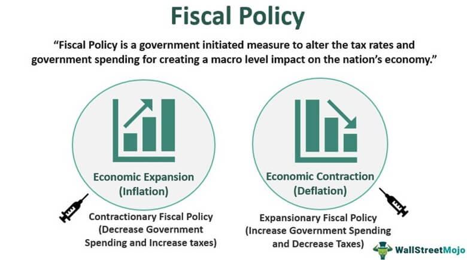

In today's dynamic economic landscape, the intricate relationship between economic activity, fiscal policy, and economic growth is pivotal. Economic activity, characterized by production, consumption, and exchange of goods and services, forms the backbone of economies. Fiscal policy, involving government decisions on taxation and spending, fundamentally influences these activities by regulating aggregate demand and stabilizing the economy. Amidst this environment, the introduction of algorithmic trading has added a layer of complexity, reshaping how markets function.

Algorithmic trading, which uses pre-programmed instructions and algorithms to perform trading at speeds and volumes impossible for human traders, transforms market dynamics. It enhances liquidity and efficiency, yet presents challenges such as increased volatility and systemic risk. Thus, understanding the synergy between fiscal policy mechanisms and algorithmic trading is crucial. 

This article explores how fiscal policy shapes economic activity and growth while reflecting on algorithmic trading's role in modern markets. A comprehensive grasp of these elements is essential for policymakers, investors, and economists. It supports informed decision-making and robust economic management, key to fostering sustainable growth and navigating complex market environments.

## Table of Contents

## Understanding Fiscal Policy and Its Impact on Economic Activity

Fiscal policy is a crucial aspect of economic governance, encompassing government expenditure and taxation strategies designed to influence a country's economic conditions. These policies are integral for managing a nation's economic performance and are often implemented to stabilize the economy during fluctuations. The primary tools of fiscal policy include adjustments in government spending and taxation, which are often strategically employed to navigate economic downturns and stimulate growth.

Tax cuts and increased government spending are two key fiscal mechanisms typically utilized during recessions to invigorate economic activity. Tax cuts enhance disposable income for individuals and businesses, encouraging spending and investment. For instance, when personal or corporate tax rates are reduced, individuals have more income to spend, and businesses have additional capital for investment, leading to increased consumption and business expansion. This boost in aggregate demand helps in stimulating economic activity, as higher demand for goods and services propels production, leading to job creation and reduced unemployment rates.

Increased government spending, on the other hand, involves allocating more financial resources toward public projects, infrastructure development, and social programs. Such expenditures generate employment opportunities and inject money into the economy, further spurring consumption and demand. Government-funded projects usually have a multiplier effect; a dollar spent by the government tends to generate more than a dollar in economic activity. This effect occurs because the initial recipients of the government funds, such as construction companies or employees, spend their earnings on goods and services, supporting businesses and stimulating further economic activity.

The ultimate objective of these fiscal measures is to enhance aggregate demand - the total demand for goods and services within the economy. By increasing aggregate demand, fiscal policy can stimulate economic growth and mitigate the adverse effects of economic downturns. The relationship between fiscal policy and aggregate demand is also modeled by the Keynesian equation:

$$
AD = C + I + G + (X - M)
$$

where $AD$ is aggregate demand, $C$ represents consumer spending, $I$ stands for investment by businesses, $G$ denotes government spending, and $(X - M)$ is the net exports (exports minus imports). Fiscal policy targets $C$, $I$, and $G$ to boost $AD$.

In summary, fiscal policy plays an essential role in managing economic activity. By judiciously adjusting taxation and government expenditures, policymakers can stimulate aggregate demand, enhance economic performance, and curb unemployment, especially during economic recessions. This strategic approach ensures that economies are more resilient to shocks and can maintain stable growth trajectories.

## Fiscal Policy's Role in Economic Growth

Fiscal policy plays a crucial role in promoting economic growth by counteracting economic downturns and fostering a favorable environment for sustainable growth. During periods of economic slowdown, governments implement expansionary fiscal policies, which primarily involve tax reductions and increased government expenditure. These measures are designed to stimulate economic activity by raising national income and enhancing aggregate demand.

Tax cuts reduce the financial burden on individuals and businesses, thereby increasing disposable income and incentivizing consumption and investment. As a result, the demand for goods and services increases, prompting businesses to expand production and hire more workers, which further bolsters economic growth.

Government subsidies can also target specific sectors to encourage innovation, efficiency, and competitiveness. By providing financial support, governments can nurture industries that have the potential to drive long-term growth, thereby contributing to a more diversified and resilient economy.

A balanced approach to fiscal policy not only addresses immediate challenges posed by economic downturns but also lays the groundwork for sustainable growth. Maintaining a balanced budget over the long term ensures that expansionary measures do not lead to excessive deficits and debt accumulation, which could undermine future growth prospects. Moreover, targeted fiscal interventions can address structural issues, such as income inequality, by ensuring that growth benefits are widely distributed across society.

The effectiveness of fiscal policy in driving economic growth also relies on the timing and magnitude of interventions. Governments must assess economic conditions accurately to implement measures that align with the cyclical nature of the economy. By doing so, fiscal policy can smooth out economic fluctuations and maintain a steady growth trajectory. This approach requires a continuous evaluation of the impact of fiscal measures and the ability to adapt to changing economic circumstances.

In conclusion, fiscal policy is a powerful tool for promoting economic growth by mitigating downturns and implementing strategic measures that support an inclusive and sustainable economic environment. Through careful design and execution, fiscal policy can provide the foundation for a prosperous and stable economy.

## Algorithmic Trading: Enhancing Market Efficiency

Algorithmic trading has fundamentally transformed financial markets by employing sophisticated mathematical models and high-frequency trading systems to automate the buying and selling of securities. These algorithms analyze vast data sets to identify patterns and execute trades at a speed and frequency that human traders cannot match. The primary benefit of [algorithmic trading](/wiki/algorithmic-trading) is enhanced market efficiency and [liquidity](/wiki/liquidity-risk-premium), as it facilitates tighter bid-ask spreads and faster execution times.

Market liquidity, defined as the ease with which assets can be bought or sold without causing drastic price changes, is significantly improved by algorithmic trading. The continuous presence of algorithms in the market allows for a greater number of transactions, thus reducing the duration and impact of trades. This results in more stable prices and reduced transaction costs for investors. Furthermore, algorithms can quickly incorporate new information, aligning market prices more closely with the underlying asset values, thereby enhancing market efficiency.

Algorithmic systems also enable rapid responses to economic policy changes. For instance, when a government announces a new fiscal measure, such as a tax cut or increased spending, algorithms scan news feeds and other data sources to evaluate the potential impact on asset prices. By swiftly adjusting their trading strategies based on this information, algorithmic trading systems enhance market adaptability and can help align market behavior with policy objectives.

Despite these advantages, algorithmic trading is not without risks. It can contribute to market [volatility](/wiki/volatility-trading-strategies), as large volumes of trades executed in milliseconds may lead to abrupt price fluctuations. This high level of activity can exacerbate stress in financial markets, particularly during periods of uncertainty or rapid change. Additionally, the potential for flash crashes—sudden, severe drops in asset prices caused by a cascade of algorithm-driven trades—is a notable concern. These events can occur when algorithms react simultaneously to market signals or when technical glitches arise. 

The risks associated with algorithmic trading necessitate the development of robust regulatory frameworks. These frameworks aim to mitigate potential market disruptions while fostering innovation in trading technologies. Regulatory measures may include circuit breakers to halt trading when extreme price movements are detected, and rules requiring the disclosure of algorithmic trading strategies to prevent manipulative practices.

In summary, while algorithmic trading enhances market efficiency and liquidity by expediting trade execution and price adjustments, it also introduces challenges that require careful management. The interplay between technology and regulation is crucial in ensuring that the benefits of algorithmic trading are realized without compromising market stability.

## Interplay Between Fiscal Policy and Algorithmic Trading

The integration of technology into economic frameworks demonstrates a significant interaction between algorithmic trading and fiscal policy. Algorithmic trading, which employs advanced algorithms to execute trades rapidly, can have substantial impacts on financial markets by swiftly responding to fiscal measures. This capability allows markets to align more closely with policy objectives such as controlling inflation and stimulating growth, potentially enhancing the effectiveness of fiscal policy interventions.

Algorithmic trading systems process large volumes of fiscal-related data in real-time, adjusting trading strategies based on changes in government spending and taxation. For example, when a policy announcement indicates a fiscal stimulus, algorithmic trading can prompt immediate adjustments in investment portfolios to capitalize on anticipated market movements. This rapid response can facilitate liquidity, allowing for smoother absorption of fiscal impacts by the market.

However, this dynamic interplay also underscores the necessity for robust regulatory frameworks. The speed and complexity of algorithmic trading introduce risks such as increased market volatility and the potential for flash crashes, where rapid price changes occur over a short period. Without adequate oversight, these risks might undermine market stability and the intended effects of fiscal policies.

From a regulatory perspective, maintaining a balance between encouraging technological innovation and ensuring market stability is crucial. Policymakers must devise rules that not only mitigate the risks associated with algorithmic trading but also enhance its benefits in synchronizing with fiscal policy. This could involve setting standards for algorithmic transparency, implementing safeguards against excessive high-frequency trading, and ensuring comprehensive market surveillance.

In conclusion, while algorithmic trading has the potential to complement fiscal policy by aligning market conditions with fiscal objectives, it requires careful regulation to prevent destabilizing consequences. By fostering an informed and balanced approach, regulatory bodies can facilitate a more stable financial environment that leverages the benefits of both fiscal policy and technological advancements.

## Case Study: Economic Stimulus during Financial Crises

During significant financial crises, such as the 2007-2008 financial crisis and the COVID-19 pandemic, governments worldwide deployed substantial economic stimulus packages. These crises necessitated both fiscal and monetary interventions to stabilize economies and prevent deeper recessions.

### The 2007-2008 Financial Crisis

The 2007-2008 financial crisis, often referred to as the Global Financial Crisis (GFC), was primarily triggered by the collapse of the housing market in the United States, leading to a severe banking liquidity crisis. In response, governments initiated large-scale fiscal stimuli, which included increasing government expenditures and reducing taxes to revive demand and economic activity.

A key fiscal measure during this period was the Economic Stimulus Act of 2008 in the United States, which involved tax rebates and incentives for businesses to increase investment. Additionally, the Troubled Asset Relief Program (TARP) was introduced to purchase toxic assets from banks, bolstering their balance sheets and restoring faith in the financial system. These actions collectively aimed to mitigate the credit crunch and reinvigorate the economy.

On the monetary front, central banks, including the Federal Reserve, implemented aggressive [interest rate](/wiki/interest-rate-trading-strategies) cuts and quantitative easing (QE) measures to enhance liquidity in the financial system. The combination of fiscal and monetary policies was crucial in curtailing the immediate impacts of the crisis and setting the stage for recovery.

### The COVID-19 Pandemic

The COVID-19 pandemic presented a unique challenge due to its simultaneous impact on both demand and supply in the global economy. Governments worldwide responded with unprecedented fiscal measures to counteract the economic paralysis induced by lockdowns and health crises.

The United States introduced the Coronavirus Aid, Relief, and Economic Security (CARES) Act, which provided direct financial support to individuals, expanded unemployment benefits, and assisted businesses through loans and grants. Similar measures were seen in other regions, with the European Union implementing the Next Generation EU fund to support member states’ recoveries.

Monetary policy also played a vital role, with central banks reducing interest rates to near-zero levels and expanding QE programs. The combined fiscal and monetary responses were pivotal in preventing the economic downturn from transforming into a prolonged depression.

### Lessons for Future Fiscal Strategy

The study of these two crises offers significant learnings for future fiscal strategies:

1. **Timeliness and Magnitude**: Quick and substantial fiscal interventions are essential to offset economic free-fall. Delayed responses can exacerbate economic contractions.

2. **Targeted Support**: Fiscal measures need to be judiciously targeted to support the most affected sectors, such as small businesses and lower-income households. This ensures a more equitable recovery.

3. **Integration with Monetary Policy**: The synergy between fiscal and monetary policy enhances the overall impact, as seen with the lowering of interest rates and QE supporting fiscal expansions.

4. **Role of Algorithmic Trading**: Algorithmic trading facilitated faster market adaptation by reacting swiftly to fiscal and monetary announcements. This technological aspect needs careful regulatory oversight to prevent excessive volatility, as witnessed in incidents like flash crashes.

In conclusion, the responses to these crises underscore the critical need for agile and robust economic policies that integrate fiscal, monetary, and technological tools to navigate and mitigate financial disruptions.

## Conclusion

The convergence of fiscal policy, economic growth, and algorithmic trading presents both significant challenges and opportunities for modern economies. To navigate this complex landscape, successful economic management hinges on the synthesis of informed policy design, precise execution, and the integration of adaptive technologies.

Fiscal policy, through meticulous crafting and implementation, plays a crucial role in steering economic growth. It requires a careful balance of government spending and taxation policies to influence aggregate demand effectively. These policies must be designed with a foresight that considers both immediate and long-term economic impacts, striving for sustainable growth that benefits society as a whole.

Algorithmic trading, with its ability to enhance market efficiency, also comes into play. These high-speed, data-driven systems are capable of rapidly executing trades, thereby improving market liquidity and adaptability to fiscal measures. However, this speed and efficiency introduce additional layers of complexity and risk, such as increased volatility. As such, algorithmic trading must be regulated with frameworks that ensure it complements fiscal objectives while maintaining financial stability.

Ongoing research and regulatory refinement are paramount to effectively harness these elements. The dynamic nature of global markets means that policy-making is an iterative process that demands continual assessment and adjustment. Regulatory frameworks must evolve in tandem with technological advancements to maintain a balance between fostering innovation and safeguarding market integrity.

In essence, the interplay between fiscal policy, economic growth, and algorithmic trading demands a comprehensive approach characterized by informed, adaptable strategies. By focusing on these elements, policymakers, investors, and economists can work towards ensuring economic stability and progress, maximizing opportunities while mitigating risks.

## References & Further Reading

[1]: Blinder, A. S. (2004). ["The Case Against the Case Against Discretionary Fiscal Policy."](https://www.princeton.edu/~ceps/workingpapers/100blinder.pdf) In The Macroeconomics of Fiscal Policy. MIT Press.

[2]: Taylor, J. B. (2009). ["The Financial Crisis and the Policy Responses: An Empirical Analysis of What Went Wrong."](https://www.nber.org/system/files/working_papers/w14631/w14631.pdf) National Bureau of Economic Research.

[3]: Goolsbee, A., & Krueger, A. B. (2015). ["A Retrospective Look at Rescuing and Restructuring General Motors and Chrysler."](https://www.nber.org/system/files/working_papers/w21000/w21000.pdf) Journal of Economic Perspectives.

[4]: Aldridge, I. (2013). ["High-Frequency Trading: A Practical Guide to Algorithmic Strategies and Trading Systems."](https://www.amazon.com/High-Frequency-Trading-Practical-Algorithmic-Strategies/dp/1118343506) Wiley Finance.

[5]: Bernanke, B. S. (2020). ["The New Tools of Monetary Policy."](https://www.aeaweb.org/articles?id=10.1257/aer.110.4.943) American Economic Review.